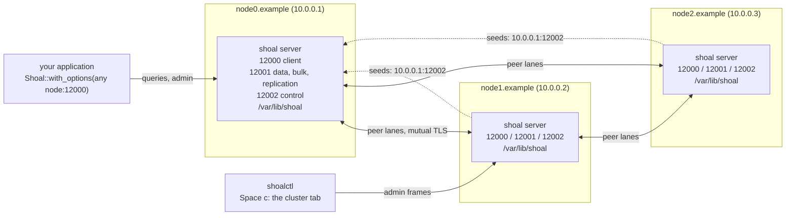

# C14. Deploying a cluster and running shoalctl against it

## Context

A cluster of three nodes at a replication factor of three, from nothing to a cluster tab, with
what to write, what to wait for and what to check at each step. The
[runbooks](../operations/runbooks.md) are the procedures for everything after the first day;
[C1](node-identity.md) is what every key means; [Configuration](../getting-started/configuration.md#cluster)
is the reference with every default. This page assumes three Linux hosts with cores to spare
and a filesystem under the storage path that takes direct I/O - a tmpfs does not.

## What you build

~~There is no `shoal` server binary and no `shoalctl` binary~~ - since [F51](../features/cluster-deployment.md)
both are one generic call: the server is `shoal::server::node::main::<Db>()` and the tool
`shoalctl::cli::main::<DbClient>()`, and `shoalctl cluster bootstrap` does everything on this
page from an inventory, over ssh (see [Deploying with shoalctl](#deploying-with-shoalctl)
below). A schema is still a compile-time construct, so both are still programs you build
against yours. What follows is the same by hand. The server is `ShoalPool::<Db>::start(conf)` and
`ready`, exactly as `shoal/examples/tmdb.rs` does it:

```rust
#[shoal::db]
pub struct Inventory {
    pub items: PersistentUnsortedTable<Item, FileSystem>,
    pub items_by_sku: PersistentSortedTable<ItemBySku, FileSystem>,
}

#[tokio::main]
async fn main() -> anyhow::Result<()> {
    // shoal.yml from the working directory, with SHOAL_* environment variables on top
    let conf = Conf::from_file("shoal.yml")?;
    // tracing, and the guard that flushes the exporter when the process ends
    let traces = shoal::server::trace::setup(&conf);
    // one shard per core, a control thread on cluster.control_core; a shard that cannot
    // start is reported here rather than as a refused connection later
    let mut pool = ShoalPool::<Inventory>::start(conf)?;
    pool.ready(std::time::Duration::from_secs(60))?;
    // serve until asked to stop; `failure` reports a shard that died meanwhile
    tokio::signal::ctrl_c().await.ok();
    pool.exit()?;
    shoal::server::trace::shutdown(traces);
    Ok(())
}
```

The tool is the same schema under `#[shoal::db(client)]` handed to `shoalctl::run`, exactly as
`shoalctl/examples/tmdbctl.rs` does it, with the address, the credentials and the trust root
given where the client is built. Before F51 it had no command line of its own; this is still
the form for a client built with options of your own:

```rust
#[shoal::db(client)]
pub struct Inventory {
    pub items: PersistentUnsortedTable<Item, FileSystem>,
    pub items_by_sku: PersistentSortedTable<ItemBySku, FileSystem>,
}

#[tokio::main]
async fn main() -> color_eyre::Result<()> {
    let options = ClientOptions::new()
        .credentials(Credentials::scram("ops", std::env::var("SHOAL_PASSWORD")?))
        .tls(TlsClientOptions::new("/etc/shoal/client-ca.pem"));
    let shoal = Arc::new(Shoal::<InventoryClient>::with_options("node0.example:12000", options).await?);
    shoalctl::run(shoal).await
}
```

`shoalctl` links no storage engine; the table and storage types are named in field position
only and never imported ([shoalctl](../operations/shoalctl.md#compiling-it-for-your-schema)).
Every node runs the same server binary: a peer whose `schema_id` differs is refused at the
hello, and a schema change is a new cluster, never a rolling operation ([C9](operations.md#rolling-upgrade)).

## The machines



Each node reserves the control thread's cpu and its SMT sibling; the remaining cores become
shards, one each, and every shard has a slot a peer names ([C1](node-identity.md#the-address-of-a-shard)).
`resources.cores` sets how many, `exclude_cores` keeps physical cores back, and `memory` is
required when `resources:` is present. A machine too small to give the control thread a
physical core sets `control_core_shared: true`, and the sharing is recorded. Three ports per
node reach the outside: the client port, the data port (data, bulk and replication lanes) and
the control port. With `cluster.tls` the kernel's `tls` module must be loaded - `modprobe tls`,
persisted with `echo tls > /etc/modules-load.d/shoal.conf` - since the server refuses to start
rather than fall back to plaintext.

## Three configurations

The cluster's policy - the voters, the factor, the consistencies, the detector, the failover
base, the removal grace and the admins - is written by the first node into the control state
at bootstrap and ignored on every other node's file afterwards, so it goes on node zero and a
change later is an admin operation. Everything else is the node's own.

`node0.example`, the bootstrapper:

```yaml
resources:
  cores: 8
  memory: "16Gi"
networking:
  interface: "0.0.0.0"
  port: 12000
  tls:
    cert: "/etc/shoal/client.pem"
    key: "/etc/shoal/client.key"
auth:
  required: true
  users:
    ops:
      password: "…"
    app:
      password: "…"
storage:
  default:
    filesystem:
      latency_sensitive:
        path: "/var/lib/shoal"
      throughput_sensitive:
        path: "/var/lib/shoal"
cluster:
  bootstrap: true
  advertise: "10.0.0.1"            # required, since the interface is 0.0.0.0
  port: 12001
  control_port: 12002
  control_voters: 3
  replication_factor: 3
  write_consistency: Quorum
  read_consistency: One
  auto_remove_after: "30m"
  admins: ["ops"]
  tls:
    cert: "/etc/shoal/node.pem"
    key: "/etc/shoal/node.key"
    ca: "/etc/shoal/cluster-ca.pem"
```

`node1.example` and `node2.example`, the joiners: the same file with `advertise` set to their
own address, `bootstrap` absent, and

```yaml
cluster:
  seeds: ["10.0.0.1:12002"]        # the control port, never the data port
  advertise: "10.0.0.2"
  port: 12001
  control_port: 12002
  tls:
    cert: "/etc/shoal/node.pem"
    key: "/etc/shoal/node.key"
    ca: "/etc/shoal/cluster-ca.pem"
```

A file that names both `bootstrap: true` and `seeds`, or neither, is refused at start, as is
every value out of range, by name ([Configuration](../getting-started/configuration.md#cluster)).
Unequal machines set `cluster.weight` to their share of the bytes; it defaults to the
executor count. Everything under `transport`, `replication`, `repair`, `migration`, `rebalance`
and `backup` has a default worth leaving alone until a capture says otherwise.

## Certificates

A node's peer certificate is bound to its identity: the leaf carries a URI SAN of
`shoal-node://<node id>`, and both ends of every lane refuse a leaf naming another node or
none. The id is minted when the directory is first claimed, so the id comes before the leaf:

1. ~~Start each node once with no `cluster.tls` (or read `node` out of `shoal-meta.json` after
   the first claim)~~ Run the node program's `claim --conf shoal.yml`, which claims the
   directory exactly as the first start will and prints its node id without starting anything
   ([F51](../features/cluster-deployment.md)), and note the id.
2. Issue a leaf per node from the cluster authority whose names include the address peers
   dial it at and `shoal-node://<id>`, and install it with the key and the authority under
   `/etc/shoal/`.
3. Add `cluster.tls` and restart. A node that comes back at a higher incarnation under the
   binding is the same member.

A deployment that shares one leaf across every node sets `bind_identity: false` and accepts
that a member can then speak as another. Rotation is [runbook 14](../operations/runbooks.md#14-rotate-certificates-and-authorities):
write the new files, `reload-tls` on that node; an authority rotates as a bundle. ~~Nothing in
Shoal issues a certificate~~ `shoalctl cluster` mints a cluster authority and issues every node it
deploys a leaf this way ([F51](../features/cluster-deployment.md)); by hand, the fixture's authority
(`shoal/tests/cluster/mod.rs`, `Pki`) shows the shape a `rcgen` or `openssl` script produces.

## Start, and what to wait for

1. **Start node zero.** Its log says `Claimed a new storage directory` with the node and
   cluster ids and `Control plane ready` with `status: joined`; it leads a control group of one.
   `pool.ready` returns once its shards are bound.
2. **Start the joiners.** Each says `Claimed a new storage directory` with `mode: joining`, then
   `admitted` and `joined` once node zero's leader has committed it; node zero says `promoted a
   learner to voter` twice. Nothing is placed on them.
3. **Wait for the members.** In `shoalctl`, `Space c` opens the cluster tab: the second line
   reads `voters 3  learners 0  up 3`. Until then the tab reads `up 1` or `up 2` and the third
   line says writes are not admitted, since a factor of three needs two members up.
4. **Initialize, once.** On the tab's command line, `initialize <node0> <node1> <node2>` in the
   order you want the tablets dealt; the first `Enter` previews the three members and the
   factor, the second sends it. Every tablet of every table is placed over those nodes at the
   factor, and a second `initialize` is refused. The same from code:

   ```rust
   // the version the pool's topology subscription last saw; StaleVersion means it moved
   // under the read, and the answer is to read it again and resend under the same op
   let version = shoal.topology().map_or(0, |topology| topology.version);
   let request = AdminRequest {
       op: Uuid::new_v4(),
       expected_version: version,
       kind: AdminKind::Initialize { nodes: vec![node0, node1, node2] },
   };
   shoal.admin(&request).await?;
   ```

5. **Wait for data readiness.** The tab's third line reads `3 of 3 copies; writes admitted`,
   and `Readiness.data.default_writes` is `Ok`. `up 3` alone is not that: a member count is
   not a copy count.

Rollback before step 4 is stopping everything and deleting the directories, since nothing was
placed; after it the cluster exists, and a mistaken order is fixed by moves, never by a second
`initialize` ([runbook 1](../operations/runbooks.md#1-bootstrap)). Never start a second node
with `bootstrap: true` against an established cluster: it keeps its own and never joins yours.
Never load data before `initialize` on a cluster of more than one node: it stays where the
bootstrapper's rule put it.

## Deploying with shoalctl

Everything above, done by a program ([F51](../features/cluster-deployment.md)). Write an inventory naming the server
program, the hosts and the cluster's shape - `shoalctl/inventories/lab.yml` is a worked one, and
`cluster new` builds one in a form that judges it as you type
([F53](../features/inventory-wizard.md)) - and, from a machine with keyless ssh and passwordless
sudo on every host:

```sh
shoal-benchctl cluster new -o lab.yml                 # or --from an inventory to edit it
# the server program, built for the oldest cpu among the hosts - never `native`
CARGO_TARGET_DIR=target/deploy RUSTFLAGS="-C target-cpu=znver1" \
    cargo build --release -p shoal-bench --bin shoal-node --bin shoal-benchctl
shoal-benchctl cluster bootstrap -i lab.yml          # stage, claim, leaf, start, initialize
shoal-benchctl cluster status -i lab.yml
shoal-benchctl cluster add -i lab.yml <node> --rebalance
shoal-benchctl tui -i lab.yml                         # the cluster tab, as the admin
```

It renders every file on this page, issues the leaves above from an authority it keeps under
`~/.shoal/clusters/<name>/`, runs each node as a systemd unit, waits for exactly what the steps
above wait for, and sends `Initialize` once. Any schema: `tmdbctl` and `tmdb_node` are the same
pair for TMDB, and `tmdb-dataset-loader` and `tmdb-dataset-node` for the full dataset, with a
`load -i <inventory>` that fills the deployed cluster
([F54](../features/tmdb-dataset-deployment.md)).

## Connect an application

A client connects to any node's client port; every node coordinates every query, forwarding
shares to the nodes that hold them. `Shoal::with_options` takes the credentials and the client
trust root; the pool subscribes to the topology on every connection, and
`shoal.topology()` reads the members' client endpoints for a reconnect. A write is answered
once a majority has fsynced it and carries a session token; a read is the local replica's
committed state by default, or a barrier from the leader at `ReadLevel::Quorum`, or past a
token ([C6](reads.md)):

```rust
// a write with a retry identity: the same bundle re-sent under NotLeader, Unavailable,
// QuorumUnavailable, OutcomeUnknown or Timeout for up to five seconds, answered once
let options = SendOptions::new().identity(Uuid::now_v7()).retry(Duration::from_secs(5));
let mut results = shoal.send_with(queries, options).await?;
let response = results.next().await?.expect("one answer per query");
let token = response.session_token().expect("a committed write carries one");
// read your own write from any node
let options = SendOptions::new().token(token);
let mut rows = shoal.send_with(read, options).await?;
// or every write acknowledged before this read began
let strong = SendOptions::new().read(ReadLevel::Quorum);
```

A write refused `Shedding`, `NotLeader` or `QuorumUnavailable` recorded nothing; one answered
`OutcomeUnknown` may have committed and is retried only under the same identity, which the
retry table answers with the first attempt's result ([C5](replication.md#what-the-client-is-promised)).
An in-flight request on a node that dies fails; the failover completes in two to three times
`primary_failover_after` ([C7](failover.md#the-window-and-what-a-client-sees)).

## shoalctl

`shoalctl` is the query tool it always was - `i` to type, `Enter` to run, `Space` for the
shortcut mode ([keys](../operations/shoalctl.md#keys)) - with a cluster tab since
[F50](../features/cluster-operations.md). `Space c` opens it against the node the connection
reached; it polls `Members`, `Readiness`, `Replication`, `Plans`, `Backups` and `Recoveries`
once a second and draws one model:

```text
cluster 8e26… via daa5… at version 31
leader daa5…  voters 3  learners 0  up 3  tombstones 0
3 of 3 copies; writes admitted
wire activated 5  members speak 5..=5
this node: 6 groups, leading 2, lag 0 entries, installing 0, quarantined 0

member                               role    health   phase      inc    grace       free       held wire  client
daa5325b-…                           voter   up       member       4        -    120.3GiB     1.2MiB    5  10.0.0.1:12000
…
open plans
  875c6a8b-… remove Running 1/2 moved - blocked: tablet 0: every up member holds the set
```

Read the third line first: copies against the factor, who is missing, what is under-replicated,
and whether a default write is admitted now. `this node` is the node reached - its groups, what
it leads, its widest lag, its installs and its quarantines - so a lagging or installing node is
seen by connecting to it.

The query bar is a command line on this tab. A mutation needs the connection to have
authenticated as a principal `cluster.admins` names; otherwise the server refuses it and the
refusal is shown where a query error would be. The first `Enter` on a mutation draws a preview -
the identity it touches as the model knows it, what will move, and the boundary that cannot be
undone - the second `Enter` sends it against the version the model was built at, and `Esc`
forgets it. An applied operation is followed by its record at the poll's cadence until it is
done, and `status <op>` follows one from any connection.

| Line | What it does | Followed by |
| --- | --- | --- |
| `initialize <node> [<node>...]` | Places every tablet over these members in this order, once | the model's copies line |
| `decommission <node>` | Drains a member and takes it out; its identity never returns | the plan record |
| `remove <node> [replacement]` | Removes a member the cluster gave up on, onto the replacement if named | the plan record |
| `maintenance <node> on\|off` | Holds or resumes a down member's removal grace | — |
| `rebalance` | Spreads the sets over the members by weight and bytes | the plan record |
| `repair <table> [verify\|repair]` | Scrubs a table's groups; `repair` also installs from a verified majority | the repair record |
| `backup [table] <dir>` | Backs a table, or every table, up under a directory on each leader's disk | the backup record |
| `restore <dir>` | Restores a backup into this fresh, empty cluster | the restore record |
| `activate <wire>` | Activates a wire version; no member rolls back below it | — |
| `status <op>` | Reads an operation's plan record | — |
| `reload-tls` | This node reads its certificate, key and authority again | — |
| `help` | Lists these | — |

`SetControlVoters`, `SetTableReadPolicy` and `Move` are sent from code through `Shoal::admin`;
`force_recover`, `export_standalone` and a rehome run on a stopped directory.

## Day two

| When | Runbook | What you type or run |
| --- | --- | --- |
| A node is added | [2](../operations/runbooks.md#2-add-a-node) | Start it with `seeds`; `rebalance`; watch the plan |
| A node died for good | [3](../operations/runbooks.md#3-replace-a-dead-node) | Start a fresh identity; `remove <dead> <fresh>`, or wait out the grace |
| A node is retired | [4](../operations/runbooks.md#4-decommission) | `decommission <node>`; its process stops itself when done |
| A node is down for maintenance | [5](../operations/runbooks.md#5-automatic-removal-and-maintenance) | `maintenance <node> on`, then `off` |
| A removed node's directory turns up | [6](../operations/runbooks.md#6-a-removed-node-returns) | Nothing: it is refused at every door |
| A new build | [7](../operations/runbooks.md#7-rolling-upgrade) | One node at a time, `wire` on the tab, then `activate <wire>`; on a deployed cluster, `shoalctl cluster upgrade -i <inv> [--activate]` ([F55](../features/cluster-upgrade.md)) |
| The control voters are down | [8](../operations/runbooks.md#8-control-quorum-lost) | Restart them; tablets with a quorum keep serving meanwhile |
| The control voters are gone | [9](../operations/runbooks.md#9-permanent-quorum-loss) | `force_recover(&conf, &[survivor])` on one stopped survivor |
| A backup | [10](../operations/runbooks.md#10-backup-and-restore) | `backup /var/backups/shoal`, copy `<dir>/<op>` off the hosts; `restore` into a fresh cluster |
| Data from a standalone node | [11](../operations/runbooks.md#11-existing-single-node-data) | `export_standalone` on the stopped directory; `restore` into a fresh cluster |
| A node's core count changes | [12](../operations/runbooks.md#12-change-a-nodes-cores) | Change `resources.cores`; the start rehomes before any shard serves |
| A node's address changes | [13](../operations/runbooks.md#13-change-a-nodes-address) | Change `advertise`, `port`, `control_port`; restart |
| A certificate expires | [14](../operations/runbooks.md#14-rotate-certificates-and-authorities) | Write the new files; `reload-tls` |

## Limitations

~~There is no server binary, no `shoalctl` binary and no packaging~~ Both halves are one
generic call and `shoalctl cluster` deploys them under systemd ([F51](../features/cluster-deployment.md)); there is still no
packaging, and the program is still yours to build. ~~Nothing issues a certificate.~~ The
deployment issues every leaf; by hand, nothing does. The
cluster tab reaches the node the connection reached, so a node's own lag or install is seen by
connecting to it. `SetControlVoters`, `SetTableReadPolicy` and `Move` have no verb. Every
number about what a cluster costs is smoke-scale ([C10](performance.md#the-numbers-so-far)).
See [C15](open-issues.md).

## Related

[C1](node-identity.md), [C9](operations.md), [runbooks](../operations/runbooks.md),
[shoalctl](../operations/shoalctl.md), [Configuration](../getting-started/configuration.md#cluster),
[Client](../api/client.md), [Building](../getting-started/building.md).
