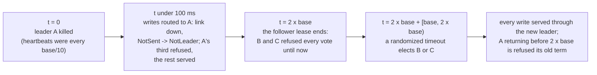
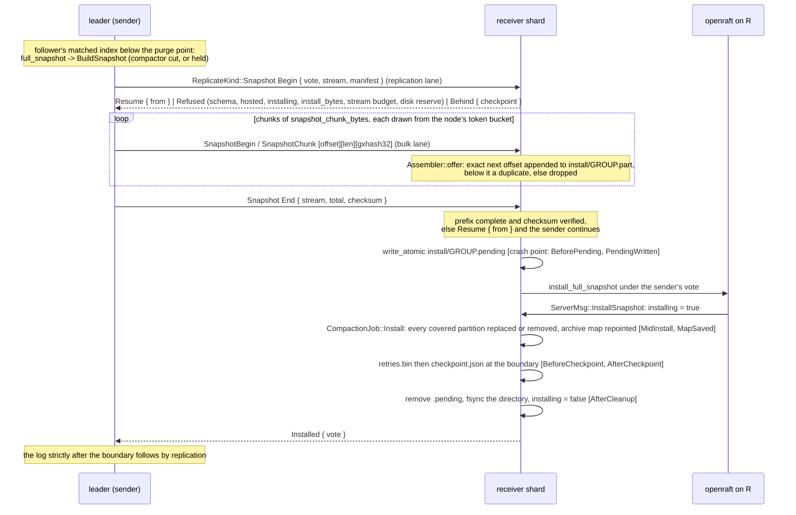

# C7. Primary failover and recovering a node

## Context

A tablet primary can die, pause, or lose some of its connections, and a node can come back
after missing an hour or a week of writes. A tablet group elects its own leader from its own
persisted votes and durable history; an isolated old leader is refused at its lease; a
returning member is fed from the retained log while it is inside it and a snapshot per group
once it is not, installed atomically under a marker. Built by [F42](../features/primary-failover.md)
(the lease, routing by health, the failover arm) and [F43](../features/node-recovery.md)
(the snapshot cut, the stream, the install, retention), with the repair path from
[F44](../features/repair.md) and the durable log reversion fix from
[item 99](../appendix/resolved/durable-log-reversion.md).

## How it works

### When a primary is down

A tablet group elects with its own timers, from `cluster.primary_failover_after` on the map:
openraft's `election_timeout_min` is the base, `election_timeout_max` twice it, and the
heartbeat a tenth of it (`group_config` in `shoal-core/src/server/shard/groups.rs`). Node-level
`Down` is routing information and the start of a grace; it is neither a prerequisite for an
election nor a proof of anything about a history, so a failover happens while the control
thread is alive and a data shard is stalled (`shard_stall_with_live_control_plane_can_fail_over`).
Only the placement primary initializes a fresh group; the others give it a head start of twice
the lease before they would elect.

The rule the first draft had - choose the highest heartbeat stamp - is unsafe: B reports index
100, C reports 101, then A and B durably acknowledge 102 before A dies, and choosing C from the
cached reports discards B's acknowledged 102. Reports are hints; the election restriction and
log matching choose the history (`stale_heartbeat_reports_cannot_lose_acked_write`). A
metadata majority never substitutes for a data quorum
(`metadata_quorum_cannot_replace_a_missing_data_quorum`); a topology commit authorizes nobody
(`delayed_topology_cannot_authorize_old_primary`); a minority never commits
(`quorum_loss_is_unavailable_without_data_loss`).

### The lease

Terms and votes are persisted before a reply; a replication message names the group, the term
and the matching history, and a receiver rejects obsolete authority. What that guarantees is
that incompatible histories cannot both commit, not that an isolated old leader receives no
request. `Lease::of` (`shoal-core/src/server/replication/lease.rs`) classifies a handle from
the metrics' state and its last quorum acknowledgement against `election_timeout_max`: `Leads`,
`Elsewhere(leader)`, `NotStarted`, `Electing` or `Lapsed`. A leader whose lease lapsed answers
a write `NotLeader` before it appends and a barrier `QuorumUnavailable` at once, so an isolated
old primary is a definite refusal rather than an `OutcomeUnknown` at the deadline
(`strong_read_refuses_isolated_old_primary`). The lease is a write's evidence of nothing but
that a write may be attempted; no read is ever served on it.

### The window, and what a client sees

A follower refuses every vote for `election_timeout_max` after it last heard from its leader,
then a randomized timeout between the base and twice it follows, so a dead leader is replaced
between two and three times the base later: two to three seconds at the fixture's one second,
ten to fifteen at the default five. A killed leader that returns inside that lease is refused
its own term by the same rule and waits it out
([item 103](../appendix/known-issues.md#103-a-returning-leader-is-refused-its-own-re-election-until-its-old-lease-lapses-and-hops-to-it-wait)).
Tuning the base moves detection and contention, never safety. The design's objective of "base
plus two seconds" is not met as set, and the milestones page says so.

A write refused at a lapsed lease, or whose hop the link never wrote, is `NotLeader`; one the
link wrote and never answered, or that a leader could not commit within its deadline, is
`OutcomeUnknown`; a forward the link never wrote is sent to another holder once by the server;
and the client retries under `SendOptions::identity` what says to try again, with
`ShoalResponse::attempts()` saying how many times ([C5](replication.md#what-the-client-is-promised)).
A node holding no copy of a tablet routes it by health, `Up` first, and a `SetHealth` moves the
map version so every ring rebuilds. `One` availability through every instant of a kill is not
promised: an in-flight request on the dead node's socket fails before anything detects it. The
outage is recorded from the client's first failed operation to a sustained run of successes,
and the failover arm records what a client without the retry sees: the dead node's third of
the writes refused within a hundred milliseconds, the rest served, until the election
([C10](performance.md#the-arms)).

### A returning node

A node restarts on its directory, recovers each group's term and vote, configuration,
checkpoint, log and retry table, and reconciles with the group before it acknowledges or
serves anything.

| Local condition | What happens |
| --- | --- |
| Matching retained history, behind | openraft replicates the missing entries from the leader's retained log (`returning_node_catches_up_by_log_or_snapshot`, first half) |
| Conflicting uncommitted suffix | The protocol locates the common history and the WAL is truncated there; an archive is never rolled back. A durable member whose log is shorter than it acknowledged - its segments or its WAL directory lost - is fed by log or snapshot, counted `log_lost`, and never stops the leader (`durable_log_reversion_is_fed_not_fatal`) |
| Required history no longer retained | A snapshot per group at its checkpoint, then the log strictly after it (`returning_node_catches_up_by_log_or_snapshot`, second half) |
| Same index, mismatched state | A record that fails its checksum quarantines the copy on the read that met it; a scrub at a committed boundary finds a copy whose rows differ from a verified majority's and quarantines it; a repair installs the leader's cut past the copy's held checkpoint ([C9](operations.md#repair), `corrupt_follower_is_quarantined_and_repaired_from_a_verified_source`) |
| A copy a published move took from this shard | Retired: its handle shut down, its log forgotten with a marker frame, every query of its tablets refused `StaleTopology`, its files dropped after the grace (`retired_copy_never_serves_from_grace_files`) |
| A removed identity | Tombstoned: refused at observe, admit, its report and the join, and the node stops `ShoalError::Removed` when it learns so, from its directory or a clone of it at any incarnation (`automatic_removal_and_rejoin_preserve_fencing`) |

Leadership is not moved back to a returning node; it leads again only once its old lease
lapses and an election runs. Eligibility is per group: `MachineState::installing` is set before
the first archive write of an install and cleared after the cleanup, a read of an installing
group's tablets is refused `Unavailable` while a write still proposes, the rest of the node
serves, and readiness reports the installing count (`installing_tablet_never_serves_partial_state`).
A `Down` member keeps its placement through the grace and returns into it
(`down_within_grace_moves_no_replicas`); a whole cluster restarts with every acknowledged key
once everywhere (`whole_cluster_restart_preserves_durable_history`).

### Snapshots and atomic installation

A snapshot is a group's committed applied state at its checkpoint `(term, index)`, with the
membership as of it and the retry table's remembered results. The cut is one file the table's
compactor writes between two of its jobs (`CompactionJob::Snapshot`), so the archives stand
still under it and no pause, generation or copy-on-write view is needed: the boundary is the
highest position the compactor merged for the group or the loop's checkpoint, whichever is
higher, and the file - a header, `[key u64][len u32][bytes]` records keyed by partition hash, a
postcard trailer of the retry table, a chunk-invariant checksum in its manifest
(`shoal-core/src/server/replication/snapshot.rs`) - is exactly the archives at it
(`snapshot_has_one_stable_boundary_under_writes`). A volatile group cuts the same file from
memory on the shard loop. Absence is total: every partition of a covered tablet not in the file
is removed at install.

The `Begin` and `End` RPCs ride the replication lane and the bytes the bulk lane, so a stalled
transfer holds the bulk queue and nothing else ([C2](transport.md#replication-frames)). A chunk
is resumed from the prefix the receiver holds, within one process; a lane cut resumes, a
receiver restart starts over. The marker is durable before the file is handed to openraft, and
at open a pending marker is found and the install redone from it, so recovery at any of the
seven crash points sees the old generation, the marker and a redo, or the new generation
(`snapshot_install_is_atomic_at_every_crash_point`); reordered or repeated chunks and a source
failover never mix generations or apply twice (`snapshot_duplicates_and_resume_are_safe`). A
rename is not the durability barrier: data is fsynced, the marker fsynced, the directory
synced. The same stream feeds a move's learner and a repair's target, with the operation on
its `Begin`.

### Retention and convergence

Checkpoint compaction and log retention are separate budgets. The sealed WAL is bounded in
bytes by `replication.retained_bytes` (a gibibyte, at least two segments): the shard's sweep
measures the sealed segments and, past the budget, forces the groups pinning the oldest to
snapshot and purge, so a slow or cut member is fed a snapshot rather than pinning history; the
receiver's side is `install_bytes` over the partials it holds, `snapshot_chunk_bytes` under the
frame and the bulk queue, and `snapshot_timeout` as the install timeout. Neither side throttles
the foreground (`retention_and_recovery_memory_are_bounded`), and a catch-up arm's record says
`none` when a run ends before the lag is held at zero rather than reporting a growing backlog as
convergence. There is no hinted handoff: the retained log and the snapshot are the catch-up.

## Design choices

The group's own election rather than a control-plane appointment, because only log matching
knows which history is authoritative. A judged lease rather than a waited-on one, because a
definite refusal in a hundred milliseconds is worth more than an unknown outcome at five
seconds. A snapshot as one file the compactor cuts between jobs, because the archives stand
still there and nothing has to be pinned or paused. A marker before the install, because a
crash mid-install has to find something that says which generation is complete. A byte budget
on the sealed WAL rather than a time budget, because bytes are what a slow member pins.

## Alternatives rejected

Heartbeat-max promotion; topology-only fencing; rollback from already merged archives; a
snapshot assembled from a mutable walk; a lease read; moving leadership back to a returning
node; a hinted handoff store; an external failover service.

## What it costs

An election pauses the affected tablets for two to three times the base. A snapshot copies
the archives into one file ([O52](../appendix/optimizations.md#o52-a-snapshot-copies-every-record-of-the-archives-into-one-file)),
and a transfer costs disk on both sides and bulk-lane bytes under the node's token bucket.
Recovery time is never attributed to one timer alone.

## Limitations

A failover completes in two to three times the base, not base plus two seconds. A returning
leader waits out its old lease. Leadership is never moved. A snapshot is per group, so a
returning node installs every tablet its replica set shares. A dead leader's stream may still
be installed beside a new leader's (two generations in flight). A resume survives a lane cut,
not a receiver restart. Installs run concurrently through one compactor. The kill arm's client
fails a steady share of its operations for as long as node one is dead
([item 110](../appendix/known-issues.md#110-the-kill-arms-client-fails-a-steady-share-of-its-operations-for-as-long-as-node-one-is-dead)).
See [C15](open-issues.md).

## Invariants to uphold

- Every acknowledged quorum operation and its original result survive every permitted election.
- Obsolete metadata cannot make an old primary authoritative or a learner a voter.
- Recovery truncates only the history the protocol permits; a committed checkpoint never rolls back.
- A snapshot and its tail meet at exactly one recorded boundary, with no gap and no duplicate application.
- An incomplete or corrupt copy never serves, votes from fabricated state, or counts toward durability.
- The install marker is durable before the file is handed to openraft, and cleaned up only after the checkpoint that carries the installed state is.

## How it is measured

`macro/cluster/failover/kill`: the durable replication cell driven for a fixed time by a client
that does not retry, node one killed a third of the way through and restarted two thirds
through; its record carries the marks, the client's first failure and recovery, three windows
with a distribution each and a per second series. `macro/cluster/catchup/{log,snapshot}`: the
same shape with the survivors' retention at the defaults and shortened past what the returning
node missed, its lag sampled each second ([C10](performance.md#the-arms)).

## Acceptance tests

| Test | Asserts | Milestone |
| --- | --- | --- |
| `stale_heartbeat_reports_cannot_lose_acked_write` | The B=100/C=101/A+B=102 schedule before an election: 102 survives | M6 |
| `delayed_topology_cannot_authorize_old_primary` | Map and term messages delayed independently: conflicting leaders cannot both commit | M6 |
| `shard_stall_with_live_control_plane_can_fail_over` | Only the owning data shard stopped: the surviving tablet majority recovers | M6 |
| `quorum_history_survives_repeated_elections` | Updates, deletes, no-ops and their original results survive several leaders and response loss | M6 |
| `strong_read_refuses_isolated_old_primary` | An old primary cannot pass a fresh read barrier after replacement | M6 |
| `quorum_loss_is_unavailable_without_data_loss` | A factor-of-three minority never commits; healing restores progress with acknowledged history intact | M6 |
| `returning_node_catches_up_by_log_or_snapshot` | Both retention cases, with state and request-result history verified | M7 |
| `snapshot_has_one_stable_boundary_under_writes` | Concurrent insert, delete, reinsert, update and compaction produce the exact checkpoint plus tail state | M7 |
| `snapshot_install_is_atomic_at_every_crash_point` | Killed after each file, marker and fsync transition, a restart has one complete generation | M7 |
| `snapshot_duplicates_and_resume_are_safe` | Reordered and repeated chunks and a source failover never mix generations or apply twice | M7 |
| `installing_tablet_never_serves_partial_state` | Stale-read tolerance does not expose an incomplete copy | M7 |
| `retention_and_recovery_memory_are_bounded` | A slow follower under a high write rate triggers a bounded fallback | M7 |
| `down_within_grace_moves_no_replicas` | An election may change leadership; placement stays | M7 |
| `whole_cluster_restart_preserves_durable_history` | Every node restarted after pending writes and compaction: acknowledged operations remain | M7 |
| `corrupt_follower_is_quarantined_and_repaired_from_a_verified_source` | A follower's flipped byte is refused by name and quarantined; a repair installs the leader's cut past the follower's held checkpoint, verifies and lifts | M8 |
| `repair_install_is_atomic_at_every_crash_point` | The target killed at each of the seven points of a repair install comes back quarantined, is redone or installed again, and converges with one generation | M8 |
| `durable_log_reversion_is_fed_not_fatal` | A durable follower with its segments or its whole WAL directory removed is fed by log or snapshot, reports `log_lost`, and never stops the leader | M8 |

## Related

[C5](replication.md), [C6](reads.md), [C8](rebalancing.md), [C9](operations.md),
[C11](testing.md), [C13](protocol.md); the
[OpenRaft state-machine and snapshot APIs](https://docs.rs/openraft/latest/openraft/storage/trait.RaftStateMachine.html);
[rename(2)](https://man7.org/linux/man-pages/man2/rename.2.html) and
[fsync(2)](https://man7.org/linux/man-pages/man2/fsync.2.html) for what the install's durability
barrier is and is not.
