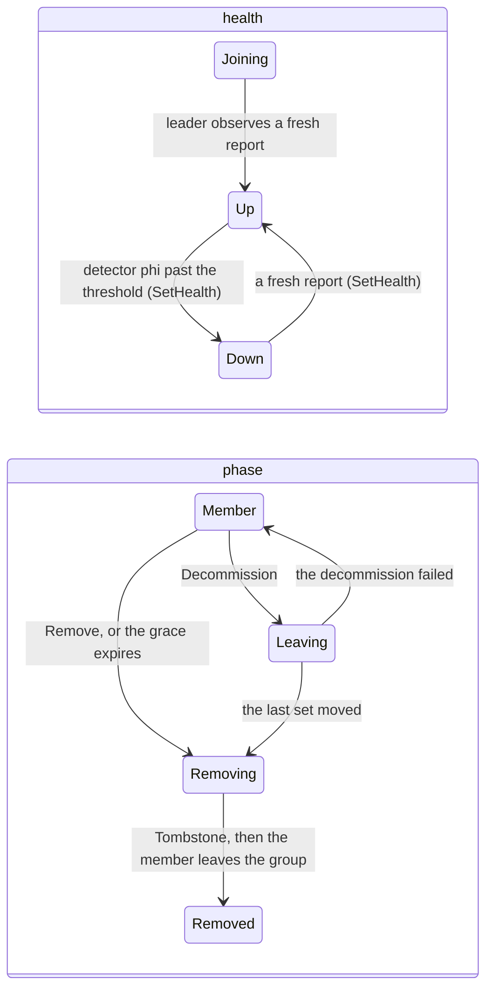

# C3. Membership and failure detection

## Context

The cluster's membership is one `openraft` group of nodes, running on every node's control
thread, whose committed state is the cluster: its identity, its members with their health and
phase, its placement, its plans and its policy. A node joins through seeds as a learner, the
leader promotes voters up to the policy, a phi-accrual detector on the leader commits a silent
member `Down`, and a `Down` member keeps its placement through a grace. Built by
[F39](../features/membership.md), with the detector's short-lived-member rule from
[F42](../features/primary-failover.md), the phase, the grace and the tombstone from
[F46](../features/capacity-rebalancing.md), and an address change followed since
[F50](../features/cluster-operations.md).

## How it works

### One Raft group of nodes

`ControlState` (`shoal-core/src/server/control/types.rs`) is the state machine: `cluster`,
`topology_version`, `members` (each a record, a role, a health, a phase, a grace, its failed
shards and its quarantined copies), `policy`, `bootstrapper`, `initialized`, `tables`,
`operations`, `fenced`, `joint`, `table_read_policy`, `repairs`, `configurations`, `moves`,
`tombstones`, `plans`, `activated`, `backups`, `restores`, `restored_from` and `recoveries`.
`ControlState::apply` is a pure function of a `ControlCommand` - `Bootstrap`, `ObserveMember`,
`Admit`, `SetHealth`, `ReportShards`, `Initialize`, `SetControlVoters`, `SetTableReadPolicy`,
`Repair`, `RepairProgress`, `ReportQuarantine`, `Move`, `MoveProgress`, `Decommission`,
`Remove`, `Maintenance`, `Rebalance`, `GraceElapsed`, `PlanProgress`, `Tombstone`, `Backup`,
`BackupProgress`, `Restore`, `RestoreProgress`, `ForceRecovered`, `Activate` - and every one of
them moves the topology version. The group's log and files live under `<storage>/control/`
(`log`, `vote.json`, `committed.json`, `purged.json`, `state.json`, `snapshot.json`), written
by the control store ([C13](protocol.md#q1-and-q13-at-m1)), independently of any table's
compaction.

`control_voters` is 1, 3 or 5. Every other member is a learner of the control group: a fourth
node under a three-voter policy joins as a learner and stays one
(`fourth_data_node_does_not_change_control_voter_count`), and `SetControlVoters` is the one
way the count moves. Control voters and tablet voters are separate populations: a tablet at a
factor of three may live entirely on control learners, and a member's status report is
telemetry, never a vote for any tablet.

### Joining

```mermaid
sequenceDiagram
    participant J as joiner (mode: joining)
    participant S as seed (any member's control_port)
    participant L as control leader
    participant G as control group
    J->>S: hello naming no cluster, Lane::Control
    S-->>J: JoinResponse::Redirect { leader } (unless S leads)
    J->>L: ControlKind::Join { record }
    Note over L: tombstone check, incarnation check,<br/>one admission at a time (others told to retry)
    L->>G: raft.add_learner(node, record)
    L->>G: propose ControlCommand::Admit(record)
    G-->>J: log replicated: the joiner applies Admit
    Note over J: StorageMeta::adopt_cluster, once:<br/>mode joining -> cluster, cluster id written
    J-->>L: StatusReport every interval_ms
    Note over L: voters below control_voters and not joint?
    L->>G: add_learner(blocking) then change_membership(+joiner)
    Note over J: JoinStatus::Joined; promoted to voter
```

The first node, `bootstrap: true` on an empty directory, mints the cluster and leads a group of
one. Every other node names `seeds` - control addresses - and no bootstrap; its marker says
`joining` with a pre-minted node id and no cluster until a leader admits it. The control thread
dials each seed in turn with a hello naming no cluster, follows a redirect to the leader, and
asks `Join`. The leader refuses a tombstoned or fenced identity, admits one joiner at a time -
`add_learner` then a committed `Admit` - and tells a second joiner to retry. Applying its own
`Admit` is when the joiner adopts the cluster identity, once, and the admission is idempotent
by identity, so an interrupted join is asked again and answered the same. `maybe_promote` on
the leader promotes the first placeable learner in node order whenever committed voters are
below the policy and no joint configuration is in flight, one change at a time.

A member restarted on its directory does not join again: it comes back `recovering` - its
log intact, its identity not yet observed by a leader at this incarnation - and is `joined`
once the leader observes it, seeds reachable or not
(`lost_seeds_do_not_rebootstrap_existing_directory`). Nothing is placed on a joined member
until an operator's `Initialize { nodes }` deals the tablets over the members it names, once
([C4](tablet-map.md#the-placement-rule)).

### The state of a member



Health and phase are read together. `Joining` is an accepted identity not yet observed;
`Up` a member whose control thread reports and whose shard health is known; `Down` a sustained
silence the leader committed. `Member` is placeable when `Up` - `is_placeable` is the one
placement check - `Leaving` is a drain no new set is placed onto, `Removing` a member whose
sets are being rebuilt elsewhere, `Removed` a tombstone. A late `Up` on a `Removing` member
keeps the phase and its grace. `Unreachable` from a ping is a local observation, never a
committed change; `Down` deletes no copy and changes no voter; nothing about health or phase
moves a data quorum's threshold. A `Decommission` that fails puts the member back to `Member`;
nothing else cancels a phase.

Fencing is the `observe` rule on every `ObserveMember`: a tombstoned identity is `Removed`; a
`wire_max` below the activated wire is refused; an incarnation lower than the committed one is
`Fenced`; an equal one from a different control address is `Fenced` as a duplicate; an equal
one from the same address is a re-observation; a higher one supersedes, and the run it replaced
is recorded in `fenced`. A running node that sees a higher incarnation of itself committed
exits `ShoalError::Fenced`, and every hello below the committed incarnation is refused
`PeerRefusal::Fenced` (`duplicate_node_identity_is_fenced`).

### An address change

A member restarted at another address comes back at a higher incarnation with the new
addresses in its record, and the M3 rule admits it. `PeerNetwork::note_addresses` on every
apply makes the control thread dial each member where its committed record says it is, and the
leader's `maybe_readdress` writes the new address into the membership with `ChangeMembers::SetNodes`,
one member at a time, so the next leader dials it there too. A clone left at the old address is
refused as a duplicate; a clone that wins its identity from another address is fed past its
shorter log, which the control group allows (`allow_log_reversion`)
(`address_change_is_observed_and_a_stale_clone_is_fenced`).

### Failure detection

Every member sends the leader a `StatusReport` over the control lane every
`failure_detector.interval_ms` (500 ms): its incarnation, a sequence, its topology version and
applied index, its failed shards, its reachability of every other member from its own pings,
its quarantined copies, its free bytes, the bytes it holds per group and its `wire_max`. The
leader's `Detector` (`control/detector.rs`) keeps the last `window` (100) arrival intervals per
member and, on every report tick, computes phi - the suspicion that the next report is this
late, from the fitted distribution, never a literal `interval × phi` deadline - and proposes
`SetHealth Down` for a member past `phi_threshold` (8.0). A report is fresh only if its
sequence is above the last of the same incarnation; a stale one is counted and ignored, and one
from an older run is answered fenced (`fresh_failure_reports_do_not_mask_shard_failure`). A
member with fewer than `min_samples` (5) arrivals is judged with the expected interval standing
in for the ones it never sent ([item 101](../appendix/resolved/short-lived-member-detection.md)),
and a new leader seeds every up member with the expected pace and a grace of five intervals so
an election is not evidence. The next fresh report from a `Down` member proposes `SetHealth Up`.
`ReportShards` carries a dead shard beside the health, so a healthy control ping never masks
one; the leader also pings every member at `transport.ping_interval` into a local reachability
view that is never proposed. Only the leader's detector view means anything.

### What follows from Down, and when

An election needs no `Down`: a tablet group's followers elect on their own timers
([C7](failover.md)), and a node without a copy routes a `Down` holder's tablets to another
holder that is up. A `Down` verdict moves no replica (`down_retains_placement_during_grace`).
Under `auto_remove_after` (thirty minutes; `null` opens no grace) it opens a `GraceState` on
the member: the leader accrues elapsed time from its own monotonic clock on top of the
committed value and proposes `GraceElapsed` every eighth of the grace or every sixty seconds,
whichever is shorter; apply keeps it monotonic and of one episode, so a leader change loses at
most one increment and never restarts or skips a grace
(`removal_grace_survives_control_leader_restart`). `Maintenance { node, suspend: true }` holds
the count and `Members` reports `grace_remaining_ms` throughout
(`maintenance_suspends_automatic_removal`). Expiry commits the member `Removing` and records an
`Expiry` plan under the policy's name whose steps are moves to feasible members; with none -
three nodes at a factor of three with one dead - the plan blocks naming the missing member,
every copy is kept, the factor is untouched, and it runs on its own once a fourth joins
([C8](rebalancing.md#removing-a-node)).

### openraft and the runtime

The control core runs a **glommio** executor, and `openraft 0.10.0-alpha.34` is driven on it
through the `AsyncRuntime` in `shoal-core/src/server/control/runtime/` under the library's
`single-threaded` feature. The control store completes an append's `IOFlushed` after its
`fdatasync` and returns from `save_vote` after the vote file is renamed and the directory
synced; the marker rewrite goes through `spawn_blocking`, so no synchronous write freezes an
election timer. `PeerNetwork` (`control/network.rs`) is the library's network adapter over the
control lane, carrying `append_entries`, `vote` and `full_snapshot` as JSON under a 16 byte
head, dialling every member's committed address at each RPC; a link failure is `Unreachable`,
which the library retries. `add_learner` with catch-up and `change_membership` with the others
retained are one change at a time, and a joint configuration is never stacked on another.

Two things the library does that the plane had to answer: a leader answers a write with an
empty forward hint until a quorum has acknowledged it, which read as "no leader" is a busy loop
and is polled with a backoff instead; and `enable_leader_restore` restores a stopped leader as
the leader of its old term, which a copied directory turns into two, so it is off. Never hold
a `RefCell` borrow across an `.await` on the control core, and never retry a proposal on a
metrics change without a backoff: both starve the one executor the RaftCore, the links and the
loop share.

## Design choices

Membership under consensus, so that every node's map is one committed thing, rather than
gossip, which converges but never decides. A fixed, small voter set with everyone else a
learner, so a fourth node does not change the quorum. Phi-accrual on the leader alone, because
a verdict is a committed command and only the leader proposes it. A grace counted in committed
increments rather than wall-clock deadlines, so it survives the leader that started it. A
tombstone committed *before* the member leaves the group, so a live member learns it is removed
from the log rather than from silence. glommio under openraft rather than a second Tokio
runtime in a process that already has a reactor and a timer wheel.

## Alternatives rejected

Gossip as authoritative membership; a failure detector as a consensus protocol, or consensus as
a way of making reachability objective; the first draft's all-members-majority detector and
first-five-automatically-vote rules; auto-removal disabled by default; a handwritten Raft
fallback; a current-thread Tokio runtime for the control core; `enable_leader_restore`.

## What it costs

One embedded group's log and files, a status report per member per half second at the leader,
a ping per member per second, and a reserved core. All-pairs reachability in the report grows
quadratically ([C13](protocol.md#q11-and-q13-at-m3)): a third of a megabyte a second of JSON
into the leader at sixty-four members, and the first thing to bound at a hundred.

## Limitations

A member has no failure domain, so voters are not spread over one. The detector's seeding grace
is a constant. The grace is the policy's, not per member, and there is no `SetPolicy`. Data
loaded before `Initialize` stays on the bootstrapper. Only the leader's detector view is
meaningful. ~~The admin refusal's code is derived from its reason text~~ - a refusal carries
its kind since [Resolved #98](../appendix/resolved/admin-refusal-kinds.md).
A member isolated on every lane long enough to inflate its term trips a debug assertion when
healed ([item 106](../appendix/known-issues.md#106-a-member-isolated-on-every-lane-long-enough-to-inflate-its-term-trips-an-openraft-debug-assertion-when-healed)).
See [C15](open-issues.md).

## Invariants to uphold

- Every membership decision is committed by the embedded control group.
- Failure suspicion cannot create a voting majority or lower a data quorum.
- `Down` retains assignments through the grace; `Removing` starts durable, capacity-checked transitions.
- Control quorum loss freezes metadata mutations, not independent healthy tablet elections.
- Rejoin, voter promotion and data readiness are distinct checks.
- A tombstone precedes the membership change that removes the member.
- The `observe` rule is the only fencing policy, and it runs in apply.

## How it is measured

Idle control CPU and report bytes are the M1 and M3 spike tables ([C13](protocol.md#q1-and-q13-at-m1));
`macro/cluster/overhead/nodes/3` carries every node's report at the end of the run
([C10](performance.md#the-arms)).

## Acceptance tests

| Test | Asserts | Milestone |
| --- | --- | --- |
| `three_nodes_bootstrap_without_external_membership` | Shoal-only processes converge on one cluster and recover metadata after restart | M3 |
| `fourth_data_node_does_not_change_control_voter_count` | A fourth node joins as a control learner under the three-voter policy | M3 |
| `minority_cannot_commit_membership_changes` | An isolated control minority cannot remove majority peers or promote replacement voters | M3 |
| `fresh_failure_reports_do_not_mask_shard_failure` | Old incarnation and status reports are ignored and a data-shard failure is observable | M3 |
| `lost_seeds_do_not_rebootstrap_existing_directory` | A restart with unreachable seeds preserves the established cluster identity and log | M3 |
| `down_retains_placement_during_grace` | An election may change a primary, but no replica moves before the configured removal | M6 |
| `removal_grace_survives_control_leader_restart` | A restart or failover of the leader preserves the episode, without an early or forgotten removal | M9b |
| `maintenance_suspends_automatic_removal` | A suspension prevents removal, and resumption reports the remaining deadline | M9b |

## Related

[C1](node-identity.md), [C4](tablet-map.md), [C7](failover.md), [C8](rebalancing.md),
[C13](protocol.md); the [OpenRaft integration guide](https://docs.rs/openraft/latest/openraft/docs/getting_started/index.html)
and its [log storage contract](https://docs.rs/openraft/latest/openraft/storage/trait.RaftLogStorage.html),
which the control store passes the conformance suite of.
