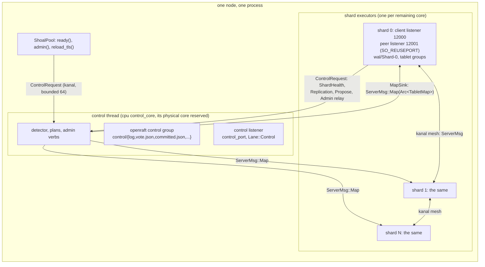

# C1. Nodes, identity, and the cluster configuration

## Context

A node has an identity independent of its address, a cluster it belongs to, and an embedded
control plane on a core of its own. Ordinary data work stays on the glommio shards. Membership
and failover need no separately deployed service ([C13](protocol.md)). Built by
[F37](../features/node-identity-control-plane.md) (identity, the marker, the control thread),
[F39](../features/membership.md) (the mode, the incarnation, fencing), [F47](../features/local-rehome.md)
(slots beside executors) and [F50](../features/cluster-operations.md) (the certificate binding
and an address change).

## How it works

### Two identities

A `NodeId` is minted once, when an empty directory is first claimed, and a `ClusterId` once,
when the first node bootstraps with `cluster.bootstrap: true`. Both are persisted in the marker
before anything else happens. Seeds are discovery addresses, never identities: a joiner adopts
the cluster identity the leader that admits it names, and a directory naming a different
cluster is refused `WrongCluster`. An established directory whose seeds are unreachable comes
back `recovering` - a member with its log that no leader has observed at this incarnation yet -
and creates nothing.

A directory lock (`shoal.lock`, `flock`) keeps two processes off one path. A cloned directory
is fenced by its incarnation: every claim of an established directory bumps it, the committed
member record carries it, and the control state's `observe` rule refuses a lower one, refuses
an equal one from a different control address as a duplicate, and lets a higher one supersede -
at which point the superseded run sees itself committed at a higher incarnation and stops
`Fenced` ([C3](membership.md#the-state-of-a-member)). A removed identity is tombstoned and
refused at every door; a node that learns its own identity is removed stops with
`ShoalError::Removed`, its directory left where it is as evidence ([C8](rebalancing.md#removing-a-node)).

### The storage marker, format 3

`shoal-meta.json` at the latency-sensitive storage root (`shoal-core/src/server/meta.rs`):

| Field | Meaning | Rewritten by |
| --- | --- | --- |
| `format` | 3 | nothing |
| `shards` | The slot count: the shard number every peer records for this node, the modulus of the placement rule, minted once | nothing |
| `physical` | The executor count the files are laid out on, when it differs from `shards` | a rehome's finalize |
| `node` | The `NodeId` | nothing |
| `cluster` | The `ClusterId`, or `null` on a standalone or joining node | the admission, once |
| `layout` | The shard layout version (2 on a cluster node) | nothing |
| `topology` | The last topology version observed, a resume hint and not proof of freshness | the control plane |
| `mode` | `standalone`, `cluster` or `joining` | the admission, `joining` to `cluster`, once |
| `incarnation` | Which start of this directory this is | every claim |

Tablet term and vote, committed configuration and checkpoint boundaries live in each group's
own durable files, never in one node-wide counter. Wire, schema and disk-format versions are
three separate things ([C2](transport.md#compatibility-and-the-wire-version)).

A marker at a format this build does not read is refused with an error naming the format found
and the formats the build reads. A marker is never migrated in place: the build that wrote it
serves it, or its data is brought into a new cluster by a restore of a backup or of an export
([C9](operations.md#backup-restore-and-export)). A directory never changes mode: a standalone
directory opened by a cluster configuration is `StandaloneDirectoryInCluster`, a cluster one
opened standalone `ClusterDirectoryInStandalone`, a joining one bootstrapped
`JoiningDirectoryBootstrapped`, and the supported path across is the export.

### The cluster block

[Configuration](../getting-started/configuration.md#cluster) is the reference with every key
and its default. A file that says only `cluster:\n  bootstrap: true` gets exactly those
defaults, and `documented_cluster_defaults_match_policy_bootstrap` holds the two to each other.
The block is `deny_unknown_fields`, and `Cluster::validate` refuses a value out of range at
start by name (`shoal-core/src/server/conf/cluster.rs`).

The keys are in two halves. **This node's**: `bootstrap` or `seeds` (one, never both, never
neither), `advertise` (required when `networking.interface` is `0.0.0.0` or `::`), `port` (the
data, bulk and replication lanes, bound by every shard with `SO_REUSEPORT`, 12001),
`control_port` (the control lane, bound by the control thread, 12002), `client_advertise`,
`control_core` and `control_core_shared`, `weight`, `slots`, `tls`, `dial`, and the
`transport`, `replication`, `repair`, `migration`, `rebalance` and `backup` blocks, whose
bounds and timeouts are node-local. **The cluster's**: `control_voters` (1, 3 or 5),
`replication_factor`, `write_consistency` (`Quorum` by default; `One` refused), `read_consistency`
(`One` by default; `All` refused), `failure_detector` (`interval_ms`, `phi_threshold`, `window`,
`min_samples`), `primary_failover_after`, `auto_remove_after` and `admins`. The bootstrapping
node writes the cluster's half into the control state as its `BootstrapPolicy`; after that a
change is an admin operation, and a joiner's copy of those keys is ignored. Local YAML cannot
weaken quorum durability: a persistent table configured `Async` on a cluster node is refused.

```yaml
cluster:
  bootstrap: true                 # the first node; every other node names seeds instead
  seeds: ["10.0.0.1:12002"]       # control addresses - control_port, not port
  advertise: "10.0.0.2"           # the address peers reach this node at
  port: 12001
  control_port: 12002
  control_core: 0
  control_voters: 3
  replication_factor: 3
  write_consistency: Quorum
  read_consistency: One
  auto_remove_after: "30m"        # null never removes on its own
  admins: ["ops"]
  tls:
    cert: "/etc/shoal/node.pem"   # a leaf naming shoal-node://<this node's id>
    key: "/etc/shoal/node.key"
    ca: "/etc/shoal/cluster-ca.pem"
```

A seed is a control endpoint, and a joiner's only conversation before it is a member is on
that lane. The replication factor is a desired configuration, not a count of members that are
up: a cluster of one at a factor of three serves reads and admin and refuses default writes
`QuorumUnavailable` naming the shortfall until two more members are up. Per-table overrides of
the cluster's half do not exist; a table's read level is the one versioned exception, set by
`SetTableReadPolicy` ([C6](reads.md#the-per-bundle-override)).

### The control thread



`ShoalPool::start` (`shoal-core/src/server.rs`) resolves the control placement first
(`control/cores.rs`: the cpu is checked against the process's affinity, and unless
`control_core_shared` its whole physical core, both SMT threads, is kept from the shards),
takes the directory lock, claims the marker, reads the TLS material once into a
`PeerTlsHolder`, and starts the control thread **before any shard**: a glommio executor pinned
to `control_core`, running the `openraft` group through the `AsyncRuntime` this repository
wrote ([C3](membership.md#openraft-and-the-runtime)), binding the control listener, and
answering `ControlRequest`s - `Topology`, `Readiness`, `Map`, `Admin`, `ShardHealth`,
`Replication`, `Propose`, `Shutdown` - on a bounded channel the pool and every shard hold. Then
a pending rehome runs, `shoal-hosting.json` is read or planned, and the shards start on the
remaining cores. Every committed map is pushed whole to every shard as `ServerMsg::Map`.

Control networking is the control thread's on its own listener; data networking is the
shards'. A shard never waits on the control plane for an ordinary read or write, and a
stalled shard cannot stall a vote or a ping. A standalone node has no control thread and no
control listener. On a small machine `control_core_shared: true` lets a shard share the
control cpu's physical core, and the sharing is recorded in the topology view and in every
benchmark artifact rather than hidden.

### The address of a shard

An address is `(NodeId, slot)`. A node claims its slots once - `cluster.slots`, one per core by
default - into the marker's `shards`, and every group identity is hashed from them. Which
*executor* hosts a slot is the node's own table, `shoal-hosting.json`, so a node's core count
changes without any address changing ([C8](rebalancing.md#slots-executors-and-the-rehome)).
A peer never learns an executor number: `peer::listener::dispatch_target` is the one place a
slot becomes one. More cores than slots is refused `CoresExceedSlots`; the way past it is a
`Replace`. A node advertises separate client, data and control endpoints; file paths stay
node-local and keep their `Shard-N` prefixes. Short identity strings are display conveniences,
never protocol keys.

## Design choices

Identity is minted, not derived from an address, so a node keeps its place across an address
change ([C3](membership.md#an-address-change)). The control core is configurable and validated
against the cpuset rather than fixed at CPU 0, because a container or a `taskset` may not have
it. The cluster's policy lives in one committed place, so no joiner can redefine it from a file.
Format refusal is a safety check; the supported migration is an export into a new cluster, not
an in-place rewrite of a marker whose reader has to guess what it meant.

## Alternatives rejected

Address-derived identity; implicit re-bootstrap when seeds are unreachable; a globally fixed
CPU 0 in every process; one node-wide topology version as proof of tablet freshness; an
external coordinator; an in-place marker migration.

## What it costs

A reserved control core - a cluster node with default settings has one fewer shard candidate
than a standalone node on the same machine - control CPU and metadata storage, two peer
listeners, certificates, and a claim at start that reads the marker before anything else.
Shared SMT and device resources can affect data performance; [C10](performance.md) measures the
one-node cluster against the standalone twin rather than describing the reserved core as free.

## Limitations

The control thread's failure is reported as shard `usize::MAX`. Nothing issues or distributes a
certificate; a leaf is minted for a node id that already exists, so a node's first start is
plaintext or under a leaf issued from the marker it wrote. The marker records no failure
domain. See [C15](open-issues.md).

## Invariants to uphold

- Identities and terms cannot be guessed from addresses or stale topology markers.
- An existing directory never bootstraps independent authority on seed failure.
- Core allocations respect the process's allowed CPUs and record any sharing.
- Cluster policy has one committed authority; local YAML cannot weaken quorum durability.
- A directory never changes mode or identity; a cloned one is fenced by incarnation.
- Neither runtime depends on an external membership or failover service.

## How it is measured

`macro/cluster/overhead/nodes/1` is the grid's reference cell served by a cluster of one, read
beside `macro/grid/unsorted/r50/1024` and nowhere else ([C10](performance.md#the-arms)); the
control thread's idle cost is the M1 spike's ([C13](protocol.md#q1-and-q13-at-m1)).

## Acceptance tests

| Test | Asserts | Milestone |
| --- | --- | --- |
| `node_identity_persists_and_wrong_cluster_is_refused` | A restart retains the identity; a wrong-cluster seed never rewrites it | M1 |
| `unknown_configuration_and_storage_formats_are_refused` | Errors name the unsupported setting or format and the supported path | M1 |
| `control_core_respects_cpuset_and_smt_reservation` | Restricted affinities and multiple processes cannot silently overlap reserved resources | M1 |
| `standalone_needs_no_peer_or_control_listener` | An absent cluster block keeps the standalone deployment shape | M1 |
| `documented_cluster_defaults_match_policy_bootstrap` | The defaults are `Quorum`/`One`, three voters and a finite configurable removal grace, and the documented block matches the bootstrap policy | M1 |
| `duplicate_node_identity_is_fenced` | Concurrent cloned identities cannot both join or serve as the same replica | M3 |
| `single_node_data_has_a_verified_cluster_migration_path` | An export of a stopped standalone directory restored into a fresh cluster preserves the data, judged by digest, with the source as the rollback | M10b |
| `certificate_rotation_binds_identity` | A peer certificate is bound to the node it claims on both ends of every lane, a leaf and an authority rotate on a live cluster through a reload and a bundle, and a leaf naming another node or none is refused by name; skips by name without kTLS | M10c |
| `address_change_is_observed_and_a_stale_clone_is_fenced` | An address change at a restart is observed at a higher incarnation by every member, the cluster reaches the member there, and a clone at the old address is refused as a duplicate | M10c |

## Related

[C2](transport.md), [C3](membership.md), [C8](rebalancing.md#slots-executors-and-the-rehome),
[C13](protocol.md), [C14](deploying.md),
[Configuration](../getting-started/configuration.md#cluster),
[Storage marker](../appendix/resolved/storage-marker-format.md).
