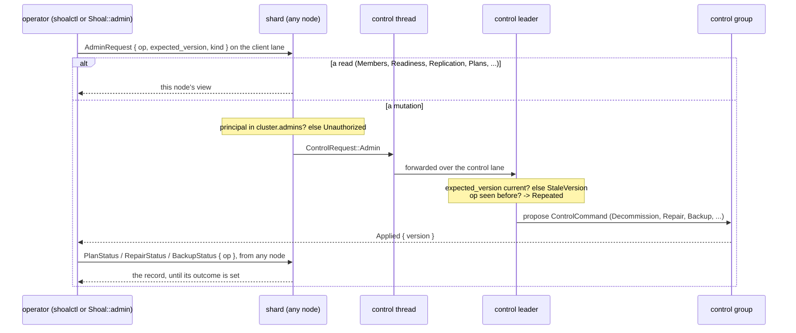

# C9. Operating a cluster

## Context

An operator sees data readiness, durability, replication debt, quarantines and plan progress,
and changes the cluster through authorized, versioned, idempotent operations that are recorded
where any node can read them. All of it talks to Shoal nodes over the client connection; there
is no external service and no second protocol. Built across the milestones as each operation
appeared - readiness and the admin frame at [F39](../features/membership.md), replication
reports at [F40](../features/replication.md), repair at [F44](../features/repair.md), moves at
[F45](../features/replica-migration.md), plans at [F46](../features/capacity-rebalancing.md),
activation at [F48](../features/rolling-compatibility.md), backup and recovery at
[F49](../features/backup-and-recovery.md), and certificate rotation, the cluster tab and the
runbooks at [F50](../features/cluster-operations.md). [C14](deploying.md) is the walk through
a deployment; the [runbooks](../operations/runbooks.md) are the procedures.

## How it works

### The admin frame

An `AdminRequest { op, expected_version, kind }` rides the authenticated client connection
(`shoal-proto/src/shared/protocol/admin.rs`). A read is answered by the node reached; a
mutation is relayed to the control thread, forwarded to the control leader, judged against
`expected_version` (`StaleVersion` if the topology moved under it), authorized against
`cluster.admins` by the connection's SCRAM principal (`Unauthorized` naming who may), applied
once by its `op` id (`Repeated { version }` the second time), logged with the principal, and
answered `Applied { version }` with a record a later read follows. A refusal is answered by
the kind the state machine decided - `NotMember`, `NotUp`, `WrongPhase`, `Duplicate`,
`AlreadyInitialized`, `NotInitialized`, `BadVoterCount`, `UnknownOperation`, `WireVersion`,
`InvalidRequest`, a queued transition as `Unavailable` - with the sentence as the message
([Resolved #98](../appendix/resolved/admin-refusal-kinds.md)).

| Kind | What it does |
| --- | --- |
| `Members` | The `TopologyView`: cluster, this node and its incarnation, the leader, the version, every member with its role, health, phase, incarnation, grace remaining, weight, free and held bytes and wire, the voters, learners and whether a joint configuration is in flight, the placement, the factors, `up_members`, `under_replicated_sets`, the open plans, the tombstones, the policy and the wire (activated, floor, newest, the range the members speak) |
| `Readiness` | Three parts: `process` (the shards bound), `control` (`joining`, `recovering` or `joined`, the leader, the voter and learner counts) and `data` (initialized, placed, members up, desired and active factor, `default_writes` as `Ok` or the `QuorumShortfall` by name, failed shards, and this node's replication summary) |
| `Detector` | The leader's suspicion per member, report freshness and incarnations |
| `Replication` | Every group this node hosts with its table, members, leader, applied, committed and checkpoint indexes, pending bytes, whether it is volatile, up, installing or quarantined; folded per node into groups hosted and led, the widest lag, pending and volatile bytes, writes answered unknown or rejected, the snapshot counters and the integrity counters |
| `Initialize { nodes }` | Deals every tablet over these members in this order, once ([C4](tablet-map.md#the-placement-rule)) |
| `SetControlVoters { voters }` | 1, 3 or 5; the leader promotes or demotes to it |
| `SetTableReadPolicy { table, level }` | A table's read level, or none to clear it ([C6](reads.md#the-per-bundle-override)) |
| `Repair { table, tablet, mode, source, release }`, `RepairStatus { op }` | A scrub of a table's groups, a verdict, a quarantine and in repair mode an install ([below](#repair)) |
| `Move { tablet, from, to }`, `MoveStatus { op }` | A replica set moved ([C8](rebalancing.md#a-move)) |
| `Decommission { node }`, `Remove { node, replacement }`, `Maintenance { node, suspend }`, `Rebalance`, `PlanStatus { op }`, `Plans` | The plans ([C8](rebalancing.md#plans)) |
| `Activate { wire }` | The cluster's activated wire version ([below](#rolling-upgrade)) |
| `Backup { table, path }`, `BackupStatus { op }`, `Backups`, `Restore { path }`, `RestoreStatus { op }`, `Recoveries` | Backups, restores and the recoveries an operator ran ([below](#backup-restore-and-export)) |
| `ReloadTls` | This node reads its peer certificate, key and authority again ([below](#certificates)) |

A standalone node answers every kind `Unavailable`. A client sends one with `Shoal::admin`;
the cluster tab of `shoalctl` sends most of them from a command line
([shoalctl](../operations/shoalctl.md#the-cluster-tab)). Three operations run on a stopped
directory rather than through the frame: `force_recover`, `export_standalone` and a rehome.

### Readiness

`ShoalPool::ready` returns once the shards are bound and reports the first shard that failed;
it is the process half. `Readiness.control` says whether this node's control thread has been
observed by a leader at this incarnation; `Readiness.data.default_writes` says whether a
default write would be admitted right now, by the same `write_admission` the shards use, and
names the shortfall when not. A node with a tablet installing is not ready for that tablet and
is for the rest. Neither `Members = up` nor a member count of three is data readiness: three
members do not mean three ready copies of every tablet
(`readiness_distinguishes_process_control_and_data`). The cluster tab's third line - copies
against the factor, who is missing, whether writes are admitted - is the figure to read first.

### What the reports carry

| Family | Where it is |
| --- | --- |
| Membership | `Members`: control quorum, voters, versions, health and phase, grace remaining, tombstones |
| Replication | `Replication`: applied, committed and checkpoint indexes per group, lag in entries, pending and volatile bytes, `under_replicated_sets` on `Members` |
| Writes | The client's outcomes ([C5](replication.md#what-the-client-is-promised)); per node the writes answered unknown or rejected on `Replication`; the histograms are the cluster arms' |
| Reads | `read_stats` per node: barriers, hops, barrier and application waits, session waits, lineage refusals, timeouts, late and duplicate shares, reroutes ([C6](reads.md)) |
| Recovery | The snapshot counters on `Replication` (built, sent, installed, bytes each way, chunks, duplicates, drops, resumes, aborts, redos, forced purges, entries installed) and the installing flag per group; time to catch up is the catch-up arms' |
| Resources | Pending bytes, volatile bytes, each member's free and held bytes, the token bucket's waits and the refused streams |
| Integrity | `integrity` on `Replication`: checksum failures, unverified reads, lost logs, quarantines, scrubs with their partitions and bytes; the source, provenance and unresolved digests are the repair record's |
| Failover | The failover arm's marks and windows; a node's own `Lease` state per group |

Series are aggregated by node, table and role; a tablet is never a metric label. Traces cross
the hop from each query's own span and a snapshot or repair carries its operation id
([F35](../features/wire-trace-context.md)).

### Repair

Every archive record is `[size][gxhash64][payload]` behind a format 2 header, written by
`write_record` and verified by `ArchiveMap::read_record` and nowhere else; the checkpoint file
and the retry sidecar carry checksums too. A record that fails is `CorruptArchive` to the
queries parked on it and quarantines the copy on the spot: a marker under
`wal/Shard-N/quarantine/`, committed through the node's next status report as
`ReportQuarantine`, so every other node routes reads around it and the node refuses them
`Quarantined`. An archive written before the format is read unverified and counted until
compaction rewrites it.

`Repair { table, mode: verify | repair, source }` commits a `RepairRecord` with a phase per
group of the table, and each group's leader drives its own (`shard/repair.rs`,
`cluster.repair.concurrent` at a time), every phase committed as `RepairProgress` before the
step: `Queued` behind a move on the set, `Pending`, `Scrubbing`, `Judged`, `Installing`,
`Verifying`, `Done`. A scrub is `Command::scrub`, a command whose tablet is `SCRUB_TABLET`,
applied in committed order and never handed to a compactor; every replica takes a canonical cut
at the entry's index - rows re-serialized in key order under the schema and the tablets, never
archive bytes, so layout, compaction timing and residency cannot make a false report
(`canonical_digest_ignores_archive_layout_at_same_boundary`) - and reports a `DigestReport` the
leader collects with `ReplicateKind::Digest`. `judge` is pure: a copy whose record failed its
checksum is quarantined on that evidence; among the verified copies a strict majority of the
replica set agreeing on one digest is trusted and every other verified copy is quarantined
divergent; `source` overrides the rule with that node's verified digest under the operator's
provenance; no majority and no source is `Unresolved { digests, invalid }`, which quarantines
nothing more and installs nothing, the record being the evidence
(`repair_detects_corrupt_primary_and_preserves_evidence`). In repair mode a leader that is not
trusted hands the lead to a trusted member first; a durable target is restarted from its held
checkpoint with the leader's cut installed through the snapshot path
([C7](failover.md#snapshots-and-atomic-installation)), then verified by a second scrub that
lifts the quarantines of the copies that agree. A scheduled pass, `cluster.repair.scrub_interval`
(off by default), is verification only and never installs. A repair and a move on one set
serialize (`repair_serializes_with_migration_and_new_commits`).

### Rolling upgrade

A build carries `MIN_PEER_VERSION..=PROTOCOL_VERSION` and every link negotiates the highest
both read ([C2](transport.md#compatibility-and-the-wire-version)). `Members.wire` reports the
activated version and the range the members speak. The order: one failure domain at a time,
stop, install, start - `cluster.transport.wire_version` pins a node at the old version through
the window if wanted - wait for `Readiness` and for `Replication.lag_max` to reach zero; lift
the pins; when `min_member` is the new version, `Activate { wire }`, which the leader refuses
until every non-removed member's running build reports it, never lowers, and past which a
build below it is refused at the hello and stops itself at start. Rollback is a downgrade
before activation and nothing after it; the matrix is on the F page. A schema change is not
a rolling operation: a join with another `schema_id` is refused, and the path is a new cluster
and a restore (`rolling_upgrade_survives_operations_and_failure`, `rolling_upgrade_from_previous_binary`).

### Backup, restore and export

`Backup { table, path }`, refused until wire 5 is activated, commits a `BackupRecord` every
group's leader drives: it nudges its checkpoint, cuts its own snapshot file at that boundary,
copies it to `<path>/<op>/<table>/<group>-<boundary>.snap` **on its own node's disk** with a
JSON manifest beside it naming the cluster, the schema, the table, the group, the boundary, the
tablets, the records, the bytes, the checksum and the retry table in the trailer, verifies it,
and records `Written`, `Skipped` (an ephemeral table) or `Failed`. It is not one cross-tablet
snapshot; each group's boundary is on the record. Copying `<path>/<op>` out of the failure
domain is the operator's step. `Restore { path }` is asked of a fresh, bootstrapped, joined,
initialized and empty cluster with the files reachable from every leader: coverage, schema and
source cluster are judged before anything is proposed (a gap, an overlap, a populated table and
the same cluster are refused); every group's leader proves its members empty by a scrub,
builds one file for its tablets from the backup's, installs it on every member through the
repair path under a quarantine, and lifts it with a second scrub; `restored_from` is
committed, the old cluster's nodes are refused as removed at every door, and the old cluster's
session tokens are `WrongCluster` (`backup_restore_verifies_history_in_new_cluster`).

Single-node data takes the same path: `export_standalone::<Schema>(&conf, &dir)` on a stopped
standalone directory folds its intent logs - the one thing it writes to the source - and writes
each persistent table's archives as one backup-shaped file with a manifest; a fresh cluster
restores it, and the source starts standalone again with every row, which is the rollback
(`single_node_data_has_a_verified_cluster_migration_path`). Nothing converts a directory in place.

### Permanent quorum loss

While the control group has no quorum, established tablet groups keep serving where their own
quorums survive; a write through a survivor without one is unknown or refused and never
acknowledged alone; a strong read is refused; an admin mutation is refused naming the voters
this node reaches and `force_recover`; and a restart with `bootstrap: true` keeps the cluster
and mints nothing. Losing the original voters' storage for good is recovered by an operator, offline,
to one survivor: `force_recover(&conf, &[me])` on the stopped survivor whose log is the
history applies what the control log held unapplied, appends a membership of that node alone
and a `ForceRecovered` record at a term past every term seen, rewrites every durable group whose
members include a lost node to that shard alone, and, applied, tombstones the lost members with
a `Remove` plan each and records the boundary in `Recoveries`. The survivor restarts leading
alone, fresh identities join, and the plans rebuild every set. What the survivor never held is
gone, and a set it was not in stays blocked until restored from a backup
(`permanent_quorum_loss_requires_explicit_recovery`).

### Certificates

`ReloadTls`, node-local and admin-only, reads `cluster.tls`'s three files again, rebuilds both
the server and the client config, and swaps the pair or neither, reporting the chain length,
the authorities in the bundle and the node the leaf names; established kTLS connections keep
their kernel keys and every later handshake uses the new material. An authority rotates as a
bundle: trust both, reissue the leaves, retire the old ([C2](transport.md#encryption-and-identity)).

### The runbooks

| Runbook | Operation |
| --- | --- |
| [1. Bootstrap](../operations/runbooks.md#1-bootstrap) | `bootstrap: true`, `seeds`, `Initialize`, wait for `default_writes` |
| [2. Add a node](../operations/runbooks.md#2-add-a-node) | `seeds`, `weight`, `Rebalance`, `PlanStatus` |
| [3. Replace a dead node](../operations/runbooks.md#3-replace-a-dead-node) | A new identity, `Remove { node, replacement }` or the grace |
| [4. Decommission](../operations/runbooks.md#4-decommission) | `Decommission`, `PlanStatus` |
| [5. Automatic removal and maintenance](../operations/runbooks.md#5-automatic-removal-and-maintenance) | `auto_remove_after`, `Maintenance` |
| [6. A removed node returns](../operations/runbooks.md#6-a-removed-node-returns) | Nothing: refused as removed |
| [7. Rolling upgrade](../operations/runbooks.md#7-rolling-upgrade) | `transport.wire_version`, `Activate` |
| [8. Control quorum lost](../operations/runbooks.md#8-control-quorum-lost) | Restart the missing voters |
| [9. Permanent quorum loss](../operations/runbooks.md#9-permanent-quorum-loss) | `force_recover`, offline |
| [10. Backup and restore](../operations/runbooks.md#10-backup-and-restore) | `Backup`, `Restore` |
| [11. Existing single-node data](../operations/runbooks.md#11-existing-single-node-data) | `export_standalone`, offline, then `Restore` |
| [12. Change a node's cores](../operations/runbooks.md#12-change-a-nodes-cores) | `resources.cores`, the rehome at start |
| [13. Change a node's address](../operations/runbooks.md#13-change-a-nodes-address) | `advertise`, `port`, `control_port`, `dial`, a restart |
| [14. Rotate certificates and authorities](../operations/runbooks.md#14-rotate-certificates-and-authorities) | `cluster.tls`, `ReloadTls` |

## Design choices

Every mutation is a committed record with an operation id, so it survives a disconnected
operator and is followed from any node. Authorization from the first operation, by the
connection's principal against committed `admins`, rather than retrofitted. A repair that
trusts a verified majority or a named source and nothing else, so no primary is believed for
being the primary. A backup as the snapshot the groups already cut, restored only into a fresh
identity that refuses the old one, so two clusters never claim one history. A recovery that
an operator runs offline on one survivor, so a lost majority is never manufactured by the
cluster. Runbooks as procedures naming the operation, the keys, the wait and the rollback point.

## Alternatives rejected

Repair from the primary on any mismatch; a raw archive-byte digest as logical equality;
handshake-only rolling upgrades; deleting orphaned data on a replica count; an automatic
forced majority after a lost quorum; a restore into a populated cluster or a node's directory;
a separate admin port or protocol.

## What it costs

A scrub reads a group's archives whole once per pass, priced against the foreground by
`macro/cluster/background/repair`; a backup cuts and copies every group's file, priced by
`macro/cluster/background/backup`; the admin reads cost a frame each, six a second on the
cluster tab. Strong operational claims rest on the restore and mixed-version tests, not the
UI.

## Limitations

Backup files land on each leader's disk with no shipping, encryption, retention or age; a
restore is once, whole, into an empty cluster - no point-in-time or single-table restore; a
recovery is to one survivor. A quarantine is routed around per holder, not per table. One
repair per shard at a time; a scheduled scrub refused stale is not retried. `shoalctl`'s tab
reaches one node. Nothing issues a certificate. ~~An admin refusal's code is derived from its
reason text~~ - a refusal carries its kind since
[Resolved #98](../appendix/resolved/admin-refusal-kinds.md). See [C15](open-issues.md).

## Invariants to uphold

- Admin mutations are authorized, versioned, idempotent and auditable.
- Readiness reflects data eligibility and the requested policy, not open sockets.
- Repair never trusts a primary for being the primary and never overwrites unresolved evidence.
- Upgrade compatibility includes payloads, schema and the activation boundary.
- Backup and restore preserve identity boundaries and state their consistency scope.
- Recovery after a lost majority is an operator's explicit, offline choice with a recorded boundary.

## How it is measured

`macro/cluster/background/{repair,backup}`: the kill arm's placement and mixture with nothing
killed and a verify-mode `Repair` or a `Backup` asked for a third of the way through, the
scrub's or the copy's cost to the foreground read as `during` against `before`
([C10](performance.md#the-arms)). Restore time is not priced.

## Acceptance tests

| Test | Asserts | Milestone |
| --- | --- | --- |
| `readiness_distinguishes_process_control_and_data` | A ready process and admin cannot falsely imply ready default quorum writes | M3 |
| `admin_mutations_require_principal_and_operation_identity` | Unauthorized, stale-version and duplicate requests cannot repeat a membership mutation | M3 |
| `repair_detects_corrupt_primary_and_preserves_evidence` | A corrupted primary is repaired from trusted surviving state; unresolved divergence stops with its evidence | M8 |
| `canonical_digest_ignores_archive_layout_at_same_boundary` | Equivalent data compacted differently compares equal; changed or missing data does not | M8 |
| `repair_serializes_with_migration_and_new_commits` | A concurrent repair and move cannot install stale state or destroy current evidence | M9a |
| `rolling_upgrade_survives_operations_and_failure` | Mixed binaries replicate, read, snapshot and elect correctly, with the activation and rollback limits | M10a |
| `rolling_upgrade_from_previous_binary` | A real previous build's nodes are upgraded in place one at a time and the version activated, when `SHOAL_PREVIOUS_TEST_BINARY` names one | M10a |
| `backup_restore_verifies_history_in_new_cluster` | An isolated backup with its retry state restores, validates, and the old identities are refused | M10b |
| `permanent_quorum_loss_requires_explicit_recovery` | No automatic empty bootstrap or destructive choice without durable majority evidence; an operator's `force_recover` to one survivor leads, serves every acknowledged key and rebuilds the sets on fresh identities | M10b |
| `the_cluster_model_reads_the_admin_frames` | The operator's view is one model built from the admin frames with the copies-against-factor figure first | M10c |
| `an_action_previews_its_boundary_and_follows_its_record` | Every operation is previewed with the identity it touches, what moves and its irreversible boundary before it is sent, then followed by its record | M10c |
| `initialize_previews_its_order_and_is_sent_once` | An `initialize` lists its members in the order typed, names the factor and that it happens once, and sends them in that order | M10c |

## Related

[C2](transport.md), [C7](failover.md), [C8](rebalancing.md), [C13](protocol.md),
[C14](deploying.md), the [runbooks](../operations/runbooks.md), [shoalctl](../operations/shoalctl.md),
[Observability](../operations/observability.md), [Authentication](../features/authentication.md).
