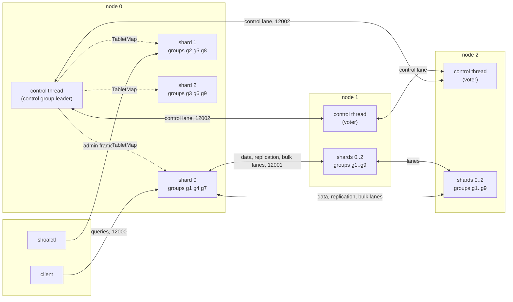

# Distributed Shoal

A Shoal cluster is a set of Shoal processes that agree on their membership, deal every table's
tablets over themselves at a replication factor, and serve every read and write through the
same shard loop a standalone node uses. Nothing outside the processes coordinates them: the
membership is an embedded `openraft` group running on a reserved core of every node, and every
tablet is replicated by an embedded `openraft` group running under the shard that hosts it. A
default write is acknowledged once a majority of its replica set has fsynced it; a default read
is served from the local replica's committed state; a strong read is a barrier from the
tablet's leader. Nodes join through seeds, are called down by a phi-accrual detector, keep their
placement through a grace, and are drained, replaced or rebalanced by plans the control leader
drives as moves. A node behind the purge point is fed a snapshot, a corrupt copy is quarantined
and repaired from a verified majority, a cluster is backed up and restored into a new identity,
and a rolling upgrade negotiates the wire and activates it.

Every milestone on the [milestones](milestones.md) page is delivered, M0 through M10c, as
[F36](../features/cluster-harness.md) through [F50](../features/cluster-operations.md). The `C`
pages of this chapter describe the cluster as it is; the `F` pages are the records of how each
piece was built, what it cost and what it left undone. [C14](deploying.md) is how to deploy one,
and [C15](open-issues.md) is what is still open.

Three nodes of three shards at a factor of three: one control group of three voters, and for
each table nine tablet groups, one per node and slot, each replicated on all three nodes. The
control leader pushes the committed `TabletMap` to every shard of its node, and every node's
control thread does the same for its shards.

## What is asked of it

| # | Requirement | Where it is met |
| --- | --- | --- |
| R1 | Nodes are easy to add and remove | [C3](membership.md) joins through seeds, [C8](rebalancing.md) plans, [C14](deploying.md) and the [runbooks](../operations/runbooks.md) |
| R2 | Removed nodes cause rebalancing | [C8](rebalancing.md): a decommission, a removal and an expired grace are plans whose steps are moves; a plan short of capacity blocks by name |
| R3 | Down nodes do not immediately cause rebalancing | [C3](membership.md)'s grace, counted in committed eighths; [C7](failover.md) elects without moving data |
| R4 | Eventually consistent by default | [C6](reads.md): a `One` read is the local replica's committed, applied prefix |
| R5 | Default writes wait for a quorum | [C5](replication.md): a `Quorum` write is a durable majority's evidence |
| R6 | Reads may coordinate across nodes | [C2](transport.md) forwards shares as bytes, [C6](reads.md) gathers them and takes a barrier for a strong read |
| R7 | No external service for membership or failover | [C13](protocol.md): both protocols are embedded; there is nothing to deploy beside a node |

Performance is judged throughout: [C10](performance.md) separates what distribution costs at
fixed resources from what more hardware buys, and every cluster arm records its own placement.
No performance target weakens R5; a weaker write is an explicit consistency level, and `One`
writes are refused because nothing offers them yet.

## The decisions

One primary per tablet, embedded `openraft` for the control plane on a reserved core, and
independent data shards. The data protocol is Raft too - `openraft` under the shard, one group
per table and replica set - agreed at the Before-M0 gate and chosen at M1's spike
([C13](protocol.md#decision-record)). Default writes are durable `Quorum`, default reads are
`One`, and a `Down` member is removed automatically after a thirty minute grace unless
`auto_remove_after` is `null`.

A control-plane placement decision authorizes no tablet primary: a tablet's writer is whoever
its own group elected, and a topology commit proves nothing about a history. Every replication
stream has explicit durable, committed, applied and checkpointed progress; a snapshot has one
stable cut and an atomic install; a migration is the group's own joint membership transition.
Reads stay eventually consistent by default even though writes are consensus-backed; a
single-tablet strong read uses a read barrier; there are no cross-tablet transactions and no
shared query snapshot. A write has a retry identity and is answered definitely or `OutcomeUnknown`,
never ambiguously.

## Vocabulary

| Term | Meaning |
| --- | --- |
| Node | One Shoal process: a persistent `NodeId`, a storage directory, and advertised client, data and control endpoints |
| Executor | One shard thread pinned to one core, owning the `Shard-N` files on disk |
| Slot | The shard number a peer names in an address. Claimed once into the marker and never moved; `shoal-hosting.json` says which executor hosts each slot ([C8](rebalancing.md#slots-executors-and-the-rehome)) |
| Range id | The partition hash's top twelve bits; 4096 ranges |
| Tablet | `(TableId, range_id)`, the unit of placement, replication, migration and progress |
| Replica set | The ordered nodes holding a tablet's copies; the primary is placed first |
| Tablet group | One `openraft` group serving every tablet of one table whose replica set is the same ordered set; `N × slots` groups a table on N nodes |
| Primary | The group's current leader, established by its own election |
| Term / log index | The group's leadership generation and its logical position, continuous across terms and WAL rotation |
| Topology version | The control group's committed version, which moves on every membership, health, placement and plan change |
| Control plane | The control thread's embedded group: membership, placement, plans, the detector and the admin verbs |
| Data plane | The shards: tablet groups, reads, gathers and the peer lanes |

## The constraint every page inherits

Thread ownership and the local fast path are kept. A peer frame carries validated bytes; no
`ServerMsg::Partition` with a glommio read buffer crosses a thread. Physical group commit is
shared where it can be - one fsync per batch across every group on a shard - and a replication
payload is serialized once. A remote gather decodes what it merges; zero-copy is a property of
particular paths, never a claim about distributed execution.

The control plane serializes no ordinary query and no tablet write. Topology is cached on every
shard and every subscribed client; a stale router forwards within a bound and is answered
`StaleTopology` when it is wrong. Tablet groups establish their own authority, so a lost
control quorum stops topology changes and nothing else that has a data quorum.

## The chapter

| # | Page | What it describes |
| --- | --- | --- |
| C1 | [Nodes and configuration](node-identity.md) | Identity, the marker, the control core, the `cluster:` block |
| C2 | [Transport](transport.md) | The four lanes, the hello, forwarding, backpressure, encryption |
| C3 | [Membership](membership.md) | The control group, joining, health and phase, the detector, the grace |
| C4 | [Tablet map](tablet-map.md) | The placement rule, groups, hosting, how a map reaches a shard and a client |
| C5 | [Replication](replication.md) | The shared WAL, a write's path, its outcomes, retry identities, checkpoints |
| C6 | [Reads](reads.md) | `One` and `Quorum`, barriers, session tokens, gathers and deadlines |
| C7 | [Failover and recovery](failover.md) | Elections, the lease, the window, snapshots and atomic installs |
| C8 | [Rebalancing](rebalancing.md) | Moves, plans, removal, slots and the rehome |
| C9 | [Operations](operations.md) | The admin frame, readiness, repair, what the runbooks use |
| C10 | [Performance](performance.md) | The cluster arms, the emulated placement, what is and is not measured |
| C11 | [Testing](testing.md) | The protocol model, the process fixture and the acceptance tables |
| C12 | [Prior art](prior-art.md) | The mechanisms other clusters use and what Shoal took |
| C13 | [Protocol contract and decisions](protocol.md) | P1–P6, the failure model and where every question was decided |
| C14 | [Deploying a cluster](deploying.md) | Three nodes from configuration to a cluster tab |
| C15 | [What is still open](open-issues.md) | Defects, unsupported operations, unsettled remainders |
| — | [Milestones](milestones.md) | The gates in order, and what met each |

## How a C page is written

Every C page has the same sections in the same order: **Context**, **How it works**, **Design
choices**, **Alternatives rejected**, **What it costs**, **Limitations**, **Invariants to
uphold**, **How it is measured**, **Acceptance tests** and **Related**. The acceptance table
names the tests that prove the page, one milestone each, and `acceptance_tables_have_unique_tests_and_valid_milestones`
holds every table to the milestones page and every named test to a function in the workspace.
A mechanism cites the F page that built it once, where it is described; the history of what
was asked for and what was delivered against it is the milestones page's.

C, M, P and Q identifiers are never reused. M9a/b/c refine M9 and M10a/b/c refine M10 without
renumbering anything after them.

## What this part is not

It is not a dated roadmap, and it depends on no external coordinator. It promises no
multi-region availability, no cross-tablet transactions, and no durability beyond the failure
model [C13](protocol.md#failure-model-and-availability) states. Shard-aware client routing is
[D7](../direction/shard-aware-routing.md); the client's part in a cluster - compatibility, a
retry identity, reconnecting - is here, because the cluster's correctness needs it.

## Related

[Partitioning](../architecture/partitioning.md), [Storage](../storage/overview.md),
[Direction](../direction/overview.md), [Configuration](../getting-started/configuration.md#cluster),
the [runbooks](../operations/runbooks.md) and [C13](protocol.md).
