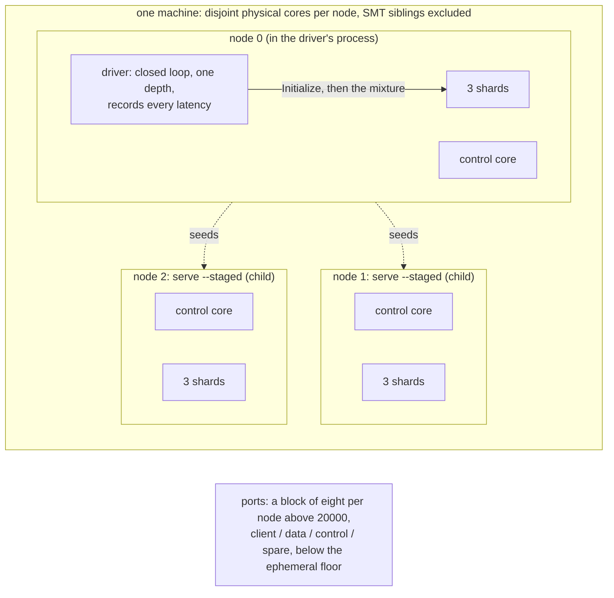

# C10. Performance, and the benchmarks that judge it

## Context

The performance question has two parts: what distribution costs at fixed resources, and what
more hardware buys. A three-node cluster at a factor of three holds every byte on every node -
a redundancy experiment, never proof of write or storage scale-out. Every cluster arm below is a
`shoal-bench` workload with a stable id, a recorded placement and its own record on the
capture, and every one of them is judged on completed committed work, latency tails and
replica lag rather than an acknowledgement rate. Built by [F36](../features/cluster-harness.md)
(the cluster record and the separate driver) and extended by every feature after it with the
arm that prices it; [F50](../features/cluster-operations.md) records every node's machine and
runs a node on another host.

## How it works

### What each experiment holds constant

| Experiment | Held constant | Learned |
| --- | --- | --- |
| Standalone versus a cluster of one | Commit, data, driver, cores, storage policy, load | Routing, metadata and adapter overhead without replication (`overhead/nodes/1` against `grid/unsorted/r50/1024`) |
| Same shard, another local shard, a remote node | The read-only data and query | Ownership and the hop's network, validation and merge cost (`hop/*`) |
| A factor of one versus three on one placement | Placement, data size, policy, offered load | Replication's cost including every follower's work (`replication/*` against `overhead/nodes/3`) |
| Durable versus volatile at a factor of three | The placement and the command encoding | What the fsync costs beyond the round trip (`replication/durable` against `volatile`) |
| `One` versus barrier versus session reads | The placement, the query, no write background | The barrier and application wait (`reads/*`) |
| A get split three ways in four shapes | The placement at a factor of one | Gathering, decoding, coverage and ordering (`fanout/*`) |
| A primary killed and restarted while serving | The durable placement and mixture, a client that does not retry | The outage as a time series (`failover/kill`) |
| A node returning inside and past the retention | The kill arm's shape | Seconds and bytes to catch up by log and by snapshot (`catchup/*`) |
| A scrub, a move, a plan or a backup while serving | The kill arm's placement and mixture, nothing killed | The foreground's tail during the background work (`background/*`, `migration/move`, `rebalance/*`) |
| A node restarted at fewer executors | The one-node arm's data | The rehome's hold (`rehome/shrink`) |

### The emulated placement

A cluster arm stages a node id, a cluster id, a marker, disjoint physical cores, a control cpu
and a port block per node; hosts node zero in the driver's process; starts every other node as
a `shoal-workload serve --staged` child that joins node zero through its seed; waits for every
member up and the voters promoted; sends `Initialize` in the recorded order; waits for every
peer to hold the placement; then seeds and drives. Every node's cores, the initialization
order, the committed members, the map version and the voter and learner counts go on
`ClusterFacts`, with every node's own report - groups, groups led, lag, pending and volatile
bytes, unknown and rejected writes - read at the end of the run, and since F50 every node's
machine (host, CPU, governor, kernel, memory, SMT, NUMA, filesystem, build digest) under
`cluster.environments`, with `emulated` derived from the hostnames and a peer whose build is
not the driver's refused. `shoal-bench run --remote <index>=<user@host>:<dir> --driver-address
<addr>` puts a node of every placed arm on another host, started over ssh from the binary and
`shoal.yml` there and killed by its pid file; node zero is always the driver's. The port
blocks are numbered among the cluster arms and stay under 32768, since one numbered among
every workload sat in the ephemeral range and lost its control port to a `TIME_WAIT`.

Emulation shares disks, caches, memory bandwidth, NUMA paths and the kernel: a persistent arm
measures replication plus device contention, and its ephemeral twin removes the storage work
but adds its own serialization, so their difference is a comparison and not an additive
decomposition. Loopback emulates no bandwidth, congestion or independent machine failure, and
a loopback latency multiplied by an RTT ratio is not a forecast. The proxies the fixture uses
are not on the arms. A physical capture needs the benchmark host; none is committed.

### The arms

Every id is appended, never renamed or interleaved, and the placement each arm reads against is
part of its family. `--group cluster` selects every `macro/cluster/` arm and `--group rehome`
the rehome arm ([F21](../features/benchmark-groups.md)).

| Arm | Placement | What it isolates | Record |
| --- | --- | --- | --- |
| `macro/cluster/overhead/nodes/1` | one node, twelve executors | The grid's reference cell served by a node with a `cluster:` block; read beside `macro/grid/unsorted/r50/1024` and nowhere else | `cluster` |
| `macro/cluster/hop/{same_shard,local_shard,remote_node}` | two nodes | A read answered by the accepting shard, another shard of the node, or a node away; `local_shard` is a mixture until [D7](../direction/shard-aware-routing.md) | the data lane's frame and shed counters |
| `macro/cluster/overhead/nodes/3` | three nodes, three shards each, factor one | The reference mixture replicated to nobody; the placement the replication and read arms are read against, never `nodes/1`, whose shard count it does not share | `cluster.replicas` |
| `macro/cluster/replication/{durable,volatile}` | the same, factor three | A durable and a volatile quorum on the persistent and the ephemeral table | `cluster.replicas`, `outcomes` |
| `macro/cluster/reads/{one,barrier,session}` | the same, factor three | One get at the reference depth differing only in the level and the token | `cluster.reads`: level, session flag, fanout, per node the barriers, hops, barrier and application waits, session waits, timeouts, late and duplicate shares |
| `macro/cluster/fanout/{get,filter,limit,empty}` | the same, factor one | A six key get split three ways; `empty` reads keys it never wrote (`Workload::expects_rows`) | `cluster.reads` |
| `macro/cluster/failover/kill` | the durable cell | Node one killed a third of the way through and restarted two thirds through, driven for a fixed time by a client that does not retry | `cluster.fault`: the marks, the first failure and the recovery, three windows with a distribution each, a per second series |
| `macro/cluster/catchup/{log,snapshot}` | the kill arm | The returning node inside the retention and past it, its lag sampled each second against node zero | `cluster.catchup`: how it caught up, the marks, the bytes and entries, the lag series; `none` when the run ended unconverged |
| `macro/cluster/background/repair` | the kill arm, nothing killed | A verify-mode `Repair` asked for a third of the way through | `cluster.background`: the marks, the groups, what the scrubs hashed and read, three windows and a series |
| `macro/cluster/migration/move` | the kill arm with a spare | One set moved from node one to the spare a third of the way through | `cluster.migration`: the marks, each phase's time, what the destination was fed, three windows and a series |
| `macro/cluster/rebalance/{add,decommission,remove,capacity_blocked}` | the kill arm with a spare, or none | A `Rebalance` onto the spare, a `Decommission` onto it, an expiry after node one is killed for good under a five second grace, a `Decommission` with no spare that stays blocked | `cluster.rebalance`: the kind, the marks, the steps, the blocked reason, the windows, the series and `p99_ratio_permille`; `unfinished` by construction for the blocked arm |
| `macro/rehome/shrink` | one node, seeded at twelve executors and started at eight | The rehome's hold between two runs | `cluster.rehome`: the pool's report and `millis` |
| `macro/cluster/background/backup` | the kill arm, nothing killed, wire 5 activated | A `Backup` of the table asked for a third of the way through | `cluster.backup`: the marks, the files' counts, bytes and records, the windows and the series |

Every record is mirrored into the explorer with defaults so every committed artifact still
loads ([F29](../features/benchmark-explorer.md)). An arm asking for more copies than it places
nodes is refused before a server starts. The failover, catch-up, background, migration and
rebalance arms are driven for a fixed time by a client that counts a failed operation rather
than ending the run, and their windows - `before`, `during`, `after` - each carry their own
distribution so the outage is never averaged into the run.

### What is measured, and how

Every arm is a closed loop at one depth. p50, p95, p99 and maximum latency, completed committed
operations, rejected and unknown outcomes, retries, queue bytes and replica lag are recorded
throughout; a fault arm records raw distributions around its marks. A capacity claim holds only
inside an explicit latency, error and lag envelope, and sustainable throughput is what every
replica keeps up with, never a rate the slowest follower cannot apply. Paired runs with their
spread are what a comparison rests on ([Benchmarking](../performance/benchmarking.md)).

### The numbers so far

Every number a cluster arm has produced is smoke-scale, on the development host, and is
recorded on the F page that produced it as not a capture: a durable quorum at about twice a
single fsync's median on a shared device and a volatile one under two milliseconds
([F40](../features/replication.md#performance)); a barrier about a millisecond over a `One`
read at the median, the barrier wait itself 590 µs on average with the hop on two reads in
three, and a session read within a tenth of a millisecond of `One`
([F41](../features/read-consistency.md#performance)); at the default five second base, an outage
of 15.9 s that fell to 11.7 s once an unsent frame was refused and to a third of the writes
refused at once with the rest served once a wanted link redialled at the floor
([F42](../features/primary-failover.md#performance)); and a catch-up the smoke run could not
show, since a twenty-four second run's outage outlasts the absence, recorded `none` with its
series kept ([F43](../features/node-recovery.md#performance)). **No full-scale capture of any cluster arm
is committed**, and the pages under `docs/src/performance/` carry none; taking one is the
benchmark host's, on a clean tree, after the change that claims an effect is committed.

| Gate as set | Where it stands |
| --- | --- |
| No material one-node overhead | Unmeasured at scale; the pair exists |
| A loopback hop under 100 µs at p50 | Unmeasured at scale; the three hop arms exist |
| Durable replication reported as curves and lag | Smoke numbers only |
| Fixed-resource reads at 0.8× the matched single node | Unmeasured |
| Failover at base plus two seconds with healthy survivors | Not met as set: two to three times the base ([C7](failover.md#the-window-and-what-a-client-sees)) |
| A healthy rebalance with zero final errors and p99 inflation under 2× | `p99_ratio_permille` is on every rebalance record; judged at smoke scale |
| Bounded recovery bytes, memory and disk | `retention_and_recovery_memory_are_bounded`; the catch-up arms record convergence or `none` |

## Design choices

One arm per question rather than a grid over the cluster, because a regression on a mixture
cannot be attributed. A record per family with defaults, so an older artifact loads. A fixed
time and windows for every fault arm, so the outage is a series and not an average. The driver
in node zero's process, recorded as such, rather than a fourth pinned process the machine may
not have cores for. Every node's machine on the capture, so a physical capture on unequal
hardware can say which node differed.

## Alternatives rejected

Weighting replica bytes at N = RF; deriving network capacity from loopback ratios; measuring
p50 alone; hiding a slow follower behind the fastest quorum; a Cartesian product of arms that
silently lowers the factor; comparing a three-machine number to the frozen one-machine B1 as if
the difference were software.

## What it costs

Longer captures: every fault, background, migration and rebalance arm is driven for a fixed
time. `list --groups` prints what a capture of `cluster` or `rehome` would cost, projected from
a hand-maintained constant that has not been re-measured since the macro layer grew.

## Limitations

There is no open-loop schedule, so an overload pause is not exposed. The families the design
named and nobody built: `groups/{idle,active}` (the spike stands in), `overhead/nodes/2`,
`scaleout/nodes/{3,4,6}`, `writes/{insert,update,delete,conditional,retry}`, a failover by
pause or by partition, a catch-up at several mutation rates, a rehome that grows, a write
background under the read arms, and a restore's cost. Nothing is measured on more nodes than
the factor, so nothing here is evidence of scale-out. See [C15](open-issues.md).

## Invariants to uphold

- Like durability, completed-operation semantics and accounted resource budgets are compared.
- A sustainable result includes every replica's work and a bounded lag.
- Emulated and physical measurements are visibly distinct.
- A fault reports time-series windows, never one averaged throughput.
- Existing workload identities, port blocks and the frozen baseline stay intact.

## How it is measured

By the arms above; the [milestones](milestones.md) assign the gates and the F pages carry the
smoke numbers. A capture goes through `shoal-bench run --label <label> --group cluster` on a
clean tree, and `render` writes the generated pages ([Benchmarking](../performance/benchmarking.md)).

## Acceptance tests

| Test | Asserts | Milestone |
| --- | --- | --- |
| `cluster_fixture_accounts_for_all_cores_and_endpoints` | Driver, control and data allocations and port ranges are recorded and disjoint where claimed | M0 |
| `historical_artifacts_and_ports_remain_compatible` | Existing facts parse and historical single-node port assignments stay unchanged | M0 |
| `infeasible_rf_policy_is_not_a_throughput_arm` | A desired factor of three on one node is an availability test, not a downgraded quorum's throughput | M4 |
| `capacity_capture_records_lag_and_offered_load` | A capacity record carries the scheduled load, completions, errors, tails and every replica's debt | M4 |
| `read_capture_records_barrier_and_application_wait` | A read arm's record carries the level, the session flag, the fanout and every node's barrier and application waits; an older record still loads | M5 |
| `fault_capture_preserves_outage_time_series` | The failure and recovery window stays visible with separate before, during and after distributions | M6 |
| `catchup_capture_records_convergence` | A returning node's record carries its restart and convergence marks, the split by log and by snapshot and the lag series; a run that ends unconverged says so and keeps the series | M7 |
| `background_capture_records_scrub_interference` | A background repair's record carries its marks, the three windows with their own distributions, a bucket per second and what the scrubs read; an older record loads without it | M8 |
| `migration_capture_records_transfer_and_pauses` | A move's record carries its marks, each phase's time, what the destination was fed, the three windows and `unfinished` for a run that ended first | M9a |
| `rebalance_capture_records_plan_and_windows` | A plan's record carries its kind, marks, steps, blocked reason, windows, series and the p99 ratio in thousandths; a blocked plan the run outlasted is `unfinished` with its reason | M9b |
| `physical_cluster_records_each_node_environment` | Every node's environment is under `cluster.environments`, `emulated` is derived from the hostnames, and a difference is named node by node | M10c |
| `a_remote_spec_parses_and_builds_its_commands` | A `--remote` spec parses and builds the ssh, scp and kill command lines for a node of this build on another host | M10c |
| `a_remote_node_serves_a_smoke_capture` | A node of a placed arm runs on another host through `--remote` when `SHOAL_REMOTE_SMOKE` names one, and says so otherwise | M10c |

## Related

[C5](replication.md), [C7](failover.md), [C8](rebalancing.md), [C11](testing.md),
[C13](protocol.md), [Benchmarking](../performance/benchmarking.md),
[Baseline](../performance/baseline.md), [F21](../features/benchmark-groups.md).
