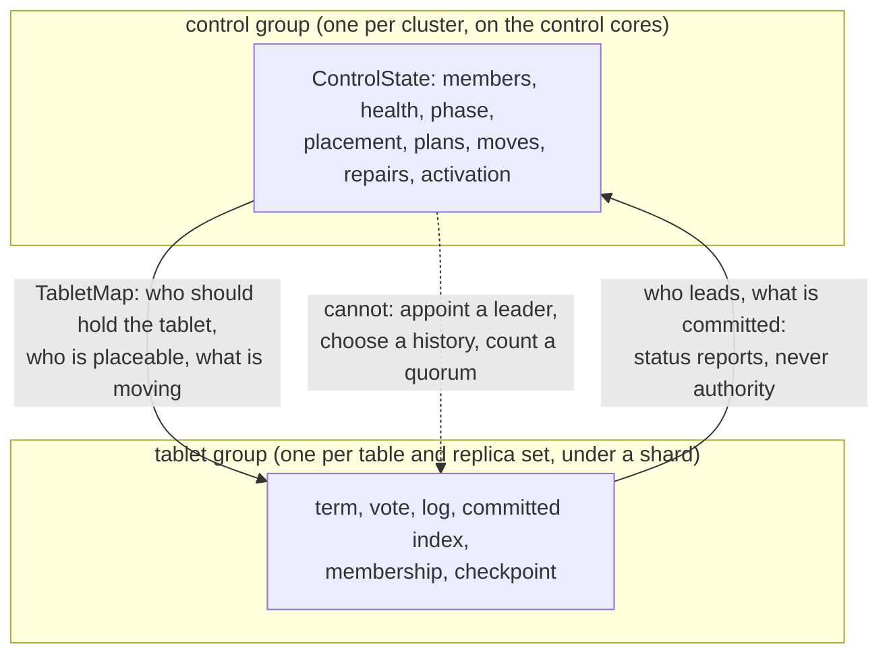

# C13. The protocol contract and decision record

## Context

The first draft of this chapter appointed primaries from heartbeat progress and treated
publishing a new epoch as fencing. That establishes nothing about which writes a new primary
must preserve, and it was replaced before anything was built: the safety protocol came first,
as a contract of six clauses agreed on 2026-09-11 at the Before-M0 gate, and every milestone
after it was built against those clauses. This page is the contract, the failure model it
assumes, and the record of where each of its thirteen questions was decided and what each
decision left unsettled.

**Membership, placement and failover run inside Shoal processes.** The control plane is an
embedded `openraft` group on a reserved core; every tablet is an embedded `openraft` group under
the shard that hosts it. No external membership, configuration or failover service is required,
operated separately, or hidden behind a dependency.

## How it works

### The decisions

| Decision | Status |
| --- | --- |
| One primary orders a tablet's mutations | A tablet is qualified by table identity ([P2](#the-contract)); its primary is its group's elected leader |
| Embedded `openraft` for membership and placement | `openraft 0.10.0-alpha.34`, pinned exactly, on a glommio runtime this repository wrote, on `cluster.control_core` (CPU 0 by default) |
| `Quorum` writes and `One` reads by default | A durable majority ([P3](#the-contract)) and committed-prefix reads ([P4](#the-contract)) |
| A down node keeps its placement through a grace | Thirty minutes by default, counted by the leader in committed eighths; an election copies nothing |
| Automatic removal after the grace | An expired grace is a removal plan; `auto_remove_after: null` opens no grace |
| The data protocol is Raft | `openraft` under a shard, one group per table and distinct replica set - `N × slots` groups a table, not 4096 - on one shared WAL per shard ([Q2, Q3 and Q4 at M4](#q2-q3-and-q4-at-m4)) |
| A control-plane `SetPrimary` alone authorizes a writer | Rejected: a tablet's election and recovery establish authority ([P5](#the-contract)) |
| Sequence numbers reset each epoch | Rejected: a log index is logical and continuous across terms ([P2](#the-contract)) |
| An external membership or failover service | Excluded ([R7](overview.md#what-is-asked-of-it)) |

Raft's ordinary write path replicates to a majority in one communication round; it adds no
separate election vote to a write, and its log agreement provides no transaction across
independent tablets. Those two properties are what the baseline needs and what a centrally
appointed primary lacks ([Raft paper, sections 5–6](https://raft.github.io/raft.pdf)).

### The contract

The Before-M0 gate agreed six clauses. They are numbered so a test, a page or a review can name
one without quoting it; `P` numbers are never reused. Each is written as a property that can be
checked against a history, beside the schedule that violates it, because [C11](testing.md)'s
model checks properties. The M0 test `protocol_model_preserves_acknowledged_history` names the
`P` number each of its checks enforces.

| # | Property | Binds | The violation the model rejects | Owning tests |
| --- | --- | --- | --- | --- |
| P1 | **Failure model.** Correctness holds under crash/restart, lost, delayed, duplicated and reordered messages, asymmetric partitions, process pauses and reported I/O failures, with stable storage meaning a successful fsync. It never depends on clocks, leases or a non-Byzantine replica behaving well. The availability table below is part of this clause | C2, C3, C7, C11 | A paused old primary, a duplicated acknowledgement or a reordered append that changes which operations are in the authoritative history; any check that needs synchronized clocks | `protocol_model_preserves_acknowledged_history` (M0) |
| P2 | **Table-qualified stream identity.** The unit of replication, election and progress is `(TableId, range_id)`. Its log index is logical and continuous across terms and physical WAL rotation, and `TableId` is stable schema metadata, never a peer's enum layout | C4, C5, C7 | Two tables sharing one index sequence; an index that restarts at rotation; a peer that infers a table from a position | `table_ids_and_streams_are_stable_across_restart` (M3), `table_streams_recover_independently_without_holes` (M4) |
| P3 | **Durable quorum.** A default write succeeds only after a majority of the *committed voter configuration* has fsynced the record and the primary has applied it. A replica counts once, only with matching durable history; `Up`/`Down`, a local `Async` setting and learners never change the threshold | C3, C5 | A quorum computed from the current `Up` list; a repeated cumulative ack counted as a second voter; an `Async` receipt counted as durable | `quorum_success_requires_distinct_durable_voters` (M4), `async_replica_cannot_weaken_durable_quorum` (M4), `quorum_loss_is_unavailable_without_data_loss` (M6), `quorum_history_survives_repeated_elections` (M6) |
| P4 | **Committed visibility.** A `One` read returns an eligible replica's committed, applied prefix, possibly stale, and never an appended-but-uncommitted suffix. Checkpoints hold only committed applied state, and the result of a state-dependent mutation is derived in committed order | C5, C6, C7 | A read or checkpoint that observes an entry a later leader truncates; a conditional result computed before its command commits | `one_reads_converge_without_exposing_uncommitted_state` (M4), `uncommitted_suffix_never_enters_checkpoint` (M4), `barrier_read_observes_prior_quorum_write` (M5), which the model checks as `Linearizable` |
| P5 | **Control/data authority split.** Membership, placement intent and transition records are committed by the embedded control group; a tablet's writer is established only by that tablet's own consensus election and recovery. A control majority cannot activate a data minority, and losing control quorum stops metadata mutation, not established tablet groups | C3, C4, C7 | The B=100 / C=101 / A+B=102 schedule from [C7](failover.md#when-a-primary-is-down): choosing C from cached reports discards B's acknowledged 102. Any promotion whose only evidence is a topology edit | `metadata_quorum_cannot_replace_a_missing_data_quorum`, `established_tablets_survive_control_quorum_loss`, `stale_heartbeat_reports_cannot_lose_acked_write`, `delayed_topology_cannot_authorize_old_primary`, `shard_stall_with_live_control_plane_can_fail_over` (all M6) |
| P6 | **No cross-tablet transaction promise.** Nothing promises atomicity across tablets, an atomic bundle, or a common multi-tablet read snapshot. A bundle's queries complete independently, each with one complete result or one error, and partial outcomes stay visible | C5, C6 | An oracle, API or test that treats a bundle as atomic or reads two tablets at one instant | `limits_apply_after_complete_ordered_gather` (M5), `mixed_table_bundle_resolves_each_table_policy` (M5); M0's oracle checks single-tablet histories only |

P5 as a picture: the control group says where a tablet *should* be and what is moving; the
tablet group says who leads it and what is committed. A control commit never becomes a data
authority, and a data group's election never needs a control commit.

### Failure model and availability

Crash/restart failures, lost, delayed, duplicated and reordered messages, asymmetric partitions,
process pauses, and disks that report I/O failures are assumed. Stable storage honors a
successful fsync; hardware that lies about flushes is outside the durability assumption.
Checksums detect accidental corruption; replicas are not Byzantine-tolerant. Clocks may be
unreliable: no correctness property depends on lease timing, and the one lease in the system
(`Lease::of`, [C7](failover.md#the-lease)) decides only whether a leader may *append*.

| Condition | Behavior |
| --- | --- |
| One failed replica in an established RF=3 tablet | The remaining majority elects and acknowledges durable writes |
| No tablet majority | No quorum write and no strong read succeeds; eligible replicas serve `One` |
| Control quorum lost, tablet quorum intact | Established tablet groups continue their writes and elections; joins, placement changes, removal, plans and policy changes stop, and every admin mutation is refused naming the missing voters |
| Control plane available, tablet quorum lost | The control plane manufactures no replacement authority from stale reports; a permanent loss is an operator's `force_recover` on one stopped survivor ([C9](operations.md#permanent-quorum-loss)) |
| Fewer members up than the factor needs | Readiness reports `default_writes` short by name; a write is refused `QuorumUnavailable` until `rf / 2 + 1` members are up under `Quorum` (every one under `All`); reads are served; the factor never moves on its own |
| Capacity insufficient to restore the factor | The plan blocks naming the member it waits for; every surviving copy and configuration is kept |
| The whole cluster restarted from durable storage | Committed state is recovered without inventing an empty membership or discarding an acknowledged write (`whole_cluster_restart_preserves_durable_history`) |

A failover duration is a measurement under a stated healthy-survivor scenario ([C7](failover.md#the-window-and-what-a-client-sees)),
never an unconditional bound under partitions or storage stalls. No cross-tablet transaction,
atomic bundle, or common multi-tablet read snapshot is promised.

### Identity and progress

A logical tablet is `(TableId, range_id)`; `range_id` is the partition hash's top twelve bits.
`TableId` is stable schema metadata, never a process-local enum layout a peer infers. Placement
is shared across tables - every table's tablet `t` lives on the same nodes - but every table's
log history and applied position is its own group's, so one stream never spans separately
fsynced table logs.

| Position | Meaning |
| --- | --- |
| Appended | Accepted into the local replication log; may not survive restart |
| Durable | The contiguous prefix whose stable-storage writes completed (`IOFlushed` after the batch's `fdatasync`) |
| Committed | The prefix the protocol guarantees future leaders retain |
| Applied | The committed prefix reflected in query-visible state |
| Checkpointed | The applied prefix the table's archives hold, recorded per group in `checkpoint.json` |

Term and vote are persisted before a reply; term/index history, configuration identity and
checkpoint metadata survive compaction so log matching works past it. A logical index does
not restart at WAL rotation. A restored copy claims no progress beyond the state and log it
recovered. A receipt never counts as a durable acknowledgement until its storage completion.

### Visibility and durability

A default persistent write needs a majority of the committed voter configuration to have
fsynced the record, plus local application, before its result is returned. A node's `Async`
setting cannot weaken that: a persistent table configured `Async` on a cluster node is refused
at start. Configuration changes use the protocol's joint transition, never a fresh majority
computed from the `Up` list.

A `One` read observes an eligible replica's committed, applied prefix. It may lag, including
after the caller received a successful write, but never exposes a suffix known only to be
speculative. A state-dependent mutation's result is derived in committed order on every
replica; nothing speculates.

`Write::One` - a local stable append, possibly rolled back on failover - is refused at
validation, because it needs a distinct accepted-or-pending result API nothing offers. A
replicated ephemeral table is explicitly volatile: its group logs in memory, and a restart
empties it. Neither is emulated by `Quorum`.

### Decision record

Each entry was recorded on the tree that delivered it, in the manner of the
[August review](../appendix/review-2026-08.md): what was decided, where it is in the source,
and what it did not settle. The unsettled remainders are gathered on [C15](open-issues.md#not-settled).

#### Before M0: the contract, 2026-09-11

| Decision | Evidence |
| --- | --- |
| P1–P6 are the contract | The six clauses of the gate, mapped [above](#the-contract) one to one onto the pages that inherit each and the test that owns it |
| Raft is the data-plane protocol; the control plane is `openraft` | One round to a majority per write and no agreement across independent logs are what the baseline needs and what a centrally appointed primary lacks. A custom protocol was not a fallback: it would need its own election, recovery, reconfiguration and read specification plus an executable model |
| Q1 was left to M1's spike | Selecting a library needed idle memory and CPU per group at scale, batching across groups, durable term/vote before a reply, a read barrier and election timing under glommio ownership; none existed. `openraft 0.10.0-alpha.34` and `raft 0.7.0` were pinned as candidates from the sources cargo had fetched: `openraft`'s `single-threaded` feature makes `OptionalSend`/`OptionalSync` empty bounds, its storage is an async seam (`save_vote`, `append(entries, IOFlushed)`, `truncate_after`, `purge`, `apply`) and it ships only a Tokio runtime; `raft-rs`'s `RawNode` is a thread-unsafe state machine driven by `tick`/`step`/`ready`/`advance` with a synchronous `Storage` |
| What the spike inherited | rustc 1.100.0-nightly, glommio as the `../glommio` path dependency at 0.10.0. No consensus crate was in `Cargo.lock` |

#### Q1 and Q13 at M1

Recorded 2026-09-11 by [F37](../features/node-identity-control-plane.md). `shoal-spike` is a
workspace binary, not a benchmark and not a capture: `cargo run -p shoal-spike --release`
prints the tables below labelled by host and governor. **They were taken on `europa` under the
`powersave` governor**, so they bound the shape of the answer and not its exact value.

| Decision | Evidence |
| --- | --- |
| **`openraft 0.10.0-alpha.34` is the control plane's library, pinned exactly** | `shoal-core/Cargo.toml`: `openraft = "=0.10.0-alpha.34"` and `openraft-rt` at the same pin, `default-features = false`, features `single-threaded` and `serde`. Exact because the alpha's storage and network traits have moved between alphas. `openraft-rt-tokio` is not in `cargo tree -p shoal-core` |
| **The runtime is glommio, through an `AsyncRuntime` this repository wrote** | `shoal-core/src/server/control/runtime/`: task, timer, a bounded mpsc with weak senders, a watch, an async mutex and a oneshot, every one `Rc`/`RefCell` under `single-threaded`. `openraft_rt::testing::Suite::<GlommioRuntime>::test_all()` passes as `glommio_runtime_passes_the_openraft_suite`. A current-thread Tokio runtime was considered and dropped: a second reactor and timer wheel in a process that has one of each bought no property glommio lacks |
| **The storage seam is the control store, and it passes the conformance suite** | `shoal-core/src/server/control/store.rs`: log frames `[u32 len][u32 gxhash32][json]` appended and `fdatasync`ed before `IOFlushed` completes, a torn tail truncated at open, every other file replaced by temp-fsync-rename-dirsync. `control_store_passes_the_openraft_storage_suite` and `control_store_recovers_from_a_torn_append` |
| **The network seam is `RaftNetworkV2`** | `shoal-core/src/server/control/network.rs`. At M1 a group of one never sent; since M2 `PeerNetwork` wraps a control-lane link and carries `append_entries`, `vote` and `full_snapshot` as JSON under a 16 byte head, a link failure being `Unreachable`, which openraft retries |
| **raft-rs was not measured, and why** | `RawNode` has no runtime abstraction to adapt; a spike on the runtime seam would have measured the harness written around it rather than the library, and the runtime seam is what Q1 was blocking on. The data plane later took `openraft` under a shard too ([M4](#q2-q3-and-q4-at-m4)) |
| **Q13, first numbers: one control-shaped thread holds about a thousand three-member groups at openraft's default timers and about four thousand at C1's** | The idle tables below. **Heartbeats are per group and nothing coalesces across groups**: the rate is members-minus-one over the interval, times the group count. A tablet-per-group data plane at 4096 tablets on one shard therefore needs a group count an order of magnitude below the tablet count, which is the constraint M4 built to |
| **Durable append: 395 µs alone, 10.8 ms when sixty four leaders write at once** | The durable table below, on the control store. The 27× is fsyncs from independent groups queueing on one executor; Q2's shared WAL with one fsync per batch is the answer, and that number is what it beats |

**Idle cost, memory stores, 10 s window, openraft's defaults (heartbeat 50 ms, election 150-300 ms):**

| groups | RSS MiB | RSS delta/group KiB | idle CPU % of one core | append_entries/s | startup s |
| --- | --- | --- | --- | --- | --- |
| 1 | 43.3 | 304.0 | 2.81 | 36 | 0.0 |
| 64 | 76.0 | 514.5 | 36.27 | 2224 | 0.0 |
| 1024 | 650.7 | 514.2 | 99.99 | 35319 | 0.5 |
| 4096 | 17282.3 | 3966.9 | 99.99 | 69722 | 128.6 |

**Idle cost, memory stores, 10 s window, C1's timers (heartbeat 500 ms, election 1500-3000 ms):**

| groups | RSS MiB | RSS delta/group KiB | idle CPU % of one core | append_entries/s | startup s |
| --- | --- | --- | --- | --- | --- |
| 1 | 18341.6 | 0.0 | 0.58 | 4 | 0.0 |
| 64 | 18353.4 | 188.6 | 4.74 | 256 | 0.0 |
| 1024 | 18690.5 | 346.9 | 45.68 | 4062 | 0.6 |
| 4096 | 20179.7 | 358.2 | 95.13 | 16245 | 2.3 |

The absolute RSS in the second table is the first table's high-water mark; the per-group delta
is the number to read.

**Durable append, control store under a temp dir, 200 writes per leader, C1's timers:**

| groups | leaders writing at once | p50 µs | p99 µs | max µs |
| --- | --- | --- | --- | --- |
| 1 | 1 | 395.1 | 506.4 | 51099.1 |
| 64 | 64 | 10792.5 | 13070.9 | 59351.7 |

The spike measured no data-plane library under a *shard's* ownership and measured on the
development host; both remain true of these tables.

#### Q10 and Q11 at M2

Recorded 2026-09-12 by [F38](../features/inter-node-transport.md). Neither question was closed
here; M2 wrote down the contract each rests on early enough that the transport could not be
built against a different one.

| Contract | Where it is |
| --- | --- |
| **Q10: schema identity, wire version and capabilities are three things, compared separately** | The 68 byte hello (`shoal-proto/src/shared/protocol/peer/hello.rs`) carries `schema_id`, `wire_min`/`wire_max` and a `capabilities` bit set as three fields, and the judge (`shoal-core/src/server/peer/handshake.rs`) compares each. `SCHEMA_ID` is the structural fingerprint *without* `PROTOCOL_VERSION` folded in. At M2 all three had to match exactly; the range and the bit set existed so that M10a had fields to negotiate over without changing the hello's shape, which it did ([Q10 at M10a](#q10-at-m10a)) |
| **Q11: a peer certificate chains to the cluster's authority; its binding to a node came later** | `cluster.tls` makes every lane mutual TLS 1.3 handed to the kernel; the listener requires a chain to `ca` and the dialler presents its own. The shape decided here - identity asserted in the hello and proven by the certificate - is what lets a node be issued a certificate for an id it has already minted. The binding is [Q11 at M10c](#q11-at-m10c) |

#### Q11 and Q13 at M3

Recorded 2026-09-12 by [F39](../features/membership.md).

**Q11, the identity half: the highest incarnation wins.** The marker carries an `incarnation`
bumped by every claim of an established directory; it rides in the committed member record,
the hello, the pong, every status report and every proposal. The state machine's `observe`
rule is the policy - a lower incarnation than the committed one is refused, an equal one from a
different control address is refused as a duplicate, an equal one from the same address is a
re-observation, a higher one supersedes - and a running node that sees a higher run of itself
committed stops `Fenced`. `cluster.dial` is where this node dials a member instead of where it
advertises.

**Q13, measured: topology fanout and report traffic**, `cargo run -p shoal-spike --release --
fanout` on `europa` under `powersave`, JSON bodies as the wire carries them. The map is an
ordered node list, so a frame grows with members and barely with tables:

| members | tables | frame bytes | encode µs |
| --- | --- | --- | --- |
| 3 | 1 | 857 | 0.5 |
| 3 | 64 | 2958 | 1.2 |
| 8 | 16 | 2348 | 1.3 |
| 16 | 16 | 3940 | 2.2 |
| 32 | 16 | 7124 | 4.7 |
| 64 | 1 | 12998 | 7.6 |
| 64 | 16 | 13493 | 7.7 |
| 64 | 64 | 15099 | 8.4 |

One version pushed to every subscriber of a sixty-four member, sixteen table cluster, encoded
once and copied once per subscriber:

| subscribers | bytes written | µs per version |
| --- | --- | --- |
| 1 | 13,493 | 8.0 |
| 100 | 1,349,300 | 377.2 |
| 1000 | 13,493,000 | 3,983.9 |

The status reports every member sends the leader at the default 500 ms interval, carrying its
reachability of every other member:

| members | report bytes | reports/s at the leader | bytes/s in at the leader |
| --- | --- | --- | --- |
| 3 | 248 | 4 | 992 |
| 8 | 473 | 14 | 6,622 |
| 16 | 833 | 30 | 24,990 |
| 32 | 1,553 | 62 | 96,286 |
| 64 | 2,993 | 126 | 377,118 |

Whole-map fanout is the right shape while the map is a node list: a version reaches a thousand
clients in the time of one disk write, and the leader's intake at sixty-four members is a third
of a megabyte a second. Per-tablet records would multiply the frame by three orders of
magnitude, which is why a move publishes a `DataConfiguration` for its set rather than a record
per tablet. The report's reachability list grows quadratically; at a hundred members it is the
first thing to bound. A client's pool subscribes on every connection, so a pool of ten reads ten
frames a version.

#### Q2, Q3 and Q4 at M4

Recorded 2026-09-12 by [F40](../features/replication.md).

| Decision | Where it is, and what it does not settle |
| --- | --- |
| **Q2: one shared WAL per shard, every group's log a subsequence of it, one `fdatasync` per batch across groups** | The format 2 frame (`shoal-core/src/server/wal/frame.rs`): `[len u32][gxhash32]` unhashed, then `[kind][version=2][flag][reserved][group u64][index u64][term u64][leader ShardAddr]` hashed with the body, so the index over a file is rebuilt from headers alone. The store (`wal/mod.rs`) stages every group's appends into the open batch; the writer syncs a batch once and completes every `IOFlushed` in it after. `rotation_preserves_pending_replication_requirements` and `table_streams_recover_independently_without_holes` are the restart and rotation tests. Not settled: the shared store's own figure at sixty-four leaders is the benchmark host's to take |
| **Q3: a checkpoint is a log id per group, moved by the compactor** | `wal/Shard-N/checkpoint.json` records, per persistent group, the last log id whose effect the table's archives hold and the membership as of it; a sealed segment is handed to the compactors once every group applied past its frames; openraft's snapshot is the checkpoint as metadata, and the purge follows it. No write pause: a sealed segment is immutable. The transfer of a checkpoint's state is [Q3 at M7](#q3-and-q9-at-m7) |
| **Q4: apply once, in committed order, derive there** | A command is applied once on every replica and its result - inserted or not, deleted or not, updated or not - derived from the state the replica finds (`PersistentUnsortedTable::apply`, `PersistentSortedTable::apply`); a partition the apply needs from disk parks the batch and blocks that group alone. Retries are answered from a per-group LRU of request identity, payload digest and result. `One` writes are refused at validation; a persistent table configured `Async` on a cluster node is refused at start. Volatile tables replicate through the same command with an in-memory log bounded by `volatile_log_bytes`. The retry table's durable mark is [Q4 at M6](#q4-at-m6) and its expiry [Q4 at M9a](#q4-and-q5-at-m9a). Not settled: speculation stays an optimization that would have to specify dependencies, rollback and separate committed visibility before it is taken |

#### Q5 at M5

Recorded 2026-09-13 by [F41](../features/read-consistency.md).

| Decision | Where it is, and what it does not settle |
| --- | --- |
| **Q5: one strong level, `Quorum`; a session token is an index in one group of one table of one cluster** | `ReadLevel { One, Quorum }` (`shoal-proto/src/shared/protocol/read.rs`) and no `Primary`: the draft's two names were two routing policies over one freshness promise, and "execute the share at the leader" is an additive routing choice, filed. The barrier is openraft's `ReadIndex` (`get_read_linearizer`) on the executing shard's own handle when it leads, asked of the leader over the replication lane with `ReplicateKind::ReadBarrier` when it does not, followed by the replica's own apply through the index (`shoal-core/src/server/shard/reads.rs`); `LeaseRead` is never used. The token is `SessionToken { cluster, table, tablet, group, index }`, forty-eight bytes, minted for `Applied` and `Duplicate` outcomes, refused by name (`WrongCluster`, `UnknownLineage`) rather than ignored, carrying an index and no term, never expiring; sixteen a bundle. The model gained `BarrierRule::QuorumConfirmed` with `CachedLeaderUnconfirmed` as its knob, caught on `strong_read_from_cached_leader.json` under `Linearizable`. A token across an election was run at M6 and across a move at [M9a](#q4-and-q5-at-m9a). Not settled: a split |

#### Q4 at M6

Recorded 2026-09-13 by [F42](../features/primary-failover.md). Q6 stays open with the barrier as
the default, and the lease openraft keeps is what a leader's *writes* are judged by, never a read.

| Decision | Where it is, and what it does not settle |
| --- | --- |
| **Q4: the retry table is persisted beside the checkpoint and seeded from it** | `wal/Shard-N/retries.bin` (`Retries` in `wal/mod.rs`): every persistent group's remembered requests as postcard, written atomically on the checkpoint's trigger and before `checkpoint.json`, which names the index the sidecar is complete to (`retries_at`) and the table's low-water mark. A group is seeded only from a sidecar written for exactly its checkpoint and only with entries applied at or below it (`Retries::seed_for`). The client's identity is its bundle id (`SendOptions::identity`); `lost_response_retry_returns_original_result` retries across an election and across a rotate, compact and restart on every node. Volatile groups persist nothing |
| **The lease is judged, not waited on, and a lapsed one is a definite refusal** | `Lease::of` (`shoal-core/src/server/replication/lease.rs`) classifies a handle from the metrics' state and `last_quorum_acked` against `election_timeout_max`: a leader whose lease lapsed answers `NotLeader` before it appends and `QuorumUnavailable` for a barrier at once. The lease is openraft's, twice the base, and what it makes the failover window is on [C7](failover.md#the-window-and-what-a-client-sees). A killed leader returning inside it is refused its own term by the same rule ([item 103](../appendix/known-issues.md#103-a-returning-leader-is-refused-its-own-re-election-until-its-old-lease-lapses-and-hops-to-it-wait)). Not settled: Q6 - a lease *read* is never taken |
| **A definite non-answer is rerouted or refused; an unknown one is the client's** | The link's unsent list (`LinkEvent::Down`) is the line: a forward the data link never wrote goes to another holder that is up once, under the same attempt and slot (`resolve_lost_link`, `TabletMap::alternate_holder`); a proposal or barrier the replication link never wrote is `RpcFailure::NotSent`, answered `NotLeader` at once; anything written is `Unavailable` or `OutcomeUnknown` and is retried only by the client under its identity. A wanted link redials at `reconnect_min`. Not settled: the backoff and floor are the transport's settings, not the policy's |

#### Q3 and Q9 at M7

Recorded 2026-09-13 by [F43](../features/node-recovery.md). Both are closed as far as a single
replica set owns them; a move feeds its learner from the same cut and budget ([F45](../features/replica-migration.md)).

| Decision | Where it is, and what it does not settle |
| --- | --- |
| **Q3: the cut is one file the compactor writes between two of its jobs, at the archives' boundary** | `CompactionJob::Snapshot` (`shoal-core/src/server/tables/storage.rs`) runs on the table's compactor between two merges, so the archives stand still under it: the boundary is the highest position the compactor merged for the group or the loop's checkpoint, whichever is higher, and the file (`replication/snapshot.rs`: a header, `[key u64][len u32][bytes]` records keyed by partition hash, a postcard trailer of the retry table, a chunk-invariant checksum in the manifest) is exactly the archives at it. A volatile group cuts the same file from memory. The receiver hands the file to openraft only after a marker is durable, and the install replaces or removes every partition of every covered tablet before the archive map is repointed; `snapshot_install_is_atomic_at_every_crash_point` is the crash matrix over seven points. Two defects the design hid were fixed first ([item 104](../appendix/resolved/segments-recompacted-after-restart.md), [item 105](../appendix/resolved/volatile-groups-never-purged.md)). Not settled: the file copies the archives rather than pinning them ([O52](../appendix/optimizations.md#o52-a-snapshot-copies-every-record-of-the-archives-into-one-file)), and a snapshot is per group, so a returning node installs every tablet its set shares |
| **Q9: the budget is bytes of sealed WAL, and a group past it is purged behind and fed a snapshot** | `replication.retained_bytes` (a gibibyte, at least two segments): the shard's sweep measures the sealed segments and, past the budget, forces the groups pinning the oldest to snapshot and purge (`enforce_retention`, counted under `snapshots.forced`); a member that missed those entries gets a snapshot from the next leader that reaches it. The receiver's side is `install_bytes`, `snapshot_chunk_bytes` and `snapshot_timeout`. `retention_and_recovery_memory_are_bounded` holds the leader's sealed WAL under twice the budget with a follower cut under wide writes. Not settled: no time budget, a budget per shard rather than per stream, and a stream that cannot keep up is fed snapshots repeatedly rather than told to stop |

#### Q12 at M8

Recorded 2026-09-13 by [F44](../features/repair.md). The corruption half of Q12 is closed; the
backup half is [Q12 at M10b](#q12-at-m10b).

| Decision | Where it is, and what it does not settle |
| --- | --- |
| **Q12: a strict majority of verified copies, or an operator's named source, is authoritative when replicas disagree; nothing is chosen automatically on a split** | `judge` (`shoal-core/src/server/shard/repair.rs`): a copy whose record failed its checksum at the scrub is quarantined on that evidence alone; among the verified copies a strict majority of the *replica set* agreeing on one canonical digest - rows re-serialized in key order, never archive bytes (`replication/digest.rs`) - is the trusted state and every other verified copy is quarantined divergent; `Repair { source }` overrides the rule with the named node's verified digest; no majority and no source is `Unresolved { digests, invalid }`, which installs nothing. A scheduled pass (`cluster.repair.scrub_interval`, off by default) verifies and never installs; its cost is `macro/cluster/background/repair`. Not settled: what an operator does after a majority is permanently lost is [M10b's](#q12-at-m10b) `force_recover`; the interval a default should be, since the arm ran at smoke scale where every partition was resident |

#### Q4 and Q5 at M9a

Recorded 2026-09-13 by [F45](../features/replica-migration.md). Q4's expiry half and Q5's move
half are closed; what a *split* does to either stays with the split, which nothing schedules.

| Decision | Where it is, and what it does not settle |
| --- | --- |
| **Q4: a retry identity is time-ordered, and expires by its own time or by the group's forgetting** | A bundle identity is a version 7 uuid. Before a write is proposed, `MachineState::is_expired` (`shoal-core/src/server/replication/machine.rs`) on the coordinator's own replica judges the identity's timestamp against `cluster.replication.retry_window` (five minutes, never under the write timeout) and against `expired_before`, the newest time-ordered identity the retry table has evicted - carried by `GroupCheckpoint::expired_before` and a snapshot's manifest so a copy built from either refuses what its source would; older than either is `IdentityExpired` and the log never carries it. `retry_identity_survives_snapshot_and_migration` reads the identity's time, since an index is nothing a client can compare a retry to. Not settled: the watermark is replica-local, so two coordinators can answer one late retry differently (neither applies it twice); the window is a node's setting rather than the policy's |
| **Q5: a token survives a move because the group's identity does** | The token's `group` names `GroupId::of(table, rule_replicas_of)`, which a move keeps: the destination's log is the same log at the same indexes. Nothing on the wire moved. Not settled: a split |

#### Q7 and Q8 at M9b

Recorded 2026-09-14 by [F46](../features/capacity-rebalancing.md). Q7 is closed; Q8's placement
and budget halves are closed, and its hotspot half is not built and not scheduled.

| Decision | Where it is, and what it does not settle |
| --- | --- |
| **Q7: thirty minutes by default, counted in committed increments, suspended by maintenance, and an expiry that blocks rather than forces** | `cluster.auto_remove_after` is the policy's; a `Down` verdict under it opens a `GraceState` on the member (`control/types.rs`). The leader accrues it from its own monotonic clock starting at the committed value and proposes `GraceElapsed` every eighth of the grace or sixty seconds, whichever is shorter (`accrue_graces` in `control/plane.rs`); apply keeps it monotonic and of one episode, so a leader change loses at most one increment. `Maintenance { node, suspend }` is a versioned operation; `Members` reports `grace_remaining_ms` throughout. Expiry moves the member to `Removing` and records an `Expiry` plan whose steps are moves to feasible members; with none, the plan blocks naming the missing member (`remove_without_replacement_capacity_stays_blocked`). A removed member is tombstoned before it leaves the control group. Not settled: the grace is the policy's and not per member; there is no `SetPolicy`; a `Decommission` cannot be cancelled |
| **Q8: a weight per node, a byte share water-filled to what a member can hold, a tenth's hysteresis, a reserve checked twice, one bucket per node** | `cluster.weight` defaults to the node's executor count. The planner (`control/planner.rs`) gives every placeable member its weight's share of the bytes held, capped at holding every set, and moves a set from the member most over its target to the member below it that gains the most while the source is over by more than `cluster.rebalance.hysteresis`; at N = RF it answers nothing (`heterogeneous_placement_obeys_feasible_weights`). Bytes are the archived bytes each holder reports per group, kept in the leader's memory. `cluster.migration.disk_reserve` is checked by the planner and by the receiver; `stream_bytes_per_sec` is one token bucket per sending node and `concurrent_streams` caps a shard's assembling streams (`node_transfer_budgets_bound_concurrent_sources`). Not settled: per-device and per-pair budgets, a budget that adapts to the foreground's tail, resident bytes as a weight, any hotspot threshold |

#### Q10 at M10a

Recorded 2026-09-14 by [F48](../features/rolling-compatibility.md). Q10's wire half is closed;
its schema and on-disk halves are closed as explicitly unsupported limits.

| Decision | Where it is, and what it does not settle |
| --- | --- |
| **Q10: the wire version is a range negotiated to the highest both read, every frame names its codec, and a committed cluster-wide activation is the boundary past which no member rolls back** | `PROTOCOL_VERSION` is 5 and `MIN_PEER_VERSION` 4 (`shoal-proto/src/shared/protocol.rs`); `PeerHello::negotiate` picks the highest version both ranges hold and `Negotiated` carries it with the intersected capability word onto every link. A receiver decodes by the header and refuses a frame above what was negotiated. The one body that differs is the snapshot manifest (`SnapshotRpc::encode_at`/`decode_at`), and a snapshot file's version 2 header is written only once 5 is activated. `ControlState::activated` moves by `Activate { wire, members }`, whose `members` the leader fills from the hellos its links completed and the members' status reports (`activation_needs_every_member_at_the_wire`); a member below it is `BelowActivatedWire` at the hello and stops itself at start. `cluster.transport.wire_version` pins a node below the build's newest. The client lane is exact at `CLIENT_WIRE_VERSION`, 4. **Explicitly unsupported**: a schema change as a rolling operation (a join with another `schema_id` is refused; the path is a new cluster and a restore) and a marker format migration in place |

#### Q12 at M10b

Recorded 2026-09-14 by [F49](../features/backup-and-recovery.md).

| Decision | Where it is, and what it does not settle |
| --- | --- |
| **Q12: a backup is one verified file per group at that group's committed boundary, restored only into an empty new cluster that then refuses the old identities; a permanently lost majority is recovered by an operator rewriting one stopped survivor's membership** | `Backup { table, path }` (`control/backup.rs`, `shard/backup.rs`) is a control record every group's leader drives: the group's own snapshot file cut at a boundary the record names, copied under the path with a JSON manifest beside it, verified, refused until wire 5 is activated. `Restore { path }` (`shard/restore.rs`) is asked of a fresh, initialized, empty cluster: coverage, schema and source cluster are judged before anything is proposed; every group's leader builds a file for its tablets and installs it on every member through the repair path under a quarantine a scrub lifts; `restored_from` is committed and a node of the source cluster is refused as removed at every door (`backup_restore_verifies_history_in_new_cluster`). `force_recover(conf, &[me])` (`recover.rs`) runs on a stopped survivor under its lock: it applies what the control log held unapplied, appends a membership of this node alone and a `ForceRecovered` at a term past every term seen, rewrites every durable group whose members include a lost node to this shard alone, and applying the record tombstones the lost members with a `Remove` plan each (`permanent_quorum_loss_requires_explicit_recovery`). Single-node data takes the same path: `export_standalone` writes a stopped standalone directory's archives as one such file per table (`single_node_data_has_a_verified_cluster_migration_path`). Not settled: a backup's shipping, retention and age; point-in-time or partial restore; recovery to more than one survivor, or of a set the survivor never held; the backup arm's full-scale cost |

#### Q11 at M10c

Recorded 2026-09-14 by [F50](../features/cluster-operations.md). Q11's certificate half is
closed; first-boot provisioning is closed as explicitly manual.

| Decision | Where it is, and what it does not settle |
| --- | --- |
| **Q11: a peer certificate is bound to the node it claims by its `shoal-node://<id>` name on both ends of every lane; a certificate and an authority rotate on a live node whole or not at all; an address change at a restart is followed** | `shared::tls::node_identity_of` reads the URI SAN off the leaf the authority verified; `bound_identity` (`peer/handshake.rs`) judges the hello against it at the listener and at the dialler, `IdentityMismatch` for another node and `Unauthorized` for none, under `cluster.tls.bind_identity` (on by default; off is the shared-leaf deployment). `PeerTlsHolder` is read at every handshake and `ReloadTls` swaps both configs or neither; `ca` is a bundle through an authority rotation. An address change is the M3 rule plus `PeerNetwork::note_addresses` and `maybe_readdress`, so the control leader dials the member where it is and writes it into the membership; a clone that wins is fed past its shorter log by `allow_log_reversion`. Provisioning before a node id exists is manual: the id is minted at the first claim, the leaf issued for it, the node started under the binding afterwards. Not settled: nothing issues or distributes a certificate; a reload is per node; a shared leaf carries no identity |

### The questions, and where each was decided

| ID | Question | Decided | Open remainder |
| --- | --- | --- | --- |
| Q1 | Which embedded Raft library, on which runtime | [M1](#q1-and-q13-at-m1): `openraft` on glommio for the control plane; [M4](#q2-q3-and-q4-at-m4): the same under a shard for the data plane, grouped by replica set | — |
| Q2 | How logical logs share a physical WAL | [M4](#q2-q3-and-q4-at-m4): one WAL per shard, a format 2 frame per group entry, one fsync per batch | The sixty-four leader figure on the benchmark host |
| Q3 | A stable checkpoint without long pauses | Design at [M4](#q2-q3-and-q4-at-m4), transfer at [M7](#q3-and-q9-at-m7) | A snapshot copies rather than pins ([O52](../appendix/optimizations.md#o52-a-snapshot-copies-every-record-of-the-archives-into-one-file)) |
| Q4 | Results, retries and `One` in committed order | [M4](#q2-q3-and-q4-at-m4) apply-and-derive; [M6](#q4-at-m6) the durable mark; [M9a](#q4-and-q5-at-m9a) expiry | Speculation; a replica-local watermark |
| Q5 | A portable session token and one strong level | [M5](#q5-at-m5); across a move at [M9a](#q4-and-q5-at-m9a) | A split |
| Q6 | Whether a lease read can beat a barrier | **Open.** The barrier is the default and the only strong read; `ReadPolicy::LeaseRead` is never used | The whole question ([C15](open-issues.md)) |
| Q7 | The auto-removal default and its accounting | [M9b](#q7-and-q8-at-m9b): thirty minutes in committed eighths, maintenance, a blocking expiry | Per-member grace; `SetPolicy`; cancelling a decommission |
| Q8 | Weights, reserve and hotspots on unequal hardware | [M9b](#q7-and-q8-at-m9b) for placement and budgets | The hotspot threshold is not built; adaptive and per-pair budgets |
| Q9 | The retention budget | [M7](#q3-and-q9-at-m7): bytes of sealed WAL per shard | No time budget; a stream that never keeps up |
| Q10 | Schema, wire and on-disk negotiation | Contract at [M2](#q10-and-q11-at-m2); wire at [M10a](#q10-at-m10a); schema and marker migration explicitly unsupported | — |
| Q11 | Certificates, cloned directories, address changes | Identity at [M3](#q11-and-q13-at-m3); certificate at [M10c](#q11-at-m10c); provisioning explicitly manual | Certificate issuance and distribution |
| Q12 | Authority on disagreement; recovery after a lost majority | Corruption at [M8](#q12-at-m8); backup and recovery at [M10b](#q12-at-m10b) | Recovery to several survivors; backup shipping and retention |
| Q13 | Scale targets | First numbers at [M1](#q1-and-q13-at-m1); fanout and reports at [M3](#q11-and-q13-at-m3) | Budgets at a hundred members; the report's reachability list |

## Design choices

The contract precedes the code: P1–P6 were agreed before a type existed, and every acceptance
test on every C page names the milestone that gated it. A property is executable: the
`shoal-model` oracle checks P1, P3, P4 and P5 against saved schedules, and the fixture checks
them against processes. Authority is split by construction, not by convention: a shard that
receives a `TabletMap` builds groups from it and never elects on its say-so, and the control
group's apply is a pure function of committed commands. Decisions are recorded where they were
made, with what they did not settle, so a later reader can see the boundary of each.

## Alternatives rejected

The heartbeat-max promotion proof assumed current, durable, compatible histories and an
intersecting tablet quorum; heartbeat reports establish none of these, and a metadata majority
and a data majority may contain entirely different nodes. Increasing the failure timeout does
not repair that. A custom centrally appointed primary protocol was not taken as the fallback for
an inconvenient library API: it would have needed its own election, recovery, reconfiguration
and read specification, a safety argument and an executable model. External group membership
is excluded by R7. A lease read (Q6) was left unbuilt because the barrier's cost is a heartbeat
round and the lease would need clock, expiry, revocation and pause assumptions the failure
model does not grant.

## What it costs

Consensus costs per-group state, scheduling, log matching and configuration transitions. The
idle cost of a group is the M1 tables above; the write cost is one fsync per batch across
groups on a shard rather than one per group; the read cost of a barrier is a heartbeat round.
Shared physical WALs keep the group count from multiplying fsyncs. Safety mechanisms stay
required whatever the baseline's latency.

## Limitations

The contract promises nothing across tablets: no atomic bundle and no common read snapshot.
Correctness never depends on clocks, which means no lease read. The failure model excludes
Byzantine replicas and lying disks. Every remainder in the decision record's "Not settled"
clauses is listed on [C15](open-issues.md#not-settled).

## Invariants to uphold

- Every acknowledged durable quorum operation remains in every future authoritative history.
- A replica's term/vote, durable acknowledgements and installed checkpoints survive restart.
- Only a consensus-authorized primary commits new operations in the active configuration.
- Checkpoints contain committed applied state; deleting WAL segments cannot remove required history.
- Joining, snapshot installation, corruption quarantine and voting eligibility are distinct states.
- A quarantine is decided on evidence - a checksum, or a verified majority's digest at a committed boundary - and lifted only by a verified repair or an operator; a split no majority can judge stops with its evidence and installs nothing.
- Removal cannot lower a write's previously promised durability or bypass a missing data quorum.
- All coordination and election components are embedded in Shoal nodes.

## How it is measured

[C10](performance.md) prices the control plane's idle cost (the spike), a durable and a volatile
quorum against the same placement replicating to nobody, a barrier and a token against a `One`
read, and a failover as a time series. Results are completed durable work, latency tails and
replica lag; acknowledged throughput with growing lag is not sustainable throughput.

## Acceptance tests

| Test | Asserts | Milestone |
| --- | --- | --- |
| `protocol_model_preserves_acknowledged_history` | Deterministic schedules including stale reports, duplicate messages, elections and restart preserve all committed results; each check names the [`P` number](#the-contract) it enforces | M0 |
| `strong_reads_are_linearizable_and_the_cached_leader_knob_is_not` | A strong read observes every write acknowledged before it began under the safe barrier rule; a leader answering from its own belief is caught on a saved schedule | M5 |
| `cluster_needs_no_external_coordinator` | Isolated Shoal processes bootstrap, elect and recover using only configured peer connections and their own storage | M3 |
| `metadata_quorum_cannot_replace_a_missing_data_quorum` | A majority of control voters cannot activate a stale tablet minority | M6 |
| `established_tablets_survive_control_quorum_loss` | Existing data groups progress where their own quorum is healthy; all membership mutations stop | M6 |

## Related

[C3](membership.md), [C5](replication.md), [C7](failover.md) and [C11](testing.md) implement
and test this contract; [Milestones](milestones.md) records the gates; the
[implementation reading list](prior-art.md#implementation-reading-list) maps primary sources and
library APIs to the decisions that used them; [C15](open-issues.md) gathers the remainders.
