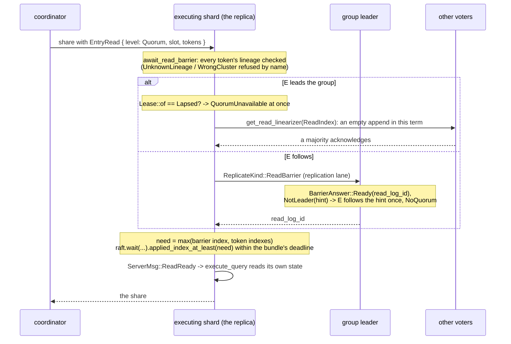
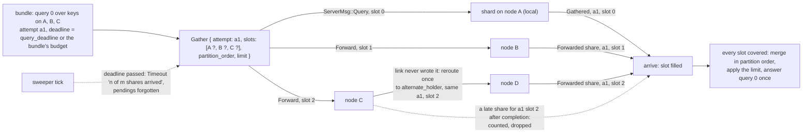

# C6. Reads and consistency levels

## Context

A read is served at `One` - the local replica's committed, applied state, possibly stale - or
at `Quorum` - a read barrier from the tablet's leader, then the replica's own apply through it.
A committed write hands back a session token a later read is served past. A bundle that spans
nodes is split into shares, forwarded as bytes, and gathered under one deadline, each query
index answered once. Built by [F41](../features/read-consistency.md), with a barrier and a token
through a leader change and the reroute of an unwritten share from
[F42](../features/primary-failover.md), the installing refusal from [F43](../features/node-recovery.md),
the quarantine refusal from [F44](../features/repair.md) and the retired-copy refusal from
[F45](../features/replica-migration.md).

## How it works

### Two read levels

| Level | Where it executes | What it promises |
| --- | --- | --- |
| `One`, the default | The local replica when this node holds one (`read_ring_for`), else the tablet's preferred holder: the first replica that is up, the primary preferred | That replica's committed, applied prefix, possibly stale, never an appended-but-uncommitted entry |
| `Quorum` | The same replica, after a `ReadIndex` barrier from the group's leader and its own apply through the index | Every write acknowledged before the read began is visible: single-tablet linearizable |

There is no `Primary` level: it would be a second routing policy over the same freshness
promise ([C13](protocol.md#q5-at-m5)). `All` is refused at validation, since nothing waits on
every replica. Neither level promises freshness from a cached leader address, and neither uses
the control group per read. A cut follower keeps answering `One` with what was committed before
the cut, and an isolated leader never shows a write it could not commit
(`one_reads_converge_without_exposing_uncommitted_state`).

### The strong read

The barrier is openraft's `get_read_linearizer(ReadPolicy::ReadIndex)`: the leader records its
read log id, probes every other voter with an empty append, and answers only once a majority
acknowledged in its term, so an old leader whose term has moved cannot answer one. A leader
whose lease lapsed refuses at once (`QuorumUnavailable`) rather than waiting out a deadline;
a barrier asked of a member that names another leader follows the hint after `LEASE_POLL`; a
barrier whose frame the link never wrote is `NotLeader` at once. The replica then waits for its
own applied index to reach the barrier within the bundle's budget, else `Timeout`, and reads.
`ReadPolicy::LeaseRead` is never used ([C13](protocol.md#the-questions-and-where-each-was-decided), Q6).

### Session tokens

A `Quorum` write's `Applied` or `Duplicate` answer carries a `SessionToken` - version, tablet,
cluster id, table id, group id, log index; forty-eight bytes - under `Flags::SESSION_TOKEN`
(`ShoalResponse::session_token()`). A read carries up to sixteen in its options, and the
replica waits `applied_index_at_least(index)` in the token's group within the bundle's deadline
before it reads, at either level; a `One` read with a token is a session read that pays no
barrier. A token naming another cluster, or sent to a standalone node, is `WrongCluster`; one
naming a group that does not serve its tablet on that replica is `UnknownLineage`. A token
carries an index and no term, because a committed index is never lost, and it does not expire,
because a lower bound does not age; a move keeps the group identity, so a token minted before
a move bounds a read after it ([C8](rebalancing.md#a-move)).

### Choosing a replica

Reachability, authority and storage readiness are separate checks at every level. An installing
group's tablets are refused `Unavailable` while the rest of the node serves
([C7](failover.md#snapshots-and-atomic-installation)); a quarantined copy is refused
`Quarantined` locally and routed around by every other node ([C9](operations.md#repair)); a
tablet no group on the shard serves - a copy retired under a move, or one never there - is
refused `StaleTopology` before anything is waited on and never from the rows still on disk. A
node at a factor of three on three nodes holds a copy of every tablet, but the request still
crosses to the executor hosting the tablet's slot; on more nodes than the factor a local copy
is not guaranteed.

### Fan-out across nodes

The coordinator splits each query by tablet and holds a `Gather` per `(bundle, index)` with an
attempt id and a slot per share (`shoal-core/src/server/shard/gather.rs`). Every share names the
attempt and the slot it fills; a reply is judged by them, so a share from an older attempt or
for a slot already covered is counted and dropped. A share the link never wrote is sent once
more to another holder under the same attempt and slot; one the link wrote is never re-sent by
the server. When every slot is covered the shares are merged in partition order and the limit
applied afterwards (`limits_apply_after_complete_ordered_gather`); an empty share still covers
its partitions, so a deletion or an empty filter can never be overwritten by an older answer
(`empty_and_deleted_partitions_have_explicit_coverage`). A bundle is not atomic: each query
index gets one complete result or one error, and other indices succeed independently. Across
tablets there is no common snapshot.

### Deadlines on a gather

Every bundle expires at `networking.query_deadline` (ten seconds) or the shorter budget it
names, measured from its last byte off the socket. A forward carries the milliseconds
remaining, and the serving node counts down from arrival, so no absolute clocks are compared.
The sweeper on every node ticks at `max(50 ms, shortest deadline / 10)`, answers an expired
gather `Timeout` once naming how many shares arrived, and forgets its pendings; an expired
forward is `OutcomeUnknown` (`gather_timeout_completes_once_and_discards_late_replies`).
Outstanding read work is not cancelled - a late share arrives and is dropped.

### The per-bundle override

A bundle's read level is the option it carries, else its table's level, else the cluster's
`read_consistency`; a table's level is versioned control state set by `SetTableReadPolicy`
(`one`, `quorum`, or nothing to clear it), never a YAML setting, so every coordinator resolves
a table the same way and a mixed bundle resolves per query
(`mixed_table_bundle_resolves_each_table_policy`). The coordinator forwards the level resolved,
and the serving node validates it rather than reinterpreting a local default. The read options
section and the token ride the client wire only behind the capability byte the hello granted.

## Design choices

One strong level, because a name is earned by an implementation and a second name would have
been two implementations to keep equivalent. A barrier rather than a lease, because the barrier
costs a heartbeat round and needs no clock. A token that is an index in a group, because a
group identity survives a move and an index is never lost. A slot per share and an attempt per
bundle, because that is the smallest identity that lets a late or duplicate share be judged
without state. A deadline carried as a remaining budget, because two machines' clocks are not
compared.

## Alternatives rejected

Control-plane-contact leases; choosing rows by the highest reported progress; a `Primary`
level; a per-share limit pushdown that is not proved equivalent; cancelling read work already
running; a quorum fetch that merges speculative rows.

## What it costs

`One` costs an eligibility check and sometimes a hop. `Quorum` costs a barrier - a heartbeat
round at the leader, plus one hop when the replica does not lead - and an application wait; a
session read costs the wait alone. A remote gather decodes what it merges; coverage metadata,
deadlines and the sweeper are bounded and measured on the read arms.

## Limitations

There is no cross-tablet snapshot. Leadership is never moved toward a reader. A coverage list is
not on the response frame - coverage is the share's own metadata. Tokens never expire. The
stage report does not draw the barrier and application waits. See [C15](open-issues.md).

## Invariants to uphold

- `One` reads only complete, eligible committed state; staleness is never partial installation.
- A strong read requires current data-protocol authority and application through the barrier.
- An empty share carries its coverage; an absent share never masquerades as emptiness.
- Every query index completes once, with complete rows or an error, within its budget.
- A table's level is resolved from committed state, and no cross-tablet atomicity is implied.

## How it is measured

`macro/cluster/reads/{one,barrier,session}`: one get at the reference depth on the replication
arms' placement, differing only in what the read asks for; `macro/cluster/fanout/{get,filter,limit,empty}`:
a six key get split over three nodes in four shapes. Every read arm records the barriers, hops,
barrier and application wait means and maxima, session waits, timeouts and late and duplicate
shares per node ([C10](performance.md#the-arms)).

## Acceptance tests

| Test | Asserts | Milestone |
| --- | --- | --- |
| `one_reads_converge_without_exposing_uncommitted_state` | A paused follower yields stale committed reads, then converges; speculative mutations never leak | M4 |
| `barrier_read_observes_prior_quorum_write` | A different coordinator reads committed state after the write response | M5 |
| `session_read_waits_for_committed_lower_bound` | A replica behind the token waits; the token works after a leader change and refuses a wrong lineage | M6 |
| `empty_and_deleted_partitions_have_explicit_coverage` | Filtering and deletion cannot resurrect an older row through missing metadata | M5 |
| `limits_apply_after_complete_ordered_gather` | Multi-tablet results preserve partition order and the limit without dropping required rows | M5 |
| `gather_timeout_completes_once_and_discards_late_replies` | A timeout, a retry and duplicate shares release state and produce one result or error per query | M5 |
| `mixed_table_bundle_resolves_each_table_policy` | Different table defaults resolve independently unless explicitly overridden | M5 |
| `read_barrier_survives_leader_change_and_delayed_messages` | Pauses, old leader replies and late control-plane contact cannot authorize a stale strong read | M6 |

## Related

[C5](replication.md), [C7](failover.md), [C13](protocol.md),
[Request lifecycle](../architecture/request-lifecycle.md), [Client](../api/client.md). The
read-safety argument is openraft's `handle_ensure_linearizable_read` in
`openraft/src/core/raft_core.rs`, and the protocol model's `QuorumConfirmed` rule is the same
argument written where the checker can break it.
