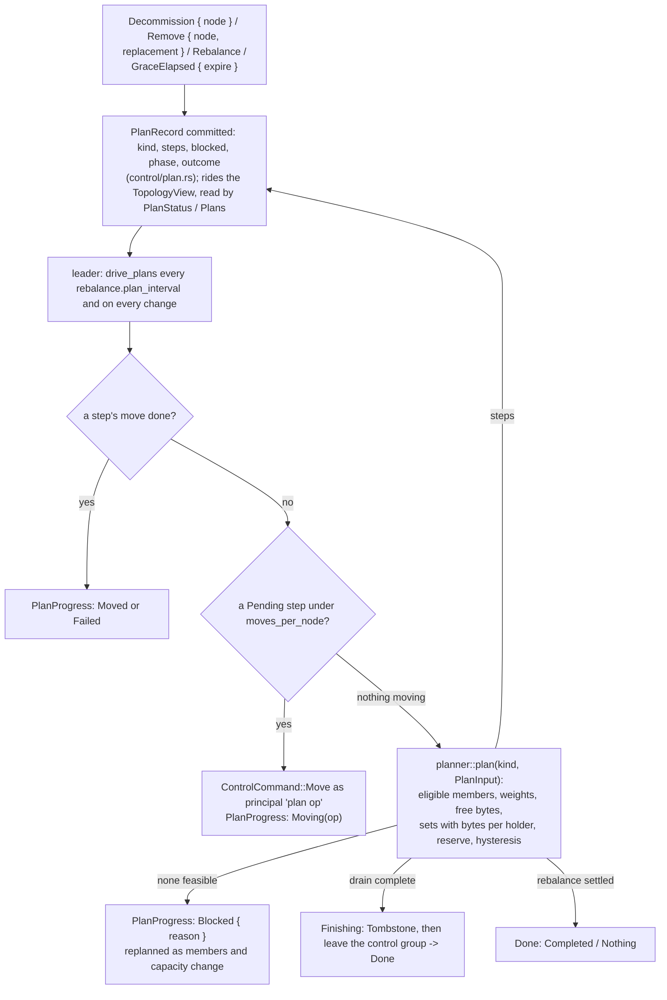
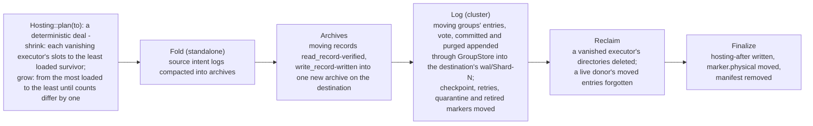

# C8. Adding, removing and rebalancing nodes

## Context

A replica set moves from one member to another as its groups' own joint membership transition,
driven phase by phase under a recorded operation, with the source's copy retired for a grace.
The control leader plans: a `Decommission`, a `Remove`, an expired grace or a `Rebalance` is a
plan whose steps are moves, derived by a pure planner from the sets as served, the members'
weights and the bytes they report, and blocked by name when capacity is short. A node's core
count changes locally, by a rehome of executors' files under a manifest, without any address
moving. Built by [F45](../features/replica-migration.md) (the move),
[F46](../features/capacity-rebalancing.md) (plans, removal, budgets) and
[F47](../features/local-rehome.md) (slots, hosting, the rehome).

## How it works

### A move

`Move { tablet, from, to }` (an admin verb, or a plan's step) is refused unless `from` holds the
tablet and `to` is a placeable member outside its set. It commits a `MoveRecord`
(`shoal-core/src/server/control/migrate.rs`) for the whole replica set the tablet is in - every
table's group over those tablets - naming the source and destination addresses (the
destination's slot is the rule's), the expected and target member lists, and a phase per
group; a set already moving or under repair queues the record behind it. The record rides the
map, the destination's shards build the set's groups as learners from it, and each group's
leader drives its own move (`shard/migrate.rs`, `cluster.migration.concurrent` at a time),
committing every phase as `MoveProgress` before the step it names, so the next leader resumes
the record rather than a lag report.

```mermaid
stateDiagram-v2
    direction LR
    [*] --> Queued: a transition is already on the set
    [*] --> Planned: Move applied whole
    Queued --> Planned: the transition ahead is done
    Planned --> Learner: add_learner(to), fed by log or snapshot
    Learner --> CatchingUp: first matched index
    CatchingUp --> Reconfiguring: lag at most catchup_lag, a source leader transfers the lead first
    Reconfiguring --> Configured: change_membership(ReplaceAllVoters(target)), joint then uniform
    Configured --> Activated: destination matched past the uniform entry and answered an Applied probe
    Activated --> Published: the last group activated, DataConfiguration committed, map version moves
    Published --> Retiring: source retires the copy under wal/Shard-N/retired
    Retiring --> Done: source answers Retired, or is Down, or the grace and a timeout passed
    Done --> [*]
```

The destination is a learner until the group's own joint transition - `[expected, target]`
under both majorities, then the uniform `target` - and its own apply make it count
(`learner_never_counts_before_configuration_commit`); a leader lost between leaves the joint
configuration behind and the next leader finishes it. A leader that is the move's source hands
the lead to a target member over the lane before reconfiguring, since without that its own
lease is the first to lapse. The last group's `Activated` publishes the set's
`DataConfiguration` beside the rule ([C4](tablet-map.md#the-placement-rule)); a stale router's
forward is answered `StaleTopology` and re-sent once. The source's shard retires the copy:
handle shut down, resident partitions evicted, the log forgotten with a `Forget` frame, a
marker under `wal/Shard-N/retired/`, every query of its tablets refused by name, and after
`cluster.migration.retire_after` the archived partitions dropped through the map's intent log
and the files gone (`retired_copy_never_serves_from_grace_files`). A group's identity survives
the move, so a session token minted before it bounds a read after it, and a retry identity is
judged the same on the destination ([C5](replication.md#retry-identity)). Every phase's
failure - source, destination or control leader killed - resumes from the record
(`migration_resumes_after_each_phase_failure`); a write acknowledged after a zero-lag report
survives the source's retirement (`move_preserves_write_after_zero_lag_report`); moving one
group's frames out of a shared segment erases nothing another group needs
(`shared_wal_cleanup_preserves_other_tablets`).

A repair and a move on one set serialize: whichever is asked second is recorded `Queued`
behind the first and released by its last group's `Done`, in apply
([C9](operations.md#repair)). Leadership transfers cooperate the same way.

### Plans

The planner (`control/planner.rs`) is pure and deterministic over a `PlanInput`: the placeable
members with their `weight` (`cluster.weight`, the executor count by default) and reported free
bytes, and every set with its members, tablets and the bytes each holder reports for it
(`ArchiveMap::tablet_bytes`, folded into the status report and kept in the leader's memory,
never committed; a set nobody measured counts as one byte). A drain sends each of the member's
sets to the feasible member with the lowest load over weight - the named replacement first -
where feasible is placeable, not in the set, free bytes at least the set plus
`cluster.migration.disk_reserve`, and under `cluster.rebalance.moves_per_node`. A rebalance
gives every member its weight's share of the bytes held, capped at holding every set with the
excess spread over the others, and moves a set from the member most over its target to the
member below it that gains the most while the source is over by more than
`cluster.rebalance.hysteresis` (0.10), so a second plan moves nothing; at N = RF every node holds
every tablet and the plan answers `Nothing` naming the constraint
(`heterogeneous_placement_obeys_feasible_weights`). The leader issues one move per member as
source or destination at a time, retries a stale-version proposal eight times, and records a
step that no member can take as `Blocked` by name. One proposal per plan is in flight.

### Adding a node

A node joins as a member holding nothing ([C3](membership.md#joining)). Nothing moves onto it on
its own: an operator asks for a `Rebalance` and follows `PlanStatus`, or a blocked removal
waiting on a further member runs by itself once one joins. At three nodes and a factor of
three a fourth node permits redistribution; the plan gives it learners and replaces old copies
set by set, serving continues where quorums and capacity permit, and a stalled move pauses
visibly without taking unrelated tablets offline.

### Removing a node

`Decommission { node }` moves a plain member to `Leaving` and records a plan; it serves its
remaining copies while they drain. `Remove { node, replacement }` needs a member that is down
or leaving, moves it to `Removing` with its grace expired at the operator's word, and takes the
replacement - a placeable member outside every set the member holds - first when one is named.
Both drain one set per member at a time. When every set has moved, `finish_removal` commits the
`Tombstone` first - the member `Removed`, its grace cleared, its identity in `tombstones` -
then changes the control membership to drop it, and `maybe_promote` refills the voter count
from a placeable learner; a leader removing itself transfers the lead. The tombstoned identity
is refused at `observe`, `Admit`, `SetHealth`, the join, its report, the membership and both
hello judges, and is never pinged; a node that learns it is removed stops
`ShoalError::Removed` (`automatic_removal_and_rejoin_preserve_fencing`). Three nodes at a factor
of three with one dead is `remove_without_replacement_capacity_stays_blocked`: the plan blocks
naming the missing member, every copy is kept, the factor is untouched, and the fourth identity
that joins completes it. No copy is dropped before the new configuration is safe, and the factor
is never reduced: there is no RF change.

An expired grace ([C3](membership.md#what-follows-from-down-and-when)) is the same as a
`Remove` under the policy's name. `Maintenance { node, suspend }` holds it. A partitioned node
fenced and replaced after its grace cannot undo the transitions when it returns.

### Transfer budgets

`cluster.migration.stream_bytes_per_sec` (64 MiB/s; 0 is unlimited) is one token bucket per
sending node across every stream and group; `concurrent_streams` (2) caps what one shard
assembles at once, the rest refused at their `Begin` and fed again by the sender's backoff;
`disk_reserve` (1 GiB) is checked by the planner against the reported free bytes and again by
the receiver against its own before a stream is accepted, so a stale report is caught where the
bytes would land (`node_transfer_budgets_bound_concurrent_sources`). A move's `timeout` bounds
the refusals. Snapshot bytes ride the bulk lane, separate from queries, replication and control
([C2](transport.md#four-lanes-on-two-ports)).

### Orphaned copies

Data no longer assigned to this node - a retired copy past its grace, a removed node's
directory - is never served or counted because it exists. A removed identity cannot regain
authority by reporting useful files, and reusing its directory is not a rejoin: what it held
comes back only through a `Backup` of a live cluster restored into a new one
([C9](operations.md#backup-restore-and-export)).

### Slots, executors and the rehome

A cluster node's *slots* - `cluster.slots`, one per core by default - are claimed once into the
marker and never move: they are the shard in every address, the rule's modulus and every
group's identity. Which *executor* hosts a slot, and on a standalone node which executor owns
each tablet, is `shoal-hosting.json` (`server/hosting.rs`), a table nothing off the node reads.
Changing `resources.cores` is therefore local: the claim reports a pending rehome, and
`Rehome::run` (`server/rehome/`) runs on its own executor after the control plane is up (its map
says which slot each group is on) and before any shard opens a file, under the directory lock
and a manifest, `shoal-rehome.json`, written whole before the first move and rewritten after
each durable step, so a crash resumes at its step (`local_rehome_recovers_after_each_crash_point`,
`standalone_rehome_rebalances_tablets_across_restarts`).

More cores than slots is refused `CoresExceedSlots` - a slot is a ceiling, and the way past it
is a `Replace` - and a `cluster.slots` that differs from the marker's is refused `SlotsFixed`.
The rehome changes no address, no rule, no group identity and nothing on the map; the pool's
`rehome()` reports what moved and how long the hold was, and `macro/rehome/shrink` prices it.

## Design choices

A move as the group's own joint transition, because only the protocol knows when the new copy
counts. A record committed before every step, because the leader that finishes a move is often
not the one that started it. Plans as recorded steps that are ordinary moves, so removal,
expiry and rebalancing are one mechanism with one audit trail. A pure planner over reported
bytes, so a plan can be tested without a cluster and a leader change loses nothing but a
report. Bytes reported rather than committed, since they change every second. Slots separate
from executors, so a core-count change never touches the map.

## Alternatives rejected

Three map edits and a lag-zero heartbeat as a move; replica-count equality as the target;
immediate file cleanup, or reading a retired copy during its grace; automatic removal as
permission to force a configuration after a lost data majority; a plan that runs forever toward
an impossible ratio at N = RF; a rehome that changes addresses.

## What it costs

Temporary disk amplification, retained history, foreground interference under the token bucket,
and a leadership transfer's short retries. A rehome holds the node's start for the copy; the
rehome arm records the hold in `cluster.rehome.millis`.

## Limitations

A failed move leaves the committed membership where it got to; there is no rollback. A set
moves its groups one at a time. There is no same-node move, no RF change, no operator-chosen
destination slot, no `Decommission` cancel and no plan preview beyond reading the steps.
Bytes are archived bytes only. The bucket is per node, not per device or per pair, and does
not adapt to the foreground's tail. The learner is fed a whole-group snapshot
([O55](../appendix/optimizations.md#o55-a-learner-inside-the-retained-log-is-fed-a-snapshot-when-the-leaders-cached-cut-is-newer-than-its-purge-point)). A rehome serves nothing while it runs
([O59](../appendix/optimizations.md#o59-the-rehome-runs-on-one-core-and-blocks-the-start)) and drops partial installs. See [C15](open-issues.md).

## Invariants to uphold

- A migration preserves acknowledged operations across both configurations and every crash phase.
- A learner becomes a voter only through a committed data-protocol transition.
- A transition resumes by durable identity, never from a cached progress report.
- `Down` keeps assignments through the grace; removal cannot manufacture capacity or a majority.
- Per-node budgets bound streams and retained state; the reserve is checked where the bytes land.
- A retired copy does not serve; cleanup waits for the configuration and the grace.
- A tombstone precedes the membership change; a slot never moves.

## How it is measured

`macro/cluster/rebalance/{add,decommission,remove,capacity_blocked}`: the kill arm's placement
and mixture with a plan driven from a third of the way through, each recording
`p99_ratio_permille` against the foreground before it; `macro/cluster/migration/move` prices
one move; `macro/rehome/shrink` the rehome's hold ([C10](performance.md#the-arms)).

## Acceptance tests

| Test | Asserts | Milestone |
| --- | --- | --- |
| `move_preserves_write_after_zero_lag_report` | Writes acknowledged after the catch-up report and delayed old-configuration requests all survive source retirement | M9a |
| `migration_resumes_after_each_phase_failure` | Source, destination or control leader killed at every phase: reconciled without lost or duplicate operations | M9a |
| `learner_never_counts_before_configuration_commit` | A delayed snapshot installation cannot prematurely satisfy a quorum | M9a |
| `retired_copy_never_serves_from_grace_files` | Stale routing forwards rather than returning post-drop stale source data | M9a |
| `shared_wal_cleanup_preserves_other_tablets` | Moving one stream cannot erase history another needs | M9a |
| `node_transfer_budgets_bound_concurrent_sources` | Many sources respect the destination's memory, disk and bandwidth limits while foreground work progresses | M9b |
| `heterogeneous_placement_obeys_feasible_weights` | N>RF balances bytes; N=RF reports the full-copy constraint without oscillation | M9b |
| `remove_without_replacement_capacity_stays_blocked` | A three-node factor-of-three loss preserves two copies and the desired factor until a fourth identity joins | M9b |
| `automatic_removal_and_rejoin_preserve_fencing` | Grace expiry, a leader restart and an old node's return cannot revive old authority | M9b |
| `decommission_drains_within_supported_load_envelope` | A healthy drain preserves every operation and finishes without final client errors | M9b |
| `local_rehome_recovers_after_each_crash_point` | Fewer configured cores preserve full data and consensus metadata across an interrupted rehome | M9c |
| `standalone_rehome_rebalances_tablets_across_restarts` | A standalone node dealt per tablet up and down preserves every row through a crash at the fold and at the copy | M9c |

## Related

[C3](membership.md), [C4](tablet-map.md), [C7](failover.md), [C9](operations.md),
[C13](protocol.md); [etcd's learner design](https://etcd.io/docs/v3.5/learning/design-learner/)
on why catch-up precedes promotion and
[Scylla's tablets](https://www.scylladb.com/2024/06/17/how-tablets/) on durable transition
records, both references and not dependencies.
