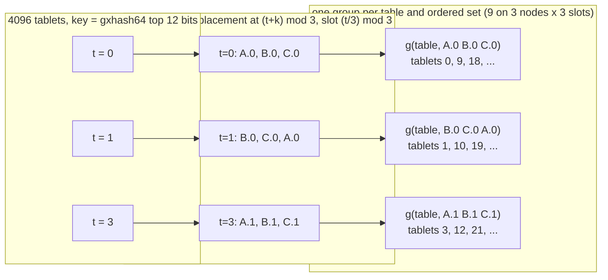
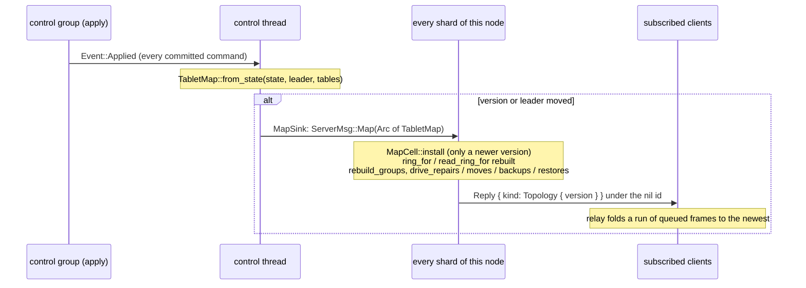

# C4. The replicated tablet map

## Context

Every shard routes by one committed map of where each tablet's copies are. The map is built by
the control thread from the control group's applied state on every version, pushed whole to
every shard of the node and to every subscribed client, and never asked for synchronously.
Placement intent is the control group's; a tablet group's own configuration is what its
members vote by. Built by [F39](../features/membership.md) (the map, `Initialize`, the
topology frame), [F40](../features/replication.md) (replica sets and groups),
[F41](../features/read-consistency.md) (the table read policy), [F44](../features/repair.md)
(quarantined copies), [F45](../features/replica-migration.md) (a moved set as a
`DataConfiguration`) and [F47](../features/local-rehome.md) (hosting slots on executors).

## How it works

### The map

`TabletMap` (`shoal-core/src/server/map.rs`) carries `version`, `cluster`, `leader`, the
`members` (each with its addresses, health, phase, incarnation, slot count, failed shards and
quarantined copies), the `placement` order, the `tables` with their ids, `desired_rf`, the two
consistencies, `table_read_policy`, `admins`, the pending `repairs`, `moves`, `backups` and
`restores`, the `configurations` a move published, `primary_failover_ms`, `activated_wire`,
`restored_from` and the `tombstones`. `TableId` is the hash of the table's name, stable schema
metadata a peer never infers. Nothing per tablet is on the map: a set is derived by a rule,
and a set that moved is one record for its tablets.

### The placement rule

`Initialize { nodes }`, sent once by an operator, commits the placement order. Before it the
bootstrapper holds every tablet and a joiner holds none. After it, for tablet `t` over the `N`
placed nodes, copy `k` of `min(desired_rf, N)` lives on `placement[(t + k) % N]` at slot
`(t / N) % slots` of that node (`rule_replicas_of`). The window never repeats a node while
`k < N`, so three copies land on three distinct nodes by construction; at N > RF each node holds
`RF / N` of the tablets to within one; `active_rf` is reported beside the desired factor, and
the write quorum is the desired factor's ([C5](replication.md#the-quorum-gate)).

Every tablet whose rule set is the same ordered list of `(node, slot)` addresses is served by
one tablet group per table: `GroupId::of(table, rule_members)` hashes the table and that list,
so a table has `N × slots` groups on N nodes rather than 4096, and the primary is the first
address. `replica_groups(me)` gives a node the `GroupSpec` of every group it is in - id, table,
members, voters (the non-tombstoned members), the tablets, `mine` (this node's slot), whether
this node is a learner of it and the move it is in - and `spec.me(node)` is `(node, slot)`,
never an executor id. A set a move published is a `DataConfiguration` on the map - its tablets,
its members with the primary first, each group's uniform membership index - and `replicas_of`
answers the configuration's members for exactly its tablets and the rule's for the rest, while
`rule_replicas_of` stays what the group's identity is minted from, so a moved group keeps its
id ([C8](rebalancing.md#a-move)).

### Slots, executors and the rings

A node's `shards` on the map is its slot count. Which *executor* hosts a slot is the node's own
`shoal-hosting.json` (`server/hosting.rs`): `hosts[slot] → executor` on a cluster node,
`tablets[tablet] → executor` on a standalone one. `ring_for(me, hosting)` builds the `Ring` a
shard routes writes and local reads by - a local tablet owned by the executor hosting its
slot, a remote one a `ShardContact::Remote { node, shard: slot }` - and `read_ring_for`
routes a tablet this node holds a non-quarantined copy of to that executor and everything else
to `preferred_holder`: the first replica that is `Up`, the primary preferred, passing over a
holder whose copy of those tablets is quarantined. `alternate_holder` is the same choice with
one node avoided, for a share the link never wrote ([C2](transport.md#links)).
`write_admission` is the map's other judgement: `quorum_for(write_consistency)` against the
members that are up, refused `QuorumUnavailable` naming the shortfall.

### How a map reaches a shard, and a client

A shard installs a complete newer version between two messages, never a partial one, and an
older version is dropped (`map_versions_install_atomically_and_resync`). A client that sent
`Subscribe` after authenticating gets every version as a `Topology` frame carrying the
members' client endpoints, the placement, the tables, the factors, the table read policy, the
moves and configurations, the quarantines and the activated wire; `Shoal::topology()` and
`topology_changed(since)` read it ([Client](../api/client.md)). Fanout is whole-map: under
16 KiB a frame at sixty-four members and a thousand subscribers pushed in four milliseconds
([C13](protocol.md#q11-and-q13-at-m3)).

### Staleness

A coordinator routes on the map it holds; the node it forwards to judges the request against
its own. A share for a tablet no group of the serving node serves is answered `StaleTopology`
(error 55) at the version it holds, and the origin sends it once more to another holder and
never relays a second hop, so two stale nodes cannot loop
(`stale_routes_terminate_without_duplicate_writes`). A write retry keeps its identity across a
redirect, and a redirect never implies an accepted command was absent. Files a retired copy
left behind are cleanup grace, never read-eligible.

### Persistence, and what a restart does

The control group's snapshot persists placement intent; each tablet group persists its own
configuration, term and vote, checkpoint and log. A restart reconciles the two before serving:
a shard builds its groups from the map and each group starts from its own files
(`data_configuration_outlives_stale_placement_hint`). The marker's `topology` is a resume hint,
never proof of freshness. A removed node's identity is tombstoned and its files are never a
source. A rehome changes which executor hosts a slot and nothing on the map
([C8](rebalancing.md#slots-executors-and-the-rehome)).

## Design choices

A rule rather than a record per tablet, so the map stays a node list - the M3 fanout numbers
depend on it - and a group per ordered set rather than per tablet, because heartbeats do not
coalesce across groups ([C13](protocol.md#q1-and-q13-at-m1)). A moved set widens the value by
exactly the sets that moved. Whole-map pushes with a fold to the newest, rather than deltas, at
the size a map is. "Has a copy", "can vote", "counts toward durability" and "can serve this
read" are kept as separate facts: a learner, a quarantined copy and an installing group each
fail a different one.

## Alternatives rejected

The first draft's `SetPrimary` and map-only `AddReplica`/`DropReplica`, superseded by data
elections and configuration transitions; a leader hint on the map, which would rewrite every
client's map on every election; a group per tablet; per-table placement templates as separate
log sequences.

## What it costs

More metadata than the standalone 8 KiB ring, by member and table count, plus a configuration
per moved set. A stale route costs a hop, bounded by the deadline and one reroute. Both the
rule's set and a configuration exist while a move is in flight.

## Limitations

There are no leader hints and no deltas on the map. Per-table replication factors do not exist.
A quarantine is routed around per tablet's holder, not per table. A client records the topology
and does not route by it until [D7](../direction/shard-aware-routing.md). See [C15](open-issues.md).

## Invariants to uphold

- Placement intent changes by control-plane commit; voting authority changes by data consensus.
- Distinct-node placement and the desired factor are enforced separately from current availability.
- An installing learner does not vote and satisfies neither durability nor read readiness.
- Routing refresh is bounded; an accepted operation keeps its identity across a redirect.
- A map installs atomically per version, and only a newer one.
- A group's identity is minted from the rule's set and survives a move.

## How it is measured

The topology fanout and report tables ([C13](protocol.md#q11-and-q13-at-m3)); the routing
microbenchmarks ([F24](../features/routing-benchmarks.md)); a rebalance's moves on the
rebalance arms ([C10](performance.md#the-arms)).

## Acceptance tests

| Test | Asserts | Milestone |
| --- | --- | --- |
| `map_versions_install_atomically_and_resync` | A missed version causes a full refresh; no partial placement is visible | M3 |
| `table_ids_and_streams_are_stable_across_restart` | Distinct tables share placement only, not identity or progress | M3 |
| `placement_respects_distinct_nodes_and_feasible_capacity` | The factor's constraints hold; at N=RF each node holds every tablet; N>RF uses feasible weights | M4 |
| `client_receives_topology_with_client_endpoints` | The initial topology and subsequent coalesced updates identify reachable client endpoints | M3 |
| `stale_routes_terminate_without_duplicate_writes` | A stale A↔B route, an absent old owner and repeated redirects complete or error within budget | M9a |
| `data_configuration_outlives_stale_placement_hint` | A crash between a data configuration commit and the metadata's completion cannot reactivate an old configuration | M9a |

## Related

[C3](membership.md), [C5](replication.md), [C8](rebalancing.md), [C13](protocol.md),
[Partitioning](../architecture/partitioning.md), [D7](../direction/shard-aware-routing.md).
