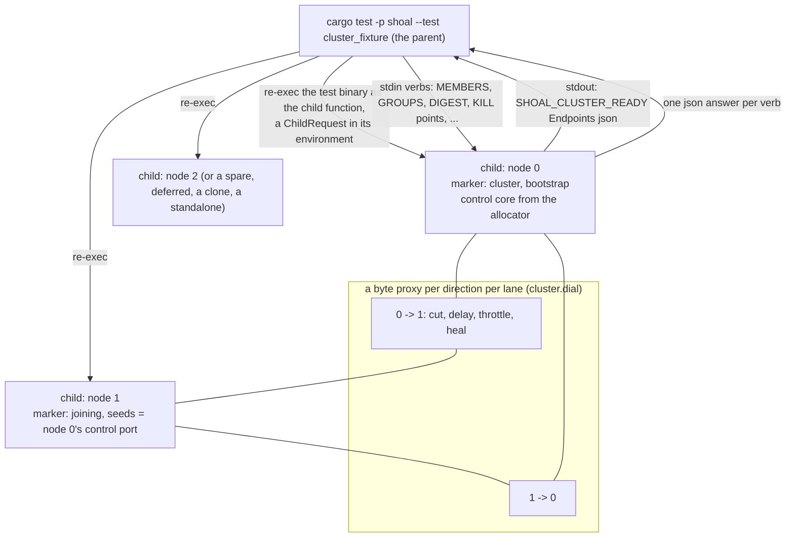

# C11. Acceptance tests and the cluster harness

## Context

The cluster is proved two ways: a pure, deterministic protocol model that explores elections,
persistence completions and configuration changes without a runtime, and a process fixture
that starts real Shoal nodes on real cores and kills, stalls, cuts, throttles, isolates,
restarts, clones and crashes them. Neither replaces the other: the model checks the contract's
properties against schedules a fixture cannot force, and the fixture checks that the adapters
obey the model. Every C page's acceptance table names the tests that prove it, one milestone
each, and a docs check holds those tables to the milestones page and to the functions in the
workspace. Built by [F36](../features/cluster-harness.md), extended by every feature after it.

A third way, since: the [distributed cluster testing](../cluster-testing/overview.md) chapter
deploys the TMDB dataset onto three physical hosts with `shoalctl cluster` and drives it with real
clients and faults injected from outside the process. It found defects that every fixture test
had run over, most of all [a use-after-free](../appendix/resolved/read-plan-rc-across-shards.md)
the fixture's glibc allocator let pass.

## How it works

### The process fixture

The fixture (`shoal/tests/cluster/`, entry point `shoal/tests/cluster_fixture.rs`) re-executes
the test binary as its children, one per node, each on whole cores the allocator leases - a
control core and its shard cores - so the suite is what a loaded machine makes it, and a
failure that passes alone was a timeout. A child claims its staged marker: node zero's names
the cluster, every other child's says `joining` with a pre-minted id and node zero's control
address as its seed; data and control ports are numbers from a block below the ephemeral
floor ([Resolved #102](../appendix/resolved/fixture-port-block.md)), client ports are zero and
reported. A child prints `SHOAL_CLUSTER_READY`
with its bound endpoints, identities, control core and control status, then answers verbs on
stdin with one JSON line each. Between any two nodes a byte proxy per direction per lane
(`cluster.dial`) can cut, delay, throttle to a byte rate, or heal, so every connection opened
after a join stays under the fault; a proxy cannot parse an encrypted frame, which is why
frame-class faults are the child's own verbs and the real-TLS tests use a fixture authority.
`SHOAL_CHILD_LOG=<dir>` keeps every child's log (hundreds of megabytes each; point it under
`target/`, never at a tmpfs, never set it empty, give it an absolute path since a child runs
in its own directory, and set it for a targeted run only - one suite run under it wrote fifty
gigabytes and failed twenty-two tests on the I/O). Run it at six threads: at the default thirty-two the children die
at glommio's io_uring probe on the development host, which is the machine's limit and not a
defect - the fencing failure that was filed against that load was a race of the clone's own
([Resolved #100](../appendix/resolved/clone-fencing-under-load.md)).

| Verbs | What they do | Since |
| --- | --- | --- |
| `PING`, `VOTE_PROBE`, `TRANSPORT`, `PROBE_BULK`, `FLUSH` | A peer ping, a control vote probe, the lanes' counters, a bulk lane probe, a flush | F38 |
| `MEMBERS`, `READINESS`, `MAP`, `INITIALIZE`, `SET_VOTERS`, `ADMIN`, `INCARNATION`, `LOG_LEN`, `FAIL_SHARD`, `STALE_REPORT` | The admin reads, an admin mutation as the process, this start's incarnation, the control log's bytes, a shard failed on purpose, a stale status report sent on purpose | F39 |
| `GROUPS`, `DIGEST <table>`, `ROTATE`, `COMPACT`, `STALL_WAL <group>` / `RELEASE_WAL <group>` | Every group with its members, leader, applied, committed and checkpoint indexes; the rows and a hash over every shard's applied state, archived partitions included; a rotation, a compaction; a group's flush completions held on this node so a quorum is short by exactly one durable voter | F40 |
| `HOLD_SHARES <shard> <ms> [dup]`, `GATHERS`, `SET_TABLE_READ_POLICY <table> <one\|quorum\|clear>` | Every share a shard would send held that long and sent twice on release if asked; the resident gathers and the read counters; a table's level | F41 |
| `STALL_SHARD <shard> <ms>`, `DROP_REPLIES <n>` | A shard's executor blocked while the control thread keeps reporting; the next `n` committed write replies dropped | F42 |
| `SNAPSHOT <group>`, `CRASH_AT <point>` | The manifest of a cut taken now; the child armed to exit at one of the seven points of an install | F43 |
| `SCRUB`, `REPAIR`, `REPAIR_STATUS`, `CORRUPT <table> <key>`, `FORGET`, `ERASE` | A scrub; a repair as the process and its record; a byte of a partition's archived record flipped in place by the compactor that owns it; the partition's map entry dropped; the partition rewritten with no live row under a valid checksum | F44 |
| `MOVE <key-hex> <from> <to>`, `MOVE_STATUS <op>`, `MOVE_CRASH_AT <phase> [<group>]` | A move of the set holding the key's tablet; its record; the child armed to exit right after its driver commits that phase | F45 |
| `DECOMMISSION`, `REMOVE`, `MAINTENANCE`, `REBALANCE`, `PLAN_STATUS <op>`, `PLANS`, `FREE_BYTES <bytes\|none>` | The plans as the process; the records; what the node reports as free and its receiver checks against the reserve, so a capacity test fills no disk | F46 |
| `REHOME`, `HOSTING`, `SHARD_DIRS` | The rehome's report or `null`; the slots, executors and which hosts which; which executors still have files; and `restart_with_cores` / `restart_with_overrides` restart a node on its lease at another count with a rehome crash point armed | F47 |
| `WIRE`, `ACTIVATE <wire>` | The negotiated and activated versions; an activation as the process; a node restarted pinned, lifted or on another build of the test binary (`SHOAL_PREVIOUS_TEST_BINARY`) | F48 |
| `BACKUP`, `BACKUP_STATUS`, `BACKUPS`, `RESTORE`, `RESTORE_STATUS`, `RECOVERIES` | The backups and restores as the process and their records; a recovery run offline on a stopped child | F49 |
| `RELOAD_TLS` | This node reads its certificate again, through the admin verb; a `.peer_tls()` cluster runs mutual TLS under a fixture authority whose leaves name their nodes, and `restart_at_fresh_ports` and a clone at the old ones | F50 |

The builder sets every timer and bound a test needs - `primary_failover_after` (a second in
tests), the write and query deadlines, the pending bound, one node's durability,
`checkpoint_entries`, `retained_entries`, `segment_bytes`, `retained_bytes`,
`snapshot_chunk_bytes`, `bulk_queue_bytes`, `retire_after`, `catchup_lag`, `migration_timeout`,
`retry_window`, `auto_remove_after`, a node's `weight`, `stream_budget`, `disk_reserve`,
`moves_per_node`, `plan_interval`, `node_cores` and `slots` - and its helpers read and write
with `SendOptions`, keep a write's token, ask a named node for a key's leader, wait for a
join, a voter count, a plan's outcome or every node's digest to agree, and leave a node behind
the purge point on purpose. A standalone node in the same binary is started in process.

### The protocol model

`shoal-model` is a workspace crate that names no shoal crate, no runtime and no engine: the
contract as executable checks over a Raft-shaped tablet group, with client invocation, message
receipt, timer tick, storage completion, crash and restart, snapshot completion and
configuration commit as explicit events, stable storage modelled apart from volatile buffers,
and every invariant checked on every transition. Seeded schedules and saved failing traces
under `shoal-model/schedules/` each replay to the violation they record
(`saved_protocol_schedule_reproduces_failure`): `ack_on_receipt`,
`async_receipt_counts_as_durable`, `duplicate_ack_counts_again`,
`election_by_heartbeat_max_report`, `quorum_from_current_up_list`,
`reads_and_checkpoints_see_appended_suffix`, `stale_report_b4_c5_ab6` and
`strong_read_from_cached_leader` - each the schedule that violates one clause of
[P1–P6](protocol.md#the-contract). `cargo run -p shoal-model --example regenerate_schedules`
regenerates them after a model change; the tests only load. The model's oracle reads at `One`.

### Faults

| Fault | How it is injected |
| --- | --- |
| Process crash and pause | `kill` (SIGKILL) and `STALL_SHARD`, distinguished from disk failure and from a link partition |
| Directed partition | A proxy per direction: A→B and B→A cut independently, full cuts, non-transitive connectivity |
| Traffic-class fault | A lane cut, delayed or throttled on its own; `DROP_REPLIES` for client responses; `HOLD_SHARES` for gather shares |
| Duplicate and reorder | `HOLD_SHARES ... dup` and the model's schedules, never an assumption about TCP order |
| Partial node failure | `STALL_SHARD`, `FAIL_SHARD`, `STALL_WAL` for a disk completion, a stalled data lane under a live control thread |
| Storage faults | `STALL_WAL` for a delayed fsync; `CORRUPT`, `FORGET`, `ERASE` for the archives; a corrupt checkpoint or sidecar refused at open by its checksum (`checkpoint_and_retries_are_checksummed`); the control store's torn append |
| Recovery faults | `CRASH_AT` at each of an install's seven points; `MOVE_CRASH_AT` at each move phase, beside the destination and the control leader killed as the phase is reached; the rehome's seven points |

`kill` proves nothing about durability: SIGKILL does not lose OS or device caches, and bytes in
a live file before an acknowledgement do not prove an fsync. Durability is judged by the
protocol model's storage completions and by `STALL_WAL`, which holds a completion the way a
slow disk does. Disk full and a torn write to an archive are not injected.

### The write ledger and the oracle

A test's writes are recorded with invocation and completion times, identity, payload, key and
tablet, policy and outcome - inserts, updates, deletes, delete-then-reinsert, conditional
no-ops and the results returned - with successful, definitely rejected and outcome-unknown
operations kept distinct. `conditional_results_follow_committed_order` feeds the ledger to the
model's oracle: an unknown command may appear zero or once, a successful retry under the same
identity resolves consistently, and an error never implies an absent effect. The oracle's scope
is the contract's: single-tablet strong operations, session lower bounds, committed-prefix
reads and convergence after quiescence. A quorum read alone is not verification, since a
shared merge bug hides divergent replicas; the digests below compare replicas at one boundary.

### Digests

`DIGEST <table>` folds every shard's partitions - resident and archived - into a row count and
a hash over their serialized bytes, and a convergence test waits until every node agrees. It
is on purpose not the scrub's canonical digest: the repair path folds rows re-serialized in
key order under the schema and the tablets at a committed boundary
([C9](operations.md#repair)), and `canonical_digest_ignores_archive_layout_at_same_boundary`
is the layout self-test - three replicas merged thrice, once and never agree at one boundary,
a forgotten or an erased partition does not, a corrupted one is invalid - while the fixture's
fold agrees with every verdict from outside. Source selection is tested by corrupting the
primary (`repair_detects_corrupt_primary_and_preserves_evidence`) and a follower
(`corrupt_follower_is_quarantined_and_repaired_from_a_verified_source`).

### Assertions on the path

A schedule names the point at which it blocks - `CRASH_AT`, `MOVE_CRASH_AT`, `STALL_WAL`,
`HOLD_SHARES` - rather than hoping repeated wall-clock races hit it. Every wait is bounded and
prints the node, term, configuration and progress it was waiting on when a deadline fails.
The small deterministic regressions and the focused process faults run in the ordinary suite;
the fixture suite is `cargo test -p shoal --test cluster_fixture -- --test-threads 6`.

### The acceptance table

C1–C10 and C13 are the source of truth for named tests, and they are not duplicated here.
`acceptance_tables_have_unique_tests_and_valid_milestones` (`shoal-bench/tests/acceptance_tables.rs`)
parses every `## Acceptance tests` table under this chapter and checks that every name is
unique and a test name, that every milestone exists as a `### Mx.` section on the
[milestones page](milestones.md) whose body names the owning chapter, and that every test a
delivered milestone gates is a `fn` somewhere in the workspace.

| Page | Test scope |
| --- | --- |
| [C1](node-identity.md#acceptance-tests) | Identity, configuration, affinity, the certificate binding and existing-data migration |
| [C2](transport.md#acceptance-tests) | Framing, flow control, compatibility and response identity |
| [C3](membership.md#acceptance-tests) | Control membership, reporting, grace and maintenance |
| [C4](tablet-map.md#acceptance-tests) | The placement/configuration distinction and bounded stale routing |
| [C5](replication.md#acceptance-tests) | Durability, progress, conditional results and retries |
| [C6](reads.md#acceptance-tests) | Barriers, sessions, empty results, limits and deadlines |
| [C7](failover.md#acceptance-tests) | Elections, checkpoint boundaries, recovery and corruption |
| [C8](rebalancing.md#acceptance-tests) | The transition crash matrix, capacity and the rehome |
| [C9](operations.md#acceptance-tests) | Authorization, repair, upgrades, backup, recovery and the cluster tab |
| [C10](performance.md#acceptance-tests) | Comparable resource and semantic facts and the failure time series |
| [C13](protocol.md#acceptance-tests) | Protocol invariants and the separation of data and control quorums |

## Design choices

Real processes on real cores rather than a whole-engine simulator, because glommio is not
simulated and a fixture that fakes it would test the fake; a pure model beside it, because
the schedules that break a contract are the ones a fixture cannot force. Verbs on stdin
rather than a test-only network protocol, so a child is the server binary with one extra
loop. A byte proxy per direction per lane, so a post-join connection stays under the fault. A
digest the repair path does not share, so a bug in the canonical digest cannot hide itself.

## Alternatives rejected

Rejecting deterministic testing because glommio is not simulated; an insert-only success set as
the oracle; fixed sleeps as readiness; bind-zero-then-close as a port reservation, and after it
a reservation from the ephemeral range at all; a process
pause and a link partition labelled as one fault; twenty repetitions of a ledger in place of a
named schedule.

## What it costs

A model, a fixture crate, per-child logs and whole cores per test: the suite takes what a loaded
machine gives it, and a test that needs a real cluster of three needs nine or more leased cores.

## Limitations

The model is Raft-shaped and not a library: no configuration changes, learners or snapshots in
it. Core allocation is recorded, not enforced. ~~The fencing test fails at full parallelism~~
(the clone's race is [Resolved #100](../appendix/resolved/clone-fencing-under-load.md); the
suite at full parallelism fails on the host's io_uring limits);
~~a deferred node can lose its reserved port to an outbound connection~~ (the ports come from a
block below the ephemeral floor since [Resolved #102](../appendix/resolved/fixture-port-block.md));
the certificate test skips without kTLS; the previous-binary upgrade test runs only when a
build is named. Disk full and torn archive writes are not injected. See [C15](open-issues.md).

## Invariants to uphold

- Faults cover post-discovery connections and distinguish disk persistence from process death.
- Tests preserve reproducible schedules and independent expected-state evidence.
- Successful, rejected and unknown outcomes are checked against their different contracts.
- Every named acceptance test has one milestone and an executable entry point.
- `DIGEST` and the canonical digest stay two folds.

## How it is measured

Coverage is recorded by schedule and invariant on the [test coverage](../appendix/test-coverage.md)
page, with the per-binary counts. Performance is [C10](performance.md)'s.

## Acceptance tests

| Test | Asserts | Milestone |
| --- | --- | --- |
| `fixture_reports_bound_endpoints_without_port_race` | Concurrent fixtures own distinct actual listeners and clean up after a failure | M0 |
| `fixture_faults_cover_directed_links_and_reconnects` | Every modelled and proxied path stays under the requested fault after a reconnect | M0 |
| `history_oracle_distinguishes_unknown_and_rejected` | An ambiguous effect is permitted only under the operation history rules | M0 |
| `saved_protocol_schedule_reproduces_failure` | A seeded, minimized violation is detected identically on replay | M0 |
| `acceptance_tables_have_unique_tests_and_valid_milestones` | The owning page tables and the milestone gate references stay structurally consistent | M0 |

## Related

[C13](protocol.md), [C10](performance.md), [Test coverage](../appendix/test-coverage.md),
[F36](../features/cluster-harness.md); the
[FoundationDB paper's testing section](https://www.foundationdb.org/files/fdb-paper.pdf) for
controlled scheduling, which this is a small instance of and not a reproduction of; the
[OpenRaft storage test suite](https://docs.rs/openraft/latest/openraft/docs/getting_started/index.html),
which the control store and the shared WAL both pass.
