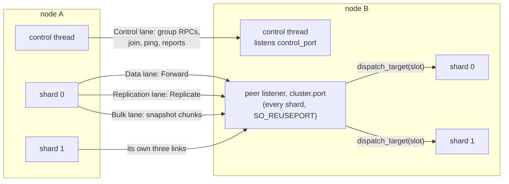
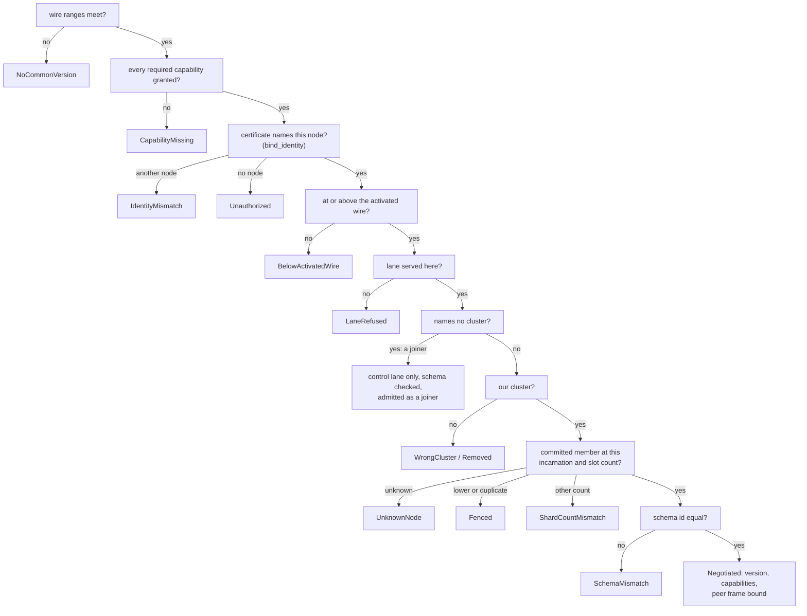

# C2. The inter-node transport

## Context

A node forwards a query's shares to the nodes that hold them, replicates a tablet group's log to
the nodes in its set, carries the control group's RPCs, and streams snapshots - each without
letting a slow peer stall the others, and each carrying bytes that are validated where they
arrive. The transport is the same framing the client uses ([Wire protocol](../architecture/wire-protocol.md))
with a peer hello in front of it. Built by [F38](../features/inter-node-transport.md), extended
by [F40](../features/replication.md) (the replication lane), [F41](../features/read-consistency.md)
(read plans and tokens on a forward), [F42](../features/primary-failover.md) (what a link never
wrote), [F43](../features/node-recovery.md) (the snapshot stream), [F48](../features/rolling-compatibility.md)
(the wire range) and [F50](../features/cluster-operations.md) (the certificate binding).

## How it works

### Four lanes on two ports

| Lane | Port | Owned by | Carries | Byte bound |
| --- | --- | --- | --- | --- |
| `Data` (1) | `cluster.port` | every shard, `SO_REUSEPORT` | `Forward` / `Forwarded`: a bundle's shares as the client's bytes, answers and shares back | `transport.data_queue_bytes` per peer |
| `Control` (2) | `cluster.control_port` | the control thread | the control group's `append_entries`, `vote` and `full_snapshot` as JSON; `Join`, `Ping`/`Pong`, `StatusReport`, `Propose` | `transport.control_queue_bytes` |
| `Bulk` (3) | `cluster.port` | every shard | `SnapshotBegin`, `SnapshotChunk`, `SnapshotEnd`: a snapshot's bytes, routed to the target slot | `transport.bulk_queue_bytes` |
| `Replication` (4) | `cluster.port` | every shard, one link per peer node per shard | `Replicate` / `ReplicateResponse`: the tablet groups' `AppendEntries`, `Vote`, `Propose`, `Snapshot` (`Begin`/`End`), `ReadBarrier`, `Digest`, `Quarantine`, `Applied`, `Retired`, `TransferLeader` as postcard under a 24 byte head | `transport.replication_queue_bytes` |

Every lane is its own socket, so bulk bytes already written cannot delay a vote behind them.
The control lane is dialled to the peer's control address and owned by the control thread, so
a stalled data shard cannot stop an election or a ping (`control_elections_do_not_depend_on_data_shard_relay`).
The other three are dialled to the peer's data address; the kernel hands an accepted connection
to one of the shards listening on the port, and an inbound frame naming a slot is handed to the
executor hosting it by `peer::listener::dispatch_target` - the one place a slot becomes an
executor. With S shards and N nodes a node holds up to `3 × S × (N−1)` outbound data-port links
and `N−1` control links; the fixture's `cluster.dial` map lets a test put a proxy on each
direction of each lane.

### The hello

Every connection opens with a 68 byte pre-schema `PeerHello` (`shoal-proto/src/shared/protocol/peer/hello.rs`):
`cluster`, `node`, `incarnation`, `lane`, `wire_min..=wire_max`, a `capabilities` bit set,
`schema_id`, `shards` (the slot count) and `max_frame_bytes`, written at `MIN_PEER_VERSION` so
every build reads it. Both ends judge it in one order (`handshake::judge`,
`shoal-core/src/server/peer/handshake.rs`), and the first refusal names itself:

A shard judges membership against the map it holds (`Admission` over `MapCell`); the control
thread against its applied state. A joiner - a hello naming no cluster - is admitted on the
control lane alone and nowhere else ([C3](membership.md#joining)). The identity check reads the
`shoal-node://<id>` URI SAN off the leaf the authority verified ([below](#encryption-and-identity)).
What survives the judge is `Negotiated { version, capabilities, max_frame_bytes }`, kept per
link and per accepted connection.

### Links

A link (`peer/link.rs`) is one task owned by the shard or control thread that dials it, in one
of `Idle`, `Connecting`, `Up` or `Backoff`. `Link::enqueue` sheds synchronously at the lane's
byte bound, before anything is recorded: a forward past it is answered `Shedding`, an append
past it is refused and retried by openraft. A lost link backs off from `reconnect_min` to
`reconnect_max` with jitter, but a link a frame *wants* redials at the floor, so a refusal
takes `reconnect_min` and not the backoff. When a link goes down it reports the frames it never
wrote (`LinkEvent::Down { unsent }`), and that list is the line between a definite and an
unknown outcome: a forward never written is sent once more to another holder that is up, under
the same attempt and slot; a proposal or barrier never written is `RpcFailure::NotSent`,
answered `NotLeader` at once; anything written and unanswered is `Unavailable` or
`OutcomeUnknown`, and only the client retries it under its identity ([C5](replication.md#what-the-client-is-promised)).
An accepted connection holds at most `transport.inflight_bytes` of forwarded bytes unanswered.

### A bundle is forwarded as bytes

The coordinator - the shard whose client sent the bundle - routes each query's keys on the
map's ring and builds one `Forward` frame per remote node: the client's own serialized bytes,
and per entry an offset into them, the query index, the target slot, the gather slot and a read
plan (`FLAG_READ`: the resolved level, the slot it fills, its tokens) under the bundle's
attempt and the milliseconds of budget remaining. The receiving shard re-validates the bytes as
if a client had sent them - lengths, offsets, indices, keys, alignment, the rkyv payload - before
any archive is touched; `ServerMsg::Partition` and every other process-local object has no wire
form. The serving node counts the deadline down from arrival. An answer comes back on the
same connection as `Forwarded`: a whole response sealed, or a share with the attempt and slot
it fills, which the coordinator's gather merges ([C6](reads.md#fan-out-across-nodes)); a query
for a tablet the node no longer serves is answered `StaleTopology` on the forward's own frame,
and the origin sends it once more to another holder. A trace crosses the hop from each query's
own span (`trace_context_crosses_nodes_without_false_batch_parent`).

### Replication frames

A tablet group's RPCs ride the replication lane as postcard under a 24 byte head naming the
correlation id, the group, the target slot, the kind and the deadline. `AppendEntries` and
`Vote` are openraft's; a follower answers an append after its own `fdatasync`. `Propose` is the
one hop a write takes from a replica to its leader and `ReadBarrier` the one hop a strong read
takes for a read index; `Snapshot` is the `Begin`/`End` control pair of a snapshot whose bytes
ride the bulk lane in `snapshot_chunk_bytes` chunks, so a stalled transfer holds the bulk
queue and never the replication lane's ([C7](failover.md#snapshots-and-atomic-installation));
`Digest` and `Quarantine` are a scrub's report and a driver's verdict ([C9](operations.md#repair));
`Applied`, `Retired` and `TransferLeader` are a move's probes and its leadership hand-off
([C8](rebalancing.md#a-move)). Each link has its own correlation table and its own bound, so a
follower that stops reading holds nothing but its queue.

### Backpressure

Every queue is bounded in bytes, and admission sheds before a command is accepted; once
accepted, a timeout or a lost peer is an unknown outcome unless something definite came back.
Bulk work has its own lane and queue, so a snapshot cannot starve the appends and votes beside
it, and a slow follower blocks neither the other follower nor the shard's other groups. Nothing
holds a consensus or storage resource while waiting on a queue whose consumer needs it. The
local kanal mesh between a node's own shards is still unbounded ([item 15](../appendix/known-issues.md#15-no-backpressure-anywhere)).

### Compatibility and the wire version

Schema identity, wire version and capabilities are three separately compared fields.
`SCHEMA_ID` is the structural fingerprint without `PROTOCOL_VERSION` folded in and must match
exactly: a schema change is not a rolling operation ([C9](operations.md#rolling-upgrade)). The
wire is a range, `MIN_PEER_VERSION..=PROTOCOL_VERSION` (4 to 5), narrowed by
`transport.wire_version` to hold a node below the build's newest through a rolling upgrade;
`PeerHello::negotiate` picks the highest both ranges hold. Every frame header names the version
its body is encoded at, a receiver refuses a frame above what was negotiated, and the one body
with two codecs is the snapshot manifest. Every capability the build defines is required
(`CAP_FORWARD_V1`, `CAP_CONTROL_RAFT_V1`, `CAP_BULK_SNAPSHOT_V1`, `CAP_MEMBERSHIP_V1`,
`CAP_REPLICATION_V1`, `CAP_READ_CONSISTENCY_V1`); an optional one would be gated by
`Negotiated::has`. The cluster's activated wire (`Activate { wire }`) is the committed boundary
past which no member rolls back: a hello below it is `BelowActivatedWire`, and a node whose
build is below it stops at start. Between a client and a node the version is exact at
`CLIENT_WIRE_VERSION` and the hello's capability byte gates the read options section and the
session token.

### Encryption and identity

With `cluster.tls` set every lane is mutual TLS 1.3 handed to the kernel, as `networking.tls`
does for clients ([F14](../features/encryption-in-transit.md)): the listener requires a chain to
`ca`, the dialler presents its own leaf, and both ends read the `shoal-node://<id>` URI SAN off
the peer's leaf and judge it against the hello - `IdentityMismatch` for another node,
`Unauthorized` for none - unless `cluster.tls.bind_identity` is off, which trusts the chain
alone for a deployment sharing one leaf. The material is read once into a `PeerTlsHolder` that
every listener and link consult at each handshake, and `ReloadTls` rebuilds both configs and
swaps the pair or neither; `ca` may be a bundle through an authority rotation
([C9](operations.md#certificates)). kTLS needs the kernel's `tls` module loaded; the server
refuses to start rather than fall back. Without `cluster.tls` the lanes are plaintext and peer
identity is trusted inside whatever boundary the deployment draws around them.

## Design choices

Four lanes on separate sockets rather than priorities on one stream, because bytes already
written to a socket cannot be preempted. The control lane on its own port and thread, so
partial failure of a shard is visible rather than masked. Forwarding the client's bytes rather
than re-serializing, because the coordinator would otherwise decode what it never needs. A link
that reports what it never wrote, because that is the only evidence that turns a lost peer into
a definite refusal. A version range and a capability set in the hello from M2, so M10a could
negotiate without changing the hello's shape.

## Alternatives rejected

Sending process-local objects; trusting remote validation; unbounded peer buffers; accepting an
older version in the hello without a codec for it (M2 matched exactly until the codec existed);
an RPC library in place of the framing the client already uses; control traffic routed through a
data shard.

## What it costs

A cross-node request adds socket work and a second validation; a remote merge adds decoding.
Independent lanes cost sockets and buffers - up to `3 × S × (N−1)` data-port links a node - and
prevent bulk work monopolizing progress traffic. Topology, trace and policy metadata are
measured at their encoded size on the hop arms.

## Limitations

~~`ShoalPool::transport()` reports shard zero's links and calls them the node's~~ - every
shard answers for its own since [Resolved #95](../appendix/resolved/transport-view-every-shard.md).
`local_shard` in the hop arms is a mixture until [D7](../direction/shard-aware-routing.md).
The reconnect floor is a node's setting, not the policy's, so a deployment whose floor is
longer than its clients' patience waits it out. Peer identity under plaintext lanes is the
deployment's boundary. See [C15](open-issues.md).

## Invariants to uphold

- A data connection is owned by one shard; control sockets by the control thread.
- A process boundary re-establishes checked decoding and alignment.
- One slow peer cannot exhaust memory or block independent quorum progress.
- An accepted write's identity and deadline survive every hop and reconnect.
- A compatible handshake implies working selected-version payloads, not accepted metadata.
- A frame the link never wrote is the only thing rerouted or refused as definite.

## How it is measured

The three hop arms `macro/cluster/hop/{same_shard,local_shard,remote_node}` price the hop
([C10](performance.md#the-arms)); the read arms carry the data lane's frame and shed counters;
the catch-up arms the bulk lane's bytes.

## Acceptance tests

| Test | Asserts | Milestone |
| --- | --- | --- |
| `remote_query_returns_one_result_per_index` | Cross-node split and unsplit requests preserve coverage, ordering and response identity | M2 |
| `peer_rejects_wrong_cluster_identity_and_malformed_payload` | Invalid identity, lengths, offsets, archives and alignment cannot reach unchecked access; a leaf naming another node or none is refused by name | M2 |
| `slow_peer_has_bounded_bytes_and_independent_lanes` | A snapshot or peer stall cannot exhaust memory or stop unrelated progress messages | M2 |
| `control_elections_do_not_depend_on_data_shard_relay` | A stalled data receiver leaves direct control networking functional | M3 |
| `trace_context_crosses_nodes_without_false_batch_parent` | Remote work retains the originating context or correct batch links | M2 |
| `deadline_and_operation_id_survive_forwarding` | A redirect or reconnect cannot reset a budget or replay an accepted write under a new identity | M6 |
| `mixed_versions_exchange_real_cluster_operations` | n and n−1 codecs carry queries, replication, snapshots and elections until an explicit activation | M10a |

## Related

[C3](membership.md), [C5](replication.md), [C7](failover.md), [C13](protocol.md),
[Wire protocol](../architecture/wire-protocol.md), [F14](../features/encryption-in-transit.md),
[F35](../features/wire-trace-context.md).
