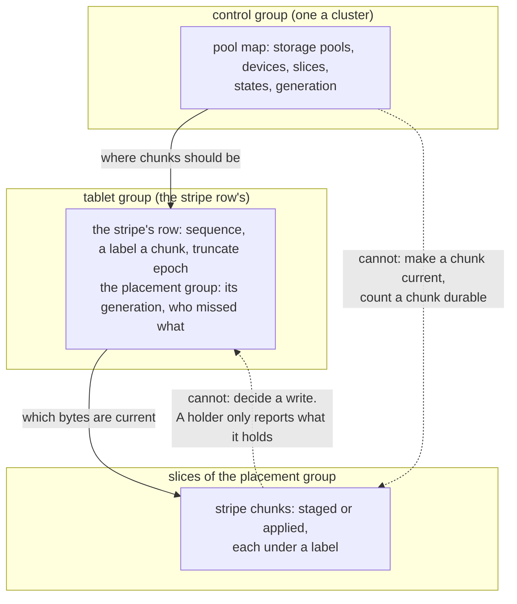

# S18. The contract and the questions

## Context

Objects are mutable in place, by the decision of 2026-10-02. That makes the write protocol the
part of this design that cannot be improvised: a write that reaches some holders of a stripe
and not others has to be finished or abandoned, by a rule every node applies alike, and under
erasure coding a half-applied write is not stale data but wrong data, since a decode over
stripe chunks from two writes returns bytes nobody wrote. Ceph solved it with a primary for each
placement group, a log on every holder and a peering protocol that reconciles the logs after a
failure ([S17](prior-art.md#ceph)). The Distributed chapter refused a protocol of that kind
once already, in favour of an embedded Raft it could hold to a contract
([C13](../distributed/protocol.md#alternatives-rejected)).

This page is the same move made for objects. It drafts the contract as numbered properties,
each beside the schedule that violates it; it states the failure model; it lists the
questions with the gate each blocks and the evidence that settles it; and it opens the
decision record. ~~**Nothing here is agreed.** P7–P19 are a draft for the gate before
[M11](milestones.md#before-m11-the-object-contract), and the preferred direction they are
written against is a hypothesis.~~ **P7–P19 are agreed**, at the gate before
[M11](milestones.md#before-m11-the-object-contract) on 2026-10-09, each beside the schedules that
violate it and the tests that own it ([the record](#before-m11-the-contract-agreed-and-q27s-path-modelled-2026-10-09)). The direction they are written against
was checked for safety by [X1](stripe-model.md) on 2026-10-06, and again for the small write that
rides in its commit, which [X8](small-writes.md) added after it, before the gate agreed them.

## What exists today

A tablet group is an `openraft` group replicating one table's rows over one replica set, with
a contract of its own, P1–P6 ([C13](../distributed/protocol.md#the-contract)). What it offers a
design built on top of it:

- **an order**: a write is a `Command` applied once on every replica in committed order, with
  its result derived there (`shoal-core/src/server/shard/groups.rs`, `apply`;
  [C5](../distributed/replication.md));
- **fencing**: a leader whose lease lapsed refuses to append (`Lease::of`,
  [C7](../distributed/failover.md#the-lease)), and a deposed one cannot commit;
- **a retry identity**: a retried write is answered what its first try was answered, from a
  table each group keeps and persists beside its checkpoint
  ([C5](../distributed/replication.md#retry-identity));
- **two read levels**: `One`, an eligible replica's committed and applied prefix, possibly
  stale, and `Quorum`, a read barrier from the leader ([C6](../distributed/reads.md));
- **a driver pattern**: a group's leader drives a recorded operation phase by phase, each
  phase committed before the step it names, so the next leader resumes it
  ([F44](../features/repair.md), [F45](../features/replica-migration.md)).

What it does not offer: ~~a write that is conditional on what it finds
([S1](prerequisites.md#required))~~ (offered since [F68](../features/conditional-writes.md): an insert, a delete or an
update applied only if the row is absent or matches a filter, judged at apply in committed
order and refused with a typed reason); anything across two tablets
([P6](../distributed/protocol.md#the-contract)); any byte that is not in its log.

## The design

### Decisions taken and directions preferred

| Decision | Status |
| --- | --- |
| Objects are mutable in place | Taken 2026-10-02 ([overview](overview.md#decisions-taken-on-2026-10-02)) |
| Metadata is in unsorted tables replicated by the tablet groups, never erasure coded | Taken: R10 and R11 |
| The bytes of an object are not rows | Preferred, with two named exceptions: an inline object, and whatever [Q27](#questions-to-answer) decides for small writes. Candidate A of [S7](write-path.md#the-candidates) is the alternative and the baseline. [X3](bytes-through-groups.md) measured A on 2026-10-07 and the preference stands: A writes a byte about twice, reaches a fifth to a quarter of a replicated pool's device, and slows every table on its nodes ([the record](#q14-in-part-the-cost-of-stripes-as-rows-2026-10-07)) |
| A stripe's writes are ordered by the tablet group that owns its row | Preferred ([Q14](#questions-to-answer)). No second consensus protocol is introduced for objects |
| A write is staged, then committed, then applied: redo, never undo | Preferred ([S7](write-path.md)) |
| A placement group is a sub-range of one tablet | Preferred ([Q19](#questions-to-answer)), because it gives every placement group a log it already has. [X2](placement-simulation.md) simulated placement under it and leaned on it: the tablet group that is the log is also where a placement group's positions are kept |
| A primary for each placement group, with a peering protocol | Rejected for now ([Alternatives rejected](#alternatives-rejected)) |
| A timer that authorizes a holder to discard bytes | Rejected ([P16](#the-contract)) |
| An external metadata or coordination service | Excluded ([R7](../distributed/overview.md#what-is-asked-of-it)) |

### The contract

`P` numbers continue [C13's](../distributed/protocol.md#the-contract) and are never reused.
P1–P6 bind this part unchanged: the metadata rows are tablet rows. P7–P19 are what objects
add. Each is written as a property that can be checked against a history, beside the schedule
that violates it, because [S16](testing.md#the-model)'s model checks properties.

| # | Property | Binds | The violation the model must reject | Owning tests |
| --- | --- | --- | --- | --- |
| P7 | **Failure model, extended.** Everything P1 assumes, and also: a pool device may fail alone, and every slice on it with it, by reporting errors, by filling, or by being replaced with an empty one, while its node stays up; a write to a device may tear; a device may return bytes it was never given, with no error. Stable storage is a successful `fdatasync` of the bytes and of whatever names them. No property depends on a clock | every page | A check that needs synchronized clocks; a torn apply served as a stripe chunk; an empty replacement disk taken for the device it replaced | `object_model_preserves_acknowledged_bytes` (M11) |
| P8 | **One authority.** Only the conditional commit of a stripe's row makes bytes current. It is conditional on ~~the row's sequence, the object's truncate epoch and the pool map generation the write was staged under~~ the row's sequence and the placement group's generation the write was staged under, and no commit lands on a row stamped or fenced past the truncate epoch its writer read. The epoch is the entry's, in another tablet; what the row holds of it moves only with the sequence ([X1](stripe-model.md#the-generation-and-positions-q19)). A stager that lost the race, lost its lease or holds an old map cannot commit | [S5](placement.md), [S7](write-path.md) | Two stagers on one base both applied; a parity built from an old row committed over a newer one; chunks committed on slices a newer map no longer names | `stale_stager_cannot_commit` (M15), `commit_names_the_generation_it_was_staged_under` (M16) |
| P9 | **Stripe-atomic writes.** A stripe's content is a total order of committed writes. A write takes effect whole at its commit or not at all, and uncommitted bytes never replace committed ones on any holder | [S6](device-store.md), [S7](write-path.md) | A holder applying before the commit, and the write then abandoned; a write applied to some chunks and served | `uncommitted_bytes_never_replace_committed` (M15), `stripe_write_is_atomic_at_every_crash_point` (M15) |
| P10 | **No mixed labels.** Every byte returned to a reader or fed to a decoder comes from stripe chunks whose labels match one committed state of the row. ~~A chunk with another label, newer or older, is treated as missing.~~ A chunk with another label, newer or older, is treated as missing, but for a chunk at a base the row's pending bytes fold from, which with them laid over is that state's chunk and is taken no other way ([the small write](stripe-model.md#a-small-write-in-its-commit)). A row older than the chunks it names is refused by name | [S7](write-path.md), [S8](erasure-coding.md), [S9](read-path.md) | A decode over chunks from two writes; a reader accepting a chunk newer than the row it consulted; a restored row served against chunks overwritten since; a chunk at the base of pending bytes taken without them | `one_reads_never_mix_and_move_forward` (M15), `decode_never_mixes_labels` (M18), `read_overlays_pending_bytes` (M15) |
| P11 | **Durable at acknowledgement.** A write is acknowledged only when its new content is `fdatasync`ed on slices in distinct failure domains such that `k + f` stripe chunks are current after it, `f` being the pool's setting and at least one, and its commit is on a durable majority of the row's group ([P3](../distributed/protocol.md#the-contract)). A write that cannot reach that is refused, or acknowledged under a named weaker setting, never silently. A failure domain is a device or a host, never a slice, and a loss is a whole device with every slice on it, or a whole host: so `k + f` current chunks on distinct devices (or hosts) survive any `f` losses. A chunk is counted current on its holder's word in the write's round, a synced stage's answer or a confirmation that it holds the label the row names, and never on the row's word alone: losses after that word are what `f` is for ([X1](stripe-model.md#q16-both-ways)). A write whose bytes ride in its commit ([Q27](#q27-and-q14-in-part-one-small-write-three-ways-2026-10-08)) touches no chunk: it counts the `k + f` chunks its bytes are laid over on their holders' word in its round, its bytes are durable where its commit is, which a pool takes only where the row's group survives `f` losses, and they leave the row only by a commit that finds `k + f` chunks holding them at their evidence and marks every other position missed, or with a staged write that carried them ([the small write](stripe-model.md#a-small-write-in-its-commit)) | [S5](placement.md), [S7](write-path.md), [S8](erasure-coding.md) | A 4+2 write touching one data chunk acknowledged after one stage, and that device lost; a staged chunk counted before its `fdatasync`; two chunks counted on one host, or on two slices of one device; a small write's bytes cleared from the row on one holder's word | `ack_requires_k_plus_f_current` (M15), `erasure_coded_ack_requires_k_plus_f_current` (M18), `pending_bytes_leave_the_row_only_on_k_plus_f_holders` (M15) |
| P12 | **Read levels.** A default read returns, for each stripe, a committed state at or after the row it consulted: possibly stale, never mixed. The size and floors it applies are the entry's at a point consistent with that state ([X1](stripe-model.md#what-the-search-found-and-the-repairs)). A strong read returns, for each stripe, a state at least as new as every write acknowledged before it began | [S9](read-path.md) | A stale read reported as corruption; a strong read answered from a lagging replica's row | `strong_read_observes_prior_acknowledged_write` (M15) |
| P13 | **Size and truncate.** Bytes cut off by a truncate never return, whatever later extends the object. A write ~~acknowledged~~ invoked after a truncate completed is never hidden by it. A write concurrent with a truncate may be cut by it, and is then ordered before it, whenever it is acknowledged ([X1](stripe-model.md#truncate-q18)) | [S3](objects.md), [S7](write-path.md) | A writer that read the size before a truncate commits a stripe past the cut, and a later extension exposes it | `truncated_bytes_never_return` (M15) |
| P14 | **Path identity.** An object is found by its whole path. Two paths whose partition keys collide are never served as one another, and a write to one never replaces the other | [S3](objects.md#path-identity) | A get of one path answered with the object at a colliding one | `colliding_paths_are_told_apart` (M13) |
| P15 | **Integrity.** No read returns bytes that fail their checksum. A checksum binds bytes to their place: object, stripe, chunk, chunk unit. No checksum is computed over old bytes that were not verified first, and a corrupt chunk is never a source for a rebuild. A scrub tells a stale chunk from a corrupt one | [S6](device-store.md), [S8](erasure-coding.md), [S11](scrub.md) | A sub-unit overwrite merged into a corrupt chunk unit and checksummed afresh; a parity staged as a patch and replayed twice; a misdirected write that verifies where it landed | `scrub_never_launders` (M17), `corrupt_chunk_is_never_a_source` (M17) |
| P16 | **Reclamation.** A holder discards staged or current bytes only on a committed fact that can never be undone and that proves nothing refers to them. A committed write not yet applied is referred to by every later change staged over it ([X1](stripe-model.md#what-the-search-found-and-the-repairs)). A row's pending bytes refer to the chunk they fold from, and to every record a holder keeps toward it, until a commit takes them out of the row ([the small write](stripe-model.md#a-small-write-in-its-commit)). Unreferenced bytes are eventually reclaimed. A timer may ask the question; it never answers it | [S10](recovery.md#reclamation) | A stager timing out and telling holders to drop while its commit is in flight; a holder discarding because a lagging replica shows no row | `staged_bytes_outlive_a_stagers_timeout` (M15), `discard_requires_a_committed_fact` (M20) |
| P17 | **The pool map says where, never what is current.** A commit of the control group (a device or slice added, moved or removed) cannot make a stale or empty chunk current; currency is the row's label and nothing else. A failing pool device stops no tablet group. This is [P5](../distributed/protocol.md#the-contract)'s twin | [S4](pools-and-devices.md), [S5](placement.md), [S10](recovery.md), [S13](isolation.md) | A new slice counted as holding chunks because the map names it; a tablet group stalled by a pool device's error | `map_change_cannot_make_a_chunk_current` (M16), `tables_survive_pool_device_loss` (M14) |
| P18 | **Bounded metadata.** An object's `ObjectMeta` row is bounded whatever its size. Stripe rows are linear in the stripes written in place, at a published constant. A stripe row's pending bytes are bounded by its pool's small-write threshold: a write that would take them past it is staged ([the small write](stripe-model.md#a-small-write-in-its-commit)). Nothing for an object, a stripe or a stripe chunk is in a group's unbounded state or on a pushed map | [S3](objects.md), [S5](placement.md) | A structure rewritten whole as an object grows; a record for each stripe on the pool map | `metadata_cost_is_linear_and_published` (M15) |
| P19 | **What is not promised.** No atomicity across the stripes of an object or across objects, no read of several stripes at one instant, no listing, no atomic move between pools, no consistent backup of bytes. A write spanning stripes completes stripe by stripe; a crash leaves some done, and its retry under the same identity finishes it. An atomic replace of a whole object is the one exception, and it is promised. This is [P6](../distributed/protocol.md#the-contract)'s twin | [S7](write-path.md), [S9](read-path.md), [S14](operations.md) | An oracle, an API or a test that treats a multi-stripe write as atomic | The oracle's scope in `object_model_preserves_acknowledged_bytes` (M11); `whole_object_replace_is_atomic` (M15) |

P8 and P17 as a picture. The pool map says where a chunk should be; the row says which bytes
are current; a slice holds what it was given and decides nothing.

### Failure model and availability

The failure model is [C13's](../distributed/protocol.md#failure-model-and-availability),
extended by P7. Checksums detect accidental corruption; nothing here tolerates a Byzantine
node. Hardware that lies about a flush is outside the durability assumption, as it is there.

| Condition | Required behavior |
| --- | --- |
| One holder of a stripe is down, and the pool's `f` allows it | Reads are served, decoding where the missing chunk is needed. Writes are acknowledged while `k + f` stripe chunks can be current, and each one records that the holder missed it |
| More holders are down than the pool's setting allows | Writes to the stripes they hold are refused by name. Reads are served while k current chunks remain |
| Fewer than k current chunks of a stripe can be read | Reads of that stripe fail by name. Other stripes and other objects are unaffected. Nothing is fabricated, and nothing is chosen by a rule nobody asked to apply |
| The row's tablet group has no majority | No write to its stripes commits, and no strong read succeeds. A default read is served from a replica's committed state where the chunks are reachable |
| The control group has no quorum | Pool map changes stop: no device or slice is added, moved or removed. Reads and writes under the committed map go on |
| A device is replaced by an empty one | It is a new device, with new slices. The chunks its old slices held are rebuilt; the empty directory is never read as the old one |
| A device is full | A write that would stage on it is refused before its commit. Nothing fails after a commit for want of space |
| The whole cluster is restarted | Committed state is recovered. Every staged and undecided write is decided by its row |
| Rows are restored to a state older than the chunks | The bucket refuses by name ([Q31](#questions-to-answer)). No read mixes a restored row with a chunk overwritten since |

A degraded read's latency, a rebuild's duration and a scrub's cycle are measurements under a
stated load, never unconditional bounds.

### Identity and progress

A stripe is `(consumer id, object id, stripe index)`, the consumer id being its bucket's
([S4](pools-and-devices.md#pools-and-bindings-are-policy)). The object id is minted when the
object is created and never reused, so a stripe of a replaced or deleted object can never be
mistaken for a stripe of its successor at the same path.

A write to a stripe passes through three positions, on each holder separately:

| Position | Meaning |
| --- | --- |
| Staged | The write's bytes for this chunk are `fdatasync`ed on the holder, apart from the chunk, under the write's label. Nothing reads them as the stripe's content |
| Committed | The row names the write's label for this chunk. From here the bytes are the stripe's content, and a read is served them, overlaid from the staged copy if need be |
| Applied | The holder has folded the staged bytes into the chunk, made that durable, and dropped the staged copy |

A **label** is the row's sequence and a tag derived from the write's request identity. A
sequence number alone cannot label a stripe chunk: two writers that stage against the same
row both produce "the next sequence" with different bytes, and a holder told only that the
next sequence committed would apply whichever it had staged. The row keeps a label for each
chunk, because a write that touches some chunks of a stripe leaves the others as they were
([S8](erasure-coding.md#a-partial-overwrite)).

### Visibility and durability

An acknowledged write is in two places: its commit is on a durable majority of the row's
group, and its bytes are staged or applied on enough holders that `k + f` stripe chunks are
current. Neither half is enough alone. Bytes on every holder with no commit are an abandoned
write; a commit with too few holders is a promise the pool cannot keep through `f` losses.

A default read sees a committed state of each stripe it touches and may see different
stripes at different moments. A strong read takes a read barrier on each row first. Neither
ever returns bytes of a write that did not commit.

### Decision record

Each entry is recorded on the tree it was written against, in the manner of
[C13's](../distributed/protocol.md#decision-record): what was decided, on what evidence, and
what was not.

#### Before M11: the decisions of 2026-10-02

Recorded 2026-10-02, on the tree at `ba7edf1`. Crate facts were read from the sources
downloaded from `static.crates.io` at the versions given, at the path and line named; Ceph
facts from its repository at the tag `v20.2.0` (commit `69f84cc`). Neither `docs.rs` nor a
README was the source.

| Decision | Evidence |
| --- | --- |
| Objects are mutable in place; listing waits; the metadata tables are hidden; pools are bound in the deployment; both write shapes are in scope | Taken with the user while this part was planned ([overview](overview.md#decisions-taken-on-2026-10-02)) |
| P7–P19 are a **draft** | Written against the preferred direction of [S7](write-path.md). No clause has been checked against a model, because none exists ([X1](spikes.md#x1-the-stripe-protocol-as-a-model)). ~~None exists~~: since 2026-10-06 P7–P13 and P15–P17 are checked by X1's model, which changed P8, P11, P12 and P13 ([the record](#q16-and-q18-and-q14-q15-q19-in-part-the-stripe-protocol-modelled-2026-10-06)). ~~A draft~~: agreed on 2026-10-09, with P10, P11, P16 and P18 changed for the small write in its commit ([the record](#before-m11-the-contract-agreed-and-q27s-path-modelled-2026-10-09)) |
| Q14 is **not** settled | An independent review of the first statement of the preferred direction found five faults in it, each now a schedule in [S7](write-path.md#the-schedules-that-shaped-it): a sequence number used as a label, an unconditional commit, a returning device with nobody to ask, truncate across two tablets, and placement recorded nowhere a commit could check. A direction that needed five repairs before it was written down has not earned the word "decided" |
| Candidate, random linear network coding: `rlnc` `0.8.7` (2025-10-15), BSD-3-Clause, MSRV 1.89 | GF(2^8). `Encoder::new(data: Vec<u8>, piece_count)` owns the data and pads it with a `0x81` marker and zeros (`src/full/encoder.rs:85`, `src/full/consts.rs:5`). `code_with_buf` writes a coded piece into a caller's buffer and `code` returns a `Vec` (`:241`, `:264`). Coefficients come from the caller's RNG; `code_with_coding_vector` is `pub(crate)`, and nothing in `src` or the README says "systematic". `Decoder::decode` takes one piece at a time and `get_decoded_data` returns the whole (`src/full/decoder.rs:96`, `:136`). `mod common` is private, so the GF(2^8) kernels are not exported (`src/lib.rs:127`). SIMD is chosen at run time with `is_x86_feature_detected!`: GFNI with AVX512, AVX512BW, AVX2, SSSE3 (`src/common/simd/x86/mod.rs:7-85`). Depends on `rand =0.9.2`, and on `rayon` behind `parallel` |
| Candidate, Reed-Solomon: `reed-solomon-simd` `3.1.0` (2025-10-14), MIT AND BSD-3-Clause, MSRV 1.82 | Leopard-RS. `ReedSolomonEncoder::new(original_count, recovery_count, shard_bytes)`, `add_original_shard`, and `encode` returning the recovery shards, so the originals are stored as they are (`src/reed_solomon.rs:22-43`). A shard's size "must non-zero and multiple of 2" (`src/lib.rs:188`). Engines for AVX2, SSSE3 and NEON are chosen at run time with `cpufeatures` (`src/engine/engine_default.rs:31-44`). No update call |
| Candidate, Reed-Solomon: `reed-solomon-erasure` `6.0.0` (2022-09-23), MIT | `ReedSolomon::new(data_shards, parity_shards)`, `encode`, `verify`, `reconstruct`. `encode_single` builds parity one data shard at a time, but "in strict sequential order (0..data shard count), otherwise the parity shards will be incorrect" (`src/core.rs:534-545`), so it is incremental and not a delta. `simd-accel` compiles `simd_c/reedsolomon.c`. Its last release is four years old |
| Candidate, Reed-Solomon: `isa-l` `0.2.0` (2020-06-25), BSD-3-Clause | Bindings through `libisal-sys 0.1`: `ec_init_tables`, `ec_encode_data`, `gf_gen_rs_matrix`, `gf_gen_cauchy1_matrix`, `gf_invert_matrix` (`src/lib.rs:22-302`). **It binds no `ec_encode_data_update`**, which the plan for this part had assumed it did. Its last release is six years old |
| Candidate, Reed-Solomon: `rusty_erasure` `0.4.1` (2026-09-10), MIT OR Apache-2.0, MSRV 1.95 | A Rust port of ISA-L's erasure code: `ec_encode_data`, `ec_encode_data_update`, `gf_vect_mad`, and `xor_gen` and `pq_gen` beside them (`src/isal.rs:174-323`, `src/lib.rs:41-54`). Three weeks old on the day it was read, with seven hundred downloads |
| Candidate, fountain: `raptorq` `2.0.1` (2026-03-09), Apache-2.0 | RFC 6330. `source_packets` and `repair_packets` (`src/encoder.rs:349`, `:361`), so it is systematic. A packet's size is a `u16` (`set_max_packet_size(bytes: u16)`, `:55`), so a symbol is at most 64 KiB |
| Candidates, checksum: `crc32c` `0.6.8`, `crc-fast` `1.10.0`, `crc64fast-nvme` `1.2.1`, `xxhash-rust` `0.8.19`, `blake3` `1.8.7`, and gxhash `2.3.1` already in the tree | Versions from the registry on the day. ~~None was read beyond its manifest; [X5](spikes.md#x5-checksums) reads them~~ [X5](checksums.md) read and ran every one, with gxhash `3.5.0` and `crc32fast` `1.5.1` beside them as references; the choice is [below](#q21-in-part-the-checksum-2026-10-03) |
| What the spikes inherit | rustc 1.100.0-nightly (2026-09-04). glommio is the `../glommio` path dependency at 0.10.0, on `873fa44`; since [F70](../features/storage-faults.md) on `f4643f7`, whose two commits add an I/O hook that costs one relaxed atomic load an operation while no fault is armed and that does not cover `copy_file_range_aligned`. No erasure coding crate is in `Cargo.lock`; ~~none is~~ since [X9](table-latency.md) `rusty_erasure` 0.4.1 is, behind shoal-core's `x9` feature, which only X9's harness builds. `.cargo/config.toml` builds for `target-cpu=native`, so a spike binary for the Zen1 hosts is built `znver1` by hand |

**What this gate did not do.** It agreed no clause of the contract, selected no crate, wrote
no type, added no dependency and measured nothing. A version above is a pin for a spike to
start from, not a choice.

#### Q30, in part: the driver's shape (2026-10-03)

Recorded 2026-10-03, on the tree that landed [F69](../features/driver-operation-kinds.md).

| Decision | Evidence |
| --- | --- |
| The one driver is generalized; no second driver is written for objects | [X13](spikes.md#x13-the-benchmarks-shape)'s reading, done while building F69: read and insert are written into five places (`spec.rs`, `window.rs`, `pick.rs`, `feed.rs` and the driver's judge), and each took a third kind as one more case. The kind is `OperationKind<S>`, handed over through `DatasetSupport::operation_kinds`, and bytes are counted at the client where frames are written and read |
| A table workload is unchanged | `table_arm_ids_are_unchanged` and `picks_of_read_insert_workloads_are_unchanged`, frozen on the tree before F69; on the lab, a capture before F69 and one after are joined arm by arm by `compare` with no fact refused ([F69](../features/driver-operation-kinds.md#performance)) |

**Not settled.** ~~The object dataset (a folder of real files, or a seeded description), and how
fast one core makes seeded bytes, which is X13's stub. Neither is needed before buckets exist.~~
Both were settled by X13 on 2026-10-05, [below](#q30-the-object-dataset-and-seeded-bytes-2026-10-05).

#### Q20, in part: the code and the crate (2026-10-03)

Recorded 2026-10-03 by [X4](erasure-coding-crates.md), on the tree that adds
`shoal-spike-erasure`. Measured on titan and hyperion (Zen1, a `znver1` build) and on europa
(Zen4, `znver1`, `x86-64-v4` and native builds), one pinned core, the `performance` governor,
no shoal unit running on any host. Every figure is GiB a second for one core, at 64 KiB units
unless it says otherwise; *cold* is rows taken in turn from an arena larger than any cache,
*hot* is one row over and over. The choice was the user's instruction to record X4's
recommendation.

| Decision | Evidence |
| --- | --- |
| **The code is Reed-Solomon over GF(2^8), systematic, on ISA-L's Cauchy matrix** (`gf_gen_cauchy1_matrix`), **with plain XOR at one parity chunk** | Every set of one to m lost chunks at every layout from 2+1 to 6+3, and at 8+3 and 10+4 (2,186 patterns), decoded byte for byte by all four Reed-Solomon candidates on every host and build. RaptorQ failed 4 of the 1,001 patterns of 10+4 that lose four chunks, and random linear network coding fails about 0.39% of sets of k, 1 in 255, as theory says (100,000 trials a layout), so neither can state [P11](#the-contract) for every k. The Cauchy matrix inverts at every k and m; ISA-L's Vandermonde one has a region where it does not. XOR at one parity chunk is the fastest code measured there on Zen1, 14.5 to 16.9 GiB/s cold at 4+1 to 10+1 against 11.8 to 12.5 |
| **The crate is `rusty_erasure` `=0.4.1`**, pinned exactly as gxhash is, and added at M18 | The fastest candidate at encode, decode, rebuild and update on both microarchitectures: titan 4+2 encode 7.6 cold and 9.9 hot, europa 20 cold and 97 hot, where `isa-l` gives 5.0, 5.4, 20 and 35. It has an update in its public API (`Coder::update`), writes into the caller's buffers, starts no thread, picks GFNI, AVX2 or SSSE3 at run time (GFNI from a `znver1` build on europa), and needs no C toolchain. MIT OR Apache-2.0. **Its parity is byte for byte ISA-L 2.29's** at all five layouts, and its digests were the same on every host and build, so the format a pool writes is ISA-L's matrix and not this crate's release |
| **A write of part of a stripe updates parity by delta** where it touches few data chunks | An update of one data chunk at 4+2 folds 3.25 GiB/s of change into parity on titan cold, where encoding the row again costs the equivalent of 1.9, and it reads 1 + m chunks where reconstruct-write reads k - 1 others; at 10+4, 1.94 against 0.53 |
| **A Zen1 core does not make dedicated executors a requirement of an erasure coded pool** | X4's line was about a gibibyte a second; titan encodes 4+2 at 7.6. Whether object work may share an executor with tables is ~~[X9](spikes.md#x9-table-latency-beside-object-work)'s, and is not settled by this~~ settled by [X9](table-latency.md): not with a step of a 1 MiB unit, whose slice of the encode alone held a shard about 270 µs at its p99, so dedicated executors are required by the latency of a step, not by the code's rate ([below](#q24-and-q15-in-part-table-latency-beside-object-work-2026-10-09)) |
| **Recoding is not a reason to take random linear network coding** | Rebuilding one chunk reads k chunks either way. `rlnc`'s recoder rebuilds at 1.2 on titan where a Reed-Solomon rebuild of the one chunk runs at 3.0 |

**Not settled.** The geometry: stripe size, chunk unit and how data is dealt across the data
chunks. X4 says only that encoding reaches its rate from 16 KiB units on titan and 64 KiB on
europa, and that a call on a 1 MiB unit row of 4+2 takes 0.5 ms on titan, which
[S13](isolation.md)'s yield budget has to fit. Also not settled: ~~[X14](spikes.md#x14-ceph-and-s3-at-the-source)'s reading
of Ceph~~ (X14 read it and took nothing of the geometry from Ceph,
[below](#q32-and-q14-q20-q28-in-part-ceph-and-s3-at-the-source-2026-10-05)), ~~a code inside a node
(X9)~~ (X9 ran it inside a node, on a shard and on a core of its own,
[below](#q24-and-q15-in-part-table-latency-beside-object-work-2026-10-09)), and the crate's age: three weeks on the day it was read,
with about a hundred lines of `unsafe` in its kernels that are read before M18 takes it.

#### Q21, in part: the checksum (2026-10-03)

Recorded 2026-10-03 by [X5](checksums.md), on the tree that adds `shoal-spike-checksum`.
Measured on titan and hyperion (Zen1; `znver1` and `x86-64-v3` builds) and on europa (Zen4;
`znver1`, `x86-64-v3`, `x86-64-v4` and native builds, and native with gxhash 3's `hybrid`). One
pinned core, the `performance` governor, no shoal unit running on any host. Every figure is GiB
a second for one core at 64 KiB units, *cold* (units taken in turn from an arena larger than
any cache) and *hot* (one unit over and over). The choice follows the user's instruction to
complete S1's checksum prerequisite with X5's recommendation.

| Decision | Evidence |
| --- | --- |
| **AVX2 may be required of a node** | The user's ruling on 2026-10-03, given while X5 was planned, so that a candidate needing AVX2, or gxhash's AVX2 path, would count as a build a node could be given. Nothing chosen below leans on it: `crc-fast` picks its kernels at run time. Nothing in the tree enforces it, and nothing needs to until something does lean on it |
| **gxhash is not the checksum of a chunk unit** | Its `Hasher` fed in pieces equalled its one-shot function on 0 of 1,365 inputs and cuttings, in both majors, on every host and build. Two cuttings of the same bytes agree only when each arrived in one piece. Its definition is its crate's code: the two majors disagree, 2.3.1's `avx2` feature cannot be compiled by rustc 1.100, and 3.5.0's `hybrid` builds for `znver1` and dies of SIGILL on a Zen1 cpu. Its output did **not** move across cpus or builds, so the trigger X5 named fired for ways of feeding it alone. Shoal's existing uses of gxhash fix their pieces by their own formats and are unaffected |
| **The checksum is CRC-64/NVME**: polynomial `0xAD93D23594C93659`, reflected, initial value and final xor all ones, check value `0xAE8B14860A799888` | A definition of six parameters in the RevEng catalogue, which two crates met on every host and build, along with every other published value tried. Of the candidates that give the same output however fed, only a CRC combines and resumes. So a chunk's checksum is made from its units' without a second pass, and a unit's checksum is carried to its place without its bytes, which lets a client's checksum be the one a slice stores ([S12](wire-and-client.md#ranged-frames)). It runs at 11.4 cold and 13.1 hot on titan, and 40.5 and 75.0 on europa from the `znver1` build. CRC-32C through the same crate is no faster on either cpu (11.1 and 12.4 on titan) and half as wide |
| **The crate is `crc-fast` `=1.10.0`**, pinned exactly as gxhash is, added at M13 with its default features off | It chooses PCLMULQDQ, AVX-512VL or VPCLMULQDQ at run time and names its choice: VPCLMULQDQ on europa from a `znver1` build. No C, no allocation, no thread. MIT OR Apache-2.0. `crc64fast-nvme`, the other CRC-64/NVME crate, is deprecated for it and has no VPCLMULQDQ kernel on a stable compiler. Because the format is the definition and not the crate, the crate can be replaced without a format change |
| **The combine is Shoal's own**, from zlib's method, with the multiplier for each unit length made once | It costs 78 ns on titan for CRC-64/NVME, and 50 ns on europa. `crc-fast`'s `checksum_combine` gives the same answer in 124 to 236 µs on titan, longer than checksumming the second part. Sixteen units combine into a chunk's checksum in about 1.2 µs, where reading the chunk again costs 85 µs |
| **The checksum sets no floor under the chunk unit** | CRC-64/NVME is within 2% of its rate at 4 KiB cold on titan. The floor is X4's encode, at 16 to 64 KiB. A 1 MiB unit holds a Zen1 core for 85 µs |

**Not settled.** These remain open:

- **The granule**: Q20's geometry.
- ~~**Whether the row keeps each stripe chunk's digest**:
  [X1](spikes.md#x1-the-stripe-protocol-as-a-model) and
  [X10](spikes.md#x10-what-a-stripe-row-costs). X5 says it costs about 1.2 µs a chunk to make
  and eight bytes to keep. X10 says six of them cost a stripe row 64 bytes archived and nothing in
  its index ([Q25, in part](#q25-in-part-the-metadata-rows-2026-10-04)); whether it is kept is X1's.~~
  It is not kept: X1 found nothing a digest catches that a label and a checksum bound to its place
  do not ([the record](#q16-and-q18-and-q14-q15-q19-in-part-the-stripe-protocol-modelled-2026-10-06)).
- **The bytes of a unit's identity, and their place in the checksum**: [S6](device-store.md), at
  M14.
- ~~**What checksumming costs a table beside it**: X9. On Zen1 it is as much CPU as encoding.~~
  Measured by X9: as much of a Zen1 core as the encode, 0.16 to 0.17 ms a MiB of data with the
  parity's, and on a table's shard a 1 MiB unit's checksum held it about 200 µs at its p99
  ([below](#q24-and-q15-in-part-table-latency-beside-object-work-2026-10-09)).
- ~~**S3's full-object checksums**: recalled to include CRC-64/NVME, and read by
  [X14](spikes.md#x14-ceph-and-s3-at-the-source).~~ Read by X14: S3's default checksum is the
  full object's CRC-64/NVME, made for a multipart object from its parts' CRCs, which is this
  checksum and its combine ([below](#q32-and-q14-q20-q28-in-part-ceph-and-s3-at-the-source-2026-10-05)).
- **`crc-fast`'s `unsafe`**: about 361 lines, read before M13 takes it.

#### Q19, in part: placement (2026-10-03)

Recorded 2026-10-03 by [X2](placement-simulation.md), on the tree that adds `shoal-spike
placement`. The simulation is seeded, and three runs on europa agreed byte for byte in every
section they shared. The lookups and
frames were timed on titan and hyperion (Zen1) and europa (Zen4) from one `znver1` build, on one
pinned core, under the `performance` governor, with no shoal unit running on any host. Every
table is one consumer's, the worst case. The choice follows the user's instruction to complete
X2 and record it.

| Decision | Evidence |
| --- | --- |
| **The placement function is weighted rendezvous over a pool's slices, and it picks a set**: each failure domain's best-scoring slice, and the `width` domains whose best slices score lowest. Flat, not drawn down the hierarchy | For a set it moves exactly the least each change could, on every shape and change: add, remove, reweight, a replacement in its seat, a host lost. Drawn down the hierarchy, a device's change moves its host's weight and costs 1.5 to 2.3 times the least, though a lookup is cheaper. The window moves up to 1,168 times, ignores weight and breaks the domain rule on unequal hosts. On the lab's shape rendezvous leaves the fullest device 3.7% over the mean at one placement group a tablet and 0.9% at four, below the tenth that would have made exceptions the rule |
| **A placement group's positions are its tablet group's state**, held beside its generation. They are the order of the domains' scores when the group is first placed, and the commit that switches a generation records the new ones: a member that stays keeps its position, and one that arrives takes a vacated one. ~~A chunk's position is its index in the function's answer~~ | S5's statement, the best slice in each new domain position by position, moved 1.4 to 8.4 times the least on erasure coded pools, and 21% of a lab 2+1 pool's chunks for a reweight that changed no set. Drawing by position, as CRUSH's `indep` mode does, moved 1.1 to 2.6 times and cost the most to look up. A matching no weight enters moved 2 to 3 times when the set's domains changed. And no function of the set alone can keep positions: with three members and two positions, some change has to move a member that stayed ([the argument](placement-simulation.md#why-no-function-of-the-map-keeps-positions)). Held as state, positions move exactly the least everywhere. A stager and a reader already learn the generation from the group |
| **A device has a seat**: the key it and its slices are drawn by, committed in the pool map and taken over by a device the operator names as its replacement. Its identity stays its own | A replacement drawn by a new key moved 1.3 to 2.2 times the least for a set, and up to 14 times for positions; in its predecessor's seat, exactly the least |
| **A device has a placement weight beside its capacity**, fitted by the planner only for a pool whose devices differ in weight, against a sample of many groups. The statistical remainder is **exceptions** on the map | Mixed weights bias rendezvous systematically, and more groups do not cure it: six hosts of 4 TB and 16 TB devices stayed 9.8% over at 40,050 chunks a device, and the exceptions to bring it within 2% grew with the groups, to 31,771. Weights fitted to a sample of eight consumers took a consumer outside the sample from 7,708 exceptions to 141, at 1.03 times the least to keep current through an added device. On alike devices fitting gains nothing, and fitting to one consumer learns its luck |
| **A pool's placement groups a tablet is a power of two, fixed when the pool is made**, chosen so one consumer puts about two thousand chunks on each device: one on the lab, eight at six hosts of twelve for 4+2, sixty-four at fifty hosts for 10+4 | Statistical fill falls as the chunks a device grow: about two thousand left the fullest 4.5% to 7.9% over at 72 and 1,200 devices. One placement group a tablet gives a device 2,048 chunks on lab-2 and 48 at fifty hosts for 10+4, so no one number serves both. The number also bounds how far a tablet can later split under the pool before a split splits placement groups |
| **Failure domains are a device's id and its member's host**, the host from `cluster.failure_domains` as decided with the user on 2026-10-03; a slice is never one | No candidate but the window ever answered with two positions in one domain, over every answer of three runs. A pool as wide as its domains fills at its smallest domain's pace whatever the function: the lab as fitted is 51.9% over under the planner's own table |
| **The pool map is pushed to nobody.** Each node derives it from committed commands, and its shards share it. It keeps generations as change records, moves in flight one a device, seats, placement weights and exceptions, and nothing else for a placement group. **No deltas** | It is 2.7 KB on the lab, against 16,555 bytes for today's tablet frame, which was 13,493 at F39. It is 22 KB at six hosts of twelve and 361 KB at fifty of twenty-four. A thousand subscribers of that last one would take 247 ms a version on titan, but S5 pushes it to no client. A change is a command of a few hundred bytes, and a kept change is 97 bytes. Listing every group a change moves would put 125 MB on the lab's map for a hundred consumers |
| **The score is `-log2(u / 2^64) / w`, with `u` SplitMix64's mix of the two keys and the logarithm from a fixed-point table**, never libm's | libm's `ln` and the table chose differently for 4 of 39 million chunks, all near ties. Any rate above zero is a chunk staged where another node reads. The table is also twice as fast. A flat lookup costs about ten nanoseconds a slice on Zen1, 12 µs at 1,200 slices, so a node caches the answer by generation ([O87](../appendix/optimizations.md#o87-a-placement-answer-is-computed-again-on-every-lookup)) |

**Not settled.** These remain open:

- ~~**How a commit checks a generation, and the positions beside it**: [X1](spikes.md#x1-the-stripe-protocol-as-a-model)'s
  model, whose row now carries positions as well as the generation.~~ Recorded by X1: by equality,
  beside the sequence, and the positions move with the generation
  ([the record](#q16-and-q18-and-q14-q15-q19-in-part-the-stripe-protocol-modelled-2026-10-06)).
- **How positions are written in a tablet group's state** and carried in its snapshot:
  [S10](recovery.md#how-a-slice-learns-what-it-missed), at M14 and M16.
- **Growing a pool's placement groups**, which splits every group and was not simulated.
- **The planner's fitting**: when it runs and how often.
- **Racks**: no deployment has one.
- ~~**Ceph's own code** for `indep`, `upmap` and `crush-compat`: [X14](spikes.md#x14-ceph-and-s3-at-the-source)'s reading.~~
  Read and, for `indep`, run by X14 on X2's shapes: 2.0 to 3.5 times the least for a device's
  change, which makes positions held as state the firmer choice
  ([below](#q32-and-q14-q20-q28-in-part-ceph-and-s3-at-the-source-2026-10-05)).

#### Q22, in part: the device store on SSD (2026-10-04)

Recorded 2026-10-04 by [X6](device-store-ssd.md), on the tree that adds `shoal-spike device`.
Measured on europa (Zen4, an Intel Optane 900P under XFS) and on titan and hyperion (Zen1, a
Samsung 970 EVO on one PCIe lane, under XFS, ext4 and btrfs side by side on one device). Four
rounds a leg, from one `znver1` build, under the `performance` governor, with no shoal unit
running. A difference counts where the rounds' intervals do not overlap. The 970 EVO flushes in
two regimes, 0.9 ms rested and 3 ms after sustained synced writes, so its absolute figures
carry their regime. The choice follows the user's instruction to complete X6 and record it.

| Decision | Evidence |
| --- | --- |
| **A stripe chunk is a file of its own**, and a whole-chunk write goes into a file taken from **a pool the slice keeps written ahead with zeros**: overwritten, synced, renamed over the chunk, with one directory sync for the chunks of one object written together. A removed chunk's file returns to the pool | At six in flight a fresh file a chunk reached 0.51 of a slot in a shared file at 1 MiB on the 970 EVO's XFS (0.47 to 0.61 over the rounds), 0.85 on the Optane and 0.43 on ext4; X6's trigger was 0.5, so its floor is 1 MiB and it did not fire. A fresh file's `fdatasync` commits its allocation: 7.2 ms against 3.2 for the same bytes overwritten. From the pool it reached 0.71 at 1 MiB and 0.57 at 256 KiB on the 970 EVO's XFS, and 0.93 and 0.65 at 1 MiB and 64 KiB on the Optane. Shared files would need an index and a compaction S6 rejected, for at most 30% above 1 MiB |
| **A partial update is journalled and applied in place, as S6 has it**: a journal written ahead with zeros and overwritten as a ring, a header block per record, one `fdatasync` for every record whose write completed, then units and header written in place and the chunk synced | Writing ahead committed 2.3 times an appended journal's records at one stager on the 970 EVO and sixteen times at 64 stagers on the Optane. A journal allocated ahead without zeros ran no faster than an appended one on the 970 EVO, so the zeros are written when it is made. A 4 KiB write in place cost 2.0 ms rested and 6.1 ms loaded on the 970 EVO, and 81 µs on the Optane |
| **No clone.** The apply is never a `FICLONERANGE`, and the fork gains no clone call | Against the journal on XFS, the clone wrote fewer bytes only at 1 MiB (0.52 to 0.55 as many), cost 2.1 to 3.2 times as long on the 970 EVO at one in flight, and its sync three to eight times an overwrite's. After a thousand clones a 64 MiB chunk had about 1,500 extents and a cold unit read took 2.4 to 2.6 times a fresh chunk's. The journal's own writes into a chunk that had been cloned into got slower. Every one of X6's conditions but (a) at 1 MiB failed on every leg that clones |
| **XFS is preferred and ext4 accepted. btrfs is refused for a device**, as tmpfs already is | On btrfs a 4 KiB write in place cost 17 ms and 81 bytes on the device for each byte, writing ahead bought nothing, and every overwrite is a new allocation, so S6's rule that applying needs no new space cannot hold. ext4 needs no clone and runs the journal as XFS does, but commits a rename at 17 KiB to XFS's 2 and lists a wide placement group of a million chunks in 154 s to XFS's 52 |
| **The `fdatasync` strategy**: one sync for a batch of stages; one for each apply; one directory sync for a batch of whole chunks; never a sync with nothing new to make durable | On ext4 and XFS an `fdatasync` of a file with nothing to write still flushed the 970 EVO's cache. glommio's `Directory::sync`, an `fdatasync` on the directory, made a rename durable on all three filesystems: it wrote and flushed what an `fsync` did. A directory sync for six chunks raised the rate by 40% at 64 KiB on the 970 EVO's XFS |
| **One slice for each SSD**, which the inventory wizard offers | Under XFS and ext4 one executor read 64 KiB units at fio's ceiling on both devices, and closed its gap on whole-chunk writes by holding four batches in flight. Only 4 KiB units needed two: a Zen1 core did about 123,000 random reads a second against the 970 EVO's 215,000, and two slices beat one by 43% at the same total depth. On btrfs, refused above, one slice fell short for 4 MiB chunks however many batches it held, with its thread 5% busy: a limit per slice that X6 did not trace |
| **A light scrub walks the placement group's directories and reads each chunk's header.** The label stays in the header, and no index is kept for the scrub | A cold walk reading every header of a million chunks took 37.5 s on the 970 EVO's XFS and 15.8 s on the Optane, at the cost a chunk of a hundred thousand: X6's trigger was 60 s |

**Not settled.** These remain open:

- **The chunk size and the chunk unit**: Q20's geometry and Q25. X6 says a chunk below 1 MiB on a
  device that flushes costs more than twice what a shared file would, and below 256 KiB even from
  the pool. [X10](#q25-in-part-the-metadata-rows-2026-10-04) says the
  metadata sets no higher floor: a stripe row's index at 4 MiB stripes is 0.31 GiB for a node of
  16 TiB.
- **The pool and the journal**, their sizes and how they recover after a crash: M14.
- ~~**Q27's other half**, whether small writes ride the metadata log: [X8](spikes.md#x8-one-small-write-three-ways),
  against the floor above.~~ Recorded by X8 ([below](#q27-and-q14-in-part-one-small-write-three-ways-2026-10-08)): only on a device whose sync
  flushes its cache, below 64 KiB, once a slice shares one flush among its applies.
- ~~**Rotational devices**: Q23, [X7](spikes.md#x7-the-device-store-on-hdd).~~ Recorded by X7
  ([Q23](#q23-what-a-rotational-device-needs-2026-10-06)).
- **Whether a slice keeps chunk files open**: a cold open cost 0.6 to 0.9 ms on the 970 EVO, more
  than a 64 KiB read.

#### Q25, in part: the metadata rows (2026-10-04)

Recorded 2026-10-04 by [X10](stripe-row-costs.md), on the tree that adds `shoal-spike-rows`. Rows
shaped like S3's two were driven through today's persistent unsorted tables on the lab's cluster:
`tmdb_cluster.yaml`'s three nodes at a factor of three (europa, Zen4, an Optane 900P under XFS;
titan and hyperion, Zen1, a 970 EVO under XFS), six shards a node, with WAL commit delays of 3 ms
and 2 ms. Four rounds of three legs, each on a cluster bootstrapped for it, then four rounds of a
supplement. One `znver1` build, under the `performance` governor, with no other shoal unit running.
A difference counts where the rounds' intervals do not overlap. The choice follows the user's
instruction to complete X10 and record it.

| Decision | Evidence |
| --- | --- |
| **Stripe rows are not kept resident; a stripe's commit follows S7's read of its row, sent to the group's leader at `Quorum`** | T1 fired on its second clause. At depth one a cold commit cost 1.00× a warm one, its read hidden in the WAL's commit delay. Under load a group's cold reads queued: thirty-two writers of cold rows committed 0.62× the rows a second of thirty-two writers of resident ones on the 970 EVO, and 0.91× on the Optane, and a writer beside eight writers of cold rows had a p99 1.18× to 1.24× its p99 beside eight writers of resident ones. A read through the leader first leaves its copy resident, and under load the commit after it cost 1.20× (1.09 to 1.25) a warm one, with the neighbour's p99 0.95× its p99 beside warm writers. Keeping the rows resident instead would cost 484 bytes a row as the engine counts it, 4.1 GiB for a node of 16 TiB at 4 MiB stripes |
| **The index sets no floor under the stripe size above X6's 4 MiB at 4+2** | A cold row is 39.4 bytes of memory a replica, its archive map entry, at four million rows. A node of 16 TiB at 4+2 replicating a row for every 4 MiB stripe holds 0.31 GiB of it. T2's line was 1 GiB. At 1 MiB stripes it would be 1.23 GiB |
| **A pool's inline threshold defaults to 16 KiB** | T3 fired at its line. An even mixture of inline puts and gets at depth 32 kept 0.84× its 1 KiB rate at 8 KiB in every round, fell to 0.58 to 0.71 at 16 KiB and to 0.32 to 0.55 at 32 KiB, so the lab's knee is between 16 and 32 KiB, where the benchmark host's single node bent at 8 KiB. The network carried 41% of a link at 16 KiB and bound puts only from 128 KiB |
| **A bucket is designed for about 27 million rows a GiB of archive map a replica** | 39.4 bytes a row, objects and stripes written in place alike. Paging the map stays optional ([S1](prerequisites.md#optional)). Every busy group also holds up to 10 MB of WAL index for the entries it retains ([O90](../appendix/optimizations.md#o90-the-wal-keeps-a-hundred-bytes-of-memory-for-every-retained-entry)) |
| **A commit's condition is equality on one field** | Both rows' commits were F68 conditional updates on equality of one field: a stripe row's sequence, an object row's version. No write of any cell was refused or failed |
| **The rows' sizes, which M12's generated rows are held to** | A stripe row of six labels is 176 bytes archived and 224 in its partition, 272 on disk and 331 in the WAL a replica. Six chunk digests add 64 archived and nothing to any index. An object row of one entry with nothing inline is 312 and 336, 383 on disk and 468 in the WAL. A group commits about 4,900 such rows a second at depth 32 when a Zen1 host leads it, and every write costs 4.9 ms at depth one |

**Not settled.** These remain open:

- **The generated rows' layout and whether buckets share one stripe table**: M12. X10 gives it two
  facts: commits spread over eighteen groups ran at 3,430 a second against 4,900 in one, and every
  busy group holds WAL index.
- ~~**Whether the row keeps a digest of each chunk**: X1's. X10 says it costs 64 bytes archived a row.~~
  It does not ([X1](#q16-and-q18-and-q14-q15-q19-in-part-the-stripe-protocol-modelled-2026-10-06)).
- **What a group's own state costs** to carry Q17's record of what a slice missed. A row rewritten
  whole costs its size every commit: 196 commits a second at 4 KiB, 30 at 1 MiB.
- ~~**Small writes in the metadata log**, Q27's other half: [X8](spikes.md#x8-one-small-write-three-ways).~~
  Recorded by X8 ([below](#q27-and-q14-in-part-one-small-write-three-ways-2026-10-08)); the stripe row gains a field of pending bytes for it.
- **The followers' reads**, which still park their applies one at a time:
  [O92](../appendix/optimizations.md#o92-a-group-reads-the-rows-its-parked-batch-needs-one-at-a-time).

#### Q26, in part: streamed bodies (2026-10-05)

Recorded 2026-10-05 by [X11](streamed-bodies.md), on the tree that adds `shoal-spike stream`.
Frames of plain bytes between a glommio server and a tokio client, plaintext and under the
product's kTLS, into a file with direct I/O and back, beside small requests: over loopback on
europa (Zen4, an Optane 900P under XFS), titan and hyperion (Zen1, a 970 EVO under XFS), and across
1 GbE from europa to titan and from titan to hyperion. Four rounds a leg, from one `znver1` build,
under the `performance` governor, with no shoal unit running. A difference counts where the rounds'
intervals do not overlap. The choice follows the user's instruction to complete X11 and record it.

| Decision | Evidence |
| --- | --- |
| **Object bytes travel on connections of their own.** A client keeps connections apart for long streams - an object's frames, a query bundle past the frame, a send marked bulk - two by default | T1 fired on every leg. Across 1 GbE a small request's p99 beside a 1 MiB read stream on its connection was ~~34.6 ms against 1.1 ms on a connection of its own (21 to 32 times)~~ 28.7 to 31.2 ms against 1.1 to 1.6 ms on a connection of its own (18 to 26 times), and beside a write 27 to 36 ms. Over loopback ~~9.4~~ 7.2 times on europa under kTLS, 4.3 on titan, and 12 to 25 times beside writes. ~~`TCP_NOTSENT_LOWAT` left reads where they were~~ With the server writing small frames first, `TCP_NOTSENT_LOWAT` cut a read's neighbour to 10.1 to 10.4 ms across the network, still 6 to 10 times its own; it narrowed writes to 3 to 12 times, and under kTLS on the sender reached seconds at 8 MiB frames; writing small frames first ~~at a frame's boundary changed nothing measurable~~ helped alone only over loopback below 1 MiB. X11's first figures for reads were all taken with the server writing first in first out, and were measured again ([item 213](../appendix/resolved/x11-setup-fifo.md)). `fq_codel` queues by flow, so a connection of its own does what neither setting can |
| **A data frame is 1 MiB** | cpu a GiB falls steeply to 1 MiB and is nearly flat above it, plaintext and kTLS: on titan a GiB written to the file cost the server 1,028 ms of cpu at 64 KiB, 368 at 1 MiB and 311 at 8 MiB in plaintext, and a read under kTLS 1,603, 891 and 879 |
| **A stream's window is four frames, and its memory is the window plus the kernel's buffers** | Two frames in flight reached the Optane and the 970 EVO in plaintext, and one 60 to 80% of them; under kTLS rates swung by half between rounds at every window, and europa's reads kept gaining to sixteen. A receiver held exactly window × frame of its own buffers, and the sending socket up to 4.1 MiB (`tcp_wmem`'s ceiling) and the receiving one up to 1.9 MiB beside it, whatever the window |
| **The object lane hands each connection to the executor of the slice it names; a client connection's bytes hop** | A connection under kTLS was handed between executors by `dup` and `TcpStream::from_raw_fd` in every round on every host, checked byte for byte both ways, at 0.93 to 1.05 times a direct stream's rate and cpu. Its bytes hopping as owned buffers cost 1.30 to 1.72 times the cpu a GiB at 1 MiB in plaintext (T2 fired), and twice at 64 KiB; with the copy the fork's `!Send` buffers otherwise need, 1.8 to 2.1 times |
| **A stream that has to run at a device's rate under kTLS is spread over connections** | T3 fired for reads: one connection received about 650 MiB/s on a Zen1 core against the 970 EVO's 857, and 1,730 on europa against the Optane's 2,553. Writes reached the device in some rounds and not others |
| **A kTLS receiver says records carry no padding** | `TLS_RX_EXPECT_NO_PAD` took 10 to 20% off a read's receiving cpu: 943 against 796 ms a GiB on titan at 1 MiB ([O93](../appendix/optimizations.md#o93-ktls-receivers-are-not-told-records-carry-no-padding)) |

**Not settled.** These remain open:

- **The object lane's frames** between nodes: M15's. ~~And who sends a stage: Q14 and Q15, X1.~~
  Who sends a stage is the node that received the bytes
  ([X1](#q16-and-q18-and-q14-q15-q19-in-part-the-stripe-protocol-modelled-2026-10-06)).
- **The window and the memory budget as settings**: M15 and [S13](isolation.md#memory), from these
  figures.
- **Ranges asked ahead on a read, and their spread over connections**: M15.
- **What an executor encrypting a frame costs its other work**: a send of one 1 MiB frame under kTLS
  held titan's executor about a millisecond, and a small request on another connection to it waited
  2.7 ms at its p99. Q24's, with ~~[X9](spikes.md#x9-table-latency-beside-object-work)~~
  X9, which sent no frame: an object executor of its own carries its sends, and every object loop
  yields in steps a goal can cut ([below](#q24-and-q15-in-part-table-latency-beside-object-work-2026-10-09)).
- **Why kTLS's rounds disagreed**, by up to half with nothing else on the host: not traced.

#### Q30: the object dataset and seeded bytes (2026-10-05)

Recorded 2026-10-05 by [X13](benchmark-shape.md), on the tree that adds `shoal-spike driver`, which
closes Q30 with [the driver's shape](#q30-in-part-the-drivers-shape-2026-10-03) F69 recorded. Five
generators made seeded bytes and their CRC-64/NVME on one pinned core and on several; a stub client
put and got 1 MiB frames through X11's server, which discarded them or answered from memory,
plaintext and under the product's kTLS; and a folder of real files was read cold and hot. On titan
and hyperion (Zen1, a 970 EVO under XFS) from the `znver1` build every node runs, and on europa
(Zen4, an Optane 900P under XFS) from its native build, which the bench's admin program is there,
and the `znver1` one beside it; over loopback, and across 1 GbE from europa to titan. Four rounds a
leg under the `performance` governor, with no shoal unit running. A trigger fires only where every
round is past its line. The choice follows the user's instruction to complete X13 and record it.

| Decision | Evidence |
| --- | --- |
| **A stream makes its own bytes, inline, on the task that sends them.** No generator pool and no bytes made ahead | T1 held on every judged leg. One Zen1 core put 1,837 to 1,860 MiB/s of made and checksummed 1 MiB frames to a server that discarded them, with AES-CTR, the legs' fastest (1,789 to 1,817 with SplitMix64), against the 970 EVO's 722; europa's core 6,892 with SplitMix64 against the Optane's 2,501. Two client cores on titan put 3,128 MiB/s, and four on europa 27,159, since a frame is made into a buffer that stays in cache |
| **A capture still keeps each driver thread's busy share, and the rate it would reach fully busy.** A pool of several devices takes more than one core does, and S15 asks what the driver cost | A Zen1 core's put fills it at about 1.8 GiB/s, two and a half 970 EVOs. kTLS halves it: titan's kTLS put ran 588 to 705 MiB/s, under one device, though no end was saturated and a fully busy core would have moved 974 to 1,021 MiB/s |
| **A description's bytes are SplitMix64 in counter mode**: word `i` of object `o` is `mix(seed ^ o·γ + (i + 1)·γ)`, little endian, named `splitmix64-ctr/1` | T3 held: the fastest published generator filled 1 MiB out of cache at 5,018 to 5,023 MiB/s on Zen1, seven times the device, and 23.3 GiB/s on europa, nine times. SplitMix64 was that generator on every leg in every round. It is the definition `shoal-loadgen` already seeds every draw with, needs no crate and no cpu feature, seeks to any 8 bytes, and gave the same digests on every host and build. AES-128-CTR is faster only into a hot buffer on Zen1 (6.7 GiB/s against 5.0) and slower out of cache and on Zen4; ChaCha8 is the slowest; xoshiro256++ gains nothing; a stamped copy repeats |
| **Read-back makes each unit again and compares**, beside the CRC the client checks on the wire | T2 held: a Zen1 core got and regenerated 2,506 to 2,551 MiB/s with SplitMix64 and 3,257 to 3,304 with AES-CTR against the 970 EVO's read rate of 857, and europa 6,127 with SplitMix64 against 2,553. Comparing made bytes finds a unit served from the wrong object or offset, which a CRC kept from the write finds only for the unit it was kept for |
| **A description is integers alone**: object count, a size distribution drawn without a float (fixed, uniform, doublings, or a weighted table), the seed and the generator's name with its definition's version. Its digest is SHA-256 of that text; paths are derived from the index | No libm reaches a size, which item 212 found a float can let move. A million objects expanded to paths and sizes at 3.1 to 4.0 million a second on Zen1 and 7.1 to 10.5 million on europa |
| **A folder dataset keeps F66's SHA-256 a file, hashed beside the reads, and is read several files at once** | Hashing on the reading thread cost a cold scan of 1 MiB files a third on Zen1 (528 against 768 MiB/s) and half on europa (1,166 against 2,194), though SHA-256 alone runs at 1,441 and 2,209; a CRC cost under 5%. Files of 64 KiB read one at a time came at 393 MiB/s on the 970 EVO and 1,063 on the Optane, under half either device, from its latency |

**Not settled.** These remain open:

- **The object arms themselves**: put, get, a ranged read, a write in place, append, stat and delete
  as operation kinds, each a sequence of frames, which F69's one query an operation cannot carry.
  M13 builds them.
- **The several-device pool's driver**: how many streams a run spreads over its cores, from these
  rates and the pool's devices. M14.
- **kTLS's half-rate rounds** on titan's loopback, which X11 found too and neither spike explained.

#### Q32, and Q14, Q20, Q28 in part: Ceph and S3 at the source (2026-10-05)

Recorded 2026-10-05 by [X14](ceph-and-s3-sources.md), on the tree that adds its record. Ceph was
read at `v20.2.0` (commit `69f84cc`), the code and not only the documents. The S3 API was read in
AWS's Smithy model at `a0767ac42e27`, and the User Guide only where the model is silent. A Ceph
`v20.2.0` from the image the tag was released as ran on the lab: the monitor, manager and RGW on
europa, three OSDs each on titan and hyperion. Each experiment's prediction was written from the
source before it ran. The choice follows the user's instruction to complete X14 and record it.

| Decision | Evidence |
| --- | --- |
| **Q32: the path is compared as unnormalised bytes, and a later listing orders by them** | S3 lists "lexicographically by their UTF-8 encoded byte values", case-sensitive, keys of at most 1,024 bytes (the User Guide's `object-keys`; `ListObjectsV2`, model line 39568). `ObjectMeta` already keeps the whole path for [path identity](objects.md#path-identity) |
| **Q32: a later listing index is a table of its own, updated pending then complete, as RGW's is** | S3 promises a listing that sees a write once it is acknowledged (the guide's `Welcome`). A listing ordered by path cannot share a tablet with `ObjectMeta`, which is partitioned by a hash of the path, and [P6](../distributed/protocol.md#the-contract) has no commit across tablets. RGW has the same split between its head objects and its index. It writes a pending index entry before the head and completes it after, and a lister that meets a pending entry checks the head (`src/rgw/driver/rados/rgw_rados.cc:3400`, `:10209-10214`, `:10506-10518`; `src/cls/rgw/cls_rgw.cc:991-999`). The row needs only the object id and its version, which it has |
| **Q32: an ETag is derived from the object id and the version a change of content bumps, and is never an MD5** | S3's ETag "reflects changes only to the contents of an object, not its metadata. The ETag may or may not be an MD5 digest", and is not one for a multipart or a KMS-encrypted object (`Object$ETag`, model line 40781). An MD5 cannot be combined or made later without a read, so taking one would put a hash on every write path for a gateway that does not exist. `If-Match` and `If-None-Match: *` are F68's `Matches` and `Absent` (model lines 44743-44750) |
| **Q32: `ObjectMeta` keeps a bounded attribute field** for content type, encoding, cache control, user metadata and tags, rewritten by a change of tags without a new content version | S3 returns them on every HEAD, limits user metadata to 2 KB (the guide's `UsingMetadata`), allows ten tags, and changes neither the version nor the ETag for a change of tags. A field added later would be a schema change, which is [a new cluster](../distributed/protocol.md#q10-at-m10a) |
| **Q32: a multipart object's parts are a gateway's own table, keyed by the object id; versions are not designed** | S3 keeps up to 10,000 parts' numbers, sizes and checksums after completion, for `GetObject` by `PartNumber` and `GetObjectAttributes` (model lines 35818, 35000-35111), which `ObjectMeta` cannot hold under [P18](#the-contract). Nothing here keeps an old version of an object |
| **Q32, and Q21's open digest: a whole object's S3 checksum is X5's combine** | S3's default checksum is the full object's CRC-64/NVME, and S3 makes a multipart object's "from the part-level checksums" (the guide's `checking-object-integrity-upload`; `Checksum$ChecksumCRC64NVME`, line 28205). Shoal can make the same value without a read if its units' CRCs can be read without the bytes, which is one more use for the digest a chunk [Q21](#q21-in-part-the-checksum-2026-10-03) leaves open |
| **Q28, in part: a deep scrub of an erasure coded pool checks a stripe's chunks against each other**, by [S11](scrub.md#what-a-deep-scrub-proves-and-what-it-does-not)'s summaries or by encoding again | Ceph's does not for any pool that can be overwritten. A legacy overwrite pool reports a digest of zero, "partial overwrites don't support deep-scrub yet" (`src/osd/ECBackendL.cc:1831-1835`), and an optimized pool the same (`src/osd/ECBackend.cc:1223-1224`). Only a pool that never overwrites keeps a checksum a shard (`ECBackendL.cc:1797-1818`), and the summary design in `enhancements.rst` was not built. E4, on the lab: one byte of a data shard and one of a parity shard changed with BlueStore's checksums kept valid. A deep scrub reported both on a plain pool and neither on a legacy or optimized one. There the parity corruption went unnoticed by any read, and the data corruption surfaced only as EIO on a whole-object read |
| **Q20, in part: the geometry takes nothing from Ceph** | Ceph deals 4 KiB units round-robin over the data shards (`src/osd/ECUtil.h:632-643`; `src/common/options/mon.yaml.in:16-27`) and advises 16 KiB with its optimizations (`doc/rados/operations/erasure-code.rst:232-235`). That is where [X4](#q20-in-part-the-code-and-the-crate-2026-10-03) found encoding at full rate on Zen1, and X6 sets the chunk's floor above it. Ceph bounds nothing X4 and X6 had not |
| **Q14, in part: the alternative B is measured against is Ceph as read** | One durable round: every shard sent a write commits its bytes, its log entry and an undo record (the old range cloned aside) together, and the client is answered when all have (`src/osd/ECCommon.cc:824-955`, `src/osd/ECTransaction.cc:829-869`). A partial write reads first. Since Tentacle an optimized pool writes only the touched data shard, shard 0 and the parity, and does not wait for the rest. E2, on the lab: with data shard 2's OSD stopped, an optimized pool acknowledged a 4 KiB write into shard 1's unit in 18.6 ms by parity delta. Every write that read or wrote the stopped shard, and every write on the legacy pool, waited 21 to 25 s, until the monitors marked it down. E3: a thousand 4 KiB writes into one data shard's unit wrote all six shards on the legacy pool. On the optimized pool they wrote that shard and the parity, and shard 0 its object info and log, and the other two data shards got no transaction at all |

**Not settled.** These remain open:

- **Which fields M12's rows carry**, and at what bounds: M12, from the decisions above.
- **A listing index and a gateway**, which stay out of scope ([todos](../appendix/todos.md#a-listing-index-and-an-s3-gateway)).
- **Versioning.**
- **Q28's cadence and budgets**: ~~[X12](spikes.md#x12-recovery-and-scrub-rates)~~ ✅ X12
  recorded them ([below](#q28-and-q29-and-q17-in-part-recovery-and-scrub-rates-2026-10-09)).
- **The geometry**: Q20's rest.
- **Q14 itself**: ~~X1,~~ ~~X3~~ ~~and X8~~. X1 has recorded its safety
  ([below](#q16-and-q18-and-q14-q15-q19-in-part-the-stripe-protocol-modelled-2026-10-06)), X3
  what A costs ([below](#q14-in-part-the-cost-of-stripes-as-rows-2026-10-07)), and X8 what one small
  write costs each way ([below](#q27-and-q14-in-part-one-small-write-three-ways-2026-10-08)).

#### Q16 and Q18, and Q14, Q15, Q19 in part: the stripe protocol, modelled (2026-10-06)

Recorded 2026-10-06 by [X1](stripe-model.md), on the tree that adds the stripe model to
`shoal-model`. The model holds S7's preferred direction to P7–P13 and P15–P17 from durable facts
alone, with the tablet groups as atomic objects held to P1–P6 by the tablet model. It was searched on europa (Zen4, a native build) at
20,000 seeds of each of eighty-seven configurations and 100,000 of the safe policy's twelve, and on
titan and hyperion (Zen1, a `znver1` build) at 4,000 each, 2,000 of them europa's, which every host
found the same to the step.
The repair-and-record rule for what it found was agreed with the user before the search: a hole a
local rule repairs goes into the safe policy, and the rule it replaces is kept as a setting with
the schedule that breaks it. The choice follows the user's instruction to complete X1 and record it.

| Decision | Evidence |
| --- | --- |
| **Q14, for safety: S7's direction holds.** Holders stage, one conditional commit of the stripe's row decides, holders apply, with redo and no undo | Every schedule of [S7](write-path.md#the-schedules-that-shaped-it) is saved and fires the clause S16 names under its setting and nothing under the safe policy. In 1,200,000 generated runs of the safe policy at three layouts, with the previous state kept and dropped and the reservation granted and not, no clause broke ([the record](stripe-model.md#progress-the-previous-state-and-the-reservation)). Ten rules the pages stated broke a clause; each was repaired by a local rule, and none needed a primary, a vote among holders, or undo ([the ten](stripe-model.md#ten-rules-the-pages-stated)) |
| **Q15: the node that received the client's bytes stages**, and the leader orders commits and nothing else | No clause depends on who stages: the condition, the labels and the retry table make two stagers on one row safe, as schedules 1, 2 and 10 show. What the leader is asked is to order commits, and its no-op to decide an orphan; nothing else needs it |
| **Q15: no reservation in the protocol** | No stripe's stagers starved each other within the progress bound in any configuration, with it or without, up to six writers a stripe. It halved the stages wasted on a moved row and raised a writer's p99 by a third to over a half ([progress](stripe-model.md#progress-the-previous-state-and-the-reservation)). It is advisory, so it can be added later at no change to any clause |
| **Q16: a chunk the write did not touch counts toward `k + f` only on its holder's confirmation in the write's round**, that it holds the label the row names | Both answers S16 asked about broke P11. Counted only while its holder is believed up, it sat on a disk that had failed silently, which [P7](#the-contract) allows; counted while its holder was down, the disk had been swapped meanwhile: `q16_counted_while_believed_up` and `q16_counted_when_down`, at 4+2, and in the search 83 and 85 runs of 24,000 at 2+1 and 4+2 counting it while its holder was believed up, and 2,886 and 4,004 counting it while it was down ([Q16, both ways](stripe-model.md#q16-both-ways)). The confirmation is a message beside the stages and no durable round |
| **Q18: truncate by epoch holds**, with an epoch in the entry, a stamp in each row, and floors, and six rules repaired: a stamp never moves backwards, a write zeros the units a floor hides, a reclaimed row is a tombstone, a truncate fences the stripe its cut falls inside before it commits and commits at the epoch and size it read, a reader reads the entry again for a row stamped past it, and a default read takes its rows at `Quorum` after the entry | Each rule as written is saved with the schedule that breaks it: `q18_stamp_moves_backwards` (P13), `hidden_units_left_under_a_write` (P13), `reclaimed_row_deleted` (P17), `truncate_unfenced` (P12), `reader_hides_by_the_entry_it_read` (P12), `default_read_takes_the_row_at_one` (P12) ([Truncate](stripe-model.md#truncate-q18)). The alternative, an object's rows in one tablet, is not needed |
| **Q19's rest: a commit compares the row's sequence and the placement group's generation, by equality; positions move with the generation** | Every command that changes the stamp or a fence moves the sequence, so the stager judges them on the row it read; `a_commit_compares_only_the_sequence_and_the_generation` holds every generated history to it. A move's switch records the positions in the commit that moves the generation. F68's conditional write is enough ([the record](stripe-model.md#the-generation-and-positions-q19)) |
| **A holder keeps a chunk's previous state until its next apply**, which S9 left open | Without it, readers of a stripe being written ran past their bound or failed by name at every layout, 4 to 14 in 100,000 runs at two writers and 30 in 2,000 at 4+2 with six; with it, none at any layout or load ([progress](stripe-model.md#progress-the-previous-state-and-the-reservation)). What it costs a partial write applied in place is S6's to price |
| **The row keeps no digest of each chunk**, the question Q21 and Q25 left | A write lost whole leaves a label the row does not name; a torn apply has its staged copy; a misdirected write fails a checksum bound to its place. The model has no fault a digest catches that these do not ([the chunk digest](stripe-model.md#the-chunk-digest)) |
| **A label is the sequence and a tag a try**; the row group's retry table recognises a retry | A tag from the identity alone gave two writes one label when a truncate fell between a write's tries: `tag_from_the_identity_alone`, P9 |
| **A holder keeps every committed record a label the row names stands on**, until its chunk reaches it, and counts a label as held only if it can make it | Discarding a committed record once the row moved past its base and named another label lost an acknowledged write's units from its holder: `write_discarded_beneath_a_later_one`, P17. Found only by the search at 20,000 seeds |
| **P8, P11, P12, P13 and P16 changed** on [the contract](#the-contract): P8's and P13's old words struck through and kept beside their replacements, and a sentence added to each of the other three | P8: what the group compares. P11: a chunk counts on its holder's word in the write's round. P12: a default read's entry is consistent with its rows. P13: a write *invoked* after a truncate completed is never hidden by it. P16: a committed write not yet applied is referred to by every later change staged over it |

**Not settled.** These remain open:

- **What any of it costs**: Q14's cost is ~~X3's and~~ ~~X8's~~ recorded, now that X3 has priced A
  ([below](#q14-in-part-the-cost-of-stripes-as-rows-2026-10-07)) and X8 one small write
  ([below](#q27-and-q14-in-part-one-small-write-three-ways-2026-10-08)); ~~the stager's is X9's~~ the stager's ✅ X9's, 0.37 to 0.50 ms of a Zen1 core a MiB before its sends ([below](#q24-and-q15-in-part-table-latency-beside-object-work-2026-10-09)); a previous state kept in place S6's, at M15.
- **A cheaper default read**, a row at `One` checked against a sequence the entry records: not
  modelled.
- **Q17's record**: its bound, its granularity and its snapshot, M16's. ✅ X12 gave the
  granularity a break-even ([below](#q28-and-q29-and-q17-in-part-recovery-and-scrub-rates-2026-10-09)).
- **A move under continuous writes**, and S10's `Both` phase, which the model does not have.
- **The object lane's frames**: M15's.

#### Q23: what a rotational device needs (2026-10-06)

Recorded 2026-10-06 by [X7](device-store-hdd.md), on the tree that runs `shoal-spike device` on a
rotational disk. Measured on titan and hyperion (Zen1, a WD140EDFZ of 14 TB each) and on europa
(Zen4, a WD6001FZWX of 6 TB), each beside the host's SSD. XFS and ext4 were made over the whole
disk before every leg, four rounds a leg, from one `znver1` build, under the `performance`
governor, with no shoal unit running. A supplement then ran the cells that share one arm with
the disk's write cache on and off, four rounds on each host. A difference counts where the
rounds' intervals do not overlap; XFS legs are judged and ext4 legs reported. The choice follows
the user's instruction to complete X7 and record it.

| Decision | Evidence |
| --- | --- |
| **A rotational device runs with its volatile write cache off.** The node starts a rotational device's slices only when the kernel's `queue/write_cache` for its disk reads `write through`, or the device's configuration says the cache is on deliberately, which it then names in a warning; the inventory turns the cache off and keeps it off across a power cycle | With the cache off, a sync on every disk took one revolution, 8.35 ms. With it on, the WD140EDFZ stalled a read behind a flush for about 100 ms: fio, with no harness, got half of what it offered and a 100 ms read p50, and a small write beside reads took 447 ms against 49 ms with the cache off. The WD6001FZWX with its cache on acknowledged a 4 KiB overwrite's sync in 0.39 ms, a twentieth of its 8.33 ms revolution, so the block could not be on its sector; whether its flush is durable X7 did not test |
| **A rotational device's journal is on an SSD of the same node**, named in its configuration; one without is refused. Devices that share a journal SSD count as one failure domain, as S6 already says | H1 fired on every leg. A 4 KiB stage on the disk is one revolution idle, 8.4 ms, but beside applies in offset order it took 42 ms at the median on the WD6001FZWX, 247 to 251 ms on the WD140EDFZ with its cache on and 67 ms with it off. On the SSD beside it the stage took 0.92 ms on the 970 EVO and 37 µs on the Optane, idle or not, and a small write's acknowledgement fell from 30 ms to 9 ms on the WD140EDFZ |
| **A rotational device's slices never share an executor with an SSD's**, and a disk has one slice | H2 fired on three legs of four: an SSD slice's stage or read p99 rose 102 to 134 times on an executor it shared with a disk's slice, and not with the disk's on a second executor; europa's XFS rose 1.15×. The mechanism was not traced. A disk's operation took 55 to 91 µs of its own executor's thread, under 1% of a core. A second slice on one disk read about 40% less |
| **Applies on a disk are issued a batch at a time, the whole batch in flight, and the batch is bounded by its time; S13's offset order is dropped** | H3 did not fire where judged: a read's p99 was 0.16 to 0.71 of one batch's median plus an idle read's. One apply at a time made no difference in order, by FIEMAP, by inode or as they arrived, and on the WD140EDFZ with its cache on it kept 8 of 48 applies offered where the batch in flight kept its offer. A batch of 32 took 0.2 to 0.8 s and one of 128 0.6 to 1.2 s, and a read's p99 rose with it |
| **A disk reads whole chunks, and a rotational pool's chunk is 4 MiB or more** | Across the platter, as XFS lays a population out, a random read reached half the sequential rate at 4 MiB on every disk, and four fifths only at 16 MiB or never. H5 did not fire on XFS: a file a chunk's floor stayed at 1 MiB, and finding a chunk cold cost 1.42 to 1.52 times reading it open |
| **XFS for a rotational device; ext4 is refused there**, though X6's acceptance of ext4 for an SSD stands | On ext4 a durable rename cost two revolutions to XFS's one; a file a chunk's floor was 4 MiB on the WD140EDFZ; listing a placement group of a million one-chunk objects did not finish in 30 minutes, at 4.4 to 7.8 ms an object, where XFS took 87 s; and a shared executor hurt most there |

| **A deep scrub on a disk is paced by the arm's idle time**, with S11's byte budget as its ceiling | H4 fired on europa's disk: a 10 MiB/s scrub raised a small foreground write's p99 2.65 times with the cache on and 1.70 with it off, wholly, in the supplement's XFS rounds, and 2.02 on its ext4. Elsewhere it was at the line, and no budget of 10 MiB/s or more stayed wholly within 1.25× on any XFS leg |
| **Turning the cache off is paid for in a batch's throughput**, which the record states and M19 sizes against | With the cache off a whole batch of applies in flight took 7 to 14% fewer applies a second at 32 and 27 to 40% fewer at 128, and the stage beside applies was still 28 to 67 ms on the disk |

**Not settled.** These remain open:

- **How a disk's scrub paces itself, and its ceiling**: X12's, from these figures
  ([Q28](#questions-to-answer)). ✅ X12: a piece only while the slice is idle, one at a time,
  and no ceiling below what that gives, since a ceiling of 20 MiB/s cost the foreground what none
  did ([below](#q28-and-q29-and-q17-in-part-recovery-and-scrub-rates-2026-10-09)).
- **The apply batch's bound**, in time or in applies: M19's.
- **Why a shared executor hurts**, and whether disks' slices may share one among themselves:
  one disk a host could not say.
- **A rotational pool's light scrub**: T4 fired on a disk. A header walk of a million chunks
  took 217 s on XFS, minutes for a whole disk. Whether it needs an index is M17's.
- **The geometry**, Q20 and Q25, now with a floor of 4 MiB under a rotational pool's chunk.

#### Q14, in part: the cost of stripes as rows (2026-10-07)

Recorded 2026-10-07 by [X3](bytes-through-groups.md), on the tree that adds `shoal-spike-bytes`.
Candidate A, a stripe's bytes as a row of a persistent unsorted table replicated by its tablet
group, was driven through today's engine with no new code in it, at rows of 64 KiB to 4 MiB:
puts, gets, an even mixture and overwrites, beside a small table paced at 50 operations a second,
through shoal-loadgen's own driver. Four legs, each size on a cluster of its own: the lab's three
hosts at a factor of three, `tmdb_cluster.yaml`'s nodes, with titan's and hyperion's WAL and
archives on two volumes of their 970 EVO; three nodes on europa over loopback at a factor of
three, on its Optane; and one node on titan and one on europa. Four rounds, the order reversing by
round, from one `znver1` build under the `performance` governor, with no other shoal unit running.
The triggers were set before the harness and agreed with the user. The choice follows the user's
instruction to complete X3 and record it.

| Decision | Evidence |
| --- | --- |
| **Replicated SSD pools are not tables: B stays the preferred direction**, and A the baseline it is read against | T1 did not fire. Three nodes on one Optane at a factor of three acknowledged 0.27 of the device's sequential rate a copy at 1 MiB and 0.20 at 4 MiB, in every round, against a line of 0.5, which is what writing every byte twice allows at best; sustained over their merges, 0.22 and 0.17. The device was 47 to 75% busy; the nodes' cpu bound it, at 16 MiB/s of rows a core against 150 a core on one node alone ([1](bytes-through-groups.md#1-bytes-a-second-and-t1)) |
| **A writes every byte about twice, once to a WAL and once to an archive** | T2 fired at 4 MiB, 2.04 on every host of both factor-three legs in every round, and straddled its line at 1 MiB by one host in one round: 2.54 on europa's lab node, where refused writes that had landed were sent again and stored twice. Every other host and round was 2.06 to 2.40. On titan and hyperion the WAL's volume wrote 1.03 to 1.16 and the archives' 1.03 to 1.15 a byte ([3](bytes-through-groups.md#3-bytes-written-for-each-byte-stored-and-t2)) |
| **A's object work does not keep a table's latency**, which S13's executors and lane exist to keep | Beside A's puts on the loopback leg, a small table's read p99 was 126 to 165 times its p99 alone, and its write p99 0.6 to 0.9 s; on the lab a small write waited 1.3 to 3.2 s at its p99 ([6](bytes-through-groups.md#6-a-small-table-beside-the-stripes)) |
| **A's gets are the device's**, through any replica | Three in four bytes answered were read from an archive, at 2.2 to 2.6 GB/s off the Optane, the device's read rate ([2](bytes-through-groups.md#2-gets-a-mixture-and-overwrites)) |

**Not settled.** These remain open:

- ~~**The small write**, Q27, and whether a write under a threshold rides the commit: X8, which
  runs one small write through A, through B and through B with its bytes in the commit.~~
  Recorded by X8 ([below](#q27-and-q14-in-part-one-small-write-three-ways-2026-10-08)).
- **B's own cost**, which nothing built yet measures: ~~X8 for one write,~~ ✅ X8 for one write
  ([below](#q27-and-q14-in-part-one-small-write-three-ways-2026-10-08)), M15 for the whole path.
- **Where A's cpu goes** beyond the profile on X3's page, which an optimization could narrow
  without changing that A writes a byte twice through every table's cores.
- **The two defects A met on the way**: a busy replication lane judged silent
  ([item 215](../appendix/known-issues.md#215-a-replication-lane-busy-with-wide-rows-is-judged-silent-and-refuses-forwarded-writes)),
  and a node past its memory budget when its writes outrun its merges
  ([item 216](../appendix/known-issues.md#216-writes-faster-than-a-nodes-merges-hold-it-past-its-memory-budget)).

#### Q27, and Q14 in part: one small write, three ways (2026-10-08)

Recorded 2026-10-08 by [X8](small-writes.md), on the tree that adds `shoal-spike-small`. One small
write in place, 4 KiB to 256 KiB, one at a time and thirty-two at once, was run three ways through
today's engine and a holder process of the spike's own: as a row of its own bytes; staged to a
holder on every host, which journals as X6 found best, then a conditional commit of the small
stripe row once two of three had it, then an apply in place (B); and with its bytes inside that
commit, then a fold in place. Two legs, each on a cluster brought up for it with its holders: the
lab's three hosts at a factor of three, `tmdb_cluster.yaml`'s nodes, with every root and holder on
the host's XFS beside each other, so the WAL and the pool's device are one disk; and three nodes on
europa over loopback, on its Optane. Four rounds, the order reversing by round, from one `znver1`
build under the `performance` governor, with no other shoal unit running; then a supplement of
four rounds on the lab with every holder sharing one flush among its applies. The triggers were
set before the harness and agreed with the user; the depth's bound was checked. A first attempt
at the rounds was ended by item 217 and the rounds were started again. The choice follows the
user's instruction to complete X8 and record it.

| Decision | Evidence |
| --- | --- |
| **A small write rides inside its commit only on a device whose sync flushes its cache, below 64 KiB, once a slice shares one flush among its applies; on a device whose cache writes through, every write is staged.** A pool's threshold is set by its devices' kind, and M15 builds the path for the first kind | T2 fired on the Optane: the inline path won no size at either depth, and B won from 128 KiB one write at a time and at every size under load, 1.02× to 2.01×. T3 fired on the 970 EVO behind 1 GbE: at 4 KiB with a flush an apply, where the inline path won every size to 128 KiB one write at a time, 1.39× faster at 4 KiB, and none under load; at 64 KiB in the supplement, with the holders' flushes shared, where it won to 32 KiB under load too, by 1.56× at 4 KiB to 1.11× at 32 KiB ([7](small-writes.md#7-the-supplement-one-flush-for-many-applies)). T1 fired nowhere |
| **B's second durable round is a small write's latency, and on a device that flushes its throughput** | One write at a time on the lab, a staged write took 7.0 ms at 4 KiB and an inline one 5.1: the stage to two holders of three, 1.7 ms, is the difference. With the holders' flushes shared a staged write cost 1.65 disk flushes and an inline one 1.05. On the Optane a stage cost about 0.1 ms, inside a WAL commit delay of 3 ms ([1](small-writes.md#1-depth-one-a-writes-latency)) |
| **Above the threshold, bytes in the log cost more than a stage on every device** | From 128 KiB B led on both legs at both depths. Bytes in the commit were written three times a copy, 9.2 device bytes a byte at 256 KiB against B's 6.2, cost the nodes about 40 µs of cpu a KiB, and waited behind other writes' bytes in a shard's WAL batch: a p99 of 107 ms at 256 KiB on the Optane against B's 28 ([5](small-writes.md#5-device-bytes-and-what-the-cpu-went-to)) |
| **The stripe row carries a field of pending bytes**, empty unless a small write rode its commit, which a read overlays and a fold clears | The path above needs it; an empty field archives in eight bytes, and a field added later is a new row format and so a new cluster ([Q10](../distributed/protocol.md#q10-at-m10a)) |

**Not settled.** These remain open:

- **Whether one flush may stand for many applies after a crash**: M14. The supplement measured it
  cheap, 1.70× for B at 4 KiB on its own, and crashed nothing. Until M14's faults hold it to P7,
  each apply syncs its chunk, and the threshold on a device that flushes is none.
- **How a slice knows its device's kind**: M14. The holders' probe told the two apart at once,
  about 40 µs a sync against 950 µs, and no drive with power-loss protection was measured.
- ~~**When a fold's bytes leave the row**: M15. X8's next write replaced them.~~ Modelled on
  2026-10-09: by a clear the leader's driver commits once `k + f` holders hold their label, or
  with a staged write that carried them. A next small write merges into them; replacing them, as
  X8's spike could once every holder had folded, loses a write ([the record](#before-m11-the-contract-agreed-and-q27s-path-modelled-2026-10-09)).
- **A partial write of an erasure coded stripe**, which reads before it stages and touches `d + m`
  chunks: M18, and its threshold measured then.
- **The client's pool**, which fails the answers a connection still owes when it retires it
  ([item 217](../appendix/known-issues.md#217-a-pooled-connection-retired-at-its-lifetime-fails-the-answers-it-still-owes)).

#### Q24, and Q15 in part: table latency beside object work (2026-10-09)

Recorded 2026-10-09 by [X9](table-latency.md), on the tree that adds `shoal-core/src/server/x9.rs`
behind the `x9` feature, and with it `rusty_erasure` 0.4.1 to the workspace's lockfile. The workload
grid's reference cell ran on titan's two shards, alone and beside object work at 100 and 500 MiB/s
in 4+2 stripes of 64 KiB and 1 MiB units, each copied in, checksummed with CRC-64/NVME, encoded
with `rusty_erasure` and written with direct I/O: on the table shards in a third task queue with no
latency goal and with a 250 µs one, a step a unit's worth of input; on an executor of its own on the
coordinating core's other thread; and, added after the quick run, on the shards in steps of 64 KiB
under a 100 µs goal. Two legs, the pool on a null device of its own, which was judged, and on the
970 EVO the tables are on. Eight rounds, the order rotating by round, from one `znver1` build under
the `performance` governor, every cell with its locked memory unlimited. The line was the spike's
own, and how it is read with two shared arms was agreed with the user before the harness ran. The
choice follows the user's instruction to complete X9 and record it.

| Decision | Evidence |
| --- | --- |
| **Object work runs on executors of its own, and M14 builds no shared mode.** A node of four cores gives one core up; a standalone node's coordinating core's other thread is enough for 500 MiB/s | T1 fired at 1 MiB units on both planned shared arms at both rates: the cell's read p99 rose 2.30 and 3.81 times with no goal on the object queue, 2.03 and 2.91 times with a 250 µs one, every interval above the cell alone's. At 64 KiB units neither fired, 1.05 to 1.20 times. A core of its own held the cell at 0.97 to 1.06 times at every rate and unit, every interval overlapping ([1](table-latency.md#1-the-cell-alone-and-beside-work-on-a-core-of-its-own), [2](table-latency.md#2-on-the-table-shards-a-step-a-unit)). The unit is not chosen, and a shared mode would hold only for some units and rates |
| **Every object loop yields in steps a latency goal can cut, on whatever executor it runs**, and an object queue has a goal of its own | A table waited for the hold, not the step: a whole stripe with no goal, 2 ms at the p99 at 1 MiB units, and the goal plus a step with one, 430 to 470 µs. glommio takes `yield_if_needed` only on a latency-ring event, and with no queue at a goal its timer is 100 ms: 13% of offers were taken with no goal, 44% with a 250 µs one ([3](table-latency.md#3-what-a-table-waits-behind-the-hold)). A slice's executor also serves the object lane and its other slices |
| **Where object work would share a table's executor, it would need steps of 64 KiB under a 100 µs goal, and a rate it held below about 100 MiB/s at 1 MiB units**: filed in [TODOs](../appendix/todos.md#object-work-on-the-table-shards), not built | Cut so, 1 MiB units held the cell at 1.18 times at 100 MiB/s and fired at 1.51 times at 500, with holds of 150 µs at both; 64 KiB units held at both rates ([4](table-latency.md#4-steps-inside-a-unit-the-supplement)) |
| **A stager's work costs a Zen1 core 0.37 to 0.50 ms a MiB of data**, before its sends | On a core of its own a stripe's compute is one hold: 0.37 to 0.41 ms a MiB at 64 KiB units and 0.49 to 0.50 at 1 MiB, the copy in, the checksums and the encode each about a third. 500 MiB/s takes a fifth to a quarter of a core ([6](table-latency.md#6-what-a-stagers-work-costs-a-core)) |

**Not settled.** These remain open:

- **The chunk unit**: Q20's geometry, at M18. X9 says a unit above 64 KiB is cut into steps of 64 KiB
  or less on an executor that serves anything else.
- **Which executor owns a slice, the lane and the memory budget**: the rest of Q24, at M14 and M15.
  X9 ran no lane, so a stager's sends and kTLS, which X11 priced, are not in its figures.
- **The core an object executor takes on a cluster node**, whose control thread holds core 0: M14.
- **What was left at 500 MiB/s of 1 MiB units with short holds**: not traced.
- **A pool that shares the tables' device.** On the 970 EVO the cell's write p99 rose 1.2 to 1.9
  times wherever the work ran ([5](table-latency.md#5-the-970-evo-leg-the-device-shared)); S15's
  budget holds only for pools on their own devices, as it is stated.

#### Q28 and Q29, and Q17 in part: recovery and scrub rates (2026-10-09)

Recorded 2026-10-09 by [X12](recovery-scrub-rates.md), on the tree that adds X12's measurements to
`shoal-spike device` and `rusty_erasure` 0.4.1 to `shoal-spike`'s dependencies, an edge the lockfile
already held. On stripes of real parity and real checksums, a rebuild that reads `k` chunks, decodes
one and writes it whole, and a deep scrub that reads every unit, verifies it and checks a stripe's
parity by its summaries, each ran beside X7's foreground at four paces: none, a fixed byte budget,
the slice's idle time with and without a ceiling, and no bound. They ran on the rotational disk and
the SSD of europa, titan and hyperion, the disks with their write cache off and the foreground's
journal on the host's SSD, as Q23 has a rotational device. A rebuild was judged as a destination
and a scrub's reads stood for a source; a rebuild across the lab's 1 GbE and one missed unit rebuilt
two ways were reported. Four rounds a device, the order alternating by round, from one `znver1`
build under the `performance` governor, with locked memory unlimited. Two supplements followed the
rounds: the cpu measurement with a summary folded to one block, and the disks' scrub and rebuild
with windows of 90 s. The five lines were agreed with the user before the harness was written.
The choice follows the user's instruction to complete X12 and record it.

| Decision | Evidence |
| --- | --- |
| **A device's rebuild and scrub are paced by its idle time, under a byte ceiling.** A piece is issued only while the slice has no foreground operation in flight, one piece at a time; the budget is the ceiling, not a rate the background is held to | R2 fired on titan's and hyperion's disks: a rebuild paced by idle time ran 2.32 [2.23–2.36] times as fast as the best fixed budget inside 2× on hyperion, and on titan no fixed budget stayed inside 2× while idle pacing did, at 21.7 MiB/s. With windows of 90 s it fired on all three disks, 1.96 to 2.57 times. On the 970 EVO a scrub held to a fixed 50 MiB/s doubled the foreground's read p99, 1.98 and 2.04 times, while one paced by idle time read 385 MiB/s at 1.00 and 0.98 times ([2](recovery-scrub-rates.md#2-a-rebuilds-destination), [4](recovery-scrub-rates.md#4-a-deep-scrub-on-an-ssd)) |
| **A rotational pool survives a second loss while it rebuilds**: its redundancy is at least two parity chunks or three copies, and 2+1 or two copies is refused unless accepted by name. Its rebuild is spread over the pool's devices | R1 fired on every disk. The fastest pace inside 2× rebuilt 21.7 to 22.9 MiB/s into the 14 TB disks and 9.95 into europa's, so a 16 TiB disk onto one destination takes 203 to 468 hours, and with windows of 90 s idle pacing rebuilt 18 to 25 MiB/s, 183 to 254 hours; unbounded, which no foreground tolerated, still 75 to 80. Nine destinations finish one in a day at the tolerated pace, and 1 GbE caps a 4+2 rebuild near 28 MiB/s, of which X12 reached 0.96 ([2](recovery-scrub-rates.md#2-a-rebuilds-destination), [7](recovery-scrub-rates.md#7-a-rebuild-across-hosts), [8](recovery-scrub-rates.md#8-the-arithmetic)) |
| **A deep scrub is paced by its device's idle time, in pieces of 1 MiB, and its interval is how long a pass takes**, not a constant: on a disk the scrub takes whatever rate idle pacing gives, which beside the lab's foreground read 16 TiB in 3.3 to 4.4 days, and on the 970 EVO 4 TiB in three hours | S1 fired on every disk: no pace above 5 MiB/s kept the foreground wholly within 1.25×, with windows of 20 s or of 90 s, and at 5 MiB/s 16 TiB takes 39 days. Idle pacing read 44 to 59 MiB/s at medians of 1.10 to 1.34×, about what a fixed 5 or 10 MiB/s cost, 1.04 to 1.28×, while a fixed budget's cost grew with its rate, 1.46 to 2.18× at 40 MiB/s; a ceiling of 20 MiB/s cost what none did. On the 970 EVO idle pacing stayed within at 385 to 388 MiB/s, and 4 MiB pieces did not ([4](recovery-scrub-rates.md#4-a-deep-scrub-on-an-ssd), [5](recovery-scrub-rates.md#5-a-deep-scrub-on-a-disk)) |
| **The parity check by summaries runs on a sample of deep scrubs** | P1 fired on every host: folded in the checksum's own pass, a unit-long summary added 0.49 of the checksum's cost on Zen1 and 0.71 on Zen4, and one folded to a 4 KiB block 0.43 and 0.62, against a line of 0.25. The cost is a second pass over every unit. Both planted faults, a parity byte with its checksum made to match and a data byte without, were found every time a walk reached them, and nothing else was ([1](recovery-scrub-rates.md#1-a-cores-cpu)) |
| **Q17, in part: a missed write's record keeps unit ranges up to the device's break-even**, past which the chunk is rebuilt whole | One missed 64 KiB unit rebuilt as its whole 4 MiB chunk cost 2.7 to 3.7 times its rebuild alone on a disk, 12 to 17 on the 970 EVO and 31 to 38 on the Optane ([6](recovery-scrub-rates.md#6-one-missed-unit-q17)) |

**Not settled.** These remain open:

- **What an SSD's foreground is held to while it rebuilds**: M16. On the 970 EVO no pace that
  rebuilt anything kept it under 2×, idle pacing coming closest at 1.85 to 2.13; on the Optane no
  pace of either kind kept a foreground of 86 µs under either line. An added latency, or a
  background whose cpu runs on an executor apart, was not measured.
- **A disk's scrub objective**: M17. S15's 1.25× held on a disk at the median and not wholly, at
  any pace above 5 MiB/s; M17 states what a disk's foreground pays while it is scrubbed, from
  these figures.
- **The parity check's sample, and the scrubs' stagger**: M17.
- **Q17's bound and snapshot**, and what a driver asks the tablet walk for: M16.
- **Moves' budget**: M16. A move is a rebuild's shape with no decode, and none was run.
- **A rebuild spread over many destinations**, which the arithmetic adds while the network allows:
  M16's event arms, on more devices than the lab has.

#### Before M11: the contract agreed, and Q27's path modelled (2026-10-09)

Recorded 2026-10-09, on the tree that extends X1's stripe model to the small write in its commit.
[X8](small-writes.md) found on 2026-10-08 that a write below 64 KiB is cheaper riding inside its
commit on a device whose sync flushes its cache
([Q27](#q27-and-q14-in-part-one-small-write-three-ways-2026-10-08)), two days after the model had
reported, and the gate's own rule is that a faster direction the model has not checked is not a
candidate. So before any clause was agreed the model gained the path, run both ways at r3 with a
setting for each rule it depends on, and was searched as X1 was: on europa (Zen4, a native build),
20,000 seeds of each of a hundred configurations and 100,000 of the safe policy's sixteen; on titan
and hyperion (Zen1, a `znver1` build), 2,000 seeds shared with europa and 2,000 of their own each.
X1's eighty-seven configurations ran again unchanged, and every block of them X1's own records hold
came out the same to the step. What the search found was handled by X1's rule, agreed with the user
before X1 ran. The choice follows the user's instruction to complete the gate, test on the lab and
record it.

| Decision | Evidence |
| --- | --- |
| **P7–P19 are agreed**, each as [the contract](#the-contract) has it, beside the schedules that violate it and the tests that own it ([below](#the-clauses-as-agreed)) | P7–P13 and P15–P17 are checked by the model from durable facts at every event, each with at least one saved schedule a setting fires, and held by the safe policy at every layout ([X1](stripe-model.md), [the small write](stripe-model.md#a-small-write-in-its-commit)). P14, P18 and P19 are not the model's: P14 is a key's property, owned by `colliding_paths_are_told_apart` at M13; P18 a cost, owned by `metadata_cost_is_linear_and_published` at M15; P19 the scope of the model's oracle, one stripe write at a time |
| **The small write in its commit is a candidate, for a replicated stripe**, with the rules below | 400,000 runs of the safe policy taking the path at r3, 100,000 seeds of each of four configurations, broke no clause, with the previous state kept and dropped and the reservation granted and not; every reader begun once the faults stopped finished within its bound with the previous state kept. Each rule moved breaks a clause ([every setting](stripe-model.md#every-rule-searched)) |
| **Every position of a small write in its commit counts as an untouched chunk does**: on its holder's confirmation in the write's round that it holds the chunk the bytes are laid over | The write stages nothing, so it touches no chunk. Q16's two answers on the row's word, unreachable at r3 before, broke P11 there: 409 and 531 runs of 24,000 |
| **A later small write merges its units over the pending bytes**, which keep their base and add the earlier label to a chain; a write that would take them past the threshold is staged, and a staged write over them carries them, so its commit takes them out of the row | Replacing them, as X8's spike did once every holder had folded, broke P9 in 3,412 runs of 24,000, P12 in 862. A stage of its own units over the base broke P17 in 876 and P9 in 593 |
| **A holder folds pending bytes as the committed record they are**: journalled over the chunk they fold from, answered once synced, applied in place; **a fold stands on any label of the bytes' chain**, and on nothing else | The chain was found by the search: a holder that applied an earlier merged write's fold first could never apply the latest's, and once cleared the row called current a chunk nobody could make. Reverted, P17 in 71 to 91 runs of 20,000. A fold onto another label broke P9 in 2,548 runs of 24,000 |
| **A committed record the pending bytes fold from is kept while the row holds them** | Found by reading the model before the search: the row names the bytes' label, not the base. Reverted, a holder discarded the record that made the base, P16 in 5,276 to 5,567 runs of 20,000 |
| **A reader, a rebuild and a move lay pending bytes over a chunk at their base**; that is the one older label taken as the row's state | Taken as it was, the base broke P12 for a reader in 19,992 runs of 24,000, and P9 for a rebuild in 3,123 |
| **A read names the labels the pending bytes fold from, and a holder answers with one it can make; a fold tells a holder those labels are committed** | Found by the safe policy's 100,000 seeds as a progress failure, no clause: a reader with the previous state kept failed by name once, both holders able to make the base from records they had not heard were committed, each answering with an older chunk. Before it, at 100,000 seeds, readers failed by name once with the previous state kept and no reservation, and 19 and 6 times with it dropped; after it, never with it kept, and 19 and 7 times with it dropped, as X1 found for staged writes |
| **The leader's clear takes the bytes out of the row**: it gives every holder the bytes, hears every one out, and once `k + f` hold their label durably commits a clear on the row's sequence and generation that moves the sequence and marks every other position missed | Cleared on the first holder's word, P11 broke at the clear in 22,446 runs of 24,000; cleared without the missed marks, P17 in 492. Every command that changes the pending bytes moves the sequence, so a commit's condition is still the sequence and the generation by equality, what F68 offers |
| **A pool takes the path only where its rows' group survives `f` losses**, and an erasure coded small write is staged until M18 models one | By design, not by the model: its groups never lose a commit, so until the clear the bytes are as durable as their commit is. X8 measured replicated pools alone, and a partial write of a k+m stripe in its commit has parity to bring along |
| **P10, P11, P16 and P18 changed** on [the contract](#the-contract), P10's old sentence struck through and kept beside its replacement, and a sentence added to each of the others | P10: a chunk at a base pending bytes fold from is that state's chunk with them laid over. P11: a small write counts its chunks on its holders' word and its bytes leave the row only on `k + f` holders. P16: the bytes refer to the chunk they fold from. P18: they are bounded by the threshold |

##### The clauses as agreed

Every clause, the saved schedules that violate it under their settings in
`shoal-model/schedules/stripe/`, and the tests on the owning pages, each naming its gate.

| Clause | Saved schedules that violate it | Owning tests |
| --- | --- | --- |
| P7 Failure model | `s13_disk_fills_before_the_apply`; every generated run of the safe policy holds to it | `object_model_preserves_acknowledged_bytes` (M11) |
| P8 One authority | `s02_parity_from_a_stale_row`, `s05_map_changes_during_a_write`, `s10_paused_stager` | `stale_stager_cannot_commit` (M15), `commit_names_the_generation_it_was_staged_under` (M16) |
| P9 Stripe-atomic writes | `s01_two_stagers_on_one_base`, `s09_crash_during_an_apply`, `s15_apply_before_the_commit`, `tag_from_the_identity_alone`, `pending_replaced_by_the_next_write`, `rebuild_copies_the_base`, `fold_onto_another_base` | `uncommitted_bytes_never_replace_committed` (M15), `stripe_write_is_atomic_at_every_crash_point` (M15) |
| P10 No mixed labels | `s16_reader_meets_a_newer_chunk` | `one_reads_never_mix_and_move_forward` (M15), `decode_never_mixes_labels` (M18), `read_overlays_pending_bytes` (M15) |
| P11 Durable at acknowledgement | `s07_ack_after_one_stage`, `q16_counted_while_believed_up`, `q16_counted_when_down`, `pending_cleared_before_k_plus_f_hold_it` | `ack_requires_k_plus_f_current` (M15), `erasure_coded_ack_requires_k_plus_f_current` (M18), `pending_bytes_leave_the_row_only_on_k_plus_f_holders` (M15) |
| P12 Read levels | `reader_hides_by_the_entry_it_read`, `default_read_takes_the_row_at_one`, `truncate_unfenced`, `reader_ignores_pending` | `strong_read_observes_prior_acknowledged_write` (M15) |
| P13 Size and truncate | `s04_truncate_under_a_writer`, `q18_stamp_moves_backwards`, `hidden_units_left_under_a_write` | `truncated_bytes_never_return` (M15) |
| P14 Path identity | None: the model holds one object at one path | `colliding_paths_are_told_apart` (M13) |
| P15 Integrity | `s08_patch_replayed` | `scrub_never_launders` (M17), `corrupt_chunk_is_never_a_source` (M17) |
| P16 Reclamation | `s06_stager_timeout`, `s14_lagging_replica_shows_no_row` | `staged_bytes_outlive_a_stagers_timeout` (M15), `discard_requires_a_committed_fact` (M20) |
| P17 The pool map says where | `s03_returning_slice`, `s12_empty_disk_at_the_same_path`, `reclaimed_row_deleted`, `write_discarded_beneath_a_later_one`, `clear_leaves_the_rest_current`, `staged_write_over_pending_omits_it` | `map_change_cannot_make_a_chunk_current` (M16), `tables_survive_pool_device_loss` (M14) |
| P18 Bounded metadata | None: a cost the model does not count | `metadata_cost_is_linear_and_published` (M15) |
| P19 What is not promised | None: the oracle judges one stripe write at a time, and asks for nothing across stripes | The oracle's scope in `object_model_preserves_acknowledged_bytes` (M11); `whole_object_replace_is_atomic` (M15) |

The progress setting, `rebuild_without_asking_the_holder`, breaks the rebuild bound and no clause,
in `s11_lost_stage_acknowledgement`. `every_unsafe_policy_has_a_saved_schedule` holds every
setting to its file, and `object_model_preserves_acknowledged_bytes` the safe policy to every
clause, both M11's and both passing.

**What this gate did not do.** It added no type, wire format, file format or dependency of the
object store, and no product code: what changed is the model, its schedules and these pages. A
clause agreed here is changed only with a recorded cause, as P8 to P13 were by X1 and P10, P11, P16
and P18 by this entry, and the page that leaned on it is changed with it.

**Not settled.** These remain open:

- **A stage of part of a chunk over pending bytes**: its rule is written, carrying the pending
  units over the label the row names, and the model's chunk of two units never reaches its partial
  form. M15, with a model run of chunks of more units if it is to be checked first.
- **How long the leader's clear waits** for a slow holder before it clears on the `k + f` it has:
  M15.
- **An erasure coded small write**: M18.
- **What the path costs whole**, folds and clears beside the writes: M15's arms.
- Everything X1 left: a cheaper default read, Q17's record, a move under continuous writes, the
  object lane's frames ([above](#q16-and-q18-and-q14-q15-q19-in-part-the-stripe-protocol-modelled-2026-10-06)).

## Alternatives rejected

**A primary for each placement group, with a log on every holder and peering.** It is what
Ceph does, and it does it in one durable round where the preferred direction pays two: every
shard sent the write commits its bytes, its log entry and an undo record together, and a
partial write reads first, as here
([X14](ceph-and-s3-sources.md#1-what-an-acknowledgement-waits-for)). It needs an authority that
~~appoints and fences primaries~~ appoints primaries, by committing the map every party computes
them from, and records which intervals could have written; the holders fence an old primary by
epoch ([X14](ceph-and-s3-sources.md#2-peering-fencing-and-min_size)). That is a role
[P5](../distributed/protocol.md#the-contract) forbids the control plane. It also needs a log on
every slice, a rollback record for every overwrite, and a protocol that reconciles logs
after a failure, with its own safety argument and its own model. C13 turned down a custom
protocol for tablets on exactly those grounds. It stays the alternative
[Q14](#questions-to-answer) is measured against, and is not taken as a fallback for an
inconvenient latency number.

**An `openraft` group for each placement group among the holders.** A group of k+m members
would need a quorum of `k + f` and a different payload for each member. openraft's quorum is
its membership's: every configuration's majority has to agree
(`openraft-0.10.0-alpha.34/src/membership/membership_impl_quorum_set.rs:8-24`). Whether a
caller can supply another rule was not established here, and no spike of this book has had
to ask. One group a placement group across every slice is also far past what one thread
holds
([Q1 and Q13 at M1](../distributed/protocol.md#q1-and-q13-at-m1)). It would also put the
metadata's consensus log on the pool's devices, rotational ones included.

**A sequence number as the label of a stripe chunk**, and **a commit that is not
conditional.** Both were in the first statement of the preferred direction, and both are
unsafe: see the record above.

**Discarding staged bytes on a timeout.** A holder cannot tell an abandoned write from one
whose commit is still in flight. Only the row can, so only a committed row state may
authorize it.

**Read and write quorums at the holders** (`W + R > N`). The row arbitrates which chunks are
current, so a reader needs any k that the row names, each confirming its label, and no
quorum of holders. A quorum rule would also have to be restated for every k+m.

**Holders that promise.** Staging and the commit could run at once if a holder's durable
promise bound it to a write before the row decided. A promise that survives a restart and
has to be revoked is a vote, and a protocol of votes among holders is peering by another
name.

## What it costs

**Two durable rounds where a table write pays one**: the holders' `fdatasync` of what they
staged, then the group's commit. On the lab's Zen1 hosts a flush is about 3 ms for one writer
and 5.9 ms with six at once, against 0.2 ms on europa's Optane
([cluster testing](../cluster-testing/performance.md)), so the floor under a small in-place
write there is two of those, and a partial write of an erasure coded stripe adds a round of
reads before them. ~~[X8](spikes.md#x8-one-small-write-three-ways) measures it;
[Q27](#questions-to-answer) is what to do about it.~~ [X8](small-writes.md) measured it: 7.0 ms
for one 4 KiB write on the lab where the same write in its commit took 5.1, and on the Optane both
inside a WAL commit delay. [Q27](#q27-and-q14-in-part-one-small-write-three-ways-2026-10-08) is what is done about it: below 64 KiB on a
device whose sync flushes its cache, a write rides inside its commit.

**A row for every stripe written in place**, and a conditional commit for every write to one.
**A label for each stripe chunk** in that row. **State in the group** recording which holders
missed which writes ([S10](recovery.md)).

Safety is not negotiable against any of these. A cheaper write that weakens P9 or P11 is a
setting with its own name, as `One` writes were to be ([C5](../distributed/replication.md)).

## What it breaks

"No conditional write": ~~the unsorted table gains one ([S1](prerequisites.md#required))~~
both table kinds gained one in [F68](../features/conditional-writes.md). "A result is a kind and a flag": ~~a refusal gains a
reason a caller can branch on~~ a refusal carries `ConditionRefusal`, which a caller branches on
and a retry is answered with again, since F68. "The tablet map
is the only pushed map": a pool map joins it ([S5](placement.md)). "A group's persisted state
is its checkpoint and its retry table": the record of missed writes joins them
([S10](recovery.md)). P1–P6 are not changed by anything here.

## Invariants to uphold

- Only a committed row state makes bytes current, and only a committed row state lets a
  holder discard them.
- A holder applies a staged write only when the row names that write's label for its chunk.
- ~~A commit is refused unless the row's sequence, the truncate epoch and the pool map
  generation are the ones the write was staged under.~~ A commit is refused unless the row's
  sequence and the placement group's generation are the ones the write was staged under, and
  is never proposed on a row stamped or fenced past the epoch its writer read.
- A row's sequence and its stamp never move backwards.
- A chunk counts toward `k + f` only on its holder's word in the write's round.
- A staged write holds new values, never a patch: applying it twice is applying it once.
- A decode, a rebuild and a read each take only stripe chunks whose labels the row names.
- An acknowledgement follows `k + f` current chunks and a durable majority, in that order.
- Nothing is decided by a clock.
- Every clause of P1–P6 holds for the metadata rows as it does for any table's.
- A small write's bytes are in its row until a commit takes them out: a clear that found `k + f`
  holders holding their label, a staged write that carried them, or a reclamation. Every command
  that changes them moves the sequence.
- A row's pending bytes refer to the chunk they fold from, and a holder keeps every record that
  makes it.

## Prerequisites

~~The conditional write with a typed refusal~~ (delivered, [F68](../features/conditional-writes.md)), and the tablet walk
([S1](prerequisites.md#required)). [S16](testing.md)'s model. Every question below is
resolved before the gate it names, and its decision and evidence recorded above, as the
entries of 2026-10-02 are. **A preferred direction is a hypothesis, not evidence.**

## Questions to answer

`Q` numbers continue [C13's](../distributed/protocol.md#the-questions-and-where-each-was-decided)
Q1–Q13.

| ID | Question and preferred direction | Gate and evidence |
| --- | --- | --- |
| Q14 | **What orders a stripe's writes, and how do the bytes stay out of the log?** Preferred: the tablet group that owns the stripe's row, by a conditional commit; holders stage before it and apply after ([S7](write-path.md)). The alternatives are stripes as rows, a group among the holders, and redirect-on-write. **The alternative read, 2026-10-05**: Ceph's write as `v20.2.0` has it ([the record](#q32-and-q14-q20-q28-in-part-ceph-and-s3-at-the-source-2026-10-05)). **Safe, 2026-10-06**: the direction holds with ten rules repaired ([the record](#q16-and-q18-and-q14-q15-q19-in-part-the-stripe-protocol-modelled-2026-10-06)). **A priced, 2026-10-07**: stripes as rows write a byte about twice and reach a fifth to a quarter of a replicated pool's device, so replicated SSD pools are not tables ([the record](#q14-in-part-the-cost-of-stripes-as-rows-2026-10-07)). **B priced for one small write, 2026-10-08**: its second durable round is 1.7 ms of 7.0 at 4 KiB on the 970 EVO and inside a commit delay on the Optane, and under load it wins at every size on the Optane and from 32 KiB on the 970 EVO ([the record](#q27-and-q14-in-part-one-small-write-three-ways-2026-10-08)). **Agreed with the contract, 2026-10-09**, the small write in its commit modelled first ([the record](#before-m11-the-contract-agreed-and-q27s-path-modelled-2026-10-09)) | Before M11. ✅ [X1](stripe-model.md) for safety, ✅ [X3](bytes-through-groups.md) and ✅ [X8](small-writes.md) for cost; ✅ [X14](ceph-and-s3-sources.md) for the alternative it is measured against |
| Q15 | **Who stages?** Preferred: the node that received the client's bytes, with the group's leader only ordering commits and granting an advisory reservation under contention. The other answer is the leader, which serializes and costs a network crossing while clients do not route by topology. **Recorded 2026-10-06**: the node that received the bytes, with no reservation in the protocol ([the record](#q16-and-q18-and-q14-q15-q19-in-part-the-stripe-protocol-modelled-2026-10-06)). **Its cost recorded 2026-10-09**: 0.37 to 0.50 ms of a Zen1 core a MiB before its sends, run on an executor of its own ([the record](#q24-and-q15-in-part-table-latency-beside-object-work-2026-10-09)) | Before M11. ✅ X1; ✅ [X9](table-latency.md) for what a stager's work costs the shard it runs on |
| Q16 | **The acknowledgement rule.** Preferred: `k + f` current stripe chunks with `f = 1` by default; ~~whether an untouched chunk on a slice that is down counts as current is open~~. What a degraded write does when the rule cannot be met. **Recorded 2026-10-06**: an untouched chunk counts only on its holder's confirmation in the write's round, down or up ([the record](#q16-and-q18-and-q14-q15-q19-in-part-the-stripe-protocol-modelled-2026-10-06)); a write that cannot meet the rule is refused by name | Before M11. ✅ X1 |
| Q17 | **How does a slice that missed writes learn what it is stale on**, at what granularity, and how does that record survive a checkpoint and reach a new replica? Preferred: a bounded record in the group for each placement group and chunk, derived at apply as the retry table is; past the bound, a backfill from a walk of the tablet's rows. X10 measured what a table can say of it: a group commits about 4,900 small rows a second on the lab, and a row rewritten whole costs its size every commit, 196 commits a second at 4 KiB and 30 at 1 MiB ([the record](stripe-row-costs.md#what-a-group-can-carry-q17)). **Its granularity in part, 2026-10-09**: unit ranges up to the device's break-even, 3 to 4 units on a disk and 12 to 38 on the lab's SSDs, past which the chunk is rebuilt whole ([the record](#q28-and-q29-and-q17-in-part-recovery-and-scrub-rates-2026-10-09)) | M16. ✅ X1 for the rule: a missed mark a position in the row, cleared only by a commit of what its holder holds ([the record](#q16-and-q18-and-q14-q15-q19-in-part-the-stripe-protocol-modelled-2026-10-06)); ✅ [X10](spikes.md#x10-what-a-stripe-row-costs) for a table's half, ✅ [X12](recovery-scrub-rates.md) for the granularity |
| Q18 | **Size and truncate across tablets.** Preferred: a truncate epoch in `ObjectMeta` that every stripe commit stamps, with a short stack of floors. The alternative keeps an object's rows in one tablet, which makes size atomic and confines an object to one group. **Recorded 2026-10-06**: the epoch holds, with six rules repaired ([the record](#q16-and-q18-and-q14-q15-q19-in-part-the-stripe-protocol-modelled-2026-10-06)) | Before M11. ✅ X1 |
| Q19 | **Placement.** How many placement groups a tablet; the placement function; failure domains; how a commit checks a generation; the pool map's size and fanout. **In part, 2026-10-03**: the function, positions as the tablet group's state, seats, fitted weights, the number of placement groups a pool's, the failure domains and the pool map are decided ([the record](#q19-in-part-placement-2026-10-03)); how a commit checks a generation and its positions ~~is not~~ is, since 2026-10-06: by equality, beside the sequence ([the record](#q16-and-q18-and-q14-q15-q19-in-part-the-stripe-protocol-modelled-2026-10-06)) | Before M11. ✅ [X2](placement-simulation.md); ✅ X1 for the commit |
| Q20 | **Which code family, which crate, what geometry**: Reed-Solomon, random linear network coding, a fountain code, or plain XOR at one parity chunk; stripe and chunk unit sizes; parity delta or reconstruct-write. Preferred: a systematic code that decodes from any k, because a seek and a small write both lean on those two properties. **In part, 2026-10-03**: the family, the crate and parity delta are decided ([the record](#q20-in-part-the-code-and-the-crate-2026-10-03)); the geometry is not | M18. ✅ [X4](erasure-coding-crates.md), ✅ [X14](ceph-and-s3-sources.md) |
| Q21 | **Which checksum**, at what granule, and whether the row keeps a digest of each stripe chunk to catch a write that was lost whole. Preferred: a definition no crate's release can move. **In part, 2026-10-03**: the checksum is CRC-64/NVME through `crc-fast`, with a combine of Shoal's own ([the record](#q21-in-part-the-checksum-2026-10-03)); the granule ~~and the chunk digest are~~ is not decided; the row keeps no chunk digest ([X1](#q16-and-q18-and-q14-q15-q19-in-part-the-stripe-protocol-modelled-2026-10-06)) | M13, since a frame that carries a unit's checksum fixes it on the wire before any slice stores one. ✅ [X5](checksums.md) |
| Q22 | **The device store's layout**, its way of applying an update, its `fdatasync` strategy and the filesystems it accepts. Preferred: a journal written ahead for small updates and whole files for large ones. **In part, 2026-10-04**: on SSDs, a file a chunk from a pool written ahead, the journal and the apply in place, no clone, XFS preferred, ext4 accepted and btrfs refused, one slice a device ([the record](#q22-in-part-the-device-store-on-ssd-2026-10-04)); rotational devices are Q23's | M14. ✅ [X6](device-store-ssd.md) |
| Q23 | **What a rotational device needs**: an executor of its own, a journal on an SSD, another layout. **Recorded 2026-10-06**: its write cache off, its journal on an SSD of its node, an executor of its own never shared with an SSD's slice, applies a whole batch at a time with no offset order, whole chunks of 4 MiB or more read whole, XFS only, a deep scrub paced by the arm's idle time ([the record](#q23-what-a-rotational-device-needs-2026-10-06)); the scrub's pacing and ceiling ~~are X12's~~ ✅ X12 recorded ([the record](#q28-and-q29-and-q17-in-part-recovery-and-scrub-rates-2026-10-09)) | M19. ✅ [X7](device-store-hdd.md) |
| Q24 | **Where object work runs**: which executor owns a slice, whether object work shares executors with tables, the lane, the memory budget. X11 found the lane can hand its connections to a slice's executor, and that a kTLS send of a 1 MiB frame holds an executor about a millisecond on Zen1 ([Q26, in part](#q26-in-part-streamed-bodies-2026-10-05)). **Recorded 2026-10-09**, in part: object work runs on executors of its own, a four-core node giving one core up, and every object loop yields in steps a latency goal can cut ([the record](#q24-and-q15-in-part-table-latency-beside-object-work-2026-10-09)) | M14. ✅ [X9](table-latency.md), ✅ [X11](streamed-bodies.md) for the lane |
| Q25 | **The metadata rows**: the inline threshold, what a stripe row costs, the stall when a row a commit needs is not in memory, the scale a bucket is designed for. **In part, 2026-10-04**: stripe rows are not kept resident and a commit follows S7's read of its row; 39 bytes of index a cold row, so 27 million rows a GiB a replica and no floor under the stripe above 4 MiB; the inline threshold defaults to 16 KiB; equality on one field is all a commit's condition needs ([the record](#q25-in-part-the-metadata-rows-2026-10-04)); the rows' final layout and a shared stripe table are M12's | M12. ✅ [X10](stripe-row-costs.md) |
| Q26 | **Streamed bodies**: bounded ranged frames, their size, and what a connection shared with small queries does under them. **In part, 2026-10-05**: object bytes travel on connections of their own, in frames of 1 MiB, four to a window; the object lane hands a connection to the slice's executor; a stream at a device's rate under kTLS is spread over connections ([the record](#q26-in-part-streamed-bodies-2026-10-05)); the window and budget as settings and a read's ranges ahead are M15's | M13. ✅ [X11](streamed-bodies.md) |
| Q27 | **What one small in-place write costs, and whether small writes ride the metadata log** below a threshold, to be folded into stripe chunks later. **The device's half measured, 2026-10-04**: two flushes, 2 to 6 ms on the 970 EVO at 4 KiB, 81 µs on the Optane ([the record](#q22-in-part-the-device-store-on-ssd-2026-10-04)). **Recorded 2026-10-08**: a small write rides inside its commit only on a device whose sync flushes its cache, below 64 KiB, once a slice shares one flush among its applies; on a device whose cache writes through, every write is staged ([the record](#q27-and-q14-in-part-one-small-write-three-ways-2026-10-08)). **Modelled 2026-10-09**: safe for a replicated stripe once its positions count as untouched chunks, its bytes merge, a fold stands on any label of their chain, and a leader's clear takes them out of the row once `k + f` holders hold their label; an erasure coded small write is staged until M18 models one ([the record](#before-m11-the-contract-agreed-and-q27s-path-modelled-2026-10-09)) | M15. ✅ [X6](device-store-ssd.md#3-a-partial-write), ✅ [X8](small-writes.md); ✅ [X1's model](stripe-model.md#a-small-write-in-its-commit) for safety |
| Q28 | **Scrub**: cadence, byte budgets, what a deep scrub of k+m verifies beyond each stripe chunk's own checksums. **In part, 2026-10-05**: a deep scrub checks the chunks against each other, which Ceph's does not for an overwritable pool ([the record](#q32-and-q14-q20-q28-in-part-ceph-and-s3-at-the-source-2026-10-05)); cadence and budgets are X12's. On a rotational disk, 2026-10-06: no deep scrub budget of 10 MiB/s or more kept a small foreground write's p99 wholly within 1.25×, and on europa's disk 10 MiB/s raised it 1.7 to 2.7 times, so a disk's scrub is paced by the arm's idle time with the budget as its ceiling ([Q23's record](#q23-what-a-rotational-device-needs-2026-10-06)). **Recorded 2026-10-09**: every device's scrub is paced by its idle time under a ceiling, its interval follows the device's size, and the parity check runs on a sample of deep scrubs ([the record](#q28-and-q29-and-q17-in-part-recovery-and-scrub-rates-2026-10-09)) | M17. ✅ [X12](recovery-scrub-rates.md), ✅ [X14](ceph-and-s3-sources.md), ✅ [X7](device-store-hdd.md#11-a-foreground-beside-a-scrub) for a disk's budget |
| Q29 | **Budgets for recovery and moves**, for each device. **Recorded 2026-10-09**: a rebuild is paced by its device's idle time under a byte ceiling, and a rotational pool survives a second loss while it rebuilds; an SSD's objective and moves' budget are M16's ([the record](#q28-and-q29-and-q17-in-part-recovery-and-scrub-rates-2026-10-09)) | M16. ✅ [X12](recovery-scrub-rates.md) |
| Q30 | **The benchmark**: how the driver gains object operations, byte metrics and an object dataset. **In part, 2026-10-03**: the one driver is generalized ([the record](#q30-in-part-the-drivers-shape-2026-10-03)). **The rest, 2026-10-05**: a stream makes its own bytes inline, a description's bytes are SplitMix64 in counter mode, read-back makes them again, and a description is integers alone ([the record](#q30-the-object-dataset-and-seeded-bytes-2026-10-05)); the object arms are M13's | ~~M11~~ M11 for the driver, M13 for the dataset. ✅ [F69](../features/driver-operation-kinds.md), ✅ [X13](benchmark-shape.md) |
| Q31 | **What a schema change, a backup, a restore and `force_recover` mean for a cluster holding object bytes.** [Q10](../distributed/protocol.md#q10-at-m10a) settled that a schema change is a new cluster and a restore; a restore carries rows and not stripe chunks, so on a cluster with buckets it would strand every object. This part does not reopen Q10. The two ways out are a restore that carries or adopts chunks, and an additive schema change made rolling | M21. [S14](operations.md#a-schema-change-a-backup-and-a-restore); no spike |
| Q32 | **What the later listing index needs the metadata to leave room for**. **Recorded 2026-10-05**: an ETag derived and never hashed, a bounded attribute field, the path as unnormalised bytes, and an index updated pending then complete, as RGW's is ([the record](#q32-and-q14-q20-q28-in-part-ceph-and-s3-at-the-source-2026-10-05)); M12 lays the rows out | After M21. ✅ [X14](ceph-and-s3-sources.md) |

## How it would be measured

The model ([X1](spikes.md#x1-the-stripe-protocol-as-a-model)) checks ~~P8–P16~~ P7–P13 and
P15–P17 against generated schedules and holds one saved schedule for each unsafe policy, and a
progress check beside them ([S16](testing.md#the-model)). Since 2026-10-09 it runs the small write
in its commit both ways at r3, with a saved schedule for each rule that path depends on
([the small write](stripe-model.md#a-small-write-in-its-commit)). The fixture checks them against
processes and real directories, with the device faults of [S16](testing.md). What the
contract costs is [S15](performance.md)'s: completed durable bytes, latency tails and what is
left staged or stale, never acknowledged throughput alone.

## Acceptance tests

A clause's tests are on the pages it binds, and the last column of
[the contract](#the-contract) names them. The rows here are the ones no other page owns: the
model, and two rows of the failure model.

| Test | Asserts | Milestone |
| --- | --- | --- |
| `object_model_preserves_acknowledged_bytes` | Generated schedules of crashes, lost and reordered messages, leader changes, device loss and map changes preserve every acknowledged byte range under the safe policy; each check names the `P` number it enforces | M11 |
| `object_writes_survive_control_quorum_loss` | With the control group short of a quorum, reads and writes under the committed pool map go on, and every change to the pool map is refused | M15 |
| `full_restart_decides_every_staged_write` | A cluster stopped whole with writes staged and undecided comes back with each one finished or abandoned by its row, and no acknowledged byte lost | M15 |

## Related

[S7](write-path.md) for the protocol these clauses are written against; [S16](testing.md) for
the model; [Spikes](spikes.md) and [Milestones](milestones.md) for the evidence and the gates;
[C13](../distributed/protocol.md) for P1–P6 and the form this page copies;
[S17](prior-art.md#implementation-reading-list) for the sources.
