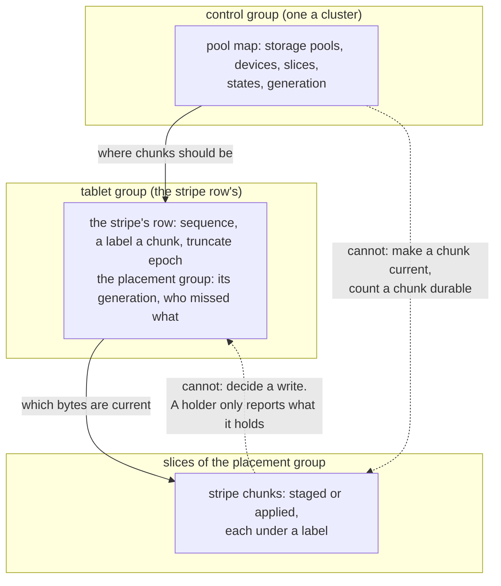

# S18. The contract and the questions

## Context

Objects are mutable in place, by the decision of 2026-10-02. That makes the write protocol the
part of this design that cannot be improvised: a write that reaches some holders of a stripe
and not others has to be finished or abandoned, by a rule every node applies alike, and under
erasure coding a half-applied write is not stale data but wrong data, since a decode over
stripe chunks from two writes returns bytes nobody wrote. Ceph solved it with a primary for each
placement group, a log on every holder and a peering protocol that reconciles the logs after a
failure ([S17](prior-art.md#ceph)). The Distributed chapter refused a protocol of that kind
once already, in favour of an embedded Raft it could hold to a contract
([C13](../distributed/protocol.md#alternatives-rejected)).

This page is the same move made for objects. It drafts the contract as numbered properties,
each beside the schedule that violates it; it states the failure model; it lists the
questions with the gate each blocks and the evidence that settles it; and it opens the
decision record. **Nothing here is agreed.** P7–P19 are a draft for the gate before
[M11](milestones.md#before-m11-the-object-contract), and the preferred direction they are
written against is a hypothesis.

## What exists today

A tablet group is an `openraft` group replicating one table's rows over one replica set, with
a contract of its own, P1–P6 ([C13](../distributed/protocol.md#the-contract)). What it offers a
design built on top of it:

- **an order**: a write is a `Command` applied once on every replica in committed order, with
  its result derived there (`shoal-core/src/server/shard/groups.rs`, `apply`;
  [C5](../distributed/replication.md));
- **fencing**: a leader whose lease lapsed refuses to append (`Lease::of`,
  [C7](../distributed/failover.md#the-lease)), and a deposed one cannot commit;
- **a retry identity**: a retried write is answered what its first try was answered, from a
  table each group keeps and persists beside its checkpoint
  ([C5](../distributed/replication.md#retry-identity));
- **two read levels**: `One`, an eligible replica's committed and applied prefix, possibly
  stale, and `Quorum`, a read barrier from the leader ([C6](../distributed/reads.md));
- **a driver pattern**: a group's leader drives a recorded operation phase by phase, each
  phase committed before the step it names, so the next leader resumes it
  ([F44](../features/repair.md), [F45](../features/replica-migration.md)).

What it does not offer: ~~a write that is conditional on what it finds
([S1](prerequisites.md#required))~~ (offered since [F68](../features/conditional-writes.md): an insert, a delete or an
update applied only if the row is absent or matches a filter, judged at apply in committed
order and refused with a typed reason); anything across two tablets
([P6](../distributed/protocol.md#the-contract)); any byte that is not in its log.

## The design

### Decisions taken and directions preferred

| Decision | Status |
| --- | --- |
| Objects are mutable in place | Taken 2026-10-02 ([overview](overview.md#decisions-taken-on-2026-10-02)) |
| Metadata is in unsorted tables replicated by the tablet groups, never erasure coded | Taken: R10 and R11 |
| The bytes of an object are not rows | Preferred, with two named exceptions: an inline object, and whatever [Q27](#questions-to-answer) decides for small writes. Candidate A of [S7](write-path.md#the-candidates) is the alternative and the baseline |
| A stripe's writes are ordered by the tablet group that owns its row | Preferred ([Q14](#questions-to-answer)). No second consensus protocol is introduced for objects |
| A write is staged, then committed, then applied: redo, never undo | Preferred ([S7](write-path.md)) |
| A placement group is a sub-range of one tablet | Preferred ([Q19](#questions-to-answer)), because it gives every placement group a log it already has |
| A primary for each placement group, with a peering protocol | Rejected for now ([Alternatives rejected](#alternatives-rejected)) |
| A timer that authorizes a holder to discard bytes | Rejected ([P16](#the-contract)) |
| An external metadata or coordination service | Excluded ([R7](../distributed/overview.md#what-is-asked-of-it)) |

### The contract

`P` numbers continue [C13's](../distributed/protocol.md#the-contract) and are never reused.
P1–P6 bind this part unchanged: the metadata rows are tablet rows. P7–P19 are what objects
add. Each is written as a property that can be checked against a history, beside the schedule
that violates it, because [S16](testing.md#the-model)'s model checks properties.

| # | Property | Binds | The violation the model must reject | Owning tests |
| --- | --- | --- | --- | --- |
| P7 | **Failure model, extended.** Everything P1 assumes, and also: a pool device may fail alone, and every slice on it with it, by reporting errors, by filling, or by being replaced with an empty one, while its node stays up; a write to a device may tear; a device may return bytes it was never given, with no error. Stable storage is a successful `fdatasync` of the bytes and of whatever names them. No property depends on a clock | every page | A check that needs synchronized clocks; a torn apply served as a stripe chunk; an empty replacement disk taken for the device it replaced | `object_model_preserves_acknowledged_bytes` (M11) |
| P8 | **One authority.** Only the conditional commit of a stripe's row makes bytes current. It is conditional on the row's sequence, the object's truncate epoch and the pool map generation the write was staged under. A stager that lost the race, lost its lease or holds an old map cannot commit | [S5](placement.md), [S7](write-path.md) | Two stagers on one base both applied; a parity built from an old row committed over a newer one; chunks committed on slices a newer map no longer names | `stale_stager_cannot_commit` (M15), `commit_names_the_generation_it_was_staged_under` (M16) |
| P9 | **Stripe-atomic writes.** A stripe's content is a total order of committed writes. A write takes effect whole at its commit or not at all, and uncommitted bytes never replace committed ones on any holder | [S6](device-store.md), [S7](write-path.md) | A holder applying before the commit, and the write then abandoned; a write applied to some chunks and served | `uncommitted_bytes_never_replace_committed` (M15), `stripe_write_is_atomic_at_every_crash_point` (M15) |
| P10 | **No mixed labels.** Every byte returned to a reader or fed to a decoder comes from stripe chunks whose labels match one committed state of the row. A chunk with another label, newer or older, is treated as missing. A row older than the chunks it names is refused by name | [S7](write-path.md), [S8](erasure-coding.md), [S9](read-path.md) | A decode over chunks from two writes; a reader accepting a chunk newer than the row it consulted; a restored row served against chunks overwritten since | `one_reads_never_mix_and_move_forward` (M15), `decode_never_mixes_labels` (M18) |
| P11 | **Durable at acknowledgement.** A write is acknowledged only when its new content is `fdatasync`ed on slices in distinct failure domains such that `k + f` stripe chunks are current after it, `f` being the pool's setting and at least one, and its commit is on a durable majority of the row's group ([P3](../distributed/protocol.md#the-contract)). A write that cannot reach that is refused, or acknowledged under a named weaker setting, never silently. A failure domain is a device or a host, never a slice, and a loss is a whole device with every slice on it, or a whole host: so `k + f` current chunks on distinct devices (or hosts) survive any `f` losses | [S5](placement.md), [S7](write-path.md), [S8](erasure-coding.md) | A 4+2 write touching one data chunk acknowledged after one stage, and that device lost; a staged chunk counted before its `fdatasync`; two chunks counted on one host, or on two slices of one device | `ack_requires_k_plus_f_current` (M15), `erasure_coded_ack_requires_k_plus_f_current` (M18) |
| P12 | **Read levels.** A default read returns, for each stripe, a committed state at or after the row it consulted: possibly stale, never mixed. A strong read returns, for each stripe, a state at least as new as every write acknowledged before it began | [S9](read-path.md) | A stale read reported as corruption; a strong read answered from a lagging replica's row | `strong_read_observes_prior_acknowledged_write` (M15) |
| P13 | **Size and truncate.** Bytes cut off by a truncate never return, whatever later extends the object. A write acknowledged after a truncate completed is never hidden by it | [S3](objects.md), [S7](write-path.md) | A writer that read the size before a truncate commits a stripe past the cut, and a later extension exposes it | `truncated_bytes_never_return` (M15) |
| P14 | **Path identity.** An object is found by its whole path. Two paths whose partition keys collide are never served as one another, and a write to one never replaces the other | [S3](objects.md#path-identity) | A get of one path answered with the object at a colliding one | `colliding_paths_are_told_apart` (M13) |
| P15 | **Integrity.** No read returns bytes that fail their checksum. A checksum binds bytes to their place: object, stripe, chunk, chunk unit. No checksum is computed over old bytes that were not verified first, and a corrupt chunk is never a source for a rebuild. A scrub tells a stale chunk from a corrupt one | [S6](device-store.md), [S8](erasure-coding.md), [S11](scrub.md) | A sub-unit overwrite merged into a corrupt chunk unit and checksummed afresh; a parity staged as a patch and replayed twice; a misdirected write that verifies where it landed | `scrub_never_launders` (M17), `corrupt_chunk_is_never_a_source` (M17) |
| P16 | **Reclamation.** A holder discards staged or current bytes only on a committed fact that can never be undone and that proves nothing refers to them. Unreferenced bytes are eventually reclaimed. A timer may ask the question; it never answers it | [S10](recovery.md#reclamation) | A stager timing out and telling holders to drop while its commit is in flight; a holder discarding because a lagging replica shows no row | `staged_bytes_outlive_a_stagers_timeout` (M15), `discard_requires_a_committed_fact` (M20) |
| P17 | **The pool map says where, never what is current.** A commit of the control group (a device or slice added, moved or removed) cannot make a stale or empty chunk current; currency is the row's label and nothing else. A failing pool device stops no tablet group. This is [P5](../distributed/protocol.md#the-contract)'s twin | [S4](pools-and-devices.md), [S5](placement.md), [S10](recovery.md), [S13](isolation.md) | A new slice counted as holding chunks because the map names it; a tablet group stalled by a pool device's error | `map_change_cannot_make_a_chunk_current` (M16), `tables_survive_pool_device_loss` (M14) |
| P18 | **Bounded metadata.** An object's `ObjectMeta` row is bounded whatever its size. Stripe rows are linear in the stripes written in place, at a published constant. Nothing for an object, a stripe or a stripe chunk is in a group's unbounded state or on a pushed map | [S3](objects.md), [S5](placement.md) | A structure rewritten whole as an object grows; a record for each stripe on the pool map | `metadata_cost_is_linear_and_published` (M15) |
| P19 | **What is not promised.** No atomicity across the stripes of an object or across objects, no read of several stripes at one instant, no listing, no atomic move between pools, no consistent backup of bytes. A write spanning stripes completes stripe by stripe; a crash leaves some done, and its retry under the same identity finishes it. An atomic replace of a whole object is the one exception, and it is promised. This is [P6](../distributed/protocol.md#the-contract)'s twin | [S7](write-path.md), [S9](read-path.md), [S14](operations.md) | An oracle, an API or a test that treats a multi-stripe write as atomic | The oracle's scope in `object_model_preserves_acknowledged_bytes` (M11); `whole_object_replace_is_atomic` (M15) |

P8 and P17 as a picture. The pool map says where a chunk should be; the row says which bytes
are current; a slice holds what it was given and decides nothing.

### Failure model and availability

The failure model is [C13's](../distributed/protocol.md#failure-model-and-availability),
extended by P7. Checksums detect accidental corruption; nothing here tolerates a Byzantine
node. Hardware that lies about a flush is outside the durability assumption, as it is there.

| Condition | Required behavior |
| --- | --- |
| One holder of a stripe is down, and the pool's `f` allows it | Reads are served, decoding where the missing chunk is needed. Writes are acknowledged while `k + f` stripe chunks can be current, and each one records that the holder missed it |
| More holders are down than the pool's setting allows | Writes to the stripes they hold are refused by name. Reads are served while k current chunks remain |
| Fewer than k current chunks of a stripe can be read | Reads of that stripe fail by name. Other stripes and other objects are unaffected. Nothing is fabricated, and nothing is chosen by a rule nobody asked to apply |
| The row's tablet group has no majority | No write to its stripes commits, and no strong read succeeds. A default read is served from a replica's committed state where the chunks are reachable |
| The control group has no quorum | Pool map changes stop: no device or slice is added, moved or removed. Reads and writes under the committed map go on |
| A device is replaced by an empty one | It is a new device, with new slices. The chunks its old slices held are rebuilt; the empty directory is never read as the old one |
| A device is full | A write that would stage on it is refused before its commit. Nothing fails after a commit for want of space |
| The whole cluster is restarted | Committed state is recovered. Every staged and undecided write is decided by its row |
| Rows are restored to a state older than the chunks | The bucket refuses by name ([Q31](#questions-to-answer)). No read mixes a restored row with a chunk overwritten since |

A degraded read's latency, a rebuild's duration and a scrub's cycle are measurements under a
stated load, never unconditional bounds.

### Identity and progress

A stripe is `(consumer id, object id, stripe index)`, the consumer id being its bucket's
([S4](pools-and-devices.md#pools-and-bindings-are-policy)). The object id is minted when the
object is created and never reused, so a stripe of a replaced or deleted object can never be
mistaken for a stripe of its successor at the same path.

A write to a stripe passes through three positions, on each holder separately:

| Position | Meaning |
| --- | --- |
| Staged | The write's bytes for this chunk are `fdatasync`ed on the holder, apart from the chunk, under the write's label. Nothing reads them as the stripe's content |
| Committed | The row names the write's label for this chunk. From here the bytes are the stripe's content, and a read is served them, overlaid from the staged copy if need be |
| Applied | The holder has folded the staged bytes into the chunk, made that durable, and dropped the staged copy |

A **label** is the row's sequence and a tag derived from the write's request identity. A
sequence number alone cannot label a stripe chunk: two writers that stage against the same
row both produce "the next sequence" with different bytes, and a holder told only that the
next sequence committed would apply whichever it had staged. The row keeps a label for each
chunk, because a write that touches some chunks of a stripe leaves the others as they were
([S8](erasure-coding.md#a-partial-overwrite)).

### Visibility and durability

An acknowledged write is in two places: its commit is on a durable majority of the row's
group, and its bytes are staged or applied on enough holders that `k + f` stripe chunks are
current. Neither half is enough alone. Bytes on every holder with no commit are an abandoned
write; a commit with too few holders is a promise the pool cannot keep through `f` losses.

A default read sees a committed state of each stripe it touches and may see different
stripes at different moments. A strong read takes a read barrier on each row first. Neither
ever returns bytes of a write that did not commit.

### Decision record

Each entry is recorded on the tree it was written against, in the manner of
[C13's](../distributed/protocol.md#decision-record): what was decided, on what evidence, and
what was not.

#### Before M11: the decisions of 2026-10-02

Recorded 2026-10-02, on the tree at `ba7edf1`. Crate facts were read from the sources
downloaded from `static.crates.io` at the versions given, at the path and line named; Ceph
facts from its repository at the tag `v20.2.0` (commit `69f84cc`). Neither `docs.rs` nor a
README was the source.

| Decision | Evidence |
| --- | --- |
| Objects are mutable in place; listing waits; the metadata tables are hidden; pools are bound in the deployment; both write shapes are in scope | Taken with the user while this part was planned ([overview](overview.md#decisions-taken-on-2026-10-02)) |
| P7–P19 are a **draft** | Written against the preferred direction of [S7](write-path.md). No clause has been checked against a model, because none exists ([X1](spikes.md#x1-the-stripe-protocol-as-a-model)) |
| Q14 is **not** settled | An independent review of the first statement of the preferred direction found five faults in it, each now a schedule in [S7](write-path.md#the-schedules-that-shaped-it): a sequence number used as a label, an unconditional commit, a returning device with nobody to ask, truncate across two tablets, and placement recorded nowhere a commit could check. A direction that needed five repairs before it was written down has not earned the word "decided" |
| Candidate, random linear network coding: `rlnc` `0.8.7` (2025-10-15), BSD-3-Clause, MSRV 1.89 | GF(2^8). `Encoder::new(data: Vec<u8>, piece_count)` owns the data and pads it with a `0x81` marker and zeros (`src/full/encoder.rs:85`, `src/full/consts.rs:5`). `code_with_buf` writes a coded piece into a caller's buffer and `code` returns a `Vec` (`:241`, `:264`). Coefficients come from the caller's RNG; `code_with_coding_vector` is `pub(crate)`, and nothing in `src` or the README says "systematic". `Decoder::decode` takes one piece at a time and `get_decoded_data` returns the whole (`src/full/decoder.rs:96`, `:136`). `mod common` is private, so the GF(2^8) kernels are not exported (`src/lib.rs:127`). SIMD is chosen at run time with `is_x86_feature_detected!`: GFNI with AVX512, AVX512BW, AVX2, SSSE3 (`src/common/simd/x86/mod.rs:7-85`). Depends on `rand =0.9.2`, and on `rayon` behind `parallel` |
| Candidate, Reed-Solomon: `reed-solomon-simd` `3.1.0` (2025-10-14), MIT AND BSD-3-Clause, MSRV 1.82 | Leopard-RS. `ReedSolomonEncoder::new(original_count, recovery_count, shard_bytes)`, `add_original_shard`, and `encode` returning the recovery shards, so the originals are stored as they are (`src/reed_solomon.rs:22-43`). A shard's size "must non-zero and multiple of 2" (`src/lib.rs:188`). Engines for AVX2, SSSE3 and NEON are chosen at run time with `cpufeatures` (`src/engine/engine_default.rs:31-44`). No update call |
| Candidate, Reed-Solomon: `reed-solomon-erasure` `6.0.0` (2022-09-23), MIT | `ReedSolomon::new(data_shards, parity_shards)`, `encode`, `verify`, `reconstruct`. `encode_single` builds parity one data shard at a time, but "in strict sequential order (0..data shard count), otherwise the parity shards will be incorrect" (`src/core.rs:534-545`), so it is incremental and not a delta. `simd-accel` compiles `simd_c/reedsolomon.c`. Its last release is four years old |
| Candidate, Reed-Solomon: `isa-l` `0.2.0` (2020-06-25), BSD-3-Clause | Bindings through `libisal-sys 0.1`: `ec_init_tables`, `ec_encode_data`, `gf_gen_rs_matrix`, `gf_gen_cauchy1_matrix`, `gf_invert_matrix` (`src/lib.rs:22-302`). **It binds no `ec_encode_data_update`**, which the plan for this part had assumed it did. Its last release is six years old |
| Candidate, Reed-Solomon: `rusty_erasure` `0.4.1` (2026-09-10), MIT OR Apache-2.0, MSRV 1.95 | A Rust port of ISA-L's erasure code: `ec_encode_data`, `ec_encode_data_update`, `gf_vect_mad`, and `xor_gen` and `pq_gen` beside them (`src/isal.rs:174-323`, `src/lib.rs:41-54`). Three weeks old on the day it was read, with seven hundred downloads |
| Candidate, fountain: `raptorq` `2.0.1` (2026-03-09), Apache-2.0 | RFC 6330. `source_packets` and `repair_packets` (`src/encoder.rs:349`, `:361`), so it is systematic. A packet's size is a `u16` (`set_max_packet_size(bytes: u16)`, `:55`), so a symbol is at most 64 KiB |
| Candidates, checksum: `crc32c` `0.6.8`, `crc-fast` `1.10.0`, `crc64fast-nvme` `1.2.1`, `xxhash-rust` `0.8.19`, `blake3` `1.8.7`, and gxhash `2.3.1` already in the tree | Versions from the registry on the day. None was read beyond its manifest; [X5](spikes.md#x5-checksums) reads them |
| What the spikes inherit | rustc 1.100.0-nightly (2026-09-04). glommio is the `../glommio` path dependency at 0.10.0, on `873fa44`. No erasure coding crate is in `Cargo.lock`. `.cargo/config.toml` builds for `target-cpu=native`, so a spike binary for the Zen1 hosts is built `znver1` by hand |

**What this gate did not do.** It agreed no clause of the contract, selected no crate, wrote
no type, added no dependency and measured nothing. A version above is a pin for a spike to
start from, not a choice.

#### Q30, in part: the driver's shape (2026-10-03)

Recorded 2026-10-03, on the tree that landed [F69](../features/driver-operation-kinds.md).

| Decision | Evidence |
| --- | --- |
| The one driver is generalized; no second driver is written for objects | [X13](spikes.md#x13-the-benchmarks-shape)'s reading, done while building F69: read and insert are written into five places (`spec.rs`, `window.rs`, `pick.rs`, `feed.rs` and the driver's judge), and each took a third kind as one more case. The kind is `OperationKind<S>`, handed over through `DatasetSupport::operation_kinds`, and bytes are counted at the client where frames are written and read |
| A table workload is unchanged | `table_arm_ids_are_unchanged` and `picks_of_read_insert_workloads_are_unchanged`, frozen on the tree before F69; on the lab, a capture before F69 and one after are joined arm by arm by `compare` with no fact refused ([F69](../features/driver-operation-kinds.md#performance)) |

**Not settled.** The object dataset (a folder of real files, or a seeded description), and how
fast one core makes seeded bytes, which is X13's stub. Neither is needed before buckets exist.

## Alternatives rejected

**A primary for each placement group, with a log on every holder and peering.** It is what
Ceph does, and it does it in one durable round where the preferred direction pays two. It
needs an authority that appoints and fences primaries (which
[P5](../distributed/protocol.md#the-contract) forbids the control plane to be), a log on
every slice, a rollback record for every overwrite, and a protocol that reconciles logs
after a failure, with its own safety argument and its own model. C13 turned down a custom
protocol for tablets on exactly those grounds. It stays the alternative
[Q14](#questions-to-answer) is measured against, and is not taken as a fallback for an
inconvenient latency number.

**An `openraft` group for each placement group among the holders.** A group of k+m members
would need a quorum of `k + f` and a different payload for each member. openraft's quorum is
its membership's: every configuration's majority has to agree
(`openraft-0.10.0-alpha.34/src/membership/membership_impl_quorum_set.rs:8-24`). Whether a
caller can supply another rule was not established here, and no spike of this book has had
to ask. One group a placement group across every slice is also far past what one thread
holds
([Q1 and Q13 at M1](../distributed/protocol.md#q1-and-q13-at-m1)). It would also put the
metadata's consensus log on the pool's devices, rotational ones included.

**A sequence number as the label of a stripe chunk**, and **a commit that is not
conditional.** Both were in the first statement of the preferred direction, and both are
unsafe: see the record above.

**Discarding staged bytes on a timeout.** A holder cannot tell an abandoned write from one
whose commit is still in flight. Only the row can, so only a committed row state may
authorize it.

**Read and write quorums at the holders** (`W + R > N`). The row arbitrates which chunks are
current, so a reader needs any k that the row names, each confirming its label, and no
quorum of holders. A quorum rule would also have to be restated for every k+m.

**Holders that promise.** Staging and the commit could run at once if a holder's durable
promise bound it to a write before the row decided. A promise that survives a restart and
has to be revoked is a vote, and a protocol of votes among holders is peering by another
name.

## What it costs

**Two durable rounds where a table write pays one**: the holders' `fdatasync` of what they
staged, then the group's commit. On the lab's Zen1 hosts a flush is about 3 ms for one writer
and 5.9 ms with six at once, against 0.2 ms on europa's Optane
([cluster testing](../cluster-testing/performance.md)), so the floor under a small in-place
write there is two of those, and a partial write of an erasure coded stripe adds a round of
reads before them. [X8](spikes.md#x8-one-small-write-three-ways) measures it;
[Q27](#questions-to-answer) is what to do about it.

**A row for every stripe written in place**, and a conditional commit for every write to one.
**A label for each stripe chunk** in that row. **State in the group** recording which holders
missed which writes ([S10](recovery.md)).

Safety is not negotiable against any of these. A cheaper write that weakens P9 or P11 is a
setting with its own name, as `One` writes were to be ([C5](../distributed/replication.md)).

## What it breaks

"No conditional write": ~~the unsorted table gains one ([S1](prerequisites.md#required))~~
both table kinds gained one in [F68](../features/conditional-writes.md). "A result is a kind and a flag": ~~a refusal gains a
reason a caller can branch on~~ a refusal carries `ConditionRefusal`, which a caller branches on
and a retry is answered with again, since F68. "The tablet map
is the only pushed map": a pool map joins it ([S5](placement.md)). "A group's persisted state
is its checkpoint and its retry table": the record of missed writes joins them
([S10](recovery.md)). P1–P6 are not changed by anything here.

## Invariants to uphold

- Only a committed row state makes bytes current, and only a committed row state lets a
  holder discard them.
- A holder applies a staged write only when the row names that write's label for its chunk.
- A commit is refused unless the row's sequence, the truncate epoch and the pool map
  generation are the ones the write was staged under.
- A staged write holds new values, never a patch: applying it twice is applying it once.
- A decode, a rebuild and a read each take only stripe chunks whose labels the row names.
- An acknowledgement follows `k + f` current chunks and a durable majority, in that order.
- Nothing is decided by a clock.
- Every clause of P1–P6 holds for the metadata rows as it does for any table's.

## Prerequisites

~~The conditional write with a typed refusal~~ (delivered, [F68](../features/conditional-writes.md)), and the tablet walk
([S1](prerequisites.md#required)). [S16](testing.md)'s model. Every question below is
resolved before the gate it names, and its decision and evidence recorded above, as the
entries of 2026-10-02 are. **A preferred direction is a hypothesis, not evidence.**

## Questions to answer

`Q` numbers continue [C13's](../distributed/protocol.md#the-questions-and-where-each-was-decided)
Q1–Q13.

| ID | Question and preferred direction | Gate and evidence |
| --- | --- | --- |
| Q14 | **What orders a stripe's writes, and how do the bytes stay out of the log?** Preferred: the tablet group that owns the stripe's row, by a conditional commit; holders stage before it and apply after ([S7](write-path.md)). The alternatives are stripes as rows, a group among the holders, and redirect-on-write | Before M11. [X1](spikes.md#x1-the-stripe-protocol-as-a-model) for safety, [X3](spikes.md#x3-bytes-through-the-tablet-groups) and [X8](spikes.md#x8-one-small-write-three-ways) for cost |
| Q15 | **Who stages?** Preferred: the node that received the client's bytes, with the group's leader only ordering commits and granting an advisory reservation under contention. The other answer is the leader, which serializes and costs a network crossing while clients do not route by topology | Before M11. X1; [X9](spikes.md#x9-table-latency-beside-object-work) for what a stager's work costs the shard it runs on |
| Q16 | **The acknowledgement rule.** Preferred: `k + f` current stripe chunks with `f = 1` by default; whether an untouched chunk on a slice that is down counts as current is open. What a degraded write does when the rule cannot be met | Before M11. X1 |
| Q17 | **How does a slice that missed writes learn what it is stale on**, at what granularity, and how does that record survive a checkpoint and reach a new replica? Preferred: a bounded record in the group for each placement group and chunk, derived at apply as the retry table is; past the bound, a backfill from a walk of the tablet's rows | M16. X1, [X10](spikes.md#x10-what-a-stripe-row-costs), [X12](spikes.md#x12-recovery-and-scrub-rates) |
| Q18 | **Size and truncate across tablets.** Preferred: a truncate epoch in `ObjectMeta` that every stripe commit stamps, with a short stack of floors. The alternative keeps an object's rows in one tablet, which makes size atomic and confines an object to one group | Before M11. X1 |
| Q19 | **Placement.** How many placement groups a tablet; the placement function; failure domains; how a commit checks a generation; the pool map's size and fanout | Before M11. [X2](spikes.md#x2-placement-simulation) |
| Q20 | **Which code family, which crate, what geometry**: Reed-Solomon, random linear network coding, a fountain code, or plain XOR at one parity chunk; stripe and chunk unit sizes; parity delta or reconstruct-write. Preferred: a systematic code that decodes from any k, because a seek and a small write both lean on those two properties | M18. [X4](spikes.md#x4-erasure-coding-crates-performance-and-tradeoffs), [X14](spikes.md#x14-ceph-and-s3-at-the-source) |
| Q21 | **Which checksum**, at what granule, and whether the row keeps a digest of each stripe chunk to catch a write that was lost whole. Preferred: a definition no crate's release can move | M13, since a frame that carries a unit's checksum fixes it on the wire before any slice stores one. [X5](spikes.md#x5-checksums) |
| Q22 | **The device store's layout**, its way of applying an update, its `fdatasync` strategy and the filesystems it accepts. Preferred: a journal written ahead for small updates and whole files for large ones | M14. [X6](spikes.md#x6-the-device-store-on-ssd) |
| Q23 | **What a rotational device needs**: an executor of its own, a journal on an SSD, another layout | M19. [X7](spikes.md#x7-the-device-store-on-hdd) |
| Q24 | **Where object work runs**: which executor owns a slice, whether object work shares executors with tables, the lane, the memory budget | M14. X9 |
| Q25 | **The metadata rows**: the inline threshold, what a stripe row costs, the stall when a row a commit needs is not in memory, the scale a bucket is designed for | M12. X10 |
| Q26 | **Streamed bodies**: bounded ranged frames, their size, and what a connection shared with small queries does under them | M13. [X11](spikes.md#x11-streamed-bodies) |
| Q27 | **What one small in-place write costs, and whether small writes ride the metadata log** below a threshold, to be folded into stripe chunks later | M15. [X6](spikes.md#x6-the-device-store-on-ssd), X8 |
| Q28 | **Scrub**: cadence, byte budgets, what a deep scrub of k+m verifies beyond each stripe chunk's own checksums | M17. X12, X14 |
| Q29 | **Budgets for recovery and moves**, for each device | M16. X12 |
| Q30 | **The benchmark**: how the driver gains object operations, byte metrics and an object dataset | M11. [X13](spikes.md#x13-the-benchmarks-shape) |
| Q31 | **What a schema change, a backup, a restore and `force_recover` mean for a cluster holding object bytes.** [Q10](../distributed/protocol.md#q10-at-m10a) settled that a schema change is a new cluster and a restore; a restore carries rows and not stripe chunks, so on a cluster with buckets it would strand every object. This part does not reopen Q10. The two ways out are a restore that carries or adopts chunks, and an additive schema change made rolling | M21. [S14](operations.md#a-schema-change-a-backup-and-a-restore); no spike |
| Q32 | **What the later listing index needs the metadata to leave room for** | After M21. X14 |

## How it would be measured

The model ([X1](spikes.md#x1-the-stripe-protocol-as-a-model)) checks P8–P16 against generated
schedules and holds one saved schedule for each unsafe policy. The fixture checks them against
processes and real directories, with the device faults of [S16](testing.md). What the
contract costs is [S15](performance.md)'s: completed durable bytes, latency tails and what is
left staged or stale, never acknowledged throughput alone.

## Acceptance tests

A clause's tests are on the pages it binds, and the last column of
[the contract](#the-contract) names them. The rows here are the ones no other page owns: the
model, and two rows of the failure model.

| Test | Asserts | Milestone |
| --- | --- | --- |
| `object_model_preserves_acknowledged_bytes` | Generated schedules of crashes, lost and reordered messages, leader changes, device loss and map changes preserve every acknowledged byte range under the safe policy; each check names the `P` number it enforces | M11 |
| `object_writes_survive_control_quorum_loss` | With the control group short of a quorum, reads and writes under the committed pool map go on, and every change to the pool map is refused | M15 |
| `full_restart_decides_every_staged_write` | A cluster stopped whole with writes staged and undecided comes back with each one finished or abandoned by its row, and no acknowledged byte lost | M15 |

## Related

[S7](write-path.md) for the protocol these clauses are written against; [S16](testing.md) for
the model; [Spikes](spikes.md) and [Milestones](milestones.md) for the evidence and the gates;
[C13](../distributed/protocol.md) for P1–P6 and the form this page copies;
[S17](prior-art.md#implementation-reading-list) for the sources.
