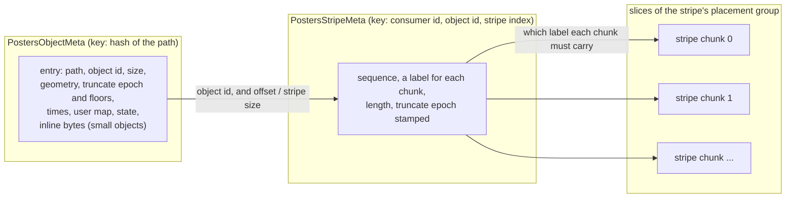

# S3. Objects, stripes and their metadata

## Context

An object is bytes of any length at a path (R9, R13), its metadata lives in an unsorted table
(R10), and by the decision of 2026-10-02 it can be written at any offset and truncated. This
page is the data model those four facts force: what a path is, what identifies an object, what
the two generated rows hold, how an object of any size has metadata that does not grow with
it, and what an unsorted table cannot do for a bucket however it is used.

The unit everything else on these pages is built from is the **stripe**: a fixed-size run of
an object's bytes, cut into one stripe chunk for each holder, and written, placed, encoded,
recovered and scrubbed on its own. It is what RADOS calls an object, and it is the reason
"arbitrarily large" is not a special case.

## What exists today

An unsorted table holds exactly one row for each partition key, and the key is a hash.

- The key is `gxhash` over the partition fields, seeded at zero
  (`shoal-derive/src/traits/partition_key.rs:104-115`); a tablet is the key's top twelve bits
  (`shoal-core/src/server/ring.rs:343-350`).
- "One row per partition. Inserting to an existing key replaces the row outright"
  ([Table Types](../tables/table-types.md)). An update succeeds whenever the row exists, ~~and
  nothing is conditional ([S1](prerequisites.md#required))~~ and since [F68](../features/conditional-writes.md) any write can
  be made conditional on the row being absent or matching a filter, which is what an entry's
  create and change are built on.
- **Keys collide and nothing detects it.** The glossary says so in those words, and for an
  unsorted table "a hash collision silently overwrites a row"
  ([Table Types](../tables/table-types.md#limitations)).
- **There is no scan.** A partition is found by its key and no other way, which is why a
  `WHERE` on the partition key is mandatory ([Introduction](../introduction.md#what-shoal-is-not)).

A row is a poor place for bytes, and the book has measured why.

- A row is one rkyv record, read and written whole. Its size fits 32 bits, since rkyv's
  relative pointers bound a record below 4 GiB
  (`shoal-core/src/server/tables/storage/fs/map.rs:253-266`), and a frame carrying it is
  bounded at 64 MiB.
- The payload is walked about six times a round trip. At 1 MiB rows the persistent unsorted
  table answered 2,226 queries a second and at 4 MiB 454, with a write's median at 16 ms and
  60 ms ([Row size and what it costs](../tables/row-size.md#the-shape), on the benchmark host
  and one node).
- A row written in a generation stays in memory until that generation is compacted
  ([Memory and Eviction](../tables/memory-and-eviction.md)), and on a cluster every byte is
  written to the WAL and again to the archives.
- The index of where rows are is held whole in memory, about fifty bytes a row, and nothing
  evicts it ([todos](../appendix/todos.md#a-nodes-archive-map-is-bounded-by-nothing)).
- An apply that needs a row from disk parks its batch and blocks that group until the row is
  read ([C5](../distributed/replication.md)).

## The design

### Paths

A path is a non-empty UTF-8 string, bounded in length by the bucket (1 KiB is proposed). It is
opaque: `/` is a byte like any other, and the store knows no directory. The partition key of
an object's metadata is the hash of its path, so an object's row lives wherever that hash
lands and two paths that share a prefix share nothing else.

### Path identity

A 64-bit key over a billion paths has about a one in forty chance of a collision somewhere
(n² over 2⁶⁵). For a table that is a row overwritten; for a bucket it would be one object's
bytes served as another's, and a write to one path destroying the other. So
[P14](contract.md#the-contract) is not left to chance:

- **the row stores the whole path** of every object it describes, and every read compares it;
- **the row is a short list**, nearly always of one entry. Two paths with one key are two
  entries of one row, each with its own object, and neither refuses the other;
- every change to the row is conditional on what its writer read, so an entry is never
  replaced by a writer that did not see it.

The alternative, refusing the second path by name, is simpler and makes one path in a bucket
unusable for no reason its author could discover.

### Object id

Every object has an id minted when it is created: 128 bits, time-ordered, as a bundle's retry
identity already is (`Uuid::now_v7`, `shoal-client/src/client.rs:1699`). It is **never
reused**, and stripes are keyed by it and not by the path: a stripe's key is the hash of its
consumer's id, its object id and its stripe index ([S5](placement.md)), the consumer here
being the bucket. That is what makes replace and delete safe: the stripes of a replaced object
and the stripes of its successor at the same path have different keys, sit in different rows
and are different stripe chunks on every slice, so nothing that reads, rebuilds or reclaims
one can touch the other.

### The two rows

**`ObjectMeta`**, one entry an object:

| Field | Holds |
| --- | --- |
| Path | The whole path, compared on every read |
| Object id | The current object at the path |
| Size | The object's length in bytes |
| Geometry | Stripe size, chunk unit and redundancy as they were when the object was created. Fixed for the object's life, so an offset maps to a stripe by division |
| Truncate epoch, floors | A counter every truncate moves, and a short list of `(length, epoch)` marks left by truncates not yet reclaimed |
| State | Live; a replacement in flight and its id; ids retired and not yet reclaimed |
| Times, user map | Created and modified, as a clock said, for people and never for a decision; a small bounded map of strings |
| Inline bytes | The whole object, when it is small enough |

**`StripeMeta`**, one row a stripe *that has been written in place*:

| Field | Holds |
| --- | --- |
| Sequence | How many writes to this stripe have committed |
| A label for each stripe chunk | The sequence and the tag of the write that last changed that chunk ([S18](contract.md#identity-and-progress)) |
| Length | How much of the stripe holds bytes |
| Truncate epoch | The object's epoch when this row was last committed |

Where a stripe's chunks are is not in its row. It is its placement group's generation, which
the tablet group holds once for every stripe in the group ([S5](placement.md#generations)).

**A stripe written only when its object was created has no row.** A whole object put under a
new id writes its stripe chunks straight into place, each labelled with sequence zero and the
object's own tag, and the one commit that makes them current is the `ObjectMeta` change that
makes the object current ([S7](write-path.md#a-whole-object-in-one-commit)). A stripe gets a
row on its first write in place. So an object that is put and read and never patched, the S3
shape, costs one row whatever its size, and [P18](contract.md#the-contract)'s linear term is
linear in what was actually overwritten.

### Size, holes and truncate

Size is in `ObjectMeta` and stripes are in other tablets, and nothing is atomic across two
tablets ([P6](../distributed/protocol.md#the-contract)). The order of operations is what
makes that safe.

- **A stripe never written reads as zeros**, up to the object's size. An object is sparse by
  construction.
- **An extending write commits its stripe first and the size second.** Bytes past the size
  are invisible, so a crash between the two leaves nothing a reader can see; the retry
  finishes it.
- **A truncate moves the epoch.** It commits the new length and the next epoch in
  `ObjectMeta`, leaving a floor `(length, epoch)`. Every stripe commit stamps the epoch its
  writer read. A reader treats a stripe beyond a floor, stamped below that floor's epoch, as a
  hole. So a writer that read the size before a truncate and commits a stripe past the cut
  after it has written a stripe no reader will ever be shown, even if the object is later
  extended over it: [P13](contract.md#the-contract).
- **The writer's read of the epoch is a strong read.** A stale one would stamp a new write
  with an old epoch and hide an acknowledged write behind a floor.
- **A floor is removed** once reclamation has deleted the stripes it hides. The list stays
  short because floors are removed as fast as stripes are reclaimed, and a truncate that
  would push it past its bound waits.

~~RADOS carries a truncate sequence on every operation for the same reason. That is recalled
and was not read at source; [X14](spikes.md#x14-ceph-and-s3-at-the-source) reads it.~~ RADOS
carries a truncate sequence for the same reason, though not on every operation and not with
this guarantee ([X14](ceph-and-s3-sources.md#4-a-truncate), read at `v20.2.0`). CephFS stamps it
on the extent reads and writes it sends, and the OSD keeps one sequence and size an object
(`src/osd/osd_types.h:6184`). It clips a stale write to the object's *current* size
(`src/osd/PrimaryLogPG.cc:6765-6773`). So once a newer write has extended the object past the
stale write's range, the stale bytes land. The OSD alone does not give P13; the floors here do.

### Small objects stay inline

An object at or under its pool's inline threshold is stored in its `ObjectMeta` entry and has
no stripes, no stripe chunks and no slice. It is a row: one commit, replicated by the tablet group
at the cluster's factor.

The threshold belongs to the **storage pool**, and zero turns it off. That is deliberate: a
bucket bound to an erasure coded pool of rotational disks would otherwise keep its small
objects on the metadata's devices at the cluster's replication factor, which is a different
durability and a different cost from the one its operator chose, and nobody would have said
so. ~~Where the threshold should sit is
[X10](spikes.md#x10-what-a-stripe-row-costs)'s to measure; the row-size capture puts the
knee of the persistent path between 1 KiB and 16 KiB.~~ **A pool's threshold defaults to 16 KiB**,
the bottom of the knee [X10](stripe-row-costs.md#4-an-object-held-inline) measured on the lab's
cluster ([S18](contract.md#q25-in-part-the-metadata-rows-2026-10-04)). Puts and an even mixture
of inline objects keep 0.84× of their 1 KiB rate at 8 KiB, fall to 0.54 to 0.72 at 16 KiB, and to
0.31 to 0.55 at 32 KiB. The benchmark host's single node bent an octave sooner.

An inline object that a write grows past the threshold is moved to stripes, once, and does
not move back.

### Replace and delete

- **Replace.** The new object's id is recorded in the path's entry as a replacement in
  flight; its stripe chunks are written; one conditional commit makes it current and moves the old
  id to the retired list. A reader sees the old object or the new one
  ([P19](contract.md#the-contract)'s one exception).
- **Delete.** The current id moves to the retired list. The entry stays until the object's
  stripe chunks and stripe rows are reclaimed, and goes when its list is empty.
- **Registration comes first.** No stripe chunk is written for an id the row does not name.
  That is what lets a slice ask the consumer that owns a chunk about any chunk it holds, which
  for a bucket is the path's `ObjectMeta` entry, and get an answer that can only move one way:
  named as current, in flight or retired, or named nowhere and therefore discardable
  ([S10](recovery.md#reclamation)).

### What an unsorted table cannot do

It cannot list. A bucket's paths are scattered over 4096 tablets by their hashes, no query
enumerates a tablet, and nothing orders one path against another. By the decision of
2026-10-02 the first version does not try: an object is reached by its exact path.

What must not be precluded is an ordered index added later
([Q32](contract.md#questions-to-answer)). The design leaves room in two ways: every change to
what exists at a path is one conditional commit of one entry, so there is one place an index
entry would be derived from; and the engine's walk of a tablet's rows, which reclamation
needs anyway ([S1](prerequisites.md#required)), is what a first, unordered enumeration and an
index rebuild would both be made of.

## Alternatives rejected

**The path's hash as the object's identity.** A replaced object would share stripe keys with
its successor, and every safety argument about a retired object's stripe chunks would need an
extra generation to tell them apart. The id is that generation, minted once.

**One row an object holding every stripe's state.** It is rewritten whole as the object
grows, it is bounded by a frame and by rkyv, and it makes every stripe of an object contend
on one row. P18 rules it out.

**An object's rows kept in one tablet**, so that size and stripes commit together. It makes
truncate atomic and costs more than it saves: keys would be allocated and not hashed, an
object would be confined to one group's commit rate, and its stripe chunks to one tablet's
placement groups ([Q18](contract.md#questions-to-answer)).

**A row for every stripe, written or not.** It doubles the commits of a streaming put and
makes metadata linear in size for the workload that never overwrites.

**Refusing a second path that collides.** See [Path identity](#path-identity).

## What it costs

- **A row an object, and a row for every stripe written in place.** Each is ~~about fifty~~
  39 bytes of index in memory on every replica of its tablet, measured by
  [X10](stripe-row-costs.md#2-bytes-a-row) at four million rows, which today caps a bucket near
  ~~twenty~~ 27 million rows a GiB of memory a replica
  ([S1](prerequisites.md#optional), paging the archive map). On disk a stripe row is 272 bytes
  and an object row with nothing inline 383; in the WAL, 331 and 468 a replica.
- **Two commits for a whole object** (the registration and the commit), **one for each
  stripe written in place**, and one more when a write extends the object.
- **A strong read of the object's entry before a write in place**, for the truncate epoch.
- **A commit to a stripe whose row is not in memory waits for the row to be read**, and its
  group's batch waits with it. An object patched once a month pays that every time
  ([X10](spikes.md#x10-what-a-stripe-row-costs)). X10 measured it: at depth one the read hides in
  the WAL's commit delay and the commit costs what a warm one does, but under load a group's cold
  reads queue, to 0.62× its rate on the lab's 970 EVOs. S7's read of the row, sent to the group's
  leader, keeps the leader off the disk, and the commit after it costs 1.20× a warm one under load
  ([X10's record](stripe-row-costs.md#5-the-supplement-the-read-under-load)). The rows are not
  kept resident.
- **Inline objects are rows**, with everything the row-size page says about rows.

## What it breaks

- "One row per partition" means one object for a table. A generated `ObjectMeta` row is a
  list.
- "Inserting to an existing key replaces the row outright": no generated row is ever written
  that way.
- "No atomicity across queries": still true. An object's size and its stripes are in
  different tablets, and this page is the argument that they do not need a transaction.

## Invariants to uphold

- An object id is never reused, and a stripe's key contains it beside its consumer's id.
- A path is compared whole on every read, and an entry is changed only by a commit
  conditional on what its writer read.
- No stripe chunk is written for an id its path's entry does not name.
- Nothing in a storage pool, a slice, a scrub or reclamation assumes the consumer is a bucket.
  What a slice asks about a chunk it holds, whether its owner id is still named, is asked of
  the consumer, and a bucket answers it from `ObjectMeta`.
- A stripe is committed before the size that reveals it; a truncate's epoch is committed
  before any stripe it hides is reclaimed.
- A stripe stamped below a floor that covers it is a hole.
- An object's geometry never changes.
- A time in a row is for people. Nothing is decided by it.

## Prerequisites

[S1](prerequisites.md#required): ~~the conditional write~~ (delivered, [F68](../features/conditional-writes.md)), known issue 198, the byte bound on an
append batch (inline objects are rows) and the tablet walk. [S2](buckets.md), which generates
the rows.

## How it would be measured

[X10](spikes.md#x10-what-a-stripe-row-costs) is this page's spike: rows a second through a
group for rows shaped like these two, bytes a row on disk and in the index, how long a commit
waits on a row that is not in memory, and the inline threshold swept from 1 KiB to 1 MiB. It has
reported ([the record](stripe-row-costs.md)), on stand-ins for these rows; M12 takes its figures
again on the rows as generated.
`metadata_cost_is_linear_and_published` holds the constant the page publishes to what a test
counts.

## Acceptance tests

| Test | Asserts | Milestone |
| --- | --- | --- |
| `colliding_paths_are_told_apart` | Two paths forced onto one key are stored, read, replaced and deleted independently | M13 |
| `inline_object_never_touches_a_device` | An object under the threshold is written and read with no device configured, and one over it is refused there by name | M13 |
| `metadata_cost_is_linear_and_published` | A put of any size leaves one row; rows grow by one for each stripe written in place and by nothing else | M15 |
| `a_hole_reads_as_zeros` | A stripe never written, inside the object's size, reads as zeros and holds no stripe chunk | M15 |
| `truncated_bytes_never_return` | A stripe committed past a cut by a writer that read the size before the truncate is never shown, after any later extension | M15 |
| `replace_shares_nothing_with_its_predecessor` | During and after a replace, no read, rebuild or reclamation of one object touches a stripe chunk of the other | M15 |

## Related

[S2](buckets.md) for where the rows come from; [S7](write-path.md) for how they are
committed; [S9](read-path.md) for how they are read; [S10](recovery.md#reclamation) for how
retired objects go; [Table Types](../tables/table-types.md) and
[Row size and what it costs](../tables/row-size.md) for the table these rows are;
[S18](contract.md) for P13, P14 and P18.
