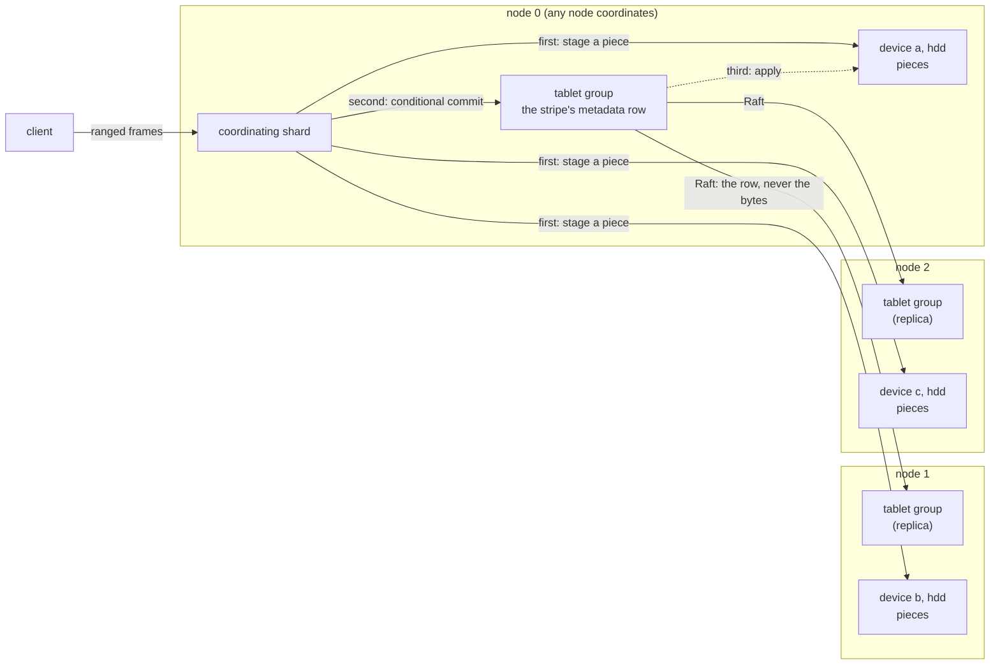

# Object Storage

**Nothing in this part is built.** These pages plan an object store inside Shoal: buckets
declared beside tables in the `#[shoal::db]` struct, objects of any size reached by a path,
their metadata in unsorted tables and their bytes replicated or erasure coded over named pools
of devices. The `S` pages are design records. [S1](prerequisites.md) is what has to exist
before any of it is written; the [spikes](spikes.md) are the exploratory work that has to
report before a milestone plan can be trusted; and the [milestones](milestones.md) page is a
draft order until they do. The contract that would gate the first milestone is drafted as
P7–P19 on [S18](contract.md#the-contract) and is agreed by nobody yet. What is settled is the
set of decisions [below](#decisions-taken-on-2026-10-02).

Ceph is the model throughout, and [S17](prior-art.md) says what is taken from it and what is
not. Compatibility with S3 is not asked for and not offered.

One stripe of one object being written under the preferred direction of
[S7](write-path.md): the bytes go to the devices of a storage pool, the decision that makes
them current is one conditional commit of a metadata row through the tablet group that already
replicates that row, and the devices fold the staged bytes in afterwards.

## What is being asked for

| # | Requirement | Where it is met |
| --- | --- | --- |
| R8 | A bucket is declared statically in the `#[shoal::db]` struct, as a table is | [S2](buckets.md) |
| R9 | An object in a bucket is reached by its path | [S3](objects.md), [S12](wire-and-client.md) |
| R10 | Object metadata lives in a Shoal unsorted table | [S3](objects.md) |
| R11 | Object data is erasure coded or replicated; metadata is not erasure coded | [S7](write-path.md), [S8](erasure-coding.md) |
| R12 | Objects are seekable, and by the decision below writable at any offset | [S7](write-path.md), [S9](read-path.md), [S12](wire-and-client.md) |
| R13 | An object may be arbitrarily large | [S3](objects.md), [S5](placement.md), [S12](wire-and-client.md) |
| R14 | Performance matters | [S15](performance.md), and "How it would be measured" on every page |
| R15 | Object storage is benchmarkable with `shoaladm bench` | [S15](performance.md) |
| R16 | HDD and SSD devices are both supported | [S4](pools-and-devices.md), [S6](device-store.md) |
| R17 | Named pools of storage: an SSD pool beside an HDD pool, or two pools of chosen devices | [S4](pools-and-devices.md), [S5](placement.md) |
| R18 | Objects are scrubbed, so that bitrot is found | [S11](scrub.md) |

`R` numbers continue [Distributed Shoal's](../distributed/overview.md#what-is-asked-of-it)
R1–R7, and R7 is inherited whole: nothing outside the Shoal processes coordinates anything
here either. No performance target weakens a clause of the contract; a faster path with a
weaker promise is a named setting, never the default under another name.

## Decisions taken on 2026-10-02

Taken with the user while this part was planned. They are the only things on these pages that
are decided rather than preferred.

| Decision | Taken | Where it lands |
| --- | --- | --- |
| Writes | **Objects are mutable in place**: random-offset writes and truncate, as a RADOS object allows. An atomic whole-object replace stays available beside it | [S7](write-path.md) |
| Listing | Exact path only at first. An ordered listing is a later gate, and nothing may preclude it | [S3](objects.md#what-an-unsorted-table-cannot-do) |
| Metadata tables | Hidden and generated by the bucket field: `<Bucket>ObjectMeta` keyed by path and `<Bucket>StripeMeta` keyed by object id and stripe. The author writes a marker type and `pub posters: Bucket<Posters>` | [S2](buckets.md) |
| Pools and redundancy | Bound in the deployment. The schema declares only the bucket; configuration and the inventory define the storage pools and bind each bucket to one | [S4](pools-and-devices.md) |
| Write shape | Large streaming writes and many small random writes are both in scope. The spikes say what each costs before either is preferred | [Q27](contract.md#questions-to-answer) |
| Erasure coding | A spike compares code families and the crates that implement them, `rlnc` among them, on performance and on tradeoffs | [X4](spikes.md#x4-erasure-coding-crates-performance-and-tradeoffs) |
| Prerequisites | A page of their own, first, each labelled required or optional with its reason. Nothing required is skipped to reach a gate sooner | [S1](prerequisites.md) |
| The lab | The spikes run on europa, titan and hyperion, the hosts of `tmdb_cluster.yaml`, and rotational disks can be fitted to them | [Spikes](spikes.md#where-a-spike-runs) |

## Vocabulary

Chosen against the words this book already uses. `shard`, `fragment`, `chunk`, `manifest` and
`cell` are taken, so none of them names anything here, and a bucket is never a token bucket.

"Pool" needs a rule of its own, since `ShoalPool` is the server and the client holds a
connection pool. **In this part a pool is a storage pool and nothing else.** The server is
always written `ShoalPool`, the client's is always its connection pool, and a runtime's is
its thread pool or its blocking pool. Outside this part the two words are written in full.

Where a page describes Ceph it uses Ceph's words, and says so: its *shard* is a piece's holder
here, and its *chunk* is a stripe unit.

| Term | Meaning |
| --- | --- |
| Bucket | A named container of objects, declared as a field of the `#[shoal::db]` struct |
| Object | Bytes of any length at a path in a bucket, with a little metadata. Mutable in place |
| Path | An object's name in its bucket: opaque UTF-8, with no hierarchy the store knows of |
| Object id | An identity minted when an object is created and never reused, which its stripes are keyed by |
| Stripe | A fixed-size run of an object's bytes: the bounded, mutable unit, placed on its own. What RADOS calls an object |
| Piece | One holder's part of a stripe: a whole copy under replication, a data piece or a parity piece under k+m |
| Stripe unit | The granule inside a piece: what is encoded together across pieces, and what one checksum covers |
| Codeword | The k data units and m parity units at one position of a stripe's pieces, encoded together. What Ceph's erasure coding calls a stripe |
| Label | What says which write a piece holds: the row's sequence and the tag of the write that made it |
| Holder | The device holding a piece |
| Device | One directory on one filesystem on one node, with an identity, a class and a capacity, owned by one executor |
| Device class | `hdd`, `ssd`, or a name an operator gives |
| Storage pool | A named set of devices with one redundancy and one failure domain rule |
| Redundancy | `replicas: r`, or `erasure: {data: k, parity: m}` |
| Failure domain | A device or a host: no two pieces of a stripe share one |
| Placement group | A sub-range of one tablet's stripes, mapped to an ordered list of devices; the unit of recovery, scrub and movement |
| Pool map | The committed record of storage pools, devices and their states, with a generation: where pieces should be |
| Stage, commit, apply | The three steps of a stripe write under [S7](write-path.md)'s preferred direction |
| Light scrub, deep scrub | A check of what a device holds against what the rows say; a read and verification of every stripe unit |

## The constraint every page inherits

**Thread ownership stays.** A device is owned by one executor, and no file is shared between
two. A peer names a device, as it names a slot today, and never an executor
([F47](../features/local-rehome.md)).

**Tables keep their latency.** Object bytes are not rows: they are never serialized by rkyv,
never held in a shard's row cache and never written to its WAL, with two named exceptions that
are rows by design (an object small enough to live inline, and whatever
[Q27](contract.md#questions-to-answer) decides for small writes). A failing pool device stops
no tablet group. What object work may cost a table's tail is a budget on
[S15](performance.md), measured by [X9](spikes.md#x9-table-latency-beside-object-work).

**The bytes are touched as few times as they can be**: checksummed once on the way in,
verified once on the way out. [Row size and what it costs](../tables/row-size.md) counts about
six walks of a row's payload a round trip, which is the cost this part exists to avoid.

**The maps stay small.** Nothing for an object, a stripe or a piece rides a pushed map. The
tablet map is pushed whole to every shard and every subscribed client on every committed
change ([C4](../distributed/tablet-map.md#how-a-map-reaches-a-shard-and-a-client)), and the
pool map is held to the same rule: a rule and its exceptions, never a record for each thing
placed.

**Redo, never undo; committed facts, never clocks.** A write that reached some holders and not
others is finished or abandoned by a committed fact, and nothing is discarded on a timer
alone. [P1](../distributed/protocol.md#the-contract) already forbids a correctness property
that needs a clock; these pages add none.

**A claim is checked where it can be.** A statement about Shoal cites a file and a line read
on the day it was written. A statement about Ceph or a crate is read from its source at a
named release, and one that could not be is marked as recalled. A preferred direction is a
hypothesis until its spike reports.

## The chapter

| # | Page | Purpose |
| --- | --- | --- |
| S1 | [What has to exist first](prerequisites.md) | The gaps in Shoal today, each labelled required or optional |
| S2 | [Buckets in the schema](buckets.md) | The bucket as a field kind, the generated tables, the fingerprint |
| S3 | [Objects, stripes and their metadata](objects.md) | Paths, identity, the two rows, size and truncate, small objects |
| S4 | [Storage pools and devices](pools-and-devices.md) | Pools as policy, devices as node facts, classes, capacity |
| S5 | [Placement and the pool map](placement.md) | Placement groups, the placement function, failure domains, generations |
| S6 | [The device store](device-store.md) | How pieces lie on a device and how an update reaches them |
| S7 | [The write path](write-path.md) | What orders a stripe's writes; stage, commit and apply |
| S8 | [Erasure coding](erasure-coding.md) | Geometry, the code, a partial overwrite, the write hole |
| S9 | [The read path](read-path.md) | Seeks, ranges, which state a read sees, degraded reads |
| S10 | [Failure, recovery and rebalancing](recovery.md) | A device down and back, backfill, moves, reclamation |
| S11 | [Scrubbing and repair](scrub.md) | Verification on read, light and deep scrub, repair |
| S12 | [The wire and the client](wire-and-client.md) | Ranged frames and the client's handle |
| S13 | [Sharing a node with tables](isolation.md) | Executors, the lane, memory and I/O budgets |
| S14 | [Operating buckets and pools](operations.md) | Admin operations, readiness, what a restore means |
| S15 | [Performance](performance.md) | The object arms of `shoaladm bench` and the budgets |
| S16 | [Testing](testing.md) | The protocol model, device faults, the acceptance index |
| S17 | [Prior art](prior-art.md) | Ceph and the other stores, each claim marked read or recalled |
| S18 | [The contract and the questions](contract.md) | P7–P19, Q14–Q32, the decision record |
| — | [Exploratory spikes](spikes.md) | X1–X14: what has to be learnt before the milestones are real |
| — | [Milestones](milestones.md) | M11–M21, provisional |

## The dependency graph

A table rather than a graph, as [Direction](../direction/overview.md#the-dependency-graph)
draws its own. Hard edges only.

| Edge | Why |
| --- | --- |
| S18 + S16 → everything | A contract and an executable model precede a format or a protocol |
| S1 → S2, S3 | The metadata rows need a conditional write before they can decide anything |
| S2 → S3 → S7, S9 | The bucket generates the rows; the rows are what a write commits and a read consults |
| S4 → S5 → S7, S10 | Devices and pools precede placement; placement precedes any piece being written or moved |
| S6 → S7, S8, S9, S11 | Staging, applying, reading and verifying are all the device store's |
| S7 → S8 → S10, S11 | Erasure coding is the write path with more than one kind of piece; recovery and repair rebuild what it wrote |
| S7, S9 → S12 → S15 | The client's operations are the write and read paths; the benchmark drives the client |
| S6, S7 → S13 → S15 | What object work costs a table depends on where it runs |
| S4, S10, S11 → S14 | Operating a pool is adding, draining, scrubbing and repairing its devices |
| Spikes → S18's questions → Milestones | A question is settled by evidence, and a gate is set only on settled questions |

## How an S page is written

[S1](prerequisites.md) is a list and has its own shape. Every page after it keeps the sections
the Distributed chapter's design pages had before anything was built: **Context**, **What
exists today**, **The design**, **Alternatives rejected**, **What it costs**, **What it
breaks**, **Invariants to uphold**, **Prerequisites**, **How it would be measured**,
**Acceptance tests** and **Related**. Where a question is open, *The design* gives the options
and names a preferred direction, and the question carries its gate on
[S18](contract.md#questions-to-answer). *Prerequisites* names the page's own rows of S1.

An acceptance table names tests that do not exist yet, each against a provisional gate. The
check that holds the Distributed chapter's tables to its milestones and to functions in the
workspace (`shoal-bench/tests/acceptance_tables.rs`) reads `docs/src/distributed/` alone;
these tables join it at [M11](milestones.md#m11-step-0-the-harness-and-the-facts), not before.

`S` and `X` identifiers are never reused. `P`, `Q`, `M` and `R` continue the Distributed
chapter's sequences from P7, Q14, M11 and R8, so a number names one thing in this book. When
work ships, an `F` page describes what was built and what it cost; the `S` page stays the
design record.

## What this part is not

It is not compatible with S3, and it is not a file system: there are no directories, no
rename, no links and no locks. It is not a block device service, though a stripe behaves much
as a RADOS object does. It promises no listing at first, no versions of an object, no
lifecycle rules or tiering between pools, no compression, no encryption at rest and no
deduplication. It promises nothing across objects, and across the stripes of one object only
what [P19](contract.md#the-contract) says. It is not a dated roadmap, and it is not yet a
milestone plan.

## Related

[S1](prerequisites.md) and [S18](contract.md) first. [Storage Overview](../storage/overview.md)
and [Row size and what it costs](../tables/row-size.md) for why a large value is not a row;
[Distributed Shoal](../distributed/overview.md) for the cluster this is built on, and
[C13](../distributed/protocol.md) for the contract this one extends;
[Direction](../direction/overview.md) for the other forward-looking part of the book;
[F66](../features/dataset-benchmarks.md) for the benchmark [S15](performance.md) extends.
