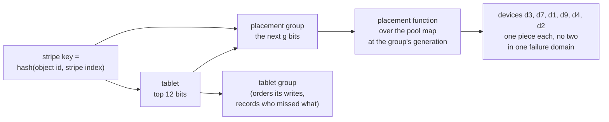

# S5. Placement and the pool map

## Context

A stripe has to land on k+m devices of its pool, or r of them, no two in one failure domain,
and every node has to agree which without asking. An object of any size spreads over a pool
because each of its stripes is placed on its own (R13); a pool of one class stays on that
class (R17).

Ceph answers with placement groups and CRUSH: an object's name hashes to a placement group,
and a function of the cluster's map sends the group to an ordered list of devices. This page
takes the first idea and changes where the group comes from, for a reason that is specific to
Shoal: here a placement group has to be something a tablet group already owns.

## What exists today

Tablets are placed by one rule over an ordered list of nodes. For tablet `t` over `N` placed
nodes, copy `k` lives on `placement[(t + k) % N]` at slot `(t / N) % slots`
(`rule_replicas_of`, `shoal-core/src/server/map.rs:681-697`). A replica set that a move
changed is recorded as an exception, a `DataConfiguration`
(`shoal-core/src/server/control/migrate.rs:39-48`), and nothing for a single tablet is on the
map otherwise ([C4](../distributed/tablet-map.md#the-placement-rule)).

- **The map is pushed whole**, to every shard and every subscribed client, on every committed
  change, and a shard installs only a newer version
  (`MapCell::install`, `map.rs:1237-1244`). At sixty-four members and sixteen tables a frame
  is 13,493 bytes and reaches a thousand subscribers in about four milliseconds
  ([Q11 and Q13 at M3](../distributed/protocol.md#q11-and-q13-at-m3)). That measurement is
  why the map is a rule and its exceptions.
- **The rule has no weights and no domains.** At `N = RF` every node holds every tablet. A
  rebalance is the planner moving whole replica sets by the bytes each holder reports
  (`shoal-core/src/server/control/planner.rs`), and each move is an openraft membership
  change ([C8](../distributed/rebalancing.md#a-move)).
- **A tablet is the top twelve bits of a key**, and the comment where that is computed says
  what the remaining bits are for: "take the high bits of the key, which is what leaves room
  for a later split" (`shoal-core/src/server/ring.rs:343-349`).
- **An apply reads its own group's state and nothing else.** A tablet group's state machine
  is a function of the commands committed in that group. It cannot consult the control group
  when it applies.

## The design

### A placement group is a sub-range of a tablet

A stripe's key, the hash of its object id and stripe index, puts its row in one tablet. A
**placement group** is a sub-range of one tablet's keys: the tablet, then the next few bits.
Every stripe whose key falls in the range belongs to it, whether or not the stripe has a row
yet ([S3](objects.md#the-two-rows)).

That choice repairs a fault an independent review found in the first form of this design
([S18](contract.md#decision-record)). If placement groups were hashed on their own, as
Ceph's are, a device would hold pieces whose rows were scattered over every tablet group,
and nothing would map a placement group to its rows: a device coming back would have nobody
to ask what it had missed. With a placement group inside one tablet, the tablet's group
**is** the placement group's log. It orders the writes to the group's stripes
([S7](write-path.md)), it holds the record of which devices missed which writes
([S10](recovery.md#how-a-device-learns-what-it-missed)), and its leader drives the group's
rebuilds and scrubs, as a group's leader drives a repair today.

How many placement groups a tablet holds is [Q19](contract.md#questions-to-answer). One is
the simplest, at 4096 a bucket; more makes a move smaller and the balance finer, at the cost
of more state in each group.

### The placement function

It takes a placement group, a storage pool and the pool map at one generation, and returns an
ordered list of devices: `r` for a replicated pool, `k + m` for an erasure coded one. The
order matters, since piece `i` lives on the device at position `i`.

| It must | Because |
| --- | --- |
| Be a function of the map alone | Every node computes it and none is asked. Nothing for a placement group is on the map ([P18](contract.md#the-contract)) |
| Never put two pieces in one failure domain | [P11](contract.md#the-contract) counts distinct domains |
| Spread by weight | Devices differ in size, and a pool mixes them |
| Move little when a device is added or removed | Every piece moved is a copy over a network, under a budget |
| Keep positions | When one device leaves, only its position changes hands. A piece that slid to another position would be a different piece |

Three candidates, to be chosen by [X2](spikes.md#x2-placement-simulation):

| Candidate | For | Against |
| --- | --- | --- |
| The tablet rule extended: a window over an ordered device list | It is what the book already has; perfect balance over equal devices | No weights; almost every placement group moves when the list changes length |
| **Weighted rendezvous** over the pool's devices, taking the best-scoring device in each new failure domain, position by position | Movement is confined to the device that changed, which is the property Ceph's `straw2` was written for; weights are natural | Balance is statistical, and poor over a handful of devices |
| A table the planner assigns and the control group commits | Any balance wanted; nothing statistical | A record for each placement group on a pushed map |

The preferred direction is the second, with the third's idea kept for what the rule gets
wrong: **a rule and its exceptions**, as the tablet map is. Ceph documents the property the
rule is chosen for: `straw2` "achieves the original goal of changing mappings only to or
from the bucket item whose weight has changed" (`doc/rados/operations/crush-map.rst` at
`v20.2.0`). The lab is the hard case for it, not the easy one: three hosts and six devices is
exactly where a statistical rule balances worst, and X2 runs that shape first.

### Failure domains

A device's failure domains are its own id and its host, the second reported by its member
([S1](prerequisites.md#required)). A pool names which one its pieces must not share. The
field is a list from the start, so a rack is a third entry and not a format change.

A pool that asks for more domains than its devices span cannot place anything, and says so
([S4](pools-and-devices.md#what-a-node-checks-before-it-serves-a-pool)). On three hosts a
host domain allows a width of three and no more: `replicas: 3`, or 2+1.

### The pool map

The control group commits it and every shard holds it:

| Part | Holds |
| --- | --- |
| Storage pools and bindings | The policy of [S4](pools-and-devices.md#pools-and-bindings-are-policy) |
| Devices | For each: id, node, failure domains, class, weight, state |
| Generations | A number that moves whenever a change alters where any placement group belongs, with enough of each generation kept to compute the function at it for as long as a placement group is still there |
| Moves in flight | The placement groups that are between two generations ([S10](recovery.md#moves)) |

It is pushed whole, as the tablet map is, and it is held to the same budget: it grows with
devices and with moves in flight, never with placement groups, stripes or objects. A client
is not pushed it at first, since a client places nothing
([Q15](contract.md#questions-to-answer)).

### Generations

The pool map says where pieces **should** be. Where a placement group's pieces **are** is a
separate fact, and it is committed in a separate place: the tablet group that owns the
placement group records the generation its pieces sit under.

It has to be there, and not read from the map, for the reason given above: an apply reads
only its own group's state. The same review found that placement was recorded nowhere a
commit could check, so a write staged under an old map could commit after the map had moved
and leave its pieces where no reader would look.

- **A placement group has a generation**, held in its tablet group's state. Its pieces are
  on the devices the function gives at that generation.
- **A commit names the generation it was staged under** and is refused unless that is the
  placement group's. This is the third condition of
  [P8](contract.md#the-contract).
- **A move changes the generation by a commit in that group**, after the pieces are where
  the new generation says. While a move is in flight the group holds both, a write stages on
  both sets of devices, and a commit names both ([S10](recovery.md#moves)).
- **A reader learns the generation where it reads the row.** Every read of a stripe consults
  the stripe table ([S9](read-path.md)), and the answer, row or no row, carries the placement
  group's generation. No reader computes holders from "the current map".

### A stale map

A node staging with an old map sends pieces to devices that may no longer be the group's. A
holder judges a stage against the map it holds and refuses one for a placement group it no
longer serves, as a shard answers `StaleTopology` to a forward for a tablet it no longer
serves ([C4](../distributed/tablet-map.md#staleness)). The refusal is a courtesy that saves
the bytes; the commit's condition is what makes it safe.

## Alternatives rejected

**Placement groups hashed apart from tablets**, as Ceph hashes an object's name. See above:
it leaves a placement group with no log.

**Pieces on the replica set of the metadata's tablet.** It is the wrong width for k+m, it is
nodes and not devices, and it ties a pool's size to the cluster's replication factor.

**The device list in every stripe's row.** It makes placement explicit and immune to a map
change, at the price of bytes in every row, a row for every stripe (written in place or not),
and a commit for every stripe a move touches.

**CRUSH whole**, with its hierarchy of typed buckets and its rule language. Two levels are
all a deployment here has. The function is small enough to write and to simulate, and
[X14](spikes.md#x14-ceph-and-s3-at-the-source) reads how Ceph keeps positions stable for an
erasure coded pool before this page claims to do the same.

**A record for each placement group on the pushed map.** It is the tablet chapter's decision
again: at 4096 groups a bucket it multiplies a frame by three orders of magnitude.

## What it costs

A second map to commit, push and hold. State in each tablet group for each of its placement
groups: a generation, and during a move two. A placement function evaluated wherever a stripe
is staged or read, which is why its cost a lookup is one of X2's numbers.

A statistical rule over few devices wastes space: the fullest device fills first. Exceptions
are the remedy and also a cost, since each is a move.

## What it breaks

- "The tablet map is the map": there are two, and a shard installs both.
- "A group's state is what its tables need": it also holds placement groups.
- "Nothing in Shoal has a failure domain": a device has two.

## Invariants to uphold

- A placement group never spans two tablets.
- The function is deterministic over the pool map at a generation, and no two pieces of a
  stripe share a failure domain of the pool's kind.
- A piece's position is its index in the function's answer and does not change while its
  device stays.
- Where a placement group's pieces are is committed in its tablet group, and a commit that
  names another generation is refused.
- A generation is kept in the pool map for as long as any placement group is at it.
- Nothing for a placement group, a stripe or an object is on a pushed map, except a move in
  flight.

## Prerequisites

[S1](prerequisites.md#required): a failure domain on a member and free bytes for each root.
[S4](pools-and-devices.md) for what is being placed.

## How it would be measured

[X2](spikes.md#x2-placement-simulation) is a pure simulation and needs no hardware. For each
candidate over the lab's shape and over larger ones it reports how unevenly devices fill, how
many pieces move when a device is added, removed or reweighted against the least that could,
how often the domain rule cannot be met, the pool map's bytes and what a lookup costs. The
map's fanout is `shoal-spike fanout` with a pool map in the frame.

## Acceptance tests

| Test | Asserts | Milestone |
| --- | --- | --- |
| `placement_never_shares_a_failure_domain` | Over generated maps, no placement group's answer holds two devices of one host under a host domain, or one device twice | M14 |
| `placement_moves_only_what_changed` | Adding, removing or reweighting one device changes only positions that device held or takes | M14 |
| `commit_names_the_generation_it_was_staged_under` | A write staged under an old generation is refused once its placement group has moved, and its pieces are never read | M16 |
| `map_change_cannot_make_a_piece_current` | A device the map newly names holds no current piece until a rebuild commits one | M16 |
| `pool_map_holds_nothing_for_a_stripe` | The pushed frame is byte for byte the same before and after a run of objects is written to a pool | M15 |

## Related

[S4](pools-and-devices.md) for pools and devices; [S7](write-path.md) for the commit that
checks a generation; [S10](recovery.md) for moves; [C4](../distributed/tablet-map.md) for
the map this one sits beside; [S17](prior-art.md#ceph) for placement groups and CRUSH.
