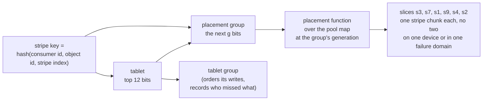

# S5. Placement and the pool map

## Context

A stripe has to land on k+m slices of its pool, or r of them, no two in one failure domain,
and every node has to agree which without asking. An object of any size spreads over a pool
because each of its stripes is placed on its own (R13); a pool of one class stays on that
class (R17).

Ceph answers with placement groups and CRUSH: an object's name hashes to a placement group,
and a function of the cluster's map sends the group to an ordered list of OSDs. This page
takes the first idea and changes where the group comes from, for a reason that is specific to
Shoal: here a placement group has to be something a tablet group already owns.

## What exists today

Tablets are placed by one rule over an ordered list of nodes. For tablet `t` over `N` placed
nodes, copy `k` lives on `placement[(t + k) % N]` at slot `(t / N) % slots`
(`rule_replicas_of`, `shoal-core/src/server/map.rs:681-697`). A replica set that a move
changed is recorded as an exception, a `DataConfiguration`
(`shoal-core/src/server/control/migrate.rs:39-48`), and nothing for a single tablet is on the
map otherwise ([C4](../distributed/tablet-map.md#the-placement-rule)).

- **The map is pushed whole**, to every shard and every subscribed client, on every committed
  change, and a shard installs only a newer version
  (`MapCell::install`, `map.rs:1237-1244`). At sixty-four members and sixteen tables a frame
  ~~is 13,493 bytes and reaches a thousand subscribers in about four milliseconds~~
  ([Q11 and Q13 at M3](../distributed/protocol.md#q11-and-q13-at-m3)) is 16,555 bytes, measured
  again by [X2](placement-simulation.md#todays-tablet-frame-again) after F46 added two fields
  to every member, and reaches a thousand subscribers in 5.0 ms on europa and 11.2 ms on titan.
  F45's configured sets grow it to 50,004 bytes once sixty-four replica sets have moved. That
  measurement is why the map is a rule and its exceptions.
- **The rule has no weights and no domains.** At `N = RF` every node holds every tablet. A
  rebalance is the planner moving whole replica sets by the bytes each holder reports
  (`shoal-core/src/server/control/planner.rs`), and each move is an openraft membership
  change ([C8](../distributed/rebalancing.md#a-move)).
- **A tablet is the top twelve bits of a key**, and the comment where that is computed says
  what the remaining bits are for: "take the high bits of the key, which is what leaves room
  for a later split" (`shoal-core/src/server/ring.rs:343-349`).
- **An apply reads its own group's state and nothing else.** A tablet group's state machine
  is a function of the commands committed in that group. It cannot consult the control group
  when it applies.

## The design

### A placement group is a sub-range of a tablet

A stripe's key, the hash of its consumer id, object id and stripe index, puts its row in one
tablet. A **placement group** is a sub-range of one tablet's keys: the tablet, then the next
few bits. Every stripe whose key falls in the range belongs to it, whether or not the stripe
has a row yet ([S3](objects.md#the-two-rows)). A consumer's stripes and another's never share
a placement group, since the consumer id is in the key.

That choice repairs a fault an independent review found in the first form of this design
([S18](contract.md#decision-record)). If placement groups were hashed on their own, as
Ceph's are, a slice would hold chunks whose rows were scattered over every tablet group,
and nothing would map a placement group to its rows: a slice coming back would have nobody
to ask what it had missed. With a placement group inside one tablet, the tablet's group
**is** the placement group's log. It orders the writes to the group's stripes
([S7](write-path.md)), it holds the record of which slices missed which writes
([S10](recovery.md#how-a-slice-learns-what-it-missed)), and its leader drives the group's
rebuilds and scrubs, as a group's leader drives a repair today.

How many placement groups a tablet holds is [Q19](contract.md#questions-to-answer). One is
the simplest, at 4096 a consumer; more makes a move smaller and the balance finer, at the cost
of more state in each group. **[X2](placement-simulation.md#two-kinds-of-imbalance) decided it
(2026-10-03): it is the pool's, a power of two fixed when the pool is made.** It is chosen so
that one consumer puts about two thousand chunks on each device: one on the lab, eight at six
hosts of twelve for 4+2, sixty-four at fifty hosts for 10+4. Balance is statistical, and the
lab's six devices and fifty hosts' twelve hundred need numbers two orders of magnitude apart.
A placement group's prefix is the tablet's twelve bits and log2 of that number, so the number
also bounds how far a tablet can later split under the pool before a split splits placement
groups.

### The placement function

It takes a placement group, a storage pool and the pool map at one generation, and returns
~~an ordered list of slices~~ a set of slices: `r` for a replicated pool, `k + m` for an
erasure coded one. ~~The order matters, since stripe chunk `i` lives on the slice at position
`i`.~~ Stripe chunk `i` lives on the slice at position `i`, and which member of the set holds
which position is the tablet group's, not the function's
([positions](#positions)): X2 found that no function of the map can keep them. No two of the
slices are on one device, and under a host domain no two are on one host.

| It must | Because |
| --- | --- |
| Be a function of the map alone | Every node computes it and none is asked. Nothing for a placement group is on the map ([P18](contract.md#the-contract)) |
| Never put two chunks on one device, or in one failure domain | [P11](contract.md#the-contract) counts distinct domains, and two slices of one device fail together |
| Spread by weight | Devices differ in size, and a pool mixes them. A slice carries an equal share of its device's weight |
| Move little when a device is added or removed | Every chunk moved is a copy over a network, under a budget |
| Keep positions | When one slice leaves, only its position changes hands. A chunk that slid to another position would be a different chunk. ~~Met by the function~~ Met by the tablet group's state, which X2 found is the only way ([positions](#positions)) |

Three candidates, to be chosen by [X2](spikes.md#x2-placement-simulation):

| Candidate | For | Against |
| --- | --- | --- |
| The tablet rule extended: a window over an ordered slice list | It is what the book already has; perfect balance over equal devices | No weights; almost every placement group moves when the list changes length |
| **Weighted rendezvous** over the pool's slices, taking the best-scoring slice in each new failure domain, ~~position by position~~ for the set alone | Movement is confined to the slices that changed, which is the property Ceph's `straw2` was written for; weights are natural | Balance is statistical, and poor over a handful of devices |
| A table the planner assigns and the control group commits | Any balance wanted; nothing statistical | A record for each placement group on a pushed map |

The preferred direction is the second, with the third's idea kept for what the rule gets
wrong: **a rule and its exceptions**, as the tablet map is. Ceph documents the property the
rule is chosen for: `straw2` "achieves the original goal of changing mappings only to or
from the bucket item whose weight has changed" (`doc/rados/operations/crush-map.rst` at
`v20.2.0`). The lab is the hard case for it, not the easy one: three hosts and six devices is
exactly where a statistical rule balances worst, and X2 runs that shape first.

**Chosen by [X2](placement-simulation.md) on 2026-10-03, and recorded on
[S18](contract.md#q19-in-part-placement-2026-10-03):** the second, drawn flat over the pool's
slices, for the set alone. Three results came with it:

- **The lab was not the hard case.** On three hosts of two devices the fullest device is 3.7%
  over the mean at one placement group a tablet, and 0.9% at four.
- **The property held for sets.** Every change on every shape moved exactly the least it could.
- **Positions did not.** Taking the best slice in each new domain "position by position", as
  this page first said, moved 1.4 to 8.4 times the least on an erasure coded pool, because any
  change to a draw reshuffles the order.

Drawing down the hierarchy, host then device then slice, makes a lookup cheaper. But it moves a
host's weight with each device's and costs 1.5 to 2.3 times the least, so the draw is flat.

#### The score

A slice's score for a placement group is `-log2(u / 2^64) × (1 / w)`, and the lowest wins:
`straw2`'s comparison, written the other way round. `u` is SplitMix64's output function over
the group's key and the slice's key. That is a definition of five lines, not a crate's, by
[X5](checksums.md)'s rule for anything persisted. `w` is the slice's equal share of its device's
placement weight. The logarithm is read from a fixed-point table of `log2(1 + i/4096)` with
linear interpolation, frozen as constants, and nothing after it is more than one IEEE multiply.
libm's `ln` chose differently from the table for 4 of 39 million chunks at near ties, and any
rate above zero is a chunk one node stages where another reads. ~~Ceph's `crush_ln` exists for
the same reason.~~ Ceph's `crush_ln` is a fixed-point logarithm from tables too, but its source
gives no reason for it ([X14](ceph-and-s3-sources.md#5-placement-indep-upmap-and-crush-compat)):
the reason is ours. The set is each domain's best slice and the `width` domains whose best slices
score lowest, found in one pass over the pool's slices.

#### Positions

**A placement group's positions are its tablet group's state**, beside its generation:

- **When the group is first placed**, they are the order of its domains' scores.
- **When a move switches it to a new generation**, the commit that switches it records the new
  ones. A member that stays keeps its position, and one that arrives takes the position a
  departing member vacated.
- **A group that has never moved needs no record.** One that has needs a permutation of at most
  sixteen positions, which is eight bytes.
- **A stager and a reader learn the positions where they already learn the generation**: from
  the group, with the row ([generations](#generations)).

No function of the map can keep positions. Take three members A, B and C and two positions. If
{A, B} gives A position 0 and B position 1, then:

- B's departure for C has to give C position 1 in {A, C};
- A's departure for C has to give C position 0 in {B, C};
- so the change from {A, C} to {B, C} moves C, which nothing called for.

The rules X2 tried that compute positions from the map all shuffled them. Drawing each position
on its own, as CRUSH's `indep` mode does, moved 1.1 to 2.6 times the least. A matching that no
weight enters moved 2 to 3 times once the set's domains changed. Held as state, positions moved
exactly the least everywhere ([X2](placement-simulation.md#positions)). Ceph's own `indep`, run
by [X14](ceph-and-s3-sources.md#5-placement-indep-upmap-and-crush-compat) through `crushtool` on
X2's shapes, moved 2.0 to 3.5 times the least for a device added, removed or reweighted, since it
draws down the hierarchy. A device marked out moved the least wherever the pool was narrower than its domains,
and removing that device afterwards moved 1.1 to 2.9 times the least again.

#### Seats and placement weights

**A device is drawn by its seat, not its identity.** A seat is a key minted with the device and
committed in the pool map, and a device the operator names as a replacement takes over its
predecessor's. The replacement is still a new device that comes up holding nothing
([S4](pools-and-devices.md#a-device-has-slices)), but it is drawn for the same groups. Under a key
of its own it takes a fresh share, and its predecessor's share scatters over everyone. X2
measured that at 1.3 to 2.2 times the least for a set, and up to 14 times for positions.

**A device has a placement weight beside its capacity**, equal to it unless the planner fits
another. Drawing several devices of unequal weight without replacement includes a heavy one less
than in proportion. That bias is systematic, and more placement groups do not cure it: six hosts
of 4 TB and 16 TB devices stay 9.8% over at forty thousand chunks a device, and the exceptions to
fix it grow with the data. The planner fits placement weights against a sample of many groups,
only for a pool whose devices differ in weight. Fitted to a sample of eight consumers, they took
another consumer's exceptions from 7,708 to 141. What is left is statistical, and is exceptions'
work: none on the lab from four groups a tablet, a few hundred at six hosts of twelve.

### Failure domains

A device's failure domains are its own id and its host, the second reported by its member
([S1](prerequisites.md#required)). A pool names which one its chunks must not share. The
field is a list from the start, so a rack is a third entry and not a format change.

A slice is never a failure domain. Its domains are its device's: two slices of one device
fail together, so they are never two failure domains, and a device given four slices so
that four cores drive it still holds one chunk of a stripe at most.

A pool that asks for more domains than its devices span cannot place anything, and says so
([S4](pools-and-devices.md#what-a-node-checks-before-it-serves-a-pool)). On three hosts a
host domain allows a width of three and no more: `replicas: 3`, or 2+1.

A pool exactly as wide as its domains puts a chunk of every group in every domain, so it fills
at the pace of its smallest domain whatever the function does. The lab as fitted is that case:
europa's two devices weigh 1,192 GiB, and titan's and hyperion's 466 each. A pool three wide
over the three hosts fills the Zen1 hosts 52% faster than the mean, under the planner's own
table as under rendezvous ([X2](placement-simulation.md#the-lab)).

### The pool map

The control group commits it and every shard holds it:

| Part | Holds |
| --- | --- |
| Storage pools and bindings | The policy of [S4](pools-and-devices.md#pools-and-bindings-are-policy) |
| Devices | For each: id, node, failure domains, class, ~~weight~~ capacity weight, placement weight, seat, state |
| Slices | For each: id, its device, state |
| Generations | A number that moves whenever a change alters where any placement group belongs, with enough of each generation kept to compute the function at it for as long as a placement group is still there. Kept as change records: a device carries the generation it joined at and the one it left at, and a reweight is one record ([X2](placement-simulation.md#what-the-map-holds-over-time)) |
| Moves in flight | The placement groups ~~that are between two generations~~ the planner is moving, one a device ([S10](recovery.md#moves)). The groups a change will move but has not started are not listed: the two generations say which they are, and each one's tablet group says whether it has moved |
| Exceptions | A slice for one position of one placement group, where the planner moved a chunk off the rule's answer |

~~It is pushed whole, as the tablet map is~~ It is derived on every node from the control
group's committed commands, as the tablet map is, and held by the node's shards behind an `Arc`.
So each change crosses the network as one command of a few hundred bytes. It is held to the same
budget as the tablet map: it grows with devices, slices, moves in flight and exceptions, never
with placement groups, stripes or objects. X2 sized it at 2.7 KB on the lab, 22 KB at six hosts
of twelve and 361 KB at fifty of twenty-four
([X2](placement-simulation.md#the-pool-maps-frame)). A client is not pushed it ~~at first~~,
since a client places nothing ([Q15](contract.md#questions-to-answer)). If one ever is, it is
pushed deltas: the whole frame at fifty hosts would take a quarter of a second a version to a
thousand subscribers on a Zen1 core.

### Generations

The pool map says where stripe chunks **should** be. Where a placement group's chunks
**are** is a separate fact, and it is committed in a separate place: the tablet group that
owns the placement group records the generation its chunks sit under.

It has to be there, and not read from the map, for the reason given above: an apply reads
only its own group's state. The same review found that placement was recorded nowhere a
commit could check, so a write staged under an old map could commit after the map had moved
and leave its chunks where no reader would look.

- **A placement group has a generation**, held in its tablet group's state, and its
  positions beside it ([positions](#positions)). Its chunks are on the slices the function
  gives at that generation, each at the position the group records.
- **A commit names the generation it was staged under** and is refused unless that is the
  placement group's. This is the third condition of
  [P8](contract.md#the-contract).
- **A move changes the generation by a commit in that group**, after the chunks are where
  the new generation says, and the same commit records the positions. While a move is in flight the group holds both, a write stages on
  both sets of slices, and a commit names both ([S10](recovery.md#moves)).
- **A reader learns the generation, and the positions, where it reads the row.** Every read of a stripe consults
  the stripe table ([S9](read-path.md)), and the answer, row or no row, carries the placement
  group's generation. No reader computes holders from "the current map".

### A stale map

A node staging with an old map sends chunks to slices that may no longer be the group's. A
holder judges a stage against the map it holds and refuses one for a placement group it no
longer serves, as a shard answers `StaleTopology` to a forward for a tablet it no longer
serves ([C4](../distributed/tablet-map.md#staleness)). The refusal is a courtesy that saves
the bytes; the commit's condition is what makes it safe.

## Alternatives rejected

**Placement groups hashed apart from tablets**, as Ceph hashes an object's name. See above:
it leaves a placement group with no log.

**Stripe chunks on the replica set of the metadata's tablet.** It is the wrong width for
k+m, it is nodes and not slices, and it ties a pool's size to the cluster's replication factor.

**The slice list in every stripe's row.** It makes placement explicit and immune to a map
change, at the price of bytes in every row, a row for every stripe (written in place or not),
and a commit for every stripe a move touches.

**CRUSH whole**, with its hierarchy of typed buckets and its rule language. Two levels are
all a deployment here has. The function is small enough to write and to simulate, and
~~[X14](spikes.md#x14-ceph-and-s3-at-the-source) reads how Ceph keeps positions stable for an
erasure coded pool before this page claims to do the same~~
[X14](ceph-and-s3-sources.md#5-placement-indep-upmap-and-crush-compat) read how Ceph keeps
positions for an erasure coded pool. Each position draws on its own, a position that finds
nothing is left a hole rather than shifted (`src/crush/mapper.c:633-805`), and a change to a
device's weight moves positions on its siblings too. This page keeps positions as state instead.

**A record for each placement group on the pushed map.** It is the tablet chapter's decision
again: at 4096 groups a consumer it multiplies a frame by three orders of magnitude.

**Positions computed by the function** ([X2](placement-simulation.md#positions)). It was this
page's first statement. No function of the set alone keeps positions, and the ones tried moved
1.1 to 8.4 times the least on an erasure coded pool.

**Drawing down the hierarchy**, as CRUSH's buckets do. A lookup at fifty hosts of four-slice
devices costs 3.9 µs on titan where flat costs 40. But a device's change moves its host's
weight, and that moves chunks off devices that did not change: 1.5 to 2.3 times the least. A
node caches a group's answer by generation, so the lookup is paid once a change, and the bytes
would be paid every time.

**The whole answer in the tablet group**, a slice for every position of every placement group.
A lookup would be a read. But every group that ever placed anything would hold its whole
answer in every replica: 4.4 GB across a cluster of three replicas at a hundred consumers,
sixty-four groups a tablet and 10+4. Positions alone are a permutation, held only for a group
that has moved.

**A device drawn by its identity.** A replacement takes a fresh share, and its predecessor's
scatters: 1.3 to 2.2 times the least for a set.

**libm's logarithm.** It is not specified to the last bit, and it chose differently for 4 of 39
million chunks. It is also half as fast as the table.

## What it costs

A second map to commit, ~~push~~ derive and hold. State in each tablet group for each of its
placement groups: a generation, and during a move two, and positions for a group that has
moved. A placement function evaluated wherever a stripe is staged or read, which is why its
cost a lookup is one of X2's numbers. It is about ten nanoseconds a slice on a Zen1 core: 132 ns
on the lab, 12 µs at 1,200 slices and 40 µs at 4,800. The answer for a group at a generation
never changes, so a node keeps it
([O87](../appendix/optimizations.md#o87-a-placement-answer-is-computed-again-on-every-lookup)).

A statistical rule over few devices wastes space: the fullest device fills first. On the lab's
shape that is 3.7% at one placement group a tablet. Exceptions are the remedy and also a cost,
since each is a move. Fitted placement weights are the remedy for mixed sizes, and each refit is
a move too, of about 1.03 to 1.16 times what the change itself needed.

## What it breaks

- "The tablet map is the map": there are two, and a shard installs both.
- "A group's state is what its tables need": it also holds placement groups.
- "Nothing in Shoal has a failure domain": a device has two.
- "A chunk's position is its index in the function's answer": it is the tablet group's.
- "A device is drawn by its identity": it is drawn by its seat.

## Invariants to uphold

- A placement group never spans two tablets.
- The function is deterministic over the pool map at a generation, and no two chunks of a
  stripe share a failure domain of the pool's kind.
- No two chunks of a stripe are on slices of one device, whatever the pool's failure domain.
  A slice is never a failure domain.
- ~~A chunk's position is its index in the function's answer and does not change while its
  slice stays.~~ A chunk's position is recorded in its placement group's tablet group, and does
  not change while its slice stays in the set.
- The score is integers, a frozen table and one IEEE multiply. Never libm's logarithm, and
  never a hash whose definition is a crate's release.
- A seat is held by one device at a time, and passes only to a device named as its replacement.
- Where a placement group's chunks are is committed in its tablet group, and a commit that
  names another generation is refused.
- A generation is kept in the pool map for as long as any placement group is at it.
- Nothing for a stripe or an object is on the pool map. For a placement group, only a move in
  flight or an exception is.

## Prerequisites

[S1](prerequisites.md#required): a failure domain on a member and free bytes for each root.
[S4](pools-and-devices.md) for what is being placed.

## How it would be measured

~~[X2](spikes.md#x2-placement-simulation) is a pure simulation and needs no hardware.~~
Measured by [X2](placement-simulation.md) on 2026-10-03, a pure simulation with its lookups and
frames timed on the lab. For each candidate over the lab's shape and over larger ones it reports:

- how unevenly devices fill;
- how many chunks move when a device is added, removed, reweighted or replaced, against the
  least that could;
- how often the domain rule cannot be met;
- what exceptions and fitted weights a pool needs;
- the pool map's bytes, and what a lookup costs.

The map's fanout is `shoal-spike fanout` with a pool map in the frame. At M14 the frame is taken
again from the map as built and held to those figures.

## Acceptance tests

| Test | Asserts | Milestone |
| --- | --- | --- |
| `placement_never_shares_a_failure_domain` | Over generated maps, no placement group's answer holds two slices of one host under a host domain, or two slices of one device under either | M14 |
| `placement_moves_only_what_changed` | Adding, removing or reweighting one device changes only ~~positions its slices held or take~~ the sets its slices leave or join | M14 |
| `placement_is_the_same_on_every_build` | The score's table and a set of answers are frozen, and every build gives them | M14 |
| `replacement_in_its_seat_moves_nothing_else` | A device that takes over a seat is given exactly its predecessor's groups | M14 |
| `positions_survive_a_set_change` | A move keeps every staying member at its position, and gives an arriving member a vacated one | M16 |
| `commit_names_the_generation_it_was_staged_under` | A write staged under an old generation is refused once its placement group has moved, and its chunks are never read | M16 |
| `map_change_cannot_make_a_chunk_current` | A slice the map newly names holds no current chunk until a rebuild commits one | M16 |
| `pool_map_holds_nothing_for_a_stripe` | The pushed frame is byte for byte the same before and after a run of objects is written to a pool | M15 |

## Related

[S4](pools-and-devices.md) for pools, devices and slices; [S7](write-path.md) for the commit that
checks a generation; [S10](recovery.md) for moves; [C4](../distributed/tablet-map.md) for
the map this one sits beside; [S17](prior-art.md#ceph) for placement groups and CRUSH.
