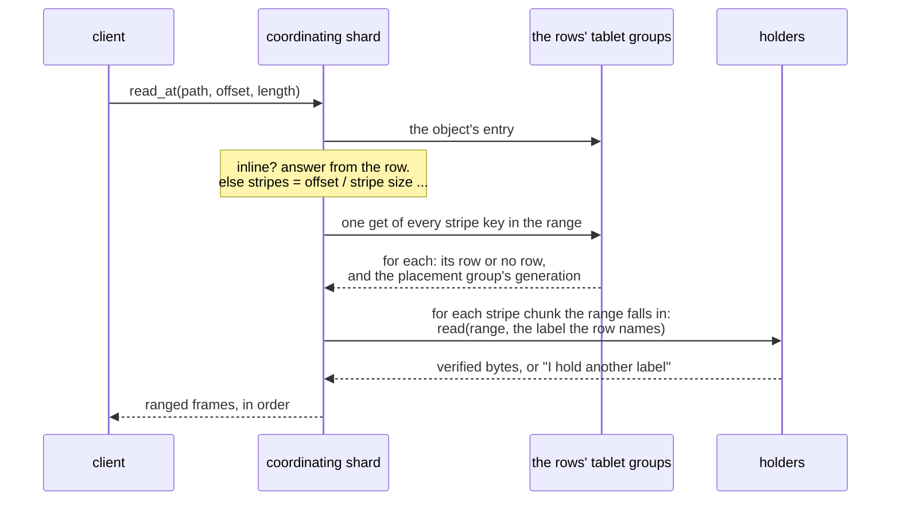

# S9. The read path

## Context

Objects are seekable (R12): a reader asks for any range of an object of any size and should
pay for that range. Under replication that is one read from one slice. Under an erasure
code it is one read from one slice as well, provided the code is systematic and nothing is
wrong; when a holder is down, stale or lying, it is a decode.

A reader also shares the stripe with writers, and writes are in place. This page is what a
read does, which state of a stripe it may return, and why it can never be handed a mixture.

## What exists today

- **Two read levels.** `One` is "one eligible replica's committed applied state, possibly
  stale"; `Quorum` is "a data-quorum barrier, then the replica's state applied through it"
  (`shoal-proto/src/shared/protocol/read.rs:73-78`). A committed write's answer carries a
  session token, a log index in one group of one table, that a later read can be served past
  (`:142-153`; [C6](../distributed/reads.md)).
- **A get names keys.** `UnsortedGet` carries a list of partition keys
  (`shoal-proto/src/shared/queries/unsorted.rs:97-106`), and a get of several is gathered
  across the shards and nodes that own them under one deadline, ten seconds by default.
- **A miss is cheap.** "A get for a partition that has never been written costs one hash
  lookup and no IO" ([Storage Overview](../storage/overview.md#the-archive-map)).
- **A row is read whole**, and ~~an answer is one frame~~ an answer longer than one data frame
  is streamed as an opener and data frames since [F73](../features/bodies-across-frames.md), but
  still assembled whole by the client before it is handed on.

Nothing reads a range of anything, and nothing is read from a device that is not a table's
own archive.

## The design

### What a read does

1. **The object's entry**: its id, size, geometry and floors. An inline object is answered
   from the row and the read is over.
2. **The stripes.** Offset divided by stripe size gives the first stripe; a seek consults no
   index. One get names every stripe key the range covers. Most are misses for an object
   that was never patched, and a miss is a lookup. Each answer carries the placement
   group's generation ([S5](placement.md#generations)).
3. **The stripe chunks.** For a replicated stripe, any one chunk the row calls current. For
   an erasure coded one, the data chunks the range falls in. A chunk on one of this node's own
   slices is preferred, then the nearest.
4. **The read.** Each holder is asked for its part of the range **at the label the row
   names**, and answers with verified bytes or with the label it holds instead
   ([S6](device-store.md#reads)).
5. **The answer** goes to the client as ranged frames ([S12](wire-and-client.md)).

### Which state a read returns

[P12](contract.md#the-contract), in the terms of this page:

- **A default read** takes ~~each row at `One`~~ the entry at `One`, and then each stripe's
  row at `Quorum`, after the entry. It returns, for each stripe, a committed state at or after
  the row it read. It may be stale by as much as the entry's replica lags, as a default read of
  a table may. A row at `One` could be older than the entry: an extension commits after the
  write it extends over, so an entry showing the new size beside a row without the write is
  no state the object was ever in ([X1](stripe-model.md#what-the-search-found-and-the-repairs),
  P12). A cold row at `Quorum` cost 0.80 ms on a 970 EVO against 0.51 ms at `One`
  ([X10](stripe-row-costs.md#3-the-cold-commit)).
- **A reader hides by an entry at least as new as its row.** A row stamped past the epoch of
  the entry the reader took means a truncate committed in between; the reader takes the entry
  again before it hides anything by its floors. Hiding by the entry it had read showed bytes no
  committed state holds ([X1](stripe-model.md#what-the-search-found-and-the-repairs), P12).
- **A strong read** takes a barrier on the entry and on each stripe's row first. It returns
  a state at least as new as every write acknowledged before it began.
- **A session token** from a write bounds a later read of the same stripe, as it bounds a
  later read of a row.
- **Stripes are read at different instants.** A read over several stripes is not a snapshot
  of them ([P19](contract.md#the-contract)).

No level ever returns bytes of a write that did not commit. A holder serves staged bytes
only to a reader whose label names them, and a label comes from a committed row.

### A stripe chunk under another label

A holder may hold a label the reader did not ask for.

| The holder's label is | It means | The reader |
| --- | --- | --- |
| Older than the row's | The chunk is stale: its slice missed a write | Treats it as missing and reads other chunks |
| Newer than the row's | The reader's row is stale: a write committed since | Reads the row again, forward, and asks again |
| Unknown to any row state it reads | A write staged and not committed | Is never shown it |
| The base the row's pending bytes fold from | A small write rode in its commit and the holder has not folded it yet ([S7](write-path.md#small-writes)) | Lays the row's pending bytes over it: that is the state the row names |

The second row is the rule that keeps [P10](contract.md#the-contract). Accepting the newer
chunk would be harmless for a replicated stripe, whose every chunk is a whole state. For an
erasure coded one it would mean combining a chunk from one write with chunks from before
it. One rule serves both: **a reader moves its row forward and never accepts a chunk ahead
of it.**

**The last row is the only way an older label is read as the row's state**, and only with the
bytes the row holds laid over it: a reader that took the base as it was returned bytes no committed
state holds ([X1](stripe-model.md#a-small-write-in-its-commit), P12). The read names the labels the
bytes fold from beside the one it asks for, and a holder that can make one, from records it has
journalled and not yet applied, answers with it. Without that, two holders that had not heard their
records were committed each answered with an older chunk, and a reader failed by name
([X1](stripe-model.md#what-it-found-and-the-repairs)). A rebuild and a move read the same way, and
write the whole chunk at the row's label.

A stripe written continuously can make a reader try again more than once, since an apply in
place replaces what the reader was about to ask for. The retries are bounded and the read
then fails by name. ~~Whether a holder should keep a chunk's previous state for a moment, so
that a reader in flight can finish, is not designed and is noted under
[What it costs](#what-it-costs).~~ **A holder keeps a chunk's previous state until its next
apply**, and answers a reader whose label names it. X1 ran both ways: without it, readers began
to fail by name or run past the progress bound as writers were added, and with it they did not
([X1](stripe-model.md#progress-the-previous-state-and-the-reservation)). Its cost is under
[What it costs](#what-it-costs).

### Degraded reads

When a stripe chunk the read wants is stale, missing or fails a checksum:

- **replicated**: read another copy;
- **erasure coded**: read any `k` current chunks of the unit rows the range touches and
  decode those units alone ([S8](erasure-coding.md#decoding-and-rebuilding)).

A unit that fails its checksum is treated as missing and reported, so that a scrub does not
have to find it again ([S11](scrub.md)). With fewer than `k` current chunks the read of that
stripe fails by name; the other stripes of the object, and every other object, read as they
did.

### Holes and ends

A stripe inside the object's size with no row and no chunks is zeros. So is one under a
truncate's floor ([S3](objects.md#size-holes-and-truncate)). A range past the size ends
there. None of the three reads a slice.

### Streams

A long read is many stripe reads. The coordinating shard reads rows ahead, a get of many
stripe keys at a time, and reads units ahead of what the client has taken, within a window
that bounds what it holds for one stream ([S13](isolation.md#memory)). On a rotational
device reading ahead is the difference between one seek a stripe and one a unit.

### Where the bytes travel

From the holder to the coordinating shard, and from there to the client: two crossings,
since a client does not choose its node and holds no pool map. A client that read stripe
chunks itself would save one, and waits on [D7](../direction/shard-aware-routing.md)
([Q15](contract.md#questions-to-answer)).

## Alternatives rejected

**A quorum of holders.** Reading `R` stripe chunks and taking the newest is what a store
without an arbiter does. Here the row is the arbiter, so one chunk at the row's label is as
good as all of them, and a quorum would cost reads the row makes unnecessary.

**Every read through the stripe's leader.** It serializes readers with writers and removes
the retry. It adds a hop to every read and makes a leader's node carry a pool's whole read
load.

**A replicated stripe chunk trusted without its row.** One copy is a consistent state by itself,
so the row could be skipped. Then a stale copy is served with nothing to say how stale, and
a truncate or a replace is invisible to the reader. The row is one cheap lookup.

**A snapshot across stripes.** It would need every stripe of a read pinned at once, across
tablets. [P6](../distributed/protocol.md#the-contract) already declines that for rows.

## What it costs

- **A lookup for every stripe read**, batched, and cheap when it misses.
- **Two network crossings** for every byte read.
- **A decode on a degraded read**, and `k` reads where a healthy one makes one.
- **Retries under contention**, bounded, and a refusal past the bound. ~~A reader of a stripe
  that is being rewritten continuously can fail where a reader of a row would be served a
  stale row. That is a real difference from tables and it is deliberate for now: the
  alternative is to keep two states of a chunk on a slice.~~ Since X1 a holder keeps a chunk's
  previous state until its next apply, so a reader one write behind is served. That keeps two
  states of a chunk on a slice: free where a whole chunk is replaced by a rename, whose old file
  is kept until the next apply; for a partial write applied in place, a copy of the range it
  overwrites, which [S6](device-store.md) has not priced.
- **A row at `Quorum` for every stripe read**, a default one included, where a table's default
  read is served at `One`.
- **A unit read whole for a byte** ([S6](device-store.md#what-it-costs)).

## What it breaks

- "A read is answered from a shard's memory or its archives": most of an object read comes
  from slices the shard does not own.
- "An answer is one frame": a read's answer is many ([S12](wire-and-client.md)). F73 already made
  a long answer many frames; what is new is an answer handed on before all of it has arrived.
- "A stale read is still an answer": see the contention item above.

## Invariants to uphold

- A reader asks a holder for a label and combines only chunks that answered with the labels
  one row state names.
- A reader never accepts a chunk newer than its row. It moves the row forward.
- A reader takes its rows after its entry, at `Quorum`, and hides by an entry at least as new
  as the stamps of the rows it hides in.
- A holder keeps a chunk's previous state until its next apply.
- No unit that fails its checksum reaches a client or a decoder.
- A holder serves staged bytes only for a label a reader names.
- A hole is zeros, and reading one touches no slice.
- A stripe that cannot be read fails alone.

## Prerequisites

[S1](prerequisites.md#required): more than one frame for one query. [S3](objects.md),
[S5](placement.md), [S6](device-store.md) and [S7](write-path.md).

## How it would be measured

The read arms of [S15](performance.md): time to the first byte and bytes a second for a
whole object, for a range inside one stripe chunk, and for a range across chunks; each with every
holder up and with one down; each on an SSD pool and, once a disk is fitted, a rotational
one. The lookup for each stripe is priced by [X10](spikes.md#x10-what-a-stripe-row-costs)
and the stream by [X11](spikes.md#x11-streamed-bodies). X11 has: one connection under kTLS
receives about 650 MiB/s on a Zen1 core, below the 970 EVO's 857, so a read that has to run at a
device's rate asks for its ranges over more than one connection; two 1 MiB ranges in flight reach
either SSD in plaintext ([X11's record](streamed-bodies.md#2-the-window-and-what-a-stream-holds)). X10 has: a stripe row read cold at
`Quorum` through its group's leader took 0.80 ms on a 970 EVO and 0.52 ms on the Optane, and at
`One` through a member 0.51 ms, on the lab at depth one; a resident row of 1 KiB answered a get in
0.13 ms at depth 32 ([X10's record](stripe-row-costs.md#3-the-cold-commit)).

## Acceptance tests

| Test | Asserts | Milestone |
| --- | --- | --- |
| `one_reads_never_mix_and_move_forward` | A reader racing writes to a stripe returns one committed state of it, never bytes of two, and never an older state than its row | M15 |
| `strong_read_observes_prior_acknowledged_write` | A strong read begun after a write's acknowledgement returns that write or a later one, through a leader change | M15 |
| `stale_chunk_is_never_served_as_current` | A slice that missed a write is read around, and its chunk is never returned | M15 |
| `read_overlays_pending_bytes` | A read of a stripe whose small write no holder has folded returns the write, from a chunk at its base with the row's pending bytes laid over, and a read after the clear returns the same | M15 |
| `range_read_touches_only_the_chunks_it_needs` | A range inside one data chunk of a healthy k+m stripe reads one slice and decodes nothing | M18 |
| `degraded_read_decodes_only_what_it_needs` | With a holder down, a range read decodes the units it covers and no others | M18 |
| `unreadable_stripe_fails_alone` | With fewer than `k` current chunks of one stripe, that range fails by name and every other range of the object reads | M18 |

## Related

[S7](write-path.md) for what a writer is doing meanwhile; [S6](device-store.md) for a
holder's side of a read; [S8](erasure-coding.md) for decoding; [S12](wire-and-client.md)
for the frames; [C6](../distributed/reads.md) for the read levels this borrows.
