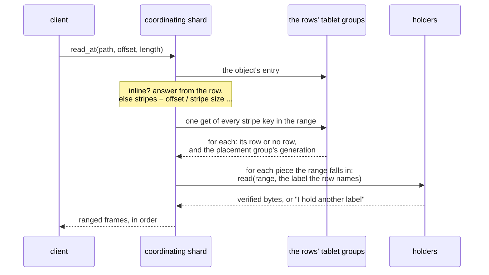

# S9. The read path

## Context

Objects are seekable (R12): a reader asks for any range of an object of any size and should
pay for that range. Under replication that is one read from one device. Under an erasure
code it is one read from one device as well, provided the code is systematic and nothing is
wrong; when a holder is down, stale or lying, it is a decode.

A reader also shares the stripe with writers, and writes are in place. This page is what a
read does, which state of a stripe it may return, and why it can never be handed a mixture.

## What exists today

- **Two read levels.** `One` is "one eligible replica's committed applied state, possibly
  stale"; `Quorum` is "a data-quorum barrier, then the replica's state applied through it"
  (`shoal-proto/src/shared/protocol/read.rs:73-78`). A committed write's answer carries a
  session token, a log index in one group of one table, that a later read can be served past
  (`:142-153`; [C6](../distributed/reads.md)).
- **A get names keys.** `UnsortedGet` carries a list of partition keys
  (`shoal-proto/src/shared/queries/unsorted.rs:97-106`), and a get of several is gathered
  across the shards and nodes that own them under one deadline, ten seconds by default.
- **A miss is cheap.** "A get for a partition that has never been written costs one hash
  lookup and no IO" ([Storage Overview](../storage/overview.md#the-archive-map)).
- **A row is read whole**, and an answer is one frame.

Nothing reads a range of anything, and nothing is read from a device that is not a table's
own archive.

## The design

### What a read does

1. **The object's entry**: its id, size, geometry and floors. An inline object is answered
   from the row and the read is over.
2. **The stripes.** Offset divided by stripe size gives the first stripe; a seek consults no
   index. One get names every stripe key the range covers. Most are misses for an object
   that was never patched, and a miss is a lookup. Each answer carries the placement
   group's generation ([S5](placement.md#generations)).
3. **The pieces.** For a replicated stripe, any one piece the row calls current. For an
   erasure coded one, the data pieces the range falls in. A piece on this node's own device
   is preferred, then the nearest.
4. **The read.** Each holder is asked for its part of the range **at the label the row
   names**, and answers with verified bytes or with the label it holds instead
   ([S6](device-store.md#reads)).
5. **The answer** goes to the client as ranged frames ([S12](wire-and-client.md)).

### Which state a read returns

[P12](contract.md#the-contract), in the terms of this page:

- **A default read** takes each row at `One`. It returns, for each stripe, a committed state
  at or after the row it read. It may be stale by as much as a metadata replica lags, as a
  default read of a table may.
- **A strong read** takes a barrier on the entry and on each stripe's row first. It returns
  a state at least as new as every write acknowledged before it began.
- **A session token** from a write bounds a later read of the same stripe, as it bounds a
  later read of a row.
- **Stripes are read at different instants.** A read over several stripes is not a snapshot
  of them ([P19](contract.md#the-contract)).

No level ever returns bytes of a write that did not commit. A holder serves staged bytes
only to a reader whose label names them, and a label comes from a committed row.

### A piece under another label

A holder may hold a label the reader did not ask for.

| The holder's label is | It means | The reader |
| --- | --- | --- |
| Older than the row's | The piece is stale: its device missed a write | Treats it as missing and reads other pieces |
| Newer than the row's | The reader's row is stale: a write committed since | Reads the row again, forward, and asks again |
| Unknown to any row state it reads | A write staged and not committed | Is never shown it |

The second row is the rule that keeps [P10](contract.md#the-contract). Accepting the newer
piece would be harmless for a replicated stripe, whose every piece is a whole state. For an
erasure coded one it would mean combining a piece from one write with pieces from before
it. One rule serves both: **a reader moves its row forward and never accepts a piece ahead
of it.**

A stripe written continuously can make a reader try again more than once, since an apply in
place replaces what the reader was about to ask for. The retries are bounded and the read
then fails by name. Whether a holder should keep a piece's previous state for a moment, so
that a reader in flight can finish, is not designed and is noted under
[What it costs](#what-it-costs).

### Degraded reads

When a piece the read wants is stale, missing or fails a checksum:

- **replicated**: read another copy;
- **erasure coded**: read any `k` current pieces of the codewords the range touches and
  decode those units alone ([S8](erasure-coding.md#decoding-and-rebuilding)).

A unit that fails its checksum is treated as missing and reported, so that a scrub does not
have to find it again ([S11](scrub.md)). With fewer than `k` current pieces the read of that
stripe fails by name; the other stripes of the object, and every other object, read as they
did.

### Holes and ends

A stripe inside the object's size with no row and no pieces is zeros. So is one under a
truncate's floor ([S3](objects.md#size-holes-and-truncate)). A range past the size ends
there. None of the three reads a device.

### Streams

A long read is many stripe reads. The coordinating shard reads rows ahead, a get of many
stripe keys at a time, and reads units ahead of what the client has taken, within a window
that bounds what it holds for one stream ([S13](isolation.md#memory)). On a rotational
device reading ahead is the difference between one seek a stripe and one a unit.

### Where the bytes travel

From the holder to the coordinating shard, and from there to the client: two crossings,
since a client does not choose its node and holds no pool map. A client that read pieces
itself would save one, and waits on [D7](../direction/shard-aware-routing.md)
([Q15](contract.md#questions-to-answer)).

## Alternatives rejected

**A quorum of holders.** Reading `R` pieces and taking the newest is what a store without an
arbiter does. Here the row is the arbiter, so one piece at the row's label is as good as
all of them, and a quorum would cost reads the row makes unnecessary.

**Every read through the stripe's leader.** It serializes readers with writers and removes
the retry. It adds a hop to every read and makes a leader's node carry a pool's whole read
load.

**A replicated piece trusted without its row.** One copy is a consistent state by itself,
so the row could be skipped. Then a stale copy is served with nothing to say how stale, and
a truncate or a replace is invisible to the reader. The row is one cheap lookup.

**A snapshot across stripes.** It would need every stripe of a read pinned at once, across
tablets. [P6](../distributed/protocol.md#the-contract) already declines that for rows.

## What it costs

- **A lookup for every stripe read**, batched, and cheap when it misses.
- **Two network crossings** for every byte read.
- **A decode on a degraded read**, and `k` reads where a healthy one makes one.
- **Retries under contention**, bounded, and a refusal past the bound. A reader of a stripe
  that is being rewritten continuously can fail where a reader of a row would be served a
  stale row. That is a real difference from tables and it is deliberate for now: the
  alternative is to keep two states of a piece on a device.
- **A unit read whole for a byte** ([S6](device-store.md#what-it-costs)).

## What it breaks

- "A read is answered from a shard's memory or its archives": most of an object read comes
  from devices the shard does not own.
- "An answer is one frame": a read's answer is many ([S12](wire-and-client.md)).
- "A stale read is still an answer": see the contention item above.

## Invariants to uphold

- A reader asks a holder for a label and combines only pieces that answered with the labels
  one row state names.
- A reader never accepts a piece newer than its row. It moves the row forward.
- No unit that fails its checksum reaches a client or a decoder.
- A holder serves staged bytes only for a label a reader names.
- A hole is zeros, and reading one touches no device.
- A stripe that cannot be read fails alone.

## Prerequisites

[S1](prerequisites.md#required): more than one frame for one query. [S3](objects.md),
[S5](placement.md), [S6](device-store.md) and [S7](write-path.md).

## How it would be measured

The read arms of [S15](performance.md): time to the first byte and bytes a second for a
whole object, for a range inside one piece, and for a range across pieces; each with every
holder up and with one down; each on an SSD pool and, once a disk is fitted, a rotational
one. The lookup for each stripe is priced by [X10](spikes.md#x10-what-a-stripe-row-costs)
and the stream by [X11](spikes.md#x11-streamed-bodies).

## Acceptance tests

| Test | Asserts | Milestone |
| --- | --- | --- |
| `one_reads_never_mix_and_move_forward` | A reader racing writes to a stripe returns one committed state of it, never bytes of two, and never an older state than its row | M15 |
| `strong_read_observes_prior_acknowledged_write` | A strong read begun after a write's acknowledgement returns that write or a later one, through a leader change | M15 |
| `stale_piece_is_never_served_as_current` | A device that missed a write is read around, and its piece is never returned | M15 |
| `range_read_touches_only_the_pieces_it_needs` | A range inside one data piece of a healthy k+m stripe reads one device and decodes nothing | M18 |
| `degraded_read_decodes_only_what_it_needs` | With a holder down, a range read decodes the units it covers and no others | M18 |
| `unreadable_stripe_fails_alone` | With fewer than `k` current pieces of one stripe, that range fails by name and every other range of the object reads | M18 |

## Related

[S7](write-path.md) for what a writer is doing meanwhile; [S6](device-store.md) for a
holder's side of a read; [S8](erasure-coding.md) for decoding; [S12](wire-and-client.md)
for the frames; [C6](../distributed/reads.md) for the read levels this borrows.
