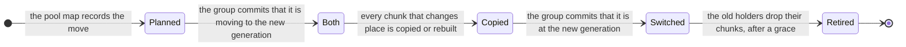

# S10. Failure, recovery and rebalancing

## Context

A pool's devices fail, fill, are replaced and are added to. A write that committed while a
holder was away has left that holder's chunk stale. A device that died has left every stripe
it held one chunk short, whichever of its slices held it. A device that was added holds
nothing on any of its slices and should hold its share. All three are the same work: **make
a stripe chunk current on a slice where it is not**, by copying it or by rebuilding it from
the others, without disturbing the writes that go on meanwhile.

This page is how the cluster knows which chunks those are, who does the work, how bytes that
are no longer wanted are removed, and what holds the work to a budget.

## What exists today

For tables, each of these has an answer built on a tablet group's own log.

- **A node that is down keeps its placement through a grace**, thirty minutes by default
  (`shoal-core/src/server/conf/cluster.rs:80`), and only then becomes a removal plan
  ([C3](../distributed/membership.md#what-follows-from-down-and-when)).
- **A replica that returns is fed its group's log, or a snapshot** when it is behind the
  purge point ([C7](../distributed/failover.md#a-returning-node)). What it missed is, by
  construction, the log's suffix.
- **A move is the group's own membership change**, driven phase by phase from a committed
  record (`MovePhase`, `shoal-core/src/server/control/migrate.rs:64`), with the source's
  copy retired for a grace of five minutes (`cluster.rs:757`).
- **A repair is driven by the group's leader**, each step committed before it is taken, so
  that the next leader resumes it (`drive_group`,
  `shoal-core/src/server/shard/repair.rs:827`).
- **Budgets**: 64 MiB/s of stream bytes, two streams assembling a shard, and a reserve of
  1 GiB checked by the receiver before a stream is accepted
  (`cluster.rs:767-784`, `shoal-core/src/server/shard/snapshots.rs:465-484`).
- **A group's derived state survives a restart by a sidecar.** The retry table is written as
  `retries.bin` beside the checkpoint and seeded from it
  (`shoal-core/src/server/wal/mod.rs:97`); it also rides in a snapshot's trailer.

None of it reaches a slice of a pool. A stripe chunk is in no group's log, a snapshot stream
carries a group's rows and is judged against a group, and the budget is not a device's. The
book says of it: "A node with two storage devices shares one budget"
([F46](../features/capacity-rebalancing.md#limitations)). The code builds it for each shard:
[item 204](../appendix/known-issues.md#204-the-stream-budget-is-built-for-a-shard-and-documented-for-a-node).

## The design

### What can happen to a holder

| Event | How it is known | What follows |
| --- | --- | --- |
| A stage is refused, fails or is late | The stager did not get its answer | The write commits without that holder if the acknowledgement rule allows, and the commit records that it missed |
| A device reports errors, or is gone | Its node marks it failed and reports it; the control group commits the state | Every slice on it is down with it, and their chunks are rebuilt on other devices at once. A dead disk does not come back holding data, so there is nothing to wait for |
| A device is full | Its node refuses stages past the reserve | Its slices keep what they hold and take no more. The planner moves placement groups off them |
| A node is down | The detector, as today | Every device of the node is down with it, and every slice on each, and the **member's grace applies**. Nothing is rebuilt until it expires; reads decode and writes proceed while the rule can be met |
| A device or a node returns | A status report | Each of its slices learns what it missed, and is brought current |
| A device is added | A join, or a restart with a new device | Its slices hold nothing. The planner moves placement groups onto them |

The grace is the Distributed chapter's R3, kept: a node that is down for ten minutes does
not cause a pool's worth of rebuilding.

### How a slice learns what it missed

It does not find out by itself. **The tablet group that owns the placement group knows**,
because every commit said so.

1. A commit names the holders its write touched that did not stage
   ([S7](write-path.md#the-preferred-direction-step-by-step)).
2. Every replica of the group derives from that, at apply, a **missed record** for each
   placement group and position: the stripes whose chunk at that position is now stale. It
   is derived state, as the retry table is.
3. When the pool map shows the slice up, the group's leader runs a **rebuild driver** for
   each of its placement groups with a record against that slice. For each stripe it asks
   the holder what label it holds (a lost acknowledgement leaves a chunk that is current
   after all), copies or rebuilds the chunk if it is stale, and commits the chunk's label in
   the stripe's row, conditional on the row's sequence so that it never overwrites a newer
   write, and on the generation and the label at its position, so that it never lands under
   another map ([X1](stripe-model.md#the-generation-and-positions-q19)). A holder it cannot ask
   is not rebuilt over: the rebuild stops and is tried again, since a chunk it could not ask
   about may be current. Its progress is committed as it goes, so a new leader resumes.
4. **The record is bounded.** Past the bound the position is marked as needing a backfill,
   and the record is dropped.
5. **A small write's clear records the same way**: a holder that does not hold the write's label
   when the leader takes its bytes out of the row is marked missed, and one that does is current
   ([S7](write-path.md#small-writes), [X1](stripe-model.md#a-small-write-in-its-commit)).

This is the reason a placement group is a sub-range of a tablet
([S5](placement.md#a-placement-group-is-a-sub-range-of-a-tablet)): the group that orders a
stripe's writes is the one place that saw every one of them.

Two things about the record are [Q17](contract.md#questions-to-answer)'s. It has to survive
a checkpoint and reach a new replica through a snapshot, as the retry table does, or a
replica built from a snapshot would call stale chunks current. And its granularity is open:
a record of stripes rebuilds a whole chunk for a 4 KiB write that was missed; a record of
unit ranges rebuilds less and is larger.

### Backfill

When the record has overflowed, or a slice is new because its device was added or replaced,
the driver compares what should be there with what is.

- **What should be there** has two sources, because a stripe written only at its object's
  creation has no row ([S3](objects.md#the-two-rows)): the engine's walk of the tablet's
  stripe rows ([S1](prerequisites.md#required)), and the inventories of the placement
  group's other holders, which are directory listings with labels
  ([S6](device-store.md#what-is-in-a-slices-directory)).
- **What is there** is the slice's own inventory.

Whatever is missing or stale is rebuilt as above. A backfill costs a walk of the placement
group, where a record costs only what was missed.

### Rebuilding a stripe chunk

- **Replicated**: read a current copy, write it whole.
- **Erasure coded**: read `k` current chunks, compute the missing one, write it whole
  ([S8](erasure-coding.md#decoding-and-rebuilding)).

Either way the new chunk is staged as a whole chunk and made current by a commit of its
label. A rebuild is therefore a write of one chunk under [S7](write-path.md)'s rules, and it
inherits them: it is refused if the row has moved, and it never mixes labels.

Where the row holds a small write's pending bytes, a chunk read at their base has them laid over
it, so the chunk written is the row's state; a rebuild that copied the base under the row's label
wrote bytes no state holds ([X1](stripe-model.md#a-small-write-in-its-commit), P9). It asks its
holder for the row's label exactly, so a holder still at the base is rewritten whole rather than
counted.

A corrupt chunk is never a source ([P15](contract.md#the-contract)). When fewer than `k`
current, verified chunks remain, the stripe is reported lost by name and nothing is
invented.

### Moves

A change to the pool map that alters where a placement group belongs makes a new
generation. The placement group's chunks are still where the old generation says, and a
**move** takes them to where the new one does.

While the group is in `Both`, a write stages on the slices of both generations and its
commit names both, so nothing written during the move is missing from either side
([S5](placement.md#generations)). Reads use the old generation until the switch. The commit
that switches also records the group's positions in the new set. Each slice that stays keeps
its position, and each that arrives takes the position of one that left, so only the chunks
whose slice changed are copied. [X2](placement-simulation.md#positions) found no function of
the map that could promise that; held as the group's state, it costs a permutation of at most
eight bytes for a group that has moved. The copy is
the rebuild above with a holder to copy from, and a move whose old holder is gone is a
rebuild. A position the row calls stale is not copied: the switch moves it and leaves it marked
missed, for a rebuild to fill on its new slice. **A slice holds one position of a stripe**, and
answers a stage, a read or a question for that position alone; a slice that two moves both
chose would otherwise answer for a chunk it does not hold
([X1](stripe-model.md#the-generation-and-positions-q19)).

The planner decides which placement groups move and in what order, one move a device at a
time, by the bytes each holds and the space each device has, as it plans replica sets today
([C8](../distributed/rebalancing.md#plans)). It is the same pure function over a different
unit.

### Reclamation

Bytes that are no longer wanted:

| What | The committed fact that allows it |
| --- | --- |
| A staged write that lost | The stripe's row names another tag at a higher sequence, and no label the row names stands on it. A write that committed and is not applied yet is beneath every later change to part of its chunk, and the row's moving past it is no fact against it ([X1](stripe-model.md#what-the-search-found-and-the-repairs), P17) |
| The chunks of a replaced or deleted object, or of a put that was abandoned | The consumer names the owner id as retired, or names it nowhere: for a bucket, the path's `ObjectMeta` entry |
| The stripes past a truncate | The owner's floor covers them: for a bucket, the entry's. The row is left a tombstone a sequence past it, never deleted ([S3](objects.md#size-holes-and-truncate)) |
| The chunks left behind by a move | The group's generation has moved past the one they sit under |
| A chunk nothing explains | The same facts, asked for by a light scrub ([S11](scrub.md)) |
| A small write's bytes in its row | A clear that found `k + f` holders holding its label durably and marked every other position missed, a staged write that carried them, or a tombstone. Until then they refer to the chunk they fold from, which a holder keeps ([X1](stripe-model.md#a-small-write-in-its-commit), P16) |

[P16](contract.md#the-contract) is the whole of the rule: a holder discards on a committed
fact that cannot be undone, and never on a timer.

**The question goes to the chunk's consumer.** A slice asks the consumer named in the chunk's
identity whether the owner id in it, an object id for a bucket, is still named. A bucket
answers from the `ObjectMeta` entry of the object's path; a file system, later, would answer
from its own metadata. Nothing here assumes the consumer is a bucket.

**Absence is judged by a strong read.** "The consumer names this id nowhere" is safe only
because an id is recorded before any chunk is written for it and is never reused, so once
it has been recorded and removed it stays gone. But a lagging replica may simply not have
applied the recording yet. A holder that discarded on that replica's word would destroy a
put in flight. So the question is asked behind a read barrier, and a default read is never
an answer to it.

**Readers get a grace, and a grace is not a permission.** The chunks of a retired object
are kept for a while so that a reader that began before the replace can finish. When they
go, a reader still at it fails by name; it is never given other bytes, since an id is never
reused.

### Budgets

Recovery, moves and scrubs are held to **bytes a second for each device**, as a source and
as a destination, and to a number of rebuilds a device runs at once. A node's single budget
cannot be right for both a rotational disk and an SSD beside it: sized for the SSD it
saturates the disk, and sized for the disk it leaves the SSD's rebuild slow and its pool
exposed for longer.

The reserve is checked where the bytes land, before a rebuild's chunk is staged, as a
snapshot stream's is today. What the budgets should be is
[Q29](contract.md#questions-to-answer), and how they sit beside foreground work is
[S13](isolation.md).

[X12](recovery-scrub-rates.md) put a rebuild to every lab device on 2026-10-09, and
[S18](contract.md#q28-and-q29-and-q17-in-part-recovery-and-scrub-rates-2026-10-09) records Q29:

- **A device's budget is a ceiling, and a rebuild is paced by the device's idle time beneath it.**
  A piece of a rebuild is issued only while the slice has no foreground operation in flight, one
  piece at a time. On titan's and hyperion's disks that rebuilt 2.3 times as fast as the best fixed
  budget that kept the foreground under twice its own, 22 to 23 MiB/s against 10. A fixed budget
  issues its pieces whatever the foreground is doing.
- **A rotational device rebuilds slowly at any pace.** Whole chunks written with the disk's cache
  off, as Q23 runs a disk, went at 22 MiB/s paced and 58 to 63 MiB/s with nothing held back. A
  16 TiB disk onto one destination is 200 hours at the pace its foreground tolerated, and 75 to 80
  with none. So a rotational pool's default layout survives a second loss while it rebuilds, and
  its rebuild is spread over the pool's devices: nine destinations finish a 16 TiB disk in a day.
- **A device's two roles are budgeted apart, as above, and a source's reads are a scrub's.** As a
  source a disk gave 46 to 58 MiB/s under twice its foreground, and the 970 EVO 385.
- **An SSD rebuilds in hours whatever the pace**: a 4 TiB 970 EVO in 4.3 hours with nothing held
  back, paced by idle time in 13 to 17. What the SSD's foreground is held to while it does is not
  settled: no pace that rebuilt anything kept the 970 EVO's under twice its own, nor any pace the
  Optane's, whose read p99 is 86 µs.

## Alternatives rejected

**A log on every slice**, as a RADOS placement group has one on every OSD that holds a shard of
it (`src/osd/PeeringState.h:1484` at `v20.2.0`). ~~It is what makes Ceph's recovery local and
fast,~~ It makes Ceph's recovery local while an OSD was away for fewer writes than the log keeps,
250 to 10,000 entries a PG, and a full backfill scan past that
([X14](ceph-and-s3-sources.md#2-peering-fencing-and-min_size)); and it is a second replicated log
to keep consistent with the first. The group already has the facts.

**Finding stale chunks by walking every row.** No scan exists for a client, and the
engine's walk is of a whole table on a shard. It is the fallback, not the method.

**A stand-in slice** that takes a down holder's writes and hands them back. It is another
place a chunk might be, and another thing a read has to consult.

**Rebuilding the moment a node is called down.** R3, again.

**Reclaiming by age.** A put that takes longer than the age loses its chunks before it
commits.

**A commit for every stripe a move touches.** It makes the move's cost linear in commits.
The generation is the placement group's, and one commit moves it.

## What it costs

- **State in each tablet group**: a generation, the positions of a group that has moved, and
  a bounded missed record for each of its placement groups, persisted with the checkpoint and
  carried in a snapshot.
- **A commit for every chunk rebuilt**, since a rebuild makes a chunk current through its
  row. A stripe with no row gains one when a chunk of it is rebuilt.
- **`k` reads for one chunk** under an erasure code, most of them over the network. On the
  lab's 1 GbE that bounds a rebuild near 117 MiB/s divided by `k`
  ([X12](spikes.md#x12-recovery-and-scrub-rates)). ✅ X12 reached 0.95 and 0.96 of the link's
  measured 112 MiB/s ÷ `k` for a 2+1 and a 4+2 rebuild into the Optane; into a disk the disk held
  it lower ([X12](recovery-scrub-rates.md#7-a-rebuild-across-hosts)). On one device a decode
  costs what its reads cost: the device's rate ÷ (`k` + 1).
- **A record's granularity has a break-even** ([Q17](contract.md#questions-to-answer)).
  Rebuilding a whole chunk for one missed 64 KiB unit costs 3 to 4 units' rebuilds on a disk, 12
  to 17 on the 970 EVO and 31 to 38 on the Optane
  ([X12](recovery-scrub-rates.md#6-one-missed-unit-q17)).
- **Space on both sides of a move** until the old side is retired.
- **A backfill walks a placement group**, and today's walk filters a whole table's keys on a
  shard to find one tablet's.

## What it breaks

- "A group's persisted state is its checkpoint and its retry table."
- "A move is a group's membership change": a placement group's move changes no membership.
- "A returning replica is fed a log": a returning slice is fed chunks, chosen by a record.
- "The stream budget is the node's" ([Q8's remainder](../distributed/open-issues.md#not-settled)):
  a device has its own.

## Invariants to uphold

- A chunk becomes current only by a commit of its label in the stripe's row. A rebuild, a
  move and a write are alike in that.
- A missed record is derived at apply, by every replica, from committed commands alone.
- A driver asks a holder what it holds before it moves a byte.
- A corrupt or stale chunk is never a source.
- A placement group's generation moves only after every chunk that changes place is current
  on its new slice, and its positions move with it, in the same commit.
- A holder discards only on a committed fact, and absence is established behind a barrier.
- A slice holds one position of a stripe, and answers only for it.
- A node that is down is not rebuilt around until its grace expires; a device that failed
  on a live node is.
- The reserve is checked where the bytes land.
- A rebuild's piece is issued only while its slice has no foreground operation in flight, under
  the device's ceiling ([X12](recovery-scrub-rates.md)).

## Prerequisites

[S1](prerequisites.md#required): the engine's walk of a tablet's rows, free bytes for every
root, and the fixture's device faults. [S5](placement.md), [S6](device-store.md) and
[S7](write-path.md).

## How it would be measured

[X12](spikes.md#x12-recovery-and-scrub-rates): bytes a second a device is rebuilt at, for a
copy and for a decode, on SSD and on a rotational disk, under a budget; from which, how long
a device of a given size is exposed. ✅ Measured on 2026-10-09 ([its record](recovery-scrub-rates.md)). In a running cluster, the event arms of
[S15](performance.md): a device killed, a node killed and returned, a device added, each
recording what the foreground's tail did before, during and after, as the rebalance arms
record it today.

## Acceptance tests

| Test | Asserts | Milestone |
| --- | --- | --- |
| `returning_device_rebuilds_exactly_what_it_missed` | A device isolated through a run of writes is brought current by rebuilding those stripes and no others | M16 |
| `missed_record_survives_restart_snapshot_and_leader_change` | A replica restarted, or built from a snapshot, or newly leading, holds the same record | M16 |
| `overflowed_record_falls_back_to_backfill` | A device away past the bound is brought current by a backfill, including stripes that have no row | M16 |
| `rebuild_never_overwrites_a_newer_write` | A rebuild racing a write to the same stripe is refused and tried again against the new row | M16 |
| `move_serves_reads_and_writes_throughout` | Every acknowledged write during a move is on the new slices after the switch; no read fails for the move | M16 |
| `rebuild_waits_for_the_slices_idle_time` | No rebuild piece is issued while its slice, as a source or as a destination, has a foreground operation in flight, and none past the device's ceiling ([X12](recovery-scrub-rates.md#2-a-rebuilds-destination)) | M16 |
| `node_down_inside_its_grace_rebuilds_nothing` | A node killed and returned inside the grace causes no rebuild, only the catch-up of what it missed | M16 |
| `discard_requires_a_committed_fact` | No holder drops a chunk on a timer, on a default read's absence, or on a stager's word | M20 |
| `retired_object_is_reclaimed` | After a replace and the grace, the old object's chunks and rows are gone and a reader of them fails by name | M20 |

## Related

[S7](write-path.md) for the commit a rebuild uses; [S5](placement.md) for generations;
[S11](scrub.md) for how damage is found; [S14](operations.md) for adding and removing a
device; [C7](../distributed/failover.md) and [C8](../distributed/rebalancing.md) for the
tablet versions of this; [F44](../features/repair.md) for the driver pattern.
