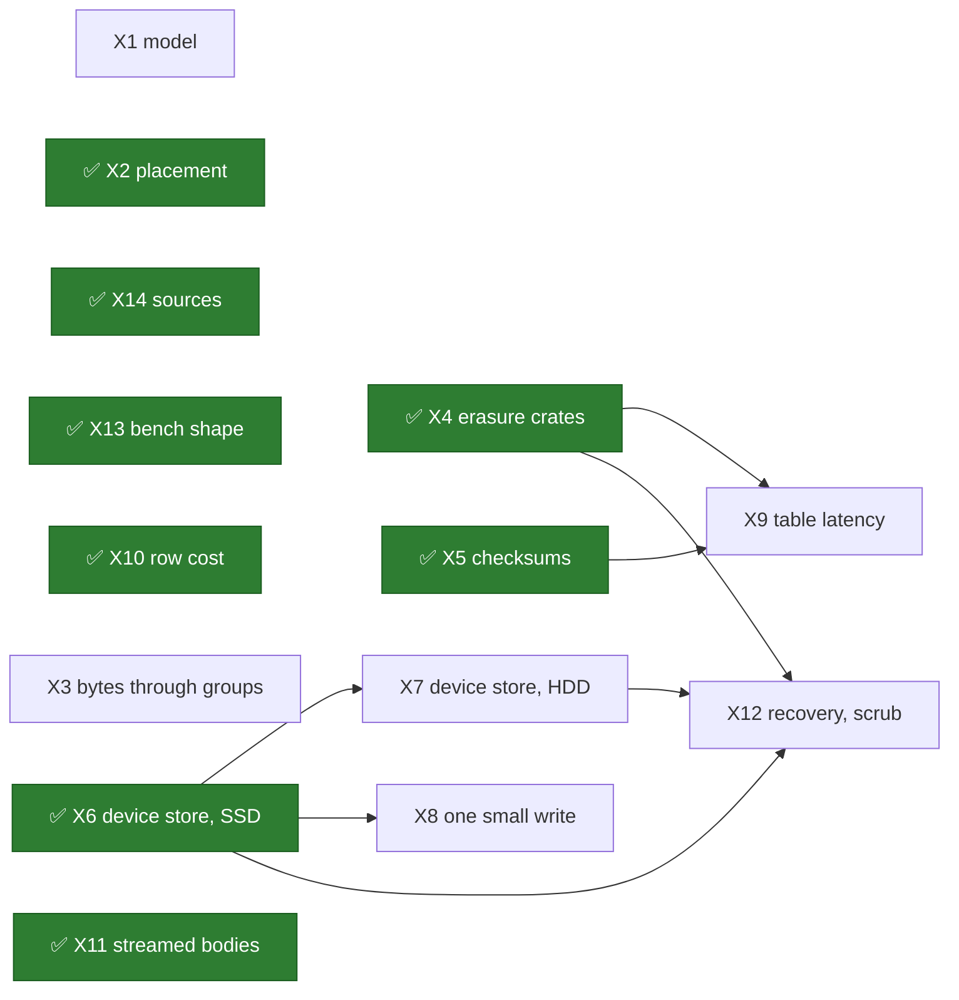

# Exploratory spikes

~~**Nothing here has been run.**~~ ~~**One spike has run**: X4, whose record is
[its own page](erasure-coding-crates.md) (2026-10-03).~~ ~~**Two spikes have run**~~ ~~**Three
spikes have run**~~ ~~**Four spikes have run**~~ ~~**Five spikes have run**~~ ~~**Six spikes have
run**~~ ~~**Seven spikes have run**~~ **Eight spikes have run**, each with its record on a page of its own: X2,
[placement](placement-simulation.md), X4, [the erasure coding crates](erasure-coding-crates.md), and
X5, [the checksums](checksums.md) (all 2026-10-03), X6, [the device store on SSD](device-store-ssd.md),
and X10, [what a stripe row costs](stripe-row-costs.md) (both 2026-10-04), and X11,
[streamed bodies](streamed-bodies.md), X13, [the benchmark's shape](benchmark-shape.md), and X14,
[Ceph and S3 at the source](ceph-and-s3-sources.md) (all three 2026-10-05). This page is the list
of what has to be
learnt before the [milestones](milestones.md) of this part can be more than a guess, and how
each thing would be learnt.

A milestone plan is a set of claims: that one design is safe, that it is fast enough, that
one part of the work comes before another. The pages before this one make those claims as
preferences and hang each on a question ([S18](contract.md#questions-to-answer)). Nineteen
questions are open. A plan drawn over nineteen open questions is an order of work nobody
should hold anyone to, which is why the milestones page says *provisional* at its top and
why this page comes first.

## What a spike is

The word has a meaning in this repository already. `shoal-spike` is a workspace binary whose
manifest says of it "Not a library and not a benchmark": it exists to answer a question a
design is blocked on, it prints tables labelled by the host and the governor it ran under,
its output is pasted into a decision record by hand, and it is never part of a capture
(`shoal-spike/Cargo.toml`). The header of its source puts it in one line: "`shoal-bench`
measures what is compared across commits; this measures what decides a design"
(`shoal-spike/src/main.rs`). The Q1 and Q13 spike measured the consensus library the
control plane and every tablet group are built on, and its tables are still on
[C13](../distributed/protocol.md#q1-and-q13-at-m1).

A spike here is the same thing:

- **It answers a question from [S18](contract.md#questions-to-answer)**, and says in
  advance what result would change the design. A measurement no result of which would
  change anything is not a spike.
- **Its code is thrown away**, with one exception: [X1](#x1-the-stripe-protocol-as-a-model),
  whose model and schedules become the first gate's acceptance test.
- **It is not a prototype of the feature.** A spike that grows a wire format or a file
  format has become the implementation without passing a gate.
- **It reports what it did not measure**, as the Q1 spike said plainly that it never
  measured the other library and why.

## How each is written

| Field | Holds |
| --- | --- |
| **Question** | The question, and the `Q` it serves |
| **What would change the design** | The result, stated before the run, that would move a preference |
| **Method** | What is built and what is run |
| **Where** | Host, device, filesystem, governor |
| **Records** | The table it prints |
| **Depends on** | Other spikes, hardware, a prerequisite |
| **Cost** | An afternoon, days, or a week. A guess, and labelled as one |

## Where a spike runs

The lab is the three hosts of `tmdb_cluster.yaml`
([cluster testing](../cluster-testing/overview.md#the-lab)):

| Host | CPU | Memory | Devices | Network |
| --- | --- | --- | --- | --- |
| europa | Ryzen 9 7945HX (Zen4), 16 cores and 32 threads. Also the development host, so its numbers carry that noise | 43 GiB | Intel Optane 900P at `/optane`, ~~btrfs~~ XFS since 2026-10-03. Samsung 990 PRO, the root device, btrfs | 1 GbE |
| titan | Ryzen Embedded V1756B (Zen1), 4 cores and 8 threads | 14 GiB | Samsung 970 EVO on one PCIe lane, ext4 at the root; since X6 an XFS volume on it at `/xfs`. Its flush costs 0.9 ms rested and 3 ms after a minute of synced writes ([X6](device-store-ssd.md#two-things-about-the-labs-970-evos)) | 1 GbE |
| hyperion | The same as titan | 14 GiB | The same as titan | 1 GbE |

**The rules a spike inherits**, which are the lab's own
([Benchmarking](../performance/benchmarking.md#before-and-after-on-the-lab)):

- Built for `znver1` in a target directory of its own and copied to the host. The workspace
  builds for the native CPU, and a native build from europa dies of SIGILL on the Zen1
  hosts. A spike that measures SIMD runs both builds on europa and says which is which.
- A scratch directory of its own on the device being measured. Never a directory the `tmdb`
  cluster uses, and never its data.
- `shoal-tmdb` stopped on the host for the measurement, the governor set to `performance`,
  and both put back afterwards, with `status` checked at three of three.
- Sides alternated by round, four rounds or more, and a difference counted only when the
  two sides' intervals do not overlap.
- Every table labelled by host, CPU, governor, device and filesystem. Nothing goes into
  `docs/perf/runs/`.

**What needs fitting** ([S1](prerequisites.md#what-the-lab-needs-fitted)):

- **Rotational disks.** One in a Zen1 host is the least that answers
  [X7](#x7-the-device-store-on-hdd). Two in each host let a 4+2 layout run over real disks
  under a device failure domain. The model, the capacity and whether the drive is shingled
  are recorded with every table, since a shingled drive answers a different question.
- ✅ **An XFS filesystem.** ~~The lab has ext4 and btrfs.~~ Fitted for X6 on 2026-10-03:
  europa's Optane was made XFS, and titan and hyperion each keep an XFS volume on their 970
  EVO at `/xfs`, an LV in the space their volume group had free. XFS is what the book
  recommends, and a clone of a range can only be measured where a filesystem shares blocks.

**What the lab cannot say, and what stands in:**

| Out of reach | Stand-in | What the stand-in is worth |
| --- | --- | --- |
| Throughput across hosts above about 117 MiB/s | Several processes over loopback on europa | It measures a core and a protocol. It says nothing about a fast network's own costs |
| k+m wider than 2+1 across hosts | Several directories a host under a device failure domain; or five children on europa | Failures and flushes are correlated within a host. The protocol is exercised, the independence is not |
| A table's files and a pool's device on separate disks | Nothing, until disks are fitted | Until then every number that mixes the two is labelled as sharing a device |
| A rotational disk, before one is fitted | **Nothing.** A device slowed by a fixed delay has no seek in it. It ranks an append to a journal and a random write in place the same, and telling those apart is what X7 is for | Not used |

## The spikes at a glance

| # | Spike | Settles | Needs | Cost |
| --- | --- | --- | --- | --- |
| X1 | The stripe protocol as a model | Q14, Q15, Q16, Q18 | Nothing | Week |
| ✅ X2 | Placement simulation, [reported](placement-simulation.md) | Q19, in part | Nothing; timed on the lab | ~~Days~~ Done 2026-10-03 |
| X3 | Bytes through the tablet groups | Q14 | The lab | Days |
| ✅ X4 | Erasure coding crates: performance and tradeoffs, [reported](erasure-coding-crates.md) | Q20, in part | titan, europa | ~~Days~~ Done 2026-10-03 |
| ✅ X5 | Checksums, [reported](checksums.md) | Q21, in part | titan, europa | ~~Afternoon~~ Done 2026-10-03 |
| ✅ X6 | The device store on SSD, [reported](device-store-ssd.md) | Q22 in part, Q27's device half | The lab; XFS, fitted | ~~Week~~ Done 2026-10-04 |
| X7 | The device store on HDD | Q23 | Disks fitted | Days |
| X8 | One small write, three ways | Q14, Q27 | The lab; X6 | Days |
| X9 | Table latency beside object work | Q15, Q24 | titan; X4, X5 | Days |
| ✅ X10 | What a stripe row costs, [reported](stripe-row-costs.md) | Q25 in part, Q17's group half | The lab | ~~Days~~ Done 2026-10-04 |
| ✅ X11 | Streamed bodies, [reported](streamed-bodies.md) | Q26 in part | europa, the lab | ~~Days~~ Done 2026-10-05 |
| X12 | Recovery and scrub rates | Q17, Q28, Q29 | X4, X6, X7 | Days |
| ✅ X13 | The benchmark's shape, [reported](benchmark-shape.md) | Q30, with F69 | europa, the lab | ~~Days~~ Mostly answered by [F69](../features/driver-operation-kinds.md); the rest done 2026-10-05 |
| ✅ X14 | Ceph and S3 at the source, [reported](ceph-and-s3-sources.md) | Q14, Q20, Q28, Q32 | Nothing; a Ceph on the lab, taken down after | ~~Days~~ Done 2026-10-05 |

## The spikes

### X1. The stripe protocol as a model

**Question.** Is the preferred direction of [S7](write-path.md) safe, under every
interleaving the failure model allows ([Q14](contract.md#questions-to-answer))? And the
three questions that are really parts of it: who stages (Q15), what the acknowledgement
rule is (Q16), and whether truncate by epoch holds (Q18).

**What would change the design.** Any violation of ~~P8 to P16~~ a clause the model checks (P7
to P13 and P15 to P17, [S16](testing.md#the-model)) under the safe policy. Three results are
expected to be close and would each move a page:

- a reader of a stripe that is written continuously cannot finish without a holder keeping
  a chunk's previous state, which would reopen
  [S9](read-path.md#a-stripe-chunk-under-another-label);
- an untouched chunk on a slice that is down cannot safely count toward `k + f`, which
  would tighten Q16;
- two stagers can starve each other without a reservation, which would make the leader's
  reservation part of the protocol and not an optimization.

**Method.** A second model in `shoal-model`, held to that crate's rules: pure, seeded, serde
alone. The actors, events, layouts, policy settings, oracle and progress check are on
[S16](testing.md#the-model). Every schedule of
[S7](write-path.md#the-schedules-that-shaped-it) is saved, ~~fourteen~~ sixteen of them today,
fifteen of safety and one of progress; each unsafe setting of the policy has at least one that
makes its check fire; and a generated run of the safe policy has to find nothing and finish
within the progress check's bounds. Q16's open point and the two progress settings are each run
both ways.

The stripe model's schedules are saved under `shoal-model/schedules/stripe/`, never beside the
tablet model's. `Schedule::load_all` reads every `*.json` directly in `schedules/` as a tablet
schedule and panics on one that is not, and the tablet tests require every file there to record
a violation (`shoal-model/src/schedule.rs`, `shoal-model/tests/protocol_model.rs`); it does not
descend into a directory. Only the seeded generator, `SplitMix64` (`src/rng.rs`), is shared as it
stands; the world, the minimizer and the checker are the tablet model's, as
[S16](testing.md#what-exists-today) says.

**Where.** Anywhere. It needs no engine and no hardware.

**Records.** For each property, the schedules that violate it under which setting, and the
count of generated schedules the safe policy survived. For the progress check, the steps a
reader and a stager took under each layout, with and without each progress setting.

**Depends on.** The contract's draft, and ~~nothing else~~ S16's model held to S7's schedules,
which it was not until 2026-10-03: five schedules had no unsafe setting, two settings had no
schedule, one schedule broke no clause, and the model's scope, events and actors could not
express three of them ([What a spike needs first](#what-a-spike-needs-first)). **Cost.** A week.

**It is kept.** Alone among these, its code is not thrown away.

### X2. Placement simulation

**Reported 2026-10-03**, on [its own page](placement-simulation.md), and recorded on S18 as
[Q19, in part](contract.md#q19-in-part-placement-2026-10-03). **Weighted rendezvous picks a
placement group's set, and the tablet group holds its positions.** Neither result named below
came out. On lab-2 the fullest device is 3.7% over the mean at one placement group a tablet and
0.9% at four. The pool map is 2.7 KB on the lab and 361 KB at fifty hosts, and it is pushed to no
client. But S5's statement of the function did not keep positions, and no function of the map
can, so positions became the tablet group's state.

The method below is what was planned. What was run differs in six places, each on the page:

- Four variants of rendezvous were added: by position, as CRUSH's `indep` mode draws; down the
  hierarchy; with positions matched by an unweighted draw; and with positions kept as state.
- The lab as fitted, with its real devices, was added to the shapes.
- Exceptions were counted to three margins.
- Placement weights were fitted to correct mixed sizes, and judged on a consumer they were not
  fitted to.
- A replacement was made two ways, under a new seat and under its predecessor's.
- Groups a tablet ran at 64 as well as 1, 4 and 16.

**Question.** Which placement function, how many placement groups a tablet, and how large
is the pool map ([Q19](contract.md#questions-to-answer))?

**What would change the design.** Weighted rendezvous leaves the fullest device more than
about a tenth above the mean on the lab's own shape, which would make the planner's
exceptions the rule there and not the remedy. Or a pool map frame grows past what a whole
push carries today, 13,493 bytes at sixty-four members and sixteen tables, by enough to need
deltas.

**Method.** A pure simulation of the three candidates of
[S5](placement.md#the-placement-function) over generated maps, placing chunks on slices and
never two chunks of a stripe on slices of one device. Shapes: three hosts of one device and
of two; six hosts of twelve; fifty of twenty-four; devices of two sizes mixed, and of one
slice and of several; two classes. Placement groups at one, four and sixteen a tablet.
Changes: a device added, removed, reweighted and replaced, and a host lost. The map's frame
is sized by extending `shoal-spike fanout`, which already prints a tablet map's.

**Where.** Anywhere.

**Records.**

| For each candidate and shape | |
| --- | --- |
| Fill | The fullest device over the mean, and the spread |
| Movement | Chunks moved by each change, over the least that change could move |
| Feasibility | Placement groups that cannot meet the domain rule |
| The map | Bytes of a frame, microseconds to encode it, microseconds to push it to a thousand subscribers |
| A lookup | Nanoseconds for one placement group |

**Depends on.** Nothing. Its first step is to run `shoal-spike fanout` again: the 13,493 bytes
above were measured at F39, and [F45](../features/replica-migration.md) added a tablet map's
configurations and moves to the frame since. **Cost.** Days.

### X3. Bytes through the tablet groups

**Question.** What does candidate A cost, today, with no new code: a stripe as a row,
replicated by its tablet group ([Q14](contract.md#questions-to-answer))?

**What would change the design.** A within reach of the devices' own rate for a replicated
pool, with a write amplification near two. Then a data plane is worth building for erasure
coding and rotational disks only, and replicated SSD pools are tables. The opposite result,
A several times short, is what the preferred direction assumes, and it has never been
measured on a cluster at these sizes.

**Method.** A bench schema with one unsorted table whose row is a key and a byte vector,
at 64 KiB, 256 KiB, 1 MiB and 4 MiB, and a small table beside it. `shoaladm bench` runs insert,
read and an even mix against its own cluster on the lab at a factor of three, and against one
node, with the small table driven lightly throughout as a paced stream (`--paced`,
[F72](../features/bench-paced-stream.md)). Beside the driver's figures, each run records what the
device was asked to write, read from the kernel's counters before and after, as the cluster
testing chapter did when it split
[write amplification by device](../cluster-testing/performance.md#write-amplification-by-device-and-filesystem),
and each member's resident set: ~~by a script beside the run~~ in the capture itself since
[F71](../features/bench-device-memory.md). A node's two roots go on separate devices for the
WAL's bytes and the archives' to be counted apart.

**Where.** The lab, where it is bounded by 1 GbE and says so; and three nodes over loopback
on europa, where it is bounded by cores and devices.

**Records.**

| For each row size and mix | |
| --- | --- |
| Throughput | MiB a second acknowledged, and the tail |
| Amplification | Device bytes written for each byte stored, WAL and archives apart |
| Memory | The node's resident set at steady state |
| A neighbour | The p99 of a second, small table driven lightly throughout |

**Depends on.** ~~Nothing: every part exists.~~ [Resolved #210](../appendix/resolved/bench-preload-frame.md):
until it, the bench preloaded rows of 1 MiB and 4 MiB in bundles past the frame whenever the
file was read faster than the cluster took rows, as on the lab, and the rows of a refused bundle
vanished from its record
([item 211](../appendix/known-issues.md#211-a-bundle-refused-at-its-send-loses-its-queries-from-the-benchs-record),
open; a run that preloads every row says so in its log line). ~~It will meet item 202 if a replica falls behind
at the larger sizes, and says so if it does.~~ Item 202 is
[resolved](../appendix/resolved/append-batch-bytes.md): a replica behind at the larger sizes is
fed batches of `cluster.replication.append_batch_bytes`. A row near a frame's size meets
[item 208](../appendix/known-issues.md#208-a-write-that-fits-a-client-frame-can-make-a-log-entry-no-peer-frame-carries)
instead, and the spike says so if it does.
**Cost.** Days.

**What it is not.** A measurement of B. Only [X8](#x8-one-small-write-three-ways) puts the
two side by side.

### X4. Erasure coding crates: performance and tradeoffs

**Reported 2026-10-03**, on [its own page](erasure-coding-crates.md), and recorded on S18 as
[Q20, in part](contract.md#q20-in-part-the-code-and-the-crate-2026-10-03). The code is
Reed-Solomon over GF(2^8), systematic, on ISA-L's Cauchy matrix, through `rusty_erasure` 0.4.1,
with plain XOR at one parity chunk. None of the four results below that would have moved S8's
preference came out: a Zen1 core encodes 4+2 at 7.6 GiB/s out of cache, three candidates have an
update of one data chunk, recoding saves nothing a Reed-Solomon rebuild of one chunk pays, and
the codes without S8's properties are the slowest measured, not the fastest. The geometry is
not settled by it. The method below is what was planned; what was run differs in four places,
each on the page: a unit above 32 KiB is cut into RaptorQ columns, every cell is also measured
hot, europa ran a third build for `x86-64-v4`, and hyperion repeated titan.

**Question.** Which family of code, which crate, and what geometry
([Q20](contract.md#questions-to-answer))? Asked for by name on 2026-10-02, with `rlnc`
given as an example of a crate to include.

**What would change the design.** [S8](erasure-coding.md#what-the-code-has-to-be) prefers a
code that is systematic, decodes from any `k`, and has an update form. Any of these would
move that preference:

- a code without those properties is several times faster, enough to pay for a decode on
  every read and `k + m` chunks rewritten on every small write;
- recoding makes a rebuild measurably cheaper with one chunk of a stripe a slice;
- a Zen1 core encodes 4+2 at under about a gibibyte a second, which would make dedicated
  executors a requirement of an erasure coded pool and not a preference
  ([S13](isolation.md#shared-executors-or-dedicated-ones));
- no candidate offers an update of one data chunk, which would leave reconstruct-write as
  the only way to overwrite part of a stripe.

**Candidates**, pinned from their sources on [S18](contract.md#decision-record):

| Family | Crate | Why it is here |
| --- | --- | --- |
| Random linear network coding | `rlnc` 0.8.7 | The crate named. Recoding; run-time SIMD up to GFNI; not systematic as published |
| Reed-Solomon | `reed-solomon-simd` 3.1.0 | Pure Rust, maintained, run-time SIMD; no update call |
| Reed-Solomon | `reed-solomon-erasure` 6.0.0 | The classic GF(2^8) form; an incremental encode; last released in 2022 |
| Reed-Solomon | `isa-l` 0.2.0 | Bindings to the C library Ceph defaults to; needs a C toolchain; binds no update |
| Reed-Solomon | `rusty_erasure` 0.4.1 | A Rust port of that library **with** an update call; three weeks old |
| Fountain | `raptorq` 2.0.1 | Systematic and rateless; decodes from "about k"; symbols of at most 64 KiB |
| XOR | none | One parity chunk. The ceiling, and all a 2+1 pool needs |

**Method.** A harness that feeds each candidate the same buffers. It is built twice, for
`znver1` and natively, and the first build is run on titan and on europa: that is the build
a node would run, and it shows whether a crate's run-time dispatch finds europa's GFNI and
AVX512 from a binary built for Zen1. One core, pinned, `performance` governor, three runs.

Correctness before speed:

- every pattern of `m` lost chunks decodes, for each layout up to 6+3;
- for a code with random coefficients, the fraction of sets of `k` chunks that fail to
  decode is counted over a large sample, not assumed;
- encoding the same input twice, on both hosts and both builds, gives the same bytes where
  the code is deterministic.

**Records.** Two tables.

| Property, for each candidate | Why the design cares |
| --- | --- |
| Systematic or not | A healthy range read touches one chunk, or `k` chunks and a decode |
| Decodes from any `k`, or with what probability | [P11](contract.md#the-contract) is stated for any `k` |
| Chunks a small write in place rewrites | `1 + m`, or `k + m` |
| An update of one data chunk, in the public API | Parity delta |
| Recoding, and chunks read to rebuild one | What a repair costs |
| Bytes a chunk carries beyond its data | Coefficients, padding, markers |
| Constraints on a chunk's size | Alignment with the chunk unit and with direct I/O |
| Writes into a caller's buffer, or allocates | A copy into an aligned buffer, or none |
| Threads | A crate with a thread pool of its own does not fit an executor a core |
| Licence, MSRV, `unsafe`, C toolchain, last release | Whether it can be a dependency |

| Speed, a core, for each candidate | |
| --- | --- |
| Layouts | 2+1, 4+2, 6+3, 8+3, 10+4 |
| Units | 4 KiB, 16 KiB, 64 KiB, 256 KiB, 1 MiB |
| Operations | Encode; decode with one to `m` chunks lost; update of one data chunk; recode |
| Figure | GiB a second of data, on Zen1 and on Zen4, from the `znver1` build and the native one |

**Where.** titan and europa. **Depends on.** Nothing.
**Cost.** Days, most of them in making seven libraries answer one harness honestly.

**What it is not.** A choice. It ends with a recommendation and the tables; the choice is
recorded on S18 against them.

### X5. Checksums

**Reported 2026-10-03**, on [its own page](checksums.md), and recorded on S18 as
[Q21, in part](contract.md#q21-in-part-the-checksum-2026-10-03). The checksum is **CRC-64/NVME,
through `crc-fast` 1.10.0, with a combine Shoal writes itself**. gxhash's output did not move
across cpus or builds, but it did with the way it was fed. Its `Hasher` cut into pieces never
equals its one-shot function, so the result named below came out for that one condition, and a
CRC with a published definition is taken.

The method below is what was planned. What was run differs in five places, each on the page:

- XXH3 ran at both widths, with gxhash 3.5.0 and `crc32fast` beside the candidates as
  references.
- The builds were `znver1` and `x86-64-v3` on each Zen1 host, after the user allowed AVX2 as a
  node requirement, and four builds on europa.
- hyperion repeated titan.
- The crates' combines took microseconds, so the harness gained a combine of its own to tell
  the definition's cost from the crates'.
- Every check and timing was also made with a unit fed in 4 KiB pieces.

**Question.** Which checksum guards a chunk unit, and can its definition ever move
([Q21](contract.md#questions-to-answer))?

**What would change the design.** gxhash, which the tree already has, gives different
output for the same bytes across CPU features, builds or ways of feeding it. Then it cannot
be an on-disk format for bytes that outlive a build, and a CRC or another hash with a
published definition is taken. The pin on gxhash exists because two of its majors once
disagreed ([Resolved #65](../appendix/resolved/gxhash-pin.md)).

**Method.** `crc32c`, a 64-bit CRC, xxh3, gxhash and blake3 over units from 4 KiB to 1 MiB,
from the `znver1` build on both hosts. Fixed vectors are checked for equality across the
two hosts, both builds, and one-shot against incremental feeding. For the CRCs, whether a
whole chunk's checksum can be combined from its units', since a checksum that combines
needs no second pass.

**Where.** titan and europa.

**Records.** GiB a second a core for each algorithm and unit size on each host; a yes or no
for stability under each condition; a yes or no for combining.

**Depends on.** Nothing. **Cost.** An afternoon.

### X6. The device store on SSD

**Reported 2026-10-04** on [its own page](device-store-ssd.md), and recorded on
[S18](contract.md#q22-in-part-the-device-store-on-ssd-2026-10-04). None of the four results
below came out, though a file a chunk sat at the line on the 970 EVO. The store stays S6's, with
each whole chunk written into a file the slice keeps written ahead. No clone; XFS preferred,
ext4 accepted, btrfs refused; one slice for each SSD. The plan as written follows, struck where
the run departed from it.

**Question.** How should stripe chunks lie on a slice, how is an update applied, and what
does a sync cost ([Q22](contract.md#questions-to-answer))? How many slices does an SSD need
for its cores to drive it, one core to a slice? And the half of
[Q27](contract.md#questions-to-answer) that is about a device: what a small write in place
costs.

**What would change the design.**

- Creating, syncing and renaming a chunk costs enough that a file a chunk is not viable at
  small sizes. Then chunks share large files, with the index and the compaction that
  brings.
- One core falls well short of what an SSD can do. Then such a device is given several
  slices, and the number this spike finds is what the inventory wizard offers
  ([S4](pools-and-devices.md#inventories)).
- A clone of a range makes a partial write one write and not two, and its sync is as cheap
  as an overwrite's. Then the clone is the way to apply, and the filesystem becomes a
  requirement: XFS or btrfs, not ext4.
- Listing a placement group's directory at a million chunks takes long enough that a light
  scrub needs an index of its own.

**Method.** A spike binary over glommio's `DmaFile`, with the three layouts of
[S6](device-store.md) built only as far as the measurements need.

| Measured | At |
| --- | --- |
| A whole chunk: create, write ahead, write, sync, rename, sync the directory | 64 KiB to 64 MiB; one writer and six |
| The journal: commits a second, written ahead and overwritten against appended | 4 KiB to 64 KiB records; one sync a batch |
| A partial write: journal and apply in place, against stage and clone | 4 KiB to 1 MiB; latency, and bytes the device was asked to write |
| Removing chunks | A thousand at a time |
| Listing a placement group | A hundred thousand and a million chunks; cold and warm |
| A read of one chunk unit at a random offset | Cold |
| Fragmentation after a run of clones | Extents a chunk |
| One device given one, two and four slices, each slice driven by its own executor | Throughput and the tail; the point past which another slice adds nothing |

**Where.** ~~titan and hyperion on ext4, europa on btrfs, and an XFS filesystem once one is
fitted. Device and filesystem are confounded across those three, and the page says so with
every table; two filesystems on one device, where that can be arranged, separate them.~~
europa's Optane, which had become XFS, and titan's 970 EVO with XFS, ext4 and btrfs on three
volumes of the one device, which separates the filesystem from the device. hyperion repeated
titan's core measurements.

**Depends on.** An XFS filesystem, for its XFS leg alone; the rest runs on the lab as it is, and
europa's btrfs shares blocks, so a clone can be measured there with the device as a confound. A
clone needs either `copy_file_range`, which the fork runs on its blocking pool, or a clone call
added to it ([S1](prerequisites.md#optional)). Neither is needed to start: a `DmaFile` gives up
its descriptor, so the spike can issue `FICLONERANGE` itself on glommio's `spawn_blocking`.
It should, because `copy_file_range` falls back to a copy on a filesystem that cannot clone and
does not say which it did. **Cost.** A week.

### X7. The device store on HDD

**Question.** What does a rotational disk need that an SSD does not
([Q23](contract.md#questions-to-answer))?

**What would change the design.**

- A stage's sync on the disk itself is slow enough, above about 20 ms, that a small write
  cannot be acknowledged from it. Then a journal on an SSD of the same node is required for
  a rotational pool and not optional.
- Applies in place, reads and scrubs on one arm interfere enough that a disk needs an
  executor to itself, or a different layout.
- Many small chunks cost a seek each to create and to find. Then a rotational pool sets its
  inline threshold and its stripe size differently from an SSD pool, or shares files.

**Method.** X6's measurements that matter, on the disk, and four that only a disk shows:

| Measured | At |
| --- | --- |
| Sequential write and read through direct I/O | Queue depths 1 to 32 |
| A sync: its cost, and whether several at once are merged into one flush | One to six writers |
| A read's tail while applies run | Applies in arrival order, and in offset order |
| A foreground write's tail while a scrub reads | Scrub budgets from 10 to 60 MiB/s |
| One executor driving one, two and four disks | Total throughput, and each disk's |
| The journal on the disk against the journal on the host's SSD | Small writes |

**Where.** A host with a disk fitted, on XFS and on ext4.

**Depends on.** Disks. X6, for the harness. **Cost.** Days, once there is a disk.

### X8. One small write, three ways

**Question.** What does one small write in place cost end to end, and should small writes
ride the metadata log ([Q27](contract.md#questions-to-answer))? It is also the cost half of
[Q14](contract.md#questions-to-answer).

**What would change the design.** The size at which staged chunks overtake bytes in the
log, on each kind of device. If there is no such size below a stripe, A is the design for
replicated pools. If it is very small, the log path is not worth having. If it sits in the
tens of kibibytes, [S7](write-path.md#small-writes)'s threshold is real and the spike has
found it.

**Method.** Three paths for the same write, from 4 KiB to 256 KiB, at one write outstanding
and at thirty-two:

| Path | How it is run |
| --- | --- |
| Through the tablet group, as a row | The existing bench, on the lab's cluster |
| Staged, then committed | A spike client sends the bytes to a small holder process on each host, which journals and syncs them as X6 found best; then it writes a small row through the real cluster |
| Bytes inside the commit | The first path with the row carrying the bytes, which is what it would be |

**Where.** The lab, where the pool's device and the WAL are one disk and the table says so;
and loopback on europa.

**Records.** For each path and size: median and p99, writes a second, and syncs issued for
each write.

**Depends on.** X6, for how a stage is synced. **Cost.** Days.

### X9. Table latency beside object work

**Question.** Can object work share an executor with tables, and what does a stager cost
the shard it runs on ([Q24](contract.md#questions-to-answer),
[Q15](contract.md#questions-to-answer))?

**What would change the design.** The reference cell's p99 more than a quarter above what
it is alone when object-shaped work runs on the table shards. Then dedicated executors are
required, and a node of four cores gives one up or does not serve a pool.

**Method.** The workload grid's reference cell, `macro/grid/unsorted/r50/1024`, with a task
behind a feature of the node that does what object work does (checksum, encode, direct
writes) at a set rate, yielding between chunk units. Three arms: the cell alone; the task
on the table shards at low priority; the task on a core of its own. The lab's
before-and-after procedure throughout.

**Where.** titan or hyperion.

**Records.** For each arm, at 100 and 500 MiB/s of object work and at units of 64 KiB and
1 MiB: the table's median and p99, and their ratio to the cell alone.

**Depends on.** X4 and X5, so that the task's work is the real work. Both have reported:

- the task encodes with `rusty_erasure` on ISA-L's Cauchy matrix
  ([X4's record](erasure-coding-crates.md));
- it checksums every unit, data and parity, with CRC-64/NVME through `crc-fast`
  ([X5's record](checksums.md)). On Zen1 that costs as much CPU as the encode, so a task that
  only encodes measures half the work. On titan's four cores the
third arm has no core of its own to give the task: the scratch configuration's two shards, the
coordinating core and the client's take all four, so one of them gives its core up, and the
table says which. **Cost.** Days.

### X10. What a stripe row costs

**Reported 2026-10-04** on [its own page](stripe-row-costs.md), and recorded on S18 as
[Q25, in part](contract.md#q25-in-part-the-metadata-rows-2026-10-04). **Stripe rows are not kept
resident; a stripe's commit follows the read of its row S7's coordinator already makes, and a
pool's inline threshold defaults to 16 KiB.** T1 fired on its second clause: at depth one a cold
commit cost what a warm one did, but under load a group's cold reads queued, 0.62× its warm rate
on the 970 EVO, and a writer beside cold commits in its group waited 2.02× longer at its p99.
A supplement under load showed the read S7 already makes, sent to the leader, removes it: the commit
then costs 1.20× a warm one and a neighbour sees no stall. T2 did not fire: a cold row is 39 bytes of index. T3 fired at its line: the
knee is between 16 and 32 KiB on the lab, where the benchmark host's was at 8 KiB. The plan as
written follows, struck where the run departed from it.

**Question.** What do the metadata rows cost, and what does that say about stripe size, the
inline threshold and how many objects a bucket can hold
([Q25](contract.md#questions-to-answer))? And how much state a group can carry for
[Q17](contract.md#questions-to-answer).

**What would change the design.**

- A commit to a stripe whose row is not in memory stalls its group for long enough to
  matter. Then stripe rows have to stay resident, which is a memory cost for each stripe
  ever written in place, or commits have to be batched around the read.
- The index memory for a row, times the rows a tebibyte written in place, exceeds what a
  node can give. That sets a floor under the stripe size.
- The inline threshold's knee on the lab's devices is far from where the benchmark host's
  was.

**Method.** Rows shaped like the two generated ones, through the existing tables on the
lab's cluster. Inserts and overwrites for the rate; a restart and then ~~overwrites~~ conditional
updates for cold rows (an overwrite is an insert, which never reads its row); the node's own figure
for its index's bytes; a sweep of row size from 1 KiB to 1 MiB for the inline threshold. Added in
the run: a stripe row with a digest a chunk, the reads S7 makes before a commit, and a supplement
on those reads under load.

**Where.** The lab.

**Records.** Rows a second a group; bytes a row on disk and in the index; a commit's
latency against a resident row and a cold one; throughput against row size. And, derived:
rows and index memory for each tebibyte written in place at stripe sizes of ~~4, 16 and
64 MiB~~ 1, 4, 16 and 64 MiB, and for a node of 16 TiB, which T2 was judged on.

**Depends on.** Nothing, with one caution. A commit to a cold stripe row is a write that reads
its row first: an update, or a conditional write ([F68](../features/conditional-writes.md)). An
insert replaces a row without reading it, and `shoaladm bench` drives only reads and inserts until
a schema supplies a kind, which none can before buckets exist. So the cold commit is driven by
the spike's own client, and the index's bytes are read from ~~`shoaladm stats --json`, which the
node reports and a capture does not keep~~ the capture, which keeps every member's index bytes
since [F71](../features/bench-device-memory.md). **Cost.** Days.

### X11. Streamed bodies

**Reported 2026-10-05** on [its own page](streamed-bodies.md), and recorded on S18 as
[Q26, in part](contract.md#q26-in-part-streamed-bodies-2026-10-05). **Object bytes travel on
connections of their own, in frames of 1 MiB, four to a window; the object lane hands a connection
to the slice's executor; and a stream that has to run at a device's rate under kTLS is spread over
connections.** All three results named below came out. A small request's p99 on a 1 MiB stream's
connection was ~~9 to 32~~ 4 to 29 times its p99 on one of its own, and ~~neither
`TCP_NOTSENT_LOWAT` nor writing small frames first brought it back~~ `TCP_NOTSENT_LOWAT` with small
frames first narrowed it about three times without bringing it back: its reads were measured again
once [item 213](../appendix/resolved/x11-setup-fifo.md) found the server had written first in first
out throughout. A connection under kTLS can be handed between executors, at no
cost, while its bytes hopping cost 1.3 to 1.7 times the cpu a GiB in plaintext. And one kTLS
connection reads below either SSD. The plan as written follows, struck where the run departed
from it.

**Question.** How do object bytes cross the wire: what frame, what window, and at what cost
to a connection shared with small queries ([Q26](contract.md#questions-to-answer))?

**What would change the design.**

- A small query's tail on a shared connection moves by more than its budget. Then object
  bytes get connections of their own in the client's connection pool.
- A connection cannot be handed from the executor that accepted it to the one that owns the
  slice, in the glommio fork, with kernel TLS on it. Then every frame crosses executors as
  a buffer, and that hop's cost is part of every write.
- kernel TLS bounds a stream below the device's rate.

**Method.** A spike server on glommio and a client on tokio exchanging frames of plain bytes
from 64 KiB to 8 MiB, with and without TLS, reading straight into buffers aligned for direct
I/O and writing them to a file. A small request and its answer are interleaved on the same
connection, and then on another. A connection is accepted on one executor and passed to a
second. Added in the run: kTLS with the receiver told records carry no padding,
`TCP_NOTSENT_LOWAT` at two settings, a server writing first in first out, and a write's bytes
crossing executors as buffers, with and without a copy, beside the connection handed over.

**Where.** Loopback on europa for what it costs; across the lab for what 1 GbE carries. Run over
loopback on titan and hyperion as well, since a Zen1 core is what a node has, and across the lab
from europa to titan and from titan to hyperion.

**Records.** MiB a second a connection and CPU a gibibyte, by frame size and by TLS; memory
held a stream at each window; the small request's tail in each arrangement; whether the
handoff works.

**Depends on.** Nothing. **Cost.** Days.

### X12. Recovery and scrub rates

**Question.** How fast can a device be rebuilt and scrubbed, inside what budget, and what
does that say about defaults ([Q28](contract.md#questions-to-answer),
[Q29](contract.md#questions-to-answer))?

**What would change the design.** A device's rebuild at a budget the foreground tolerates
takes long enough that the default `k + m` and `f` leave a pool exposed for days. Then the
defaults change, or the budget adapts to the foreground, which today's does not. Or a deep
scrub inside its budget cannot finish in its interval, which makes the interval a function
of the device's size and not a constant.

**Method.** The pipelines without the protocol around them: read `k` chunks, compute one,
write it; read every chunk unit and verify it. Each under a byte budget, beside a foreground load
from X6 or X7's harness.

**Where.** The lab, with disks for the rotational half. A rebuild across hosts is bounded
near 117 MiB/s divided by `k`, and the table says so.

**Records.** MiB a second for a copy and for a decode; the foreground's tail at each
budget; and the arithmetic: hours to rebuild and to scrub a device of 1, 4 and 16 TiB.

**Depends on.** X4, X6 and, for half of it, X7. **Cost.** Days.

### X13. The benchmark's shape

**Reported 2026-10-05** on [its own page](benchmark-shape.md), and recorded on S18 as
[Q30](contract.md#q30-the-object-dataset-and-seeded-bytes-2026-10-05), which it closes with F69.
**A stream makes its own bytes inline; a description is integers alone, its bytes SplitMix64 in
counter mode; read-back makes them again.** Neither result named below came out. One Zen1 core put
1,860 MiB/s of made and checksummed frames, two and a half times the 970 EVO, and europa's 6,892
against the Optane's 2,501; SplitMix64, not the AES-CTR the plan expected, was the fastest published
generator out of cache everywhere. The plan as written follows, struck where the run departed from
it.

**Question.** How does the driver gain object operations
([Q30](contract.md#questions-to-answer))?

**What would change the design.** The driver's read and insert are woven in deeply enough
that operation kinds supplied by generated code do not fit, and a second driver beside the
first is cheaper than generalizing. Or one core cannot make seeded bytes as fast as a pool
takes them, so a driver needs several and the capture has to prove it had them.

**Mostly answered.** [F69](../features/driver-operation-kinds.md) did the reading and built the
operation trait, `OperationKind<S>`, and S18 records the first half of Q30
([Q30, in part](contract.md#decision-record)): the one driver is generalized. What is left is
the other half: the object dataset, a folder of real files or a seeded description, and how
fast one core makes seeded bytes. Neither is needed before buckets exist, so the rest of X13
closes before [M13](milestones.md#m13-the-wire-and-the-baseline), where the driver's object
arms arrive.

**Method.** ~~Mostly reading: the five places the two kinds are written into
(`shoal-loadgen/src/spec.rs`, `window.rs`, `pick.rs`, `feed.rs` and the dataset traits).
Then a stub: an operation trait, a generator of seeded bytes, and a server that discards,
to measure the driver alone.~~ A stub: ~~a generator~~ five generators of seeded bytes and a server
that discards, X11's, to measure the driver alone, and the dataset's two shapes written down against
what a capture would have to say of each. Added with the user before the run: several cores, a
folder of real files read cold, and a leg across the network.

**Where.** europa, ~~only~~ and titan and hyperion over loopback, and europa driving titan across
the network.

**Records.** The types the driver would have; GiB a second of bytes one core generates and
checksums; what a capture gains.

**Depends on.** Nothing. **Cost.** Days.

### X14. Ceph and S3 at the source

**Reported 2026-10-05** on [its own page](ceph-and-s3-sources.md), and recorded on S18 as
[Q32, and Q14, Q20, Q28 in part](contract.md#q32-and-q14-q20-q28-in-part-ceph-and-s3-at-the-source-2026-10-05).
Of S17's nine recalled items four held, two held in part, two were wrong and one was a gap, and
every page that leaned on one is corrected. The result named below came out for three of them:

- the truncate sequence, which rides only CephFS's extent operations and clips a stale write
  to the object's current size;
- the RADOS pool RGW, CephFS and RBD were said to share, when they share a cluster and keep
  pools of their own;
- what an acknowledgement waits for, which since Tentacle skips the shards a partial write does
  not touch.

None moved a decision. A deep scrub of an overwritable erasure coded pool, it found, checks no
shard against another, so Q28's parity check is this part's own. Q32 is recorded: an ETag derived
and never hashed, a bounded attribute field, the path as unnormalised bytes, and a listing index
updated in two phases, as RGW's is. The plan as written follows, struck where the run departed
from it.

**Question.** Do the mechanisms this design copies work the way these pages say? And what
would a later listing or an S3 gateway need the metadata to have left room for
([Q32](contract.md#questions-to-answer))?

**What would change the design.** Anything [S17](prior-art.md#ceph) lists as recalled that
turns out otherwise where a page leans on it. The likeliest: what an acknowledgement of an
erasure coded write waits for, how positions are kept stable when a holder leaves, and how
a truncate is fenced.

**Method.** Reading, at the pinned release: the erasure coding back end and the peering
code, the placement code for an erasure coded rule, the object store's deferred writes, the
scrub scheduler. And the S3 reference for listing, multipart, conditional requests and
checksums, read in AWS's Smithy model of the API at a pinned commit. Added with the user before
the run: a small Ceph `v20.2.0` on the lab, to watch six of the things the reading claims. Below
`min_size`; what an acknowledgement waits for; which shards a small overwrite writes; what a
deep scrub of an erasure coded pool finds; RGW's tail after an overwrite; and Ceph's own CRUSH on
X2's shapes, offline. Each prediction was written from the source before its run.

**Where.** ~~Anywhere.~~ The reading anywhere; the cluster on europa (its monitor, manager and
RGW), titan and hyperion (three OSDs each, on LVs), deployed by cephadm and taken down after.

**Records.** Rows of S17 moved from recalled to read, each with a path; corrections to any
page that was wrong; a list of what the metadata must keep possible. And what the lab's Ceph
did, beside each prediction.

**Depends on.** Nothing; ~~nothing~~ for the lab's half, a container engine on each host and
LVs for the OSDs, all removed after. **Cost.** ~~Days.~~ A day.

## The order

Nine depend on no other spike and on nothing that has to be fitted, and can start at once:
X1, ~~X2,~~ X3, ~~X4,~~ ~~X5,~~ ~~X10,~~ ~~X11,~~ ~~X13~~ and ~~X14~~; X2, X4, X5, X10, X11, X13 and X14 have run. ~~X6 can start too, and
needs an XFS filesystem for one of its legs.~~ X6 has run too, on an XFS filesystem fitted for it.
~~X8 follows X6, and~~ X8 and X9 ~~follows X5, since X4 has
reported~~ can start: X4, X5 and X6 have all reported. X7 and the rotational half of X12 wait
for disks; X7 reuses X6's harness.

If there is one to do first it is X1. Every other spike measures the cost of a design, and
X1 is the one that can say the design is wrong.

The first gate, [before M11](milestones.md#before-m11-the-object-contract), waits on eight
of them: X1 and X2 for the decisions themselves, and X3, X8 and X9 for what those decisions
cost, which bring X4, X5 and X6 with them. X2, X4, X5 and X6 have reported, and X10 and X11 beside
them. [What's left to do](whats-left-todo.md) draws every spike into that gate, because the
milestones stop being provisional only when every decision is on the record, and X14 is among
them: it read the alternative Q14 is measured against, and it has reported.

### What a spike needs first

Checked against the tree on 2026-10-03, spike by spike, because S1 answers a different
question: what Shoal has to gain before object storage *code* is written, and spike code is
thrown away. **Nothing left on S1 stands before a spike.** Its four open rows each wait on a
question a spike answers ([S1](prerequisites.md#the-order)), so they come after.

The labels follow S1's rule, read for a spike. **Required**: run without it, the spike's answer
would be wrong, or what it keeps would need rework. **Optional**: the spike can take it in code
it throws away, or it only saves time.

| Item | For | Label | Why | State |
| --- | --- | --- | --- | --- |
| [S16](testing.md#the-model)'s model held to [S7](write-path.md#the-schedules-that-shaped-it)'s schedules | X1 | Required | X1's model and schedules are the one spike output that is kept, as M11's acceptance test. Five of S7's fourteen schedules had no unsafe setting, two settings had no schedule, one schedule broke no clause, and the model had no event for a device filling, no rebuild, and one stripe where a truncate needs an object of several. Built to that, the model's actors and events would have been rebuilt afterwards | ✅ 2026-10-03 |
| [Resolved #210](../appendix/resolved/bench-preload-frame.md): the bench's preload within the frame | X3 | Required | X3 is `shoaladm bench` at rows of 1 MiB and 4 MiB. Its preload sent bundles of sixty-four, past the frame, whenever the file outpaced the cluster, and the refused rows vanished from the record | ✅ 2026-10-03 |
| ✅ An XFS filesystem: europa's Optane, and an LV on titan's and hyperion's 970 EVO | X6's XFS leg | Required | [What the lab needs fitted](prerequisites.md#what-the-lab-needs-fitted) | ✅ 2026-10-03 |
| Rotational disks | X7; X12's rotational half | Required | The same | Not fitted |
| ✅ A Ceph `v20.2.0` on the lab: cephadm, podman on titan and hyperion, three LVs on each, a user at uid 167 | X14's lab half | Required | Asked for with the user, and without a running Ceph nothing on X14's page could be *observed*. Ubuntu 26.04's uutils `install` refused cephadm's numeric owner until the user existed, and hyperion, with no route to the internet, was given titan's image ([X14](ceph-and-s3-sources.md#what-it-took)) | ✅ 2026-10-05, taken down the same day |
| ✅ Device counters, node memory and index bytes in a bench capture: delivered by [F71](../features/bench-device-memory.md) | X3, X10 | Optional | ~~Nothing in the tree reads the kernel's device counters, and a capture keeps neither `resident_bytes` nor `archive_map_bytes`, which every node reports. A script reading `/proc/diskstats` on each host before and after, and `shoaladm stats --json --watch` beside the run, take the same numbers.~~ Since F71 every run of a capture keeps each host's device counters, read before and after it, and every member's resident set and index bytes every two seconds; `compare` reads device bytes written a byte sent, the resident peak and the index bytes. WAL and archive bytes apart still need the two roots on separate devices, which the capture then reports apart, or a trace of writes by file name, as the cluster testing took for [O62](../cluster-testing/performance.md#o62-the-archive-map-rewrite) | ✅ 2026-10-03 |
| ✅ A paced neighbour stream, with windows by table, in the bench: delivered by [F72](../features/bench-paced-stream.md) as a *paced stream* | X3 | Optional | ~~A bench run is one closed loop whose windows are kept by kind, not by table, so it cannot drive a small table lightly beside a large one and report each. A second driver against the same cluster can. It is near the open-loop generator in [TODOs](../appendix/todos.md)~~ Since F72 `--paced <table> --paced-rate <N>` drives one table at an offered rate beside a main load that leaves it alone, its latency from each operation's slot, its windows and worst second's p99 kept apart in every run | ✅ 2026-10-03 |
| ~~An operation kind a schema supplies before buckets exist~~ **Not needed**: X10 drove its own | X10 | Optional | X10's cold commit is a write that reads its row. `#[shoal::db]` emits `operation_kinds` empty, and buckets are what will fill it (M12). ~~X10's own client drives it meanwhile~~ X10's driver, `x10` in `shoal-spike-rows`, aimed each write at one group's leader and timed a read before a commit, which no operation kind the bench drives could have done ([X10](stripe-row-costs.md#the-harness)) | Not needed |

The rest is each spike's own work, written on its section: ~~X2 measures the map's frame again
before comparing with it~~ (done: 16,555 bytes where F39 measured 13,493,
[X2](placement-simulation.md#todays-tablet-frame-again)); ~~X6 issues its own clone call~~ (done,
on the blocking thread, [X6](device-store-ssd.md#the-harness)); X9
gives a core up on titan; ~~X10 drives its cold commit itself~~ (done, [X10](stripe-row-costs.md#the-harness)); ~~X11 adds tokio and a TLS stack to the spike's dependencies~~ (done: edges to tokio, rustls and rcgen and no crate, the TLS the product's own, [X11](streamed-bodies.md#the-harness)); X1 saves
its schedules in a directory of their own.

## Exploratory work that is not a spike

- **The required prerequisites that depend on no question** ([S1](prerequisites.md#the-order)):
  known issues ~~46~~ (✅ [resolved](../appendix/resolved/unmarked-directory-refused.md)), ~~198~~ (✅ [resolved](../appendix/resolved/composite-partition-key.md)) and ~~202~~ (✅ [resolved](../appendix/resolved/append-batch-bytes.md)), ~~the fixture's device faults~~ (✅ [F70](../features/storage-faults.md)), and ~~the driver's operation
  kinds and byte counters~~ (✅ [F69](../features/driver-operation-kinds.md)). Each is worth having with no object store at all, and each can
  be built and judged while the spikes run.
- **Fitting the lab**: disks, and XFS. Not yet done, and filed nowhere else but
  [S1](prerequisites.md#what-the-lab-needs-fitted).
- **Agreeing the contract**. P7 to P19 are a draft. They are agreed, or changed, when X1
  reports, at the gate before [M11](milestones.md#before-m11-the-object-contract).

## What has to be on the record before the milestones are real

The [milestones](milestones.md) page stops being provisional when
[S18's decision record](contract.md#decision-record) holds an entry for each of these, with
its evidence and with what it did not settle:

| Decided | From |
| --- | --- |
| The write protocol: Q14, Q15, Q16 and Q18, and the contract agreed | X1; X3 and X8 for cost; ✅ X14 for the alternative Q14 is measured against, Ceph's write as `v20.2.0` has it ([the record](contract.md#q32-and-q14-q20-q28-in-part-ceph-and-s3-at-the-source-2026-10-05)) |
| Placement: Q19 | ✅ X2 ([Q19, in part](contract.md#q19-in-part-placement-2026-10-03)); how a commit checks a generation and its positions is X1's |
| The code, the crate and the geometry: Q20. The checksum: Q21 | ✅ X4 for the code and the crate ([Q20, in part](contract.md#q20-in-part-the-code-and-the-crate-2026-10-03)); ✅ X5 for the checksum ([Q21, in part](contract.md#q21-in-part-the-checksum-2026-10-03)); ~~X14,~~ ✅ X14, which took nothing of the geometry from Ceph; the geometry, and the granule and chunk digest Q21 leaves |
| The device store: Q22, and Q23 for the rotational gate | ✅ X6 for SSDs ([Q22, in part](contract.md#q22-in-part-the-device-store-on-ssd-2026-10-04)); X7 for rotational disks |
| Where object work runs: Q24 | X9 |
| Stripe size and the inline threshold: Q25. Small writes: Q27 | ✅ X10 for Q25 ([Q25, in part](contract.md#q25-in-part-the-metadata-rows-2026-10-04)); X8 for Q27's other half |
| The wire: Q26 | ✅ X11 ([Q26, in part](contract.md#q26-in-part-streamed-bodies-2026-10-05)) |
| Budgets: Q28, Q29 | X12; ✅ X14 for what a deep scrub of k+m verifies, which Ceph's does not ([Q28, in part](contract.md#q32-and-q14-q20-q28-in-part-ceph-and-s3-at-the-source-2026-10-05)) |
| The driver: Q30 | ✅ [F69](../features/driver-operation-kinds.md) for the driver's shape ([Q30, in part](contract.md#q30-in-part-the-drivers-shape-2026-10-03)); ✅ X13 for the dataset and the rate of seeded bytes ([Q30](contract.md#q30-the-object-dataset-and-seeded-bytes-2026-10-05)) |

Q31 and Q32 are not waited for. Q31 blocks the last gate and is decided by design, not
measurement; ~~Q32 is for after it~~ Q32 is for after it, and X14 recorded it anyway, since what
the metadata leaves room for is cheapest to decide before M12 lays the rows out
([Q32](contract.md#q32-and-q14-q20-q28-in-part-ceph-and-s3-at-the-source-2026-10-05)).

**Two of these wait on hardware.** X7 and the rotational half of X12 cannot run until disks
are fitted. If the disks come late, every gate but
[M19](milestones.md#m19-rotational-devices) and the defaults a rotational pool ships with
can be fixed without them, and the milestones page says which of its lines are still
guesses.

**A question's gate is the backstop, not the schedule.** Each question on S18 names the gate
it blocks, which is the last moment it can be answered. The order above is the first: a
spike that needs nothing is run before the plan is drawn, so that the plan is drawn once.

## Related

[S18](contract.md#questions-to-answer) for the questions; [Milestones](milestones.md) for
what the answers gate; [S1](prerequisites.md) for the work that needs no answer;
[C13](../distributed/protocol.md#q1-and-q13-at-m1) for what a spike's record looks like
once it has run; [cluster testing](../cluster-testing/overview.md) for the lab.
