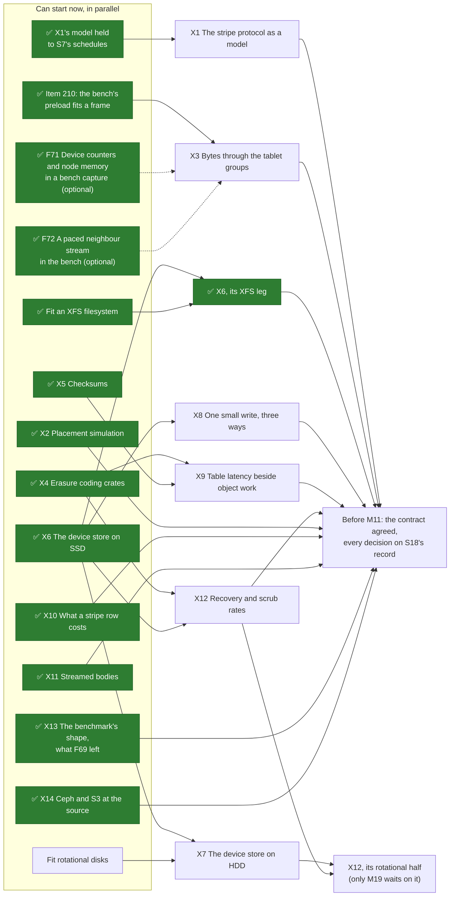
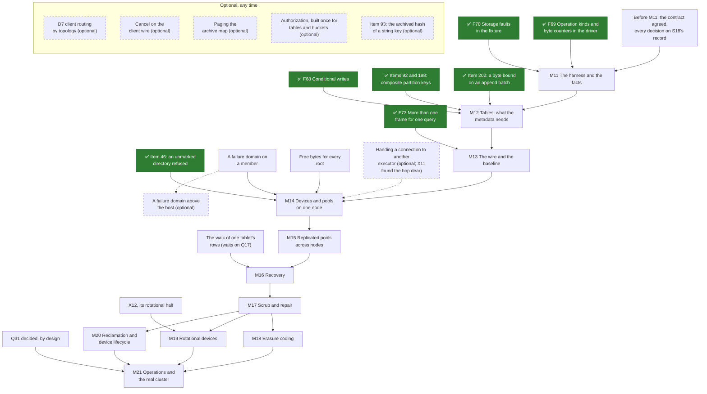

# What's left to do

**The order of the work, drawn.** The pages before this one say what has to be done and why;
this one says in what order, on two diagrams: the work up to the first gate, and the gates
after it. As of 2026-10-05, when X11 reported and F73 delivered the frames it set, X13 reported
what F69 had left of the benchmark's shape, and X14 read Ceph and S3 at the source; X6 and X10 had
reported the day before, and X2, X4 and X5 the day before that.

**How to read them.**

- An arrow points from a piece of work to what requires it. Things on one level, with no arrow
  between them, can be done in parallel.
- A green box with a ✅ is done.
- A box titled *(optional)*, with a dashed border, can be left out without anything built
  having to change; a dashed arrow means *helps*, not *requires*. Each one's reason is on the
  page that lists it.
- A box beside a gate lands no later than the start of that gate, and nothing stops it landing
  sooner ([S1](prerequisites.md#the-order)).

## Before the first gate

Everything here can be worked on now except what an arrow ~~points into~~ from an unfinished
box points into: ~~X9's arrows now come only from green ones, so it can start~~ X8's and X9's
arrows now come only from green ones, so both can start. The spikes are on
[their page](spikes.md), and what each needed first on
[What a spike needs first](spikes.md#what-a-spike-needs-first).

~~An optional box, "a kind a schema supplies, for X10's cold commit", stood beside X10.~~ It is
gone: X10 drove its commits with a driver of its own, which aimed each one at a group's leader
and timed a read before it, and no operation kind the bench drives could have done that
([X10](stripe-row-costs.md#the-harness)). Buckets still supply their kinds at M12.

The failure domain and free bytes for every root waited on Q19, which said what placement reads.
X2 decided that part of it: a device's id and its member's host, and each device's size,
placement weight and free bytes ([Q19, in part](contract.md#q19-in-part-placement-2026-10-03)).
Both can start now, though they land no later than M14.

The gate waits on every spike because the [milestones](milestones.md) stop being provisional
only once every decision is on the record
([spikes](spikes.md#what-has-to-be-on-the-record-before-the-milestones-are-real)), and a spike
that needs nothing is run before the plan is drawn. Each question also has a gate of its own,
the last moment it can be answered; those are on the
[milestones page's table](milestones.md#the-gates-at-a-glance). The rotational half of X12 and
X7 are the exception: if the disks come late, only M19 waits for them.

## The gates

~~A clone call in the glommio fork (optional, if X6 picks a clone)~~ fed M14 until 2026-10-04,
and is dropped: [X6](device-store-ssd.md#3-a-partial-write) rejected the clone, so nothing waits
on it.

More than one frame for one query waited on Q26 until 2026-10-05, when
[X11](streamed-bodies.md) answered the part it needed: object bytes travel on connections of
their own, in frames of 1 MiB. [F73](../features/bodies-across-frames.md) delivered it the same
day. The box handing a connection to another executor stays optional,
since adding it later changes no format, and X11 is what makes it worth building at M14: a
connection under kTLS can be handed over at no cost, while its bytes hopping between executors
cost 1.3 to 1.7 times the cpu a gibibyte ([X11](streamed-bodies.md#4-a-connection-handed-over-and-bytes-that-hop)).

The chain is the claim [the milestones page](milestones.md#the-order-is-a-claim) argues for:
the wire before the devices, the device store before distribution, replication before erasure
coding, recovery before scrub. Two of its places are convenience and not dependency, and the
diagram draws them as the dependencies they are: M19 needs M14 to M17 and not M18, and M20
waits on nothing after M17 and could move forward if devices fill in testing.

## Keeping it current

**Whoever finishes a piece of work turns its box green in the same change**, with a ✅ at the
start of its label and `:::done` after it, as the ✅ rows on S1 and the struck-through rows on
the milestones page record the same thing. A piece of work that is added, split or dropped is
added, split or dropped here too, and an optional one says *(optional)* in its title. The
conventions are written down in `CLAUDE.md`, under *Planning docs*, for every plan after this
one.

## Related

[S1](prerequisites.md) for the rows the gates begin with; [Spikes](spikes.md) for what has to
report first; [Milestones](milestones.md) for what each gate delivers; [S18](contract.md) for
the questions and the record.
