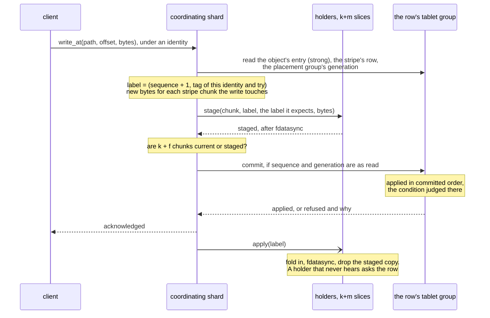

# S7. The write path

## Context

An object can be written at any offset and truncated (decided 2026-10-02), its bytes are
replicated or erasure coded (R11), and a write that is acknowledged has to survive the losses
its pool was sized for. The hard case is the one Ceph spent years on: a write that changes
part of an erasure coded stripe and reaches some of its holders. Until it has reached enough
of them it must be possible to abandon it; once it has, it must be finished everywhere; and
at no instant may a reader or a decoder be handed stripe chunks from both sides of it.

This page is that protocol. It carries four candidates, prefers one, and is explicit that the
preference is a hypothesis: [Q14](contract.md#questions-to-answer) is settled at the gate
before M11 by a model and two cost spikes, and not here.

## What exists today

A table write on a cluster node is one path.

- The shard that accepted the bundle builds a `Command { table, tablet, request, payload }`,
  whose payload is "the table's own intent, archived once by the node that accepted the write
  and carried as bytes from there to every replica's log and state machine"
  (`shoal-proto/src/shared/protocol/peer/replicate.rs:303-316`).
- `propose_write` puts it through the tablet's group
  (`shoal-core/src/server/shard/groups.rs:1997`), with one hop to the leader when this shard
  does not lead. Every replica applies it once, in committed order, and derives its result
  there. The client is answered after a durable majority and the local apply
  ([C5](../distributed/replication.md#a-writes-path)).
- A leader whose lease lapsed refuses to append (`Lease::of`,
  `shoal-core/src/server/replication/lease.rs:53`).
- A retried write is recognised by its request identity and answered what its first try was;
  a write whose answer never came is `OutcomeUnknown`, and only the client retries it
  ([C5](../distributed/replication.md#what-the-client-is-promised)).

What that path costs when the payload is large is measured.

- **Every byte is written at least twice**: to the shard's WAL, then into the archives by a
  merge that rewrites the partition whole. For rows of 64 KiB to 4 MiB that is close to all of
  it: [X3](bytes-through-groups.md#3-bytes-written-for-each-byte-stored-and-t2) counted 2.03 to
  2.31 device bytes a byte stored a copy, settled, the WAL's volume and the archives' each about
  one. Under a whole load on the lab one host wrote
  114 MB/s to its archives and 24.5 MB/s to its WAL while applying about 15 MiB/s of rows
  ([O79](../appendix/optimizations.md#o79-a-merge-rewrites-every-partition-it-touches-whole));
  fragmented partitions have since halved the archive half for sorted tables
  ([F61](../features/fragmented-partitions.md)).
- **A write is bounded** by a 64 MiB frame and by 64 MiB of proposed and unanswered bytes a
  group (`shoal-core/src/server/conf/cluster.rs:472`), and ~~an append batch is bounded in
  entries alone (item 202)~~ an append batch by `replication.append_batch_bytes` as well as in
  entries since [Resolved #202](../appendix/resolved/append-batch-bytes.md). A write near the
  frame bound can still make an entry no append carries
  ([item 208](../appendix/known-issues.md#208-a-write-that-fits-a-client-frame-can-make-a-log-entry-no-peer-frame-carries)).
- **A row stays in memory** until the segment it was logged in is merged.

And what it cannot do: an update carries no condition
([S1](prerequisites.md#required)), nothing is atomic across two tablets, and ~~a client does
not choose the node it writes to ([D7](../direction/shard-aware-routing.md))~~ a client chooses
the node a row's write goes to - its group's preferred leader, since
[F74](../features/client-routing.md) - but not the holders of an object's bytes.

## The design

### The candidates

| | Candidate | Durable rounds | What it needs that Shoal lacks | What it gives up |
| --- | --- | --- | --- | --- |
| A | **Stripes are rows.** A stripe's bytes are a row of a generated table, replicated by its tablet group | 1 | A way to patch part of a row; a byte bound on an append batch | Erasure coding, storage pools, devices and slices altogether. Every byte through the WAL, the archives and the compactor, and a 4 KiB change rewrites the stripe at the next merge |
| B | **The row's group orders; the bytes stay out of its log.** Holders stage, one conditional commit of the stripe's row decides, holders apply | 2 | A device store, a conditional write, a pool map | One round of latency against A |
| C | **A group among the holders**, one a placement group, with a log on every slice: a Raft group with payloads out of band, or a primary and peering as RADOS has | 1 | A quorum of `k + f` with a different payload for each member; or a peering protocol | The first was not found to be offered by openraft; the second is the custom protocol [C13](../distributed/protocol.md#alternatives-rejected) declined. Either puts a consensus log on the pool's slices |
| D | **Redirect on write.** Every write makes new extents; the row holds a map of them | 2 | Collection of dead extents; a larger row | Nothing is applied in place, so nothing tears; but a stripe fragments, a rotational disk reads it badly, and the row grows with every overwrite |

**B is preferred. A is the baseline every measurement is read against**, and a candidate in
its own right for small writes ([below](#small-writes)). C stays the alternative Q14 is
judged against. [X3](bytes-through-groups.md) measured A as it stands on 2026-10-07, at rows of
64 KiB to 4 MiB: near two device bytes a byte, but a fifth to a quarter of the device a copy at a
factor of three, its nodes' cpu the bound, and every table on those nodes waiting behind it. So
replicated SSD pools are not tables, and B stays preferred. D is rejected for the reasons in its row, with one part kept: a whole stripe
chunk replaced is written beside the old one and renamed, which is redirect on write at the
size where it is free ([S6](device-store.md#staging-two-cases)).

One sentence carries the difference between B and Ceph: **Ceph keeps undo and applies at
once; B keeps redo and applies after the decision.** Ceph's write is "a two-phase process:
commit and rollforward", committed "in place, possibly leaving some information required for
a rollback in a write-aside object" (`doc/dev/osd_internals/erasure_coding/ecbackend.rst` at
`v20.2.0`). The code does as the document says, in both of Tentacle's back ends. Each written
shard clones the range it is about to overwrite into an object named for the write's version,
then writes in place (`src/osd/ECTransaction.cc:829-869`). The clone is removed once every shard
has committed (`src/osd/PGBackend.cc:339-391`). Deciding which writes to roll back after a failure
is what peering is for: it takes the oldest log among the shards as authoritative for an erasure
coded pool and rolls the rest back to it (`src/osd/PeeringState.cc:1682-1710`,
`src/osd/PGLog.h:1275-1313`; [X14](ceph-and-s3-sources.md#2-peering-fencing-and-min_size)). B
moves the decision in front of the apply, makes it one commit in a group that already
exists, and pays a round for it.

Ceph's own proposal for overwrites had the same shape as B's holders: "When a prepare
operation is performed, the new data is written into a temporary object", "The apply
operation moves the data from the temporary object into the correct position within the base
object", and "an unapplied prepare operation can easily be rolled back simply by deleting
the associated temporary object" (`doc/dev/osd_internals/erasure_coding/proposals.rst`, a
proposal and marked as one). It was not built: in `v20.2.0` every write lands in place, with the
old range kept aside as above ([X14](ceph-and-s3-sources.md#1-what-an-acknowledgement-waits-for)).
What B changes is who decides.

### The preferred direction, step by step

1. **Read.** The coordinating shard reads the object's entry with a strong read, for the
   truncate epoch ([S3](objects.md#size-holes-and-truncate)), then the row of each stripe
   the write touches and its placement group's generation ([S5](placement.md#generations)).
   The stripe row is read at `Quorum` through its group's leader, so the leader's copy is
   resident when the commit arrives and its apply, which the client waits on, never waits for
   the disk ([X10](stripe-row-costs.md#5-the-supplement-the-read-under-load)). A row stamped or
   fenced past the epoch it read means a truncate has committed since, or is committing: it
   reads the entry again, and moves the epoch past a fence a truncate left and never committed
   ([X1](stripe-model.md#truncate-q18)).
2. **Stage.** It computes the new bytes of every stripe chunk the write touches and sends each
   to the slice that holds it, under the write's label. A holder stages durably and answers
   ([S6](device-store.md#staging-two-cases)). A write into a stripe a truncate's floor hides
   writes the units the floor hides as zeros, in the same write
   ([X1](stripe-model.md#truncate-q18)). It asks the holder of each chunk it counts and did not
   touch to confirm that it holds the label the row names
   ([below](#the-acknowledgement-rule)).
3. **Commit.** With enough chunks staged ([below](#the-acknowledgement-rule)) it proposes
   one command to the row's group: move the sequence, set the labels of the touched chunks,
   record which holders did not stage, stamp the truncate epoch the write read, **if**
   ~~the row's sequence, the object's truncate epoch and the placement group's generation are
   the ones this write read~~ the row's sequence and the placement group's generation are the
   ones this write read. The epoch is the entry's, in another tablet, and no apply can read it.
   What the row holds of it, its stamp and a truncate's fence, moves only with the sequence, so
   the stager judges them on the row it read and the group compares two fields by equality,
   which is what [F68](../features/conditional-writes.md) offers
   ([X1](stripe-model.md#the-generation-and-positions-q19)).
4. **Acknowledge.** The client is answered when that command has applied on a durable
   majority, as any table write is.
5. **Apply.** Holders are told and fold the staged bytes into their chunks. A holder that
   is not told learns from the next read, or asks the row.
6. **If refused**, the row has moved under another write. This write's staged bytes are now
   excluded by a committed fact, and holders drop them when they learn of it. The
   coordinator reads again and tries again, under a new tag
   ([labels](#labels-not-numbers)), or fails by name.
7. **If the coordinator dies** between staging and proposing, the staged bytes are
   undecided: the row never moved, so nothing excludes them. The group's leader, prompted by
   a timer, commits a no-op that moves the sequence without changing a label. That commit is
   the fact that lets holders discard; the timer only asked
   ([P16](contract.md#the-contract)). On a stripe with no row the no-op makes one, at its
   object's labels: a first write staged against no row is excluded only by a row that exists
   ([X1](stripe-model.md#what-the-search-found-and-the-repairs)).

### What breaks without the condition

A partial write of an erasure coded stripe computes new parity from the stripe as it read
it. If another write committed in between, that parity describes a stripe that no longer
exists. With an unconditional update the second commit simply lands: every label is
"current", every unit verifies, and the stripe decodes to garbage the first time a data
chunk is missing. Nothing else in the design can catch it, which is why the conditional
write is the first row of [S1](prerequisites.md#required), delivered by [F68](../features/conditional-writes.md): the
stripe's commit is an update `if_matches` the sequence it was staged under, and a moved row
refuses it as `RowMismatch`.

### Labels, not numbers

Two shards can stage against one row at once: two clients, or one write retried through a
new leader. Both produce "sequence plus one" with different bytes. A holder told only that
the next sequence had committed would apply whichever it had staged, and the chunks of one
stripe would then hold two different writes under one number.

So a chunk is labelled by the sequence **and a tag derived from the write's request
identity** ~~,~~ **and its try**, the row keeps a label for each chunk, and a holder applies a
staged write only when the row names that write's tag for its chunk. The loser of a race needs
no abort: the committed row naming another tag is the fact that excludes it.

~~A tag derived from the identity alone made a retry the same write.~~ X1 found that it made two
writes one label: a retry against the same row, after a truncate had committed between its tries,
staged other bytes than its first try had, under the same label, and a holder that held the
first try's took it for the retry's
([X1](stripe-model.md#what-the-search-found-and-the-repairs), P9). A tag a try is new, and the
row's group says whether a write already committed, from the retry table every tablet group
keeps ([C5](../distributed/replication.md#retry-identity)).

### Who stages

**Preferred: the shard the client's bytes arrived at**, with the group's leader doing
nothing but order commits ([Q15](contract.md#questions-to-answer)).

The other answer, the leader stages, serializes a stripe's writers and wastes no work. It
costs a network crossing: ~~clients do not route by topology, so~~ the bytes land on whichever
node the connection reached and would have to be forwarded to the leader's before they are
sent to the holders. *Since [F74](../features/client-routing.md) a client routes a table's
queries by topology, and could send an object's bytes to the node leading its stripe row's group
the same way; Q15 was recorded before, and its answer does not depend on it.* On the lab's 1 GbE one 4 MiB stripe is about 34 ms a crossing. And it
does not remove the race it seems to: a leader change mid-write makes two stagers anyway,
so labels, idempotent staging and the cleanup of a loser are needed either way.

What the preferred answer costs is a wasted stage for every loser, and a livelock if two
writers keep meeting on one stripe. For that the leader can grant an **advisory
reservation** of a stripe: it orders who tries next and promises nothing, so losing it or
ignoring it is slow and never unsafe.

**X1 ran it both ways** ([the record](stripe-model.md#progress-the-previous-state-and-the-reservation)).
Without a reservation no stripe's stagers starved each other within the progress bound at any
layout. With one, about half as many stages were wasted, and a writer waited longer for its
turn. It stays an optimization, never part of the protocol.

### The acknowledgement rule

There is no single number of stages that is "enough". The rule is about what is true after
the commit: **at least `k + f` stripe chunks are current**, in distinct failure domains,
where a replicated pool has `k = 1`. `f` is the pool's, and at least one
([P11](contract.md#the-contract)).

| Write, with every chunk current beforehand | Chunks it touches | Stages it needs |
| --- | --- | --- |
| Replicated, `r` copies | `r` | `1 + f` |
| Erasure coded, the whole stripe | `k + m` | `k + f` |
| Erasure coded, part of the stripe, `d` data chunks | `d + m` | Enough that at most `m - f` chunks are stale afterwards |

The third row is the one that is easy to get wrong. A 4+2 write that touches one data chunk
touches three chunks. Acknowledged after one stage, it is held by one slice, and losing that
slice's device loses an acknowledged write, though four chunks of the stripe are "current"
by their old labels. Chunks already stale before the write count against the same budget.

**A chunk the write did not touch counts only on its holder's word in the write's round**
([Q16](contract.md#questions-to-answer)): a confirmation that it holds the label the row names.
~~Whether an untouched chunk on a slice that is down counts is open.~~ X1 ran both ways of counting
one on the row's word and both broke P11. Counted while its holder was believed up, it sat on a
disk that had failed silently, which [P7](contract.md#the-contract) allows; counted while its node
was down, the disk had been swapped meanwhile
([X1](stripe-model.md#q16-both-ways)). The row says what should be there, never what a device
still holds.

A read, by contrast, needs no quorum: any `k` chunks the row calls current, each confirming
its label ([S9](read-path.md)). The row arbitrates, so `W + R > N` has no part here.

A pool that cannot meet the rule refuses the write by name. A weaker acknowledgement is a
setting with its own name and its own line in readiness, never what happens when holders
are short.

On the lab the rule has a consequence worth stating early: three hosts under a host failure
domain allow only 2+1, and at `f = 1` a 2+1 pool acknowledges nothing while any host is
down.

### A whole object in one commit

A put of a whole object does not use the three steps, because nothing can read its stripe
chunks until the object exists.

1. The new object's id is recorded in the path's entry as a replacement in flight.
2. Its stripe chunks are written straight into place, labelled with sequence zero and the
   object's own tag. No stripe gets a row.
3. When every stripe has `k + f` chunks durable, one conditional commit makes the id
   current and retires the old one.

That is two commits for an object of any size, and it is what makes
[P19](contract.md#the-contract)'s one exception true: a reader sees the old object or the
new one. A put that is abandoned leaves an id the entry names as in flight; aborting it is a
commit to that entry, after which its chunks are named nowhere and are discardable
([S10](recovery.md#reclamation)).

### Writes that span stripes

A write over several stripes is several stripe writes, sent in parallel, each atomic and the
whole not ([P19](contract.md#the-contract)). A reader in between can see some stripes new
and some old. A crash leaves some done.

What keeps that tolerable is identity: ~~each stripe's tag is derived from the write's request
identity and the stripe's index, so the retry of a write restages the same bytes under the
same tags. A stripe whose row already carries that tag answers as it did the first time~~ each
stripe's commit carries the write's request identity, and the row's group keeps it in its retry
table. A stripe whose commit already applied answers the retry as it did the first try, and
the retry finishes the rest, under tags of its own
([labels](#labels-not-numbers)).

### Extending and appending

- **A write past the end** commits its stripes first and the size after, conditional on the
  truncate epoch ([S3](objects.md#size-holes-and-truncate)). A definite failure before the
  size moved leaves bytes beyond the end that no reader is shown.
- **An append** is a write at the size its writer read. Two appenders meet at the row of the
  tail stripe; one commit wins, the other is refused, reads the new size and tries again.

### Small writes

B's floor is two durable rounds in sequence, and a partial write of an erasure coded stripe
reads before it stages. On the lab's Zen1 hosts a sync is 3 ms alone and 5.9 ms under six
writers, so the floor there is two of those where a table write pays one; on europa's Optane
it is two of 0.2 ms. On those hosts the pool's device and the WAL are also the same disk.

One answer is candidate A at small sizes: a write under a threshold rides **inside** the
commit command, is durable when the group's log is, and is folded into the stripe
chunks afterwards. It is one round. Its bytes cross the WAL, the row holds them until they are
folded, and a read overlays them. Whether the threshold exists, and where, is
[Q27](contract.md#questions-to-answer); ~~[X8](spikes.md#x8-one-small-write-three-ways) finds
the size at which the two paths cross on each kind of device~~.

**[X8](small-writes.md) found it, and it depends on the device.** One small write at a time, B's
second round cost 1.7 ms of 7.0 at 4 KiB on the lab's 970 EVO, where the same write in its commit
took 5.1; on the Optane it cost about 0.1 ms and hid inside the WAL's commit delay. Under load on
the Optane B won at every size, by up to 2.0×, since bytes in the log cost the nodes' cpu by the
byte and are written three times a copy against B's two. On the 970 EVO both paths were held by
the holders' syncs, a flush an apply; with one flush shared among a slice's applies, the bytes in
the commit won to 32 KiB under load as well. So
([Q27](contract.md#q27-and-q14-in-part-one-small-write-three-ways-2026-10-08)):

- **on a device whose sync flushes a volatile cache, a write below 64 KiB rides inside its
  commit**, once M14's slice shares one flush among its applies; the stripe row carries a field
  of pending bytes for it, which a read overlays and a fold clears;
- **on a device whose cache writes through, every write is staged**, as on the Optane;
- **above 64 KiB every write is staged**, on every device.

**X1's model held the path to the contract on 2026-10-09**, before the gate before M11 agreed it,
since a faster direction the model has not checked is not a candidate
([the small write](stripe-model.md#a-small-write-in-its-commit)). These are its rules:

- **The write touches no chunk.** It reads as a staged write does, then proposes one commit that
  moves every position's label to its own and puts its new values into the row's pending bytes,
  over the labels the row named: their base. Every position counts as an untouched chunk does, on
  its holder's confirmation in the write's round that it holds the chunk the bytes are laid over
  ([the acknowledgement rule](#the-acknowledgement-rule)). Counted on the row's word, both of Q16's
  answers broke P11 again, now on a replicated stripe.
- **A second small write merges** its units over the pending bytes, which keep their base and add
  the first's label to a chain. Replacing them, as X8's spike did once every holder had folded,
  lost a write: a holder still at the base folded the second write's units alone.
- **The pending bytes are bounded** by the threshold, and a write that would take them past it is
  staged ([P18](contract.md#the-contract)). A staged write over pending bytes carries them: its
  stages hold their units with its own, so its commit takes them out of the row. One that staged its
  own units over the base lost them.
- **Holders fold.** Each is given the bytes after the commit and journals them as the committed
  record they are, over the chunk they fold from, then applies them in place as any record
  ([S6](device-store.md#folding-a-small-writes-bytes)).
- **The leader's clear takes them out of the row.** Prompted by a timer, it gives every holder the
  bytes to fold and waits for each to answer; once `k + f` hold the write's label durably it commits
  a clear, conditional on the sequence and the generation, that moves the sequence, takes the bytes
  out of the row and marks every other position missed. Cleared on one holder's word, they broke
  P11; cleared without the missed marks, P17.
- **A pool takes the path only where the row's group survives `f` losses**, since until the clear
  the bytes are durable where the commit is.
- **An erasure coded stripe's small write is staged.** X8 measured replicated pools, and the model
  draws the path for a replicated stripe alone; a partial write of a k+m stripe in its commit has to
  bring its parity along, and is M18's to model and measure.

### The schedules that shaped it

~~Each is a schedule the model has to reject under the safe policy and reproduce under an
unsafe one.~~ **All sixteen are saved** since 2026-10-06, one file each under
`shoal-model/schedules/stripe/`, beside ten more for the rules X1 found did not hold
([the record](stripe-model.md#the-sixteen-schedules)). Each **safety** schedule is one the model has to reject under the safe policy and
reproduce under the unsafe setting [S16](testing.md#the-model) names for it
([X1](spikes.md#x1-the-stripe-protocol-as-a-model)). A **progress** schedule breaks no clause:
the safe policy has to finish it within S16's progress check, and an unsafe setting makes it
not. The first five are the faults a review found in the first form of this design. Schedule
11 was held to the safety rule with the rest until 2026-10-03, when each schedule was looked for
among S16's settings: what goes wrong in it is a rebuild that was not needed, which no clause
forbids. Schedules 15 and 16 were added then, since the contract's own violations named them
([P9 and P10](contract.md#the-contract)) and S7 did not.

| # | Schedule | What goes wrong | What prevents it | Kind |
| --- | --- | --- | --- | --- |
| 1 | Two stagers on one base, by a second client or a leader change | Chunks of one stripe hold two writes under one number | Labels carry a tag; the row names one | Safety |
| 2 | A parity delta built from a stale row, committed unconditionally | Parity describes a stripe that no longer exists | The commit is conditional on the sequence | Safety |
| 3 | A slice returns after an hour | It cannot learn which chunks it missed | A placement group is inside a tablet, whose group recorded it ([S10](recovery.md)) | Safety |
| 4 | A writer reads size 100 stripes; a truncate to 10 commits; the writer commits stripe 50; the object is later extended to 60 | Truncated bytes return | The commit stamps the epoch it read; the stripe is under a floor ([S3](objects.md#size-holes-and-truncate)) | Safety |
| 5 | The pool map changes during a write | Chunks committed where no reader looks | The commit names its generation ([S5](placement.md#generations)) | Safety |
| 6 | A stager times out and tells holders to drop, while its commit is in flight to the leader | An acknowledged write whose bytes are gone | Holders discard only on a committed fact | Safety |
| 7 | A 4+2 write touching one data chunk is acknowledged after one stage; that slice's device dies | An acknowledged write is lost | The acknowledgement rule | Safety |
| 8 | Parity staged as a patch; a crash after the apply; the record replayed | Parity corrupt under a current label | Staged records hold new values | Safety |
| 9 | A crash during an apply in place | A torn unit | The staged copy outlives the apply; the unit's checksum finds it | Safety |
| 10 | A stager paused for minutes resumes and proposes | Nothing: the condition refuses it | The condition | Safety |
| 11 | A stage's acknowledgement is lost; the commit proceeds without that holder | The row calls a current chunk stale | A rebuild first asks the holder what it holds | Progress |
| 12 | A disk swapped for an empty one at the same path | The row calls an empty directory current | The ids of a device and its slices ([S4](pools-and-devices.md#a-device-has-slices)) | Safety |
| 13 | The disk fills between the stage and the apply | A failure after the commit | Space is taken at the stage | Safety |
| 14 | A holder discards because a lagging replica shows no row | Bytes of a live stripe dropped | Absence on one replica is not a committed fact; only a state that cannot be undone is | Safety |
| 15 | A holder applies a stage before its commit; the commit is refused | Uncommitted bytes replace committed ones on that holder | A holder applies only what a commit made current | Safety |
| 16 | A reader consults the row; a later write commits and is applied on one holder before the reader asks it | The reader decodes a chunk newer than the row it consulted beside chunks that are not | A chunk under another label is missing to the reader ([S9](read-path.md)) | Safety |

## Alternatives rejected

**A as the only path.** It has no erasure coding, no pools and no slices, and it moves
every byte through three structures built for rows. It is kept as the measured baseline, and
possibly as the path for small writes.

**C.** See the candidates' table and [S18](contract.md#alternatives-rejected).

**D.** See the candidates' table.

**Applying before the decision**, as Ceph does. It saves the round and needs both a cheap
way to keep what was overwritten and a protocol to decide what to undo.

**Holders that vote.** If a holder's durable promise bound it to a write, staging and the
commit could run together in one round. A promise that survives a restart and can be
revoked is a vote, and a protocol of votes among holders is the peering this design is
built to avoid.

**The leader stages.** See [Who stages](#who-stages).

## What it costs

- **Two durable rounds in sequence**, and a round of reads before them for a partial write
  of an erasure coded stripe.
- **Every byte crosses the network twice on its way in**: client to coordinator, coordinator
  to holders, with parity added on the second leg.
- **A stage wasted for every writer that loses a race**, and staged bytes held on a slice
  until a commit decides them. A slice bounds what it will hold staged and refuses beyond
  it.
- **A commit command a write**, small: a label for each touched chunk and the holders that
  missed; and on a device that flushes, a write of less than 64 KiB in it as well
  ([X8](small-writes.md)).
- **A strong read of the object's entry** before each write in place.

## What it breaks

- "A write is a table's intent in a group's log": an object write is a commit about bytes
  that are elsewhere.
- "A write's result is whether it happened": a refusal says the row moved, and a caller
  acts on that.
- "A write is durable when a majority has synced it"
  ([P3](../distributed/protocol.md#the-contract)): still true of the commit. The bytes'
  durability is the pool's, by [P11](contract.md#the-contract).

## Invariants to uphold

- A holder applies a staged write only when the row names its tag for that chunk, and
  discards one only when a committed row state excludes it and no label the row names stands
  on it.
- ~~The commit is conditional on the row's sequence, the object's truncate epoch and the
  placement group's generation, judged at apply.~~ The commit is conditional on the row's
  sequence and the placement group's generation, judged at apply; a stager that finds the row
  stamped or fenced past the epoch it read does not propose.
- A row's sequence and its stamp never move backwards.
- A chunk the write did not touch counts toward `k + f` only on its holder's answer in the
  write's round, and a small write in its commit touches none.
- A small write's bytes leave the row only by a commit: a clear that found `k + f` holders holding
  their label, or a staged write that carried them.
- A write into a stripe a floor hides writes the hidden units as zeros.
- A staged record holds new values, and staging the same write twice is staging it once, while
  the holder can make its label ([X1](stripe-model.md#rules-the-model-made-precise)).
- No acknowledgement precedes `k + f` current stripe chunks and a durable majority.
- A partial write never makes a stale chunk current; only a write of the whole chunk does.
- Nothing is decided by a timer. A timer may cause a commit.
- ~~A write's tags are a function of its request identity, so its retry is the same write.~~ A
  write's tag is new for each try, and the group's retry table makes a retry the same write.

## Prerequisites

[S1](prerequisites.md#required): the conditional write with a typed refusal (delivered,
[F68](../features/conditional-writes.md)), and a byte
bound on an append batch if small writes ride the log. [S3](objects.md), [S5](placement.md)
and [S6](device-store.md). [S16](testing.md#the-model)'s model before any of it.

## How it would be measured

- ✅ [X1](stripe-model.md): every schedule above, saved, against the contract, and a generated
  search of the safe policy at every layout.
- ✅ [X3](bytes-through-groups.md): candidate A as it is today, with wide
  rows standing in for stripes. Bytes a second, bytes written to the device for each byte
  stored, memory held, and a neighbouring table's tail. Reported 2026-10-07: A wrote a byte
  2.0 to 2.3 times, reached 0.20 to 0.27 of a replicated pool's device a copy on europa's Optane,
  bound by its nodes' cpu, and slowed a small table beside it a hundredfold at the p99, so B stays
  preferred ([Q14, in part](contract.md#q14-in-part-the-cost-of-stripes-as-rows-2026-10-07)).
- ✅ [X8](small-writes.md): one small write through A, through B, and
  through B with the bytes in the commit. Reported 2026-10-08: B's second round is 1.7 ms of
  7.0 at 4 KiB on the 970 EVO and inside a commit delay on the Optane; bytes in the commit win
  below 64 KiB on a device that flushes once a slice shares a flush among its applies, and nowhere
  on the Optane ([Q27](contract.md#q27-and-q14-in-part-one-small-write-three-ways-2026-10-08)).
- The object arms of [S15](performance.md), which record bytes completed and durable, what
  was left staged, and the tail.

## Acceptance tests

| Test | Asserts | Milestone |
| --- | --- | --- |
| `stripe_write_is_atomic_at_every_crash_point` | A coordinator, a holder or the leader killed at each step leaves the stripe at its old state or its new one on every chunk that is read | M15 |
| `stale_stager_cannot_commit` | A stager that lost a race, was paused across a leader change or read a stale row is refused, and its staged bytes are dropped only afterwards | M15 |
| `uncommitted_bytes_never_replace_committed` | No holder changes a chunk for a write whose tag the row does not name | M15 |
| `ack_requires_k_plus_f_current` | No write to a replicated pool is acknowledged with fewer current chunks, in distinct failure domains, than the pool's setting | M15 |
| `staged_bytes_outlive_a_stagers_timeout` | A stager that gives up and tells holders to drop, while its commit is in flight, loses nothing: a holder keeps what it staged until the row excludes it | M15 |
| `retried_write_is_the_same_write` | A write retried across a leader change, with some stripes done, completes without changing a stripe twice | M15 |
| `whole_object_replace_is_atomic` | A reader during a put sees the old object or the new | M15 |
| `append_race_loses_no_bytes` | Two appenders both succeed, in some order, with neither's bytes overwritten | M15 |
| `pending_bytes_leave_the_row_only_on_k_plus_f_holders` | A small write's bytes in its commit stay in the row until `k + f` holders hold its label durably; after the clear every other position is stale, and losing any `f` devices loses no acknowledged byte | M15 |

## Related

[S18](contract.md) for the clauses; [S6](device-store.md) for staging and applying;
[S8](erasure-coding.md) for what a partial write reads; [S9](read-path.md) for what a
reader sees while a write is in flight; [S10](recovery.md) for a holder that missed one;
[C5](../distributed/replication.md) for the table write this is built beside;
[S17](prior-art.md#ceph) for RADOS.
